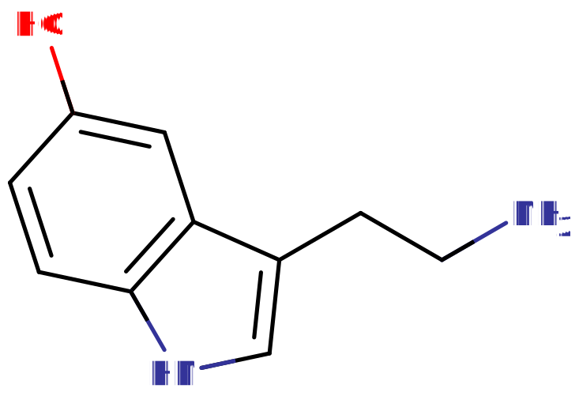

# 单胺

[◀返回](./home.md)

|                                               |                                                                                                                                                                                         |
| --------------------------------------------- | --------------------------------------------------------------------------------------------------------------------------------------------------------------------------------------- |
|  | **这篇文章是个[小作品](../关于本站/home.md)呢。** _因此，它可能包含不完整或错误的信息。你可以帮忙 [扩充它](https://psychonautwiki.org/w/index.php?title=Monoamine&action=edit) 哦。_ |

|                     |
| :-------------------------------------------: |
| [血清素](../文档/血清素.md)是一种单胺神经递质 |

**单胺神经递质** 是包含一个氨基 (-NH2) 基团的 [神经递质](../文档/神经递质.md) 和神经调节剂，该氨基基团通过一个双碳链 (-CH2-CH2-) 连接到一个芳香环上。

所有单胺都源自芳香族氨基酸，如 [苯丙氨酸](../药物/苯丙氨酸.md)、[酪氨酸](../药物/酪氨酸.md)、[色氨酸](../药物/色氨酸.md) 和甲状腺激素，通过芳香族氨基酸脱羧酶的作用生成。单胺能系统，即利用单胺神经递质的神经元网络，参与调节认知过程，如情绪、觉醒和某些类型的记忆。

研究发现，单胺神经递质在星形胶质细胞分泌和产生神经营养因子-3 (neurotrophin-3) 中起着重要作用，这是一种维持神经元完整性并为神经元提供营养支持的化学物质。[^1] 用于增加（或减少）单胺作用的药物有时被用于治疗精神疾病患者，包括抑郁症、焦虑症和精神分裂症。[^2]

存在特定的转运蛋白，称为单胺转运体，负责将单胺转运进出细胞。这些包括细胞外膜上的 [多巴胺转运体](../文档/多巴胺.md) (DAT)、[血清素转运体](../文档/血清素.md) (SERT) 和 [去甲肾上腺素转运体](../文档/去甲肾上腺素.md) (NET)，以及细胞内囊泡膜上的囊泡单胺转运体 (VMAT1 和 VMAT2)。

释放到突触间隙后，单胺神经递质的作用通过被突触前末梢再摄取而终止。在那里，它们可以被重新包装到突触囊泡中，或被单胺氧化酶 (MAO) 降解，MAO 是 [单胺氧化酶抑制剂](../文档/单胺氧化酶抑制剂.md) (MAOIs)（一类 [抗抑郁药](../文档/药物分类/抗抑郁药.md)）的靶点。

## 例子 (经典单胺)

### 儿茶酚胺

- [多巴胺](../文档/多巴胺.md)（**DA**）
- [去甲肾上腺素](../文档/去甲肾上腺素.md)（**NA**, NAd; Norepinephrine*）
- [肾上腺素](../文档/肾上腺素.md)（_Ad; Epinephrine, Epi_）

### 色胺

- [血清素](../文档/血清素.md)（**5-羟色胺**，缩写为 **5-HT**）
- [褪黑素](../药物/褪黑素.md)（**N-乙酰-5-甲氧基色胺**）

### 其他

- [组胺](../文档/组胺.md)[^3]

### 研究

#### 胆碱能药物

- [α-GPC](../药物/Alpha-GPC.md)（疑似单胺能）[^4] [^5]
- [胞磷胆碱](../药物/胞磷胆碱.md)（疑似单胺能）[^4] [^6]

## 外部链接

- [Monoaminergic（维基百科）](https://en.wikipedia.org/wiki/Monoaminergic)

## 参考文献

[^1]: Mele, T., Čarman‐Kržan, M., Jurič, D. M. (February 2010). ["Regulatory role of monoamine neurotransmitters in astrocytic NT‐3 synthesis"](https://onlinelibrary.wiley.com/doi/abs/10.1016/j.ijdevneu.2009.10.003). _International Journal of Developmental Neuroscience_. **28** (1): 13–19. [doi](http://en.wikipedia.org/wiki/Digital_object_identifier 'wikipedia:Digital object identifier'):[10.1016/j.ijdevneu.2009.10.003](..//doi.org/10.1016%2Fj.ijdevneu.2009.10.003). [ISSN](http://en.wikipedia.org/wiki/International_Standard_Serial_Number 'wikipedia:International Standard Serial Number') [0736-5748](..//www.worldcat.org/issn/0736-5748).

[^2]: Kurian, M. A., Gissen, P., Smith, M., Heales, S. J., Clayton, P. T. (August 2011). ["The monoamine neurotransmitter disorders: an expanding range of neurological syndromes"](https://linkinghub.elsevier.com/retrieve/pii/S1474442211701417). _The Lancet Neurology_. **10** (8): 721–733. [doi](http://en.wikipedia.org/wiki/Digital_object_identifier 'wikipedia:Digital object identifier'):[10.1016/S1474-4422(11)70141-7](..//doi.org/10.1016%2FS1474-4422%2811%2970141-7). [ISSN](http://en.wikipedia.org/wiki/International_Standard_Serial_Number 'wikipedia:International Standard Serial Number') [1474-4422](..//www.worldcat.org/issn/1474-4422).

[^3]: Romero-Calderón, R., Uhlenbrock, G., Borycz, J., Simon, A. F., Grygoruk, A., Yee, S. K., Shyer, A., Ackerson, L. C., Maidment, N. T., Meinertzhagen, I. A., Hovemann, B. T., Krantz, D. E. (7 November 2008). Dolph, P. J., ed. ["A Glial Variant of the Vesicular Monoamine Transporter Is Required To Store Histamine in the Drosophila Visual System"](https://dx.plos.org/10.1371/journal.pgen.1000245). _PLoS Genetics_. **4** (11): e1000245. [doi](http://en.wikipedia.org/wiki/Digital_object_identifier 'wikipedia:Digital object identifier'):[10.1371/journal.pgen.1000245](..//doi.org/10.1371%2Fjournal.pgen.1000245). [ISSN](http://en.wikipedia.org/wiki/International_Standard_Serial_Number 'wikipedia:International Standard Serial Number') [1553-7404](..//www.worldcat.org/issn/1553-7404).

[^4]: Tayebati, S. K., Tomassoni, D., Nwankwo, I. E., Di Stefano, A., Sozio, P., Cerasa, L. S., Amenta, F. (1 February 2013). "Modulation of monoaminergic transporters by choline-containing phospholipids in rat brain". _CNS & neurological disorders drug targets_. **12** (1): 94–103. [doi](http://en.wikipedia.org/wiki/Digital_object_identifier 'wikipedia:Digital object identifier'):[10.2174/1871527311312010015](..//doi.org/10.2174%2F1871527311312010015). [ISSN](http://en.wikipedia.org/wiki/International_Standard_Serial_Number 'wikipedia:International Standard Serial Number') [1996-3181](..//www.worldcat.org/issn/1996-3181).

[^5]: Trabucchi, M., Govoni, S., Battaini, F. (April 1986). "Changes in the interaction between CNS cholinergic and dopaminergic neurons induced by L-alpha-glycerylphosphorylcholine, a cholinomimetic drug". _Il Farmaco; Edizione Scientifica_. **41** (4): 325–334. [ISSN](http://en.wikipedia.org/wiki/International_Standard_Serial_Number 'wikipedia:International Standard Serial Number') [0430-0920](..//www.worldcat.org/issn/0430-0920).

[^6]: Secades, J. J., Lorenzo, J. L. (September 2006). "Citicoline: pharmacological and clinical review, 2006 update". _Methods and Findings in Experimental and Clinical Pharmacology_. 28 Suppl B: 1–56. [ISSN](http://en.wikipedia.org/wiki/International_Standard_Serial_Number 'wikipedia:International Standard Serial Number') [0379-0355](..//www.worldcat.org/issn/0379-0355).
