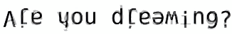

# 清醒梦探索

[◀返回](./home.md)

### **欢迎来到清醒梦探索门户喵！**

* 

    **清醒梦探索**（Oneironautics）是指在梦中进行导航的练习。这个清醒梦探索门户是一个信息目录，可能对梦境导航员（清醒梦探索者）在梦中获得清醒度有用哦。它试图从理性且基于证据的角度来探讨这一领域，以将其与围绕该主题的错误信息区分开来。

### [促梦剂](/文档/药物分类/促梦剂.md)

* **胆碱能药物：** [酒石酸氢胆碱](/药物/酒石酸氢胆碱.md) ⋅ [普拉西坦](/药物/普拉西坦.md) ⋅ [奥拉西坦](/药物/奥拉西坦.md) ⋅ [吡拉西坦](/药物/吡拉西坦.md) ⋅ 阿尼西坦 ⋅ 苯基吡拉西坦 ⋅ [Alpha-GPC](/药物/Alpha-GPC.md) ⋅ [胞二磷胆碱](/药物/胞二磷胆碱.md) ⋅ [加兰他敏](/药物/加兰他敏.md) ⋅ [乙酰胆碱](/文档/乙酰胆碱.md) ⋅ 奈非西坦 ⋅ [尼古丁](/药物/尼古丁.md)
* **作用未定：** [扎卡特草](/药物/扎卡特草.md) ⋅ [非洲梦根](/药物/非洲梦根.md) ⋅ [非洲梦豆](/药物/非洲梦豆.md)
* **内源性途径：** [乙酰胆碱](/文档/乙酰胆碱.md) ⋅ [褪黑素](/药物/褪黑素.md) ⋅ [GABA](/文档/GABA.md) ⋅ 胰岛素

### 复制

* **[梦境迹象](/文档/梦境迹象.md)：** [不可能性](/文档/梦境迹象.md#不可能性) ⋅ [不切实际性](/文档/梦境迹象.md#不切实际性) ⋅ [不协调的特征](/文档/梦境迹象.md#不协调的特征) ⋅ [超现实感觉](/文档/梦境迹象.md#超现实感觉)
* **梦境控制：** 召唤 ⋅ 念力 ⋅ 变形 ⋅ 瞬间移动

### 体验报告

* [体验索引](/报告/home.md)

### 常规

* [梦](/文档/梦.md) ⋅ [清醒梦](/文档/清醒梦.md) ⋅ [入睡幻觉](/文档/入睡幻觉.md) ⋅ [醒后幻觉](/文档/醒后幻觉.md) ⋅ [梦境角色](/文档/梦境角色.md) ⋅ [睡眠瘫痪](/药效/睡眠瘫痪.md) ⋅ 梦境回忆

### [清醒诱导技术](/文档/诱导技术.md)

* **[DILD](/文档/梦境引发的清醒梦.md)：** [现实检查](/文档/现实检查.md) ⋅ [梦境迹象](/文档/梦境迹象.md) ⋅ [直觉意识](/文档/直觉意识.md) ⋅ 睡眠周期中断 ⋅ [记忆诱发清醒梦](/文档/记忆诱发清醒梦.md)
* **[WILD](/文档/清醒引发的清醒梦.md)：** 醒后回睡 ⋅ [全天候觉知](/文档/全天候觉知.md) ⋅ 清醒白日梦 ⋅ 梦境退出引发的清醒梦 ⋅ 自我运动错觉 ⋅ 想象引发的清醒梦 ⋅ 持续觉知

### 稳定技术

* 感官沉浸 ⋅ 情节参与 ⋅ 冷静 ⋅ 环境互动

### 梦境控制

* **方法：** 想象整合 ⋅ 复制体验 ⋅ 推断体验 ⋅ 成功预期 ⋅ 梦境孵化
* **活动：** 召唤 ⋅ 念力 ⋅ 变形 ⋅ 瞬间移动

### 相关生物学

* [睡眠-觉醒周期](/文档/睡眠-觉醒周期.md) ⋅ REM 周期 ⋅ [褪黑素](/药物/褪黑素.md) ⋅ [乙酰胆碱](/文档/乙酰胆碱.md) ⋅ 视黑素 ⋅ 昼夜节律 ⋅ REM 反弹 ⋅ [戒断反应](/文档/药物戒断反应.md) ⋅ 慢波睡眠 ⋅ 腺苷 ⋅ [GABA](/文档/GABA.md) ⋅ 瘦素 ⋅ 生长素释放肽 ⋅ [谷氨酸](/文档/谷氨酸.md)

### 工具

* EEG ⋅ 床边麦克风 ⋅ 梦境日记 ⋅ 蓝光阻挡护目镜 ⋅ 数字手表 ⋅ 现实检查手环 ⋅ 故障闹钟

/文档/囚犯电影.md
---

# 囚犯电影

[◀返回](./home.md)

| | |
|---|---|
|  | 与“囚犯电影”相关的“灯光秀”视觉幻觉的艺术渲染图 |

**囚犯电影**（也称为**囚犯电影现象**）是一个术语，用于描述被长时间剥夺光线或视觉刺激的个体所体验到的眼内（entoptic）现象。

这通常是由于监禁、冥想恍惚状态或其他形式的[感官剥夺](/文档/感官剥夺.md)造成的隔离结果，对个体来说表现为自发的幻觉或“灯光秀”风格的图像，在睁眼或闭眼时从黑暗中浮现。宇航员和其他暴露于某些类型辐射的个体报告目击了类似的现象。[1][2]

有人认为这些幻觉是高水平[光幻视](/文档/光幻视.md)产生的结果。也有轶事证据表明，这些幻觉的形状可能呈现出[几何](/药效/几何.md)[形式常数](/文档/形式常数.md)的样子。[3] 此外，据推测，幻觉可以呈现出其他更抽象或朦胧的形式，包括（但不限于）形状、面孔、人物、地点，甚至是一整套想象中的场景。

这种效应不应与[内部幻觉](/药效/内部幻觉.md)、邦纳综合征（即部分或严重失明的患者体验到复杂的视觉幻觉）、[入睡幻觉](/文档/入睡幻觉.md)或由[冥想](/文档/冥想.md)诱发的幻觉相混淆。[来源请求]

## 另见

* [精神探索](/文档/精神探索.md)
* [感官剥夺](/文档/感官剥夺.md)
* [光幻视](/文档/光幻视.md)

## 参考文献

1. [↑](#cite_ref-1) Demirchoglian, GG (1973). "On the effect of ionizing radiation on the retina in man and animals." Life Sciences and Space Research. 11: 281–294. PMID 12001957.
2. [↑](#cite_ref-2) Fuglesang, C., Narici, L., Picozza, P., & Sannita, W. G. (2006). Phosphenes in low earth orbit: survey responses from 59 astronauts. Aviation, Space, and Environmental Medicine, 77(4), 449-452.
3. [↑](#cite_ref-3) Walker, J. (1981). The amateur scientist: about phosphenes: patterns that appear when the eyes are closed. Sci. Am, 244, 142-152.