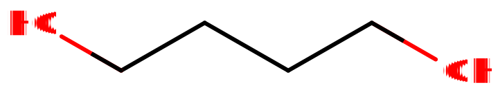

# 1,4-丁二醇

[◀返回](index.md)

|                                                                                         |                                                                                                                                                                                                                                                                                                                                                                                                                                                          |
| --------------------------------------------------------------------------------------- | -------------------------------------------------------------------------------------------------------------------------------------------------------------------------------------------------------------------------------------------------------------------------------------------------------------------------------------------------------------------------------------------------------------------------------------------------------- |
|  | **当[GABA类物质](../文档/GABA.md#GABA_receptors)（GABA）与其他[抑制剂](../文档/药物分类/抑制剂.md)如[阿片类药物](../文档/药物分类/阿片类药物.md)、[苯二氮卓类物质](../文档/药物分类/苯二氮卓类物质.md)、[巴比妥类物质](../文档/药物分类/巴比妥类物质.md)、[加巴喷丁类物质](../文档/药物分类/加巴喷丁类物质.md)、[噻吩二氮卓类物质](../文档/药物分类/噻吩二氮卓类物质.md)或[酒精](酒精.md)联用时，可能会导致致命的[药物过量](../文档/药物过量.md)。**[^1] |

| 化学信息     | 1,4-丁二醇                                                                                       |
| ------------ | ------------------------------------------------------------------------------------------------ |
| 结构式       |                                                                   |
| 分子式       | C4H10O2                                                         |
| CAS 号       | 110-63-4                                                                                         |
| **化学命名** |                                                                                                  |
| 常用名       | 1,4-Butanediol, 1,4-B, BD, BDO, One Comma Four, One Four Bee, Butylene Glycol, or One Four B-D-O |
| 系统命名     | Butane-1,4-diol                                                                                  |
| **类别归属** |                                                                                                  |
| 精神活性类别 | _[抑制剂](../文档/药物分类/抑制剂.md)_                                                           |
| 化学类别     | _[烷二醇](../文档/药物分类/烷二醇.md)_                                                           |

> **警告：** 由于个体体重、耐受性、代谢和个人敏感度的差异，请务必从低剂量开始。[参见负责任的用药部分](../文档/负责任的用药索引页.md)。

| [**给药途径**](../文档/给药途径.md)      | ⇣ [口服](../文档/给药途径.md#口服)                                                |
| ---------------------------------------- | --------------------------------------------------------------------------------- |
| [**给药剂量**](../文档/给药剂量.md)      |                                                                                   |
| [阈值](../文档/药物剂量分类.md#阈值)     | < 0.5 mL                                                                          |
| [轻微](../文档/药物剂量分类.md#轻微)     | 0.5 \~ 1 mL                                                                       |
| [中等](../文档/药物剂量分类.md#中等)     | 1 \~ 2.5 mL                                                                       |
| [强烈](../文档/药物剂量分类.md#强烈)     | 2.5 \~ 4 mL                                                                       |
| [严重](../文档/药物剂量分类.md#严重)     | 4 mL +  **警告：4 mL 以上的剂量可诱发深度睡眠，6 mL 以上的剂量可导致中毒**[^2] |
| [**药效时长**](../文档/药效时长.md)      |                                                                                   |
| [总时长](../文档/药效时长.md#总时长)     | 3 \~ 5 小时                                                                       |
| [药效发作](../文档/药效时长.md#药效发作) | 20 \~ 60 分钟                                                                     |
| [药效达峰](../文档/药效时长.md#药效达峰) | 1 \~ 2 小时                                                                       |
| [药效褪去](../文档/药效时长.md#药效褪去) | 1.5 \~ 2 小时                                                                     |
| [药效残余](../文档/药效时长.md#药效残余) | 2 \~ 4 小时                                                                       |

> **[免责声明](../关于本站/免责声明.md)：** FreeODwiki的[给药剂量](../文档/给药剂量.md)信息收集自用户和[资源](../关于本站/网络资源.md)，仅用于教育目的。它不是推荐，应与其他来源核实以确保准确性。

| **[药物联用](#危险的相互作用)**      |                 |
| ------------------------------------ | --------------- |
| [兴奋剂](../文档/药物分类/兴奋剂.md) | ⚠️ **谨慎联用** |
| [抑制剂](../文档/药物分类/抑制剂.md) | 💔 **联用危险** |
| [解离剂](../文档/药物分类/解离剂.md) | 💔 **联用危险** |

> 强烈不建议将这些物质联用，尤其是在[中等](../文档/药物剂量分类.md#中等)到[严重](../文档/药物剂量分类.md#严重)剂量下。

**1,4-丁二醇**（也称为 **1,4-B**、**BDO**、**BD 或 1,4-BD**）是一种[抑制剂](../文档/药物分类/抑制剂.md)物质，也是[GHB](GHB.md)的[前药](../文档/药物前药.md)。它是一种粘稠、无色的液体或固体，具体取决于储存温度（熔点为 20 ℃），具有独特的苦甜味。[^3] 它被用作娱乐性致醉剂，效果类似于[酒精](酒精.md)和[GHB](GHB.md)。[^4] 1 ml 的 1,4-丁二醇相当于 1.4 g 的 Na-GHB。

1,4-丁二醇在工业上用作溶剂，以及制造某些类型的塑料、弹性纤维和聚氨酯。在有机化学中，它用于合成[γ-丁内酯 (GBL)](GBL.md)。[^5]

1,4-丁二醇以及[GBL](GBL.md)会随着时间的推移溶解大多数类型的塑料。[^6] 因此，建议仅使用玻璃容器、标准明胶胶囊（非素食）或高密度聚乙烯塑料（也称为 #2 回收塑料）来运输和储存该药物。要检查瓶子使用的塑料类型，可以查看底部三角形回收标签中的数字。

## 化学

1,4-丁二醇被归类为一种称为[二醇](../文档/药物分类/烷二醇.md)的醇类化合物亚类。二醇因其结构中有两个醇 (OH-) 取代基而得名。1,4-丁二醇由四个碳基团组成的丁烷链组成，一个醇基团结合在该链的每个末端碳上。1,4-丁二醇因这些位于 R1 和 R4 的醇取代基而得名。这些醇取代基使 1,4-丁二醇成为极性液体，这解释了其良好的水溶性。

在物理上，它是一种吸湿性无色油状液体，几乎没有特征气味。与 GHB 不同，1,4-丁二醇具有独特的味道，被描述为令人反感、类似塑料和化学品的味道。

## 药理学

主条目：[GHB § 药理学](GHB.md#Pharmacology)

1,4-丁二醇本身没有活性；其作用机制源于其作为[GHB](GHB.md)[前药](../文档/药物前药.md)的身份。[^7]

它在肝脏中通过乙醇脱氢酶和乙醛脱氢酶转化为 GHB，这与代谢[酒精](酒精.md)的酶相同。[^8] 1,4-丁二醇首先在肝脏中转化为 4-羟基丁醛并释放到血液中，然后返回肝脏转化为[GHB](GHB.md)。这个过程导致其[药效发作](../文档/药效时长.md#药效发作)比[GBL](GBL.md)或[GHB](GHB.md)延迟得多。[^9] 4-羟基丁醛虽然是一种醛，但不具有与乙醛相同的器官毒性。[^10] 一个原因可能是其向 GHB 的代谢非常快。

GBL 和 1,4-丁二醇作为 GHB 前药的代谢途径

脱氢酶水平的差异因人而异，这意味着就像酒精一样，不同使用者的效果可能差异很大。在许多人中，这表现为药效发作缓慢和醛在血液中积聚率较高，从而引起更多的毒副作用。由于这些药代动力学的差异，1,4-丁二醇往往比 GHB 效力低且起效慢，但持续时间更长；相关化合物[GBL](GBL.md)往往比 GHB 效力稍高且起效更快，但作用时间更短。

## 主观效应

_**免责声明：** 下列效应列表参考了[**主观效应索引**](../药效/index.md) (**SEI**)，这是一个基于传闻中的用户报告和[PsychonautWiki](../关于本站/关于FreeODwiki.md) [贡献者](../关于本站/关于FreeODwiki.md)的个人分析的开放研究文献。因此，应以健康的怀疑态度看待它们。_

_同样值得注意的是，这些效应不一定会以可预测或可靠的方式发生，尽管较高的剂量更可能诱发全方位的效应。 同样，**不良反应**在较高剂量下变得越来越可能，并且可能包括**成瘾、严重伤害或死亡** ☠。_

### **[躯体效应](../药效/躯体效应.md)** 

- **[兴奋](../药效/兴奋.md)** 和 **[镇静](../药效/镇静.md)**：在较低剂量下，1,4-丁二醇在物理上具有刺激性，鼓励运动和清醒。然而，在较高剂量下，它会产生物理镇静作用，鼓励睡眠和嗜睡。
- **[呼吸抑制](../药效/呼吸抑制.md)** - 在 1,4-丁二醇过量的情况下，据报道许多人会出现异常的呼吸模式，特征是呼吸逐渐加深，有时加快，随后逐渐减慢，导致呼吸暂时停止，称为呼吸暂停。
- **[躯体欣快感](../药效/躯体欣快感.md)**
- **[恶心](../药效/恶心.md)** - 这种效应在 1,4-丁二醇中比[GHB](GHB.md)更常见。
- **[胃痉挛](../药效/胃痉挛.md)**
- **[运动控制丧失](../药效/运动控制丧失.md)**
- **[头晕](../药效/头晕.md)**
- **[脱水](../药效/脱水.md)** - 这种效应与 1,4-丁二醇的吸湿性有关。
- **[肌肉痉挛](../药效/肌肉痉挛.md)**
- **[眼球滑动](../药效/眼球滑动.md)**
- **[流涎/痰液增多](../药效/痰液增多.md)**

### **[认知效应](../药效/认知效应.md)** 

- **[焦虑抑制](../药效/焦虑抑制.md)**
- **[去抑制](../药效/去抑制.md)**
- **[认知欣快](../药效/认知欣快.md)**
- **[移情、情感和社交能力增强](../药效/移情、情感和社交能力增强.md)** - 与仅通过[去抑制](../药效/去抑制.md)增加社交能力的[酒精](酒精.md)不同，1,4-丁二醇呈现出强烈的[共情剂](../文档/药物分类/共情剂.md)效应，这种效应显著且明确，虽然比[MDMA](MDMA.md)弱。
- **[分析能力抑制](../药效/分析能力抑制.md)**
- **[思维减速](../药效/思维减速.md)**
- **[健忘](../药效/失忆.md)**
- **[暗示性增强](../药效/暗示性增强.md)**
- **[性欲增强](../药效/性欲增强.md)**
- **[音乐欣赏能力增强](../药效/音乐欣赏能力增强.md)**

### 体验报告

描述此化合物在我们[体验索引](../文档/科学信息索引页.md)中的效果的轶事报告包括：

- [体验:2ml 1,4-丁二醇 - 不如酒精好](../报告/psychounautwiki/Experience:2ml%201,4-Butanediol%20-%20Not%20as%20good%20as%20alcohol.md)

其他体验报告可以在这里找到：

- [Erowid Experience Vaults: 1,4-Butanediol](https://www.erowid.org/experiences/subs/exp_14Butanediol.shtml)

## 毒性和危害潜力

主条目：[GHB § 毒性和危害潜力](GHB.md#Toxicity_and_harm_potential)

显示[GHB](GHB.md)的相对身体伤害、社会伤害和依赖性的雷达图[^11]

1,4-丁二醇本身没有活性；其作用机制源于其作为 GHB 前药的身份，这意味着它在体内迅速转化为 GHB。

当负责任地或在医疗上使用时，GHB 被认为是安全且无毒的物质。[LD50](../文档/药物剂量分类.md)高于活性剂量，当以适当剂量服用该化合物时，没有急性中毒的危险。然而，当作为娱乐性药物使用或滥用时，它可能是危险的。有许多来自娱乐性用户的负面报告，他们经历了药物过量、将 GHB 与酒精或其他药物混合、或意外地给自己服用了意料之外的剂量。[^12]

一份出版物调查了 226 例归因于 GHB 的死亡。[^13] 71 例死亡 (34%) 是由单独使用 GHB 引起的，而其他死亡是由与酒精或其他药物相互作用引起的[呼吸抑制](../药效/呼吸抑制.md)。

为避免 GHB/1,4-丁二醇可能发生的过量，重要的是从低剂量开始，并以小幅度逐渐增加剂量，因为确切的中毒剂量尚不清楚。

由于储存方法不当，也发生过意外摄入 1,4-丁二醇的情况。如果将 1,4-丁二醇放入透明液体、玻璃杯或瓶子中，很容易被误认为是水。建议用文字清楚地标记您的 1,4-丁二醇，并用蓝色食用色素给液体染色，使其不再像可饮用的饮料。还建议将您的 1,4-丁二醇储存在没有人会饮用的容器中。

强烈建议在使用该药物时采取[伤害减少措施](../文档/负责任的用药索引页.md)。

### 神经毒性

在多项研究中，发现长期服用 GHB 会损害大鼠的空间记忆、工作记忆、学习和记忆能力。[^14] [^15] [^16] [^17] 这些效应与大脑皮层及可能其他区域的 NMDA 受体表达减少有关。[^18]

一项研究发现，连续 15 天给大鼠重复服用 GHB 会大大减少海马体和前额叶皮层内的神经元和非神经元细胞数量。剂量为 10 mg/kg GHB 时，海马体区域减少了 61%，前额叶皮层减少了 32%；剂量为 100 mg/kg 时，它们分别减少了 38% 和 9%。该论文证明了对神经元损失的矛盾效应，较低剂量 (10 mg/kg) 产生最大的神经毒性，而较高剂量 (100 mg/kg) 产生的神经毒性较小。

### 耐受性和成瘾潜力

该表比较了 GHB/1,4-丁二醇、[苯二氮卓类物质](../文档/药物分类/苯二氮卓类物质.md)和[酒精](酒精.md)的戒断症状。[^19]

GHB/1,4-丁二醇具有中度的身体和心理成瘾性。如果突然停止使用，频繁使用 GHB/1,4-丁二醇会导致类似于其他[抑制剂](../文档/药物分类/抑制剂.md)如[酒精](酒精.md)和[苯二氮卓类物质](../文档/药物分类/苯二氮卓类物质.md)引起的戒断症状。[^20] [^21] 这些症状似乎取决于剂量和使用药物的时间长短。轻度至中度使用者通常会出现焦虑、失眠、睡眠相关问题和震颤，而重度使用会导致严重的戒断症状，如谵妄、精神病和幻觉。[^22] [^19]

尽管有报道称 GHB/1,4-丁二醇戒断导致死亡，但报告尚无定论，需要进一步研究。[^23]

连续使用几周后，会对镇静催眠作用产生耐受性。停止使用后，耐受性会在 7 - 14 天内恢复到基线。在几周或更长时间的稳定给药后突然停止使用，可能会出现戒断症状或反弹症状，可能需要逐渐减少剂量。

### 危险的相互作用

**_警告：_** _许多精神活性物质单独使用时相对安全，但与某些其他物质结合使用时，可能会突然变得危险甚至危及生命。以下列表列出了一些已知的危险相互作用（尽管不保证包括所有相互作用）。_

_务必进行独立研究（例如 [Google](https://www.google.com), [DuckDuckGo](https://www.duckduckgo.com), [PubMed](https://pubmed.ncbi.nlm.nih.gov/)）以确保两种或多种物质的组合可以安全食用。列出的一些相互作用来自 [TripSit](https://combo.tripsit.me)。_

- **[抑制剂](../文档/药物分类/抑制剂.md)** (_1,4-丁二醇, [2M2B](2M2B.md), [酒精](酒精.md), [苯二氮卓类物质](../文档/药物分类/苯二氮卓类物质.md), [巴比妥类物质](../文档/药物分类/巴比妥类物质.md), [GHB](GHB.md)/[GBL](GBL.md), [甲喹酮](甲喹酮.md), [阿片类药物](../文档/药物分类/阿片类药物.md)_) - 这种组合会增强彼此引起的[肌肉松弛](../药效/肌肉松弛.md)、[健忘](../药效/失忆.md)、[镇静](../药效/镇静.md)和[呼吸抑制](../药效/呼吸抑制.md)。在较高剂量下，它会导致突然、意外的意识丧失以及危险程度的呼吸抑制。在无意识时被呕吐物窒息的风险也会增加。如果在意识丧失之前发生[恶心](../药效/恶心.md)或呕吐，使用者应尝试以[恢复体位](../文档/恢复体位.md)入睡或让朋友将其移入该体位。
- **[解离剂](../文档/药物分类/解离剂.md)** - 这种组合可能会不可预测地增强彼此可能引起的[健忘](../药效/失忆.md)、[镇静](../药效/镇静.md)、[运动控制丧失](../药效/运动控制丧失.md)和[妄想](../药效/妄想.md)。它还可能导致突然的意识丧失，并伴有危险程度的[呼吸抑制](../药效/呼吸抑制.md)。如果在意识丧失之前发生[恶心](../药效/恶心.md)或呕吐，使用者应尝试以[恢复体位](../文档/恢复体位.md)入睡或让朋友将其移入该体位。
- **[兴奋剂](../文档/药物分类/兴奋剂.md)** - 兴奋剂会掩盖[抑制剂](../文档/药物分类/抑制剂.md)的[镇静](../药效/镇静.md)作用，这是大多数人用来衡量其中毒程度的主要因素。一旦兴奋剂作用消退，抑制剂的作用将显著增加，导致强烈的[去抑制](../药效/去抑制.md)、[运动控制丧失](../药效/运动控制丧失.md)和危险的[断片状态](../药效/失忆.md)。如果不密切监测液体摄入量，这种组合也可能导致严重的脱水。如果选择混合使用这些物质，应严格限制自己在达到最大阈值之前每小时仅服用一定量。

## 法律地位

- **美国**：虽然 1,4-丁二醇目前在美国联邦层面未被列管，但许多州已将其归类为受控物质。此外，个人曾根据《联邦模拟法》因该物质而被起诉，理由是其实质上与 GHB 相似。[^24] 芝加哥联邦地方法院裁定，根据联邦法律，1,4-丁二醇不能被视为 GHB 的类似物，第七巡回上诉法院维持了该裁决。[^25]
- **英国**：在英国，1,4-丁二醇于 2009 年 12 月（连同另一种 GHB 前体 γ-丁内酯）被列为 C 类受控物质。
- **德国**：1,4-丁二醇不是 BtMG（麻醉品法）或 NpSG（新精神活性物质法）下的受控物质。[^26] [^27] 根据 §2 AMG，只要不作为人类消费品出售，它就是合法的。[^28]
- **加拿大**：它在加拿大被列为附表 VI 前体进行管制。
- **瑞士**：1,4-丁二醇是 Verzeichnis E 下特别指名的受控物质。[^29]

## 另见

- [负责任的用药](../文档/负责任的用药索引页.md)
- [抑制剂](../文档/药物分类/抑制剂.md)
- [GHB](GHB.md)
- [GBL](GBL.md)
- [GABA](../文档/GABA.md)

## 外部链接

- [1,4-Butanediol (Wikipedia)](https://en.wikipedia.org/wiki/1,4-Butanediol)
- [1,4-Butanediol (Erowid Vault)](https://erowid.org/chemicals/14b/14b.shtml)
- [1,4-Butanediol (TiHKAL / Isomer Design)](https://isomerdesign.com/PiHKAL/explore.php?id=12266)

## 参考文献

[^1]: [_Risks of Combining Depressants - TripSit_](https://tripsit.me/combining-depressants/)

[^2]: WHO report on 1,4-butanediol | <https://www.who.int/medicines/areas/quality_safety/4_4_Review.pdf>

[^3]: PubChem, [_1,4-Butanediol_](https://pubchem.ncbi.nlm.nih.gov/compound/8064) 

[^4]: Zvosec, D. L., Smith, S. W., McCutcheon, J. R., Spillane, J., Hall, B. J., Peacock, E. A. (11 January 2001). ["Adverse Events, Including Death, Associated with the Use of 1,4-Butanediol"](https://doi.org/10.1056/NEJM200101113440202). _New England Journal of Medicine_. **344** (2): 87–94. [doi](http://en.wikipedia.org/wiki/Digital_object_identifier 'wikipedia:Digital object identifier'):[10.1056/NEJM200101113440202](..//doi.org/10.1056%2FNEJM200101113440202). [ISSN](http://en.wikipedia.org/wiki/International_Standard_Serial_Number 'wikipedia:International Standard Serial Number') [0028-4793](..//www.worldcat.org/issn/0028-4793). 

[^5]: Zhao, J., Hartwig, J. F. (1 May 2005). ["Acceptorless, Neat, Ruthenium-Catalyzed Dehydrogenative Cyclization of Diols to Lactones"](https://pubs.acs.org/doi/10.1021/om048983m). _Organometallics_. **24** (10): 2441–2446. [doi](http://en.wikipedia.org/wiki/Digital_object_identifier 'wikipedia:Digital object identifier'):[10.1021/om048983m](..//doi.org/10.1021%2Fom048983m). [ISSN](http://en.wikipedia.org/wiki/International_Standard_Serial_Number 'wikipedia:International Standard Serial Number') [0276-7333](..//www.worldcat.org/issn/0276-7333). 

[^6]: [_Erowid 1,4-butanediol Vault : Storage : 14b and GBL May Dissolve Some Plastics_](https://www.erowid.org/chemicals/14b/14b_storage1.shtml), 2001 

[^7]: Carter, L. P., Koek, W., France, C. P. (November 2006). ["Lack of effects of GHB precursors GBL and 1,4-BD following i.c.v. administration in rats: GBL and 1,4-BD after i.p. and i.c.v. administration"](https://onlinelibrary.wiley.com/doi/10.1111/j.1460-9568.2006.05146.x). _European Journal of Neuroscience_. **24** (9): 2595–2600. [doi](http://en.wikipedia.org/wiki/Digital_object_identifier 'wikipedia:Digital object identifier'):[10.1111/j.1460-9568.2006.05146.x](..//doi.org/10.1111%2Fj.1460-9568.2006.05146.x). [ISSN](http://en.wikipedia.org/wiki/International_Standard_Serial_Number 'wikipedia:International Standard Serial Number') [0953-816X](..//www.worldcat.org/issn/0953-816X). 

[^8]: ["Gamma-Hydroxybutyrate Toxicity: Practice Essentials, Background, Pathophysiology"](https://emedicine.medscape.com/article/820531-overview). 12 May 2022. 

[^9]: Burk, M. J., Van Dien, S. J., Burgard, A. P., Niu, W., [_United States Patent: 8067214 - Compositions and methods for the biosynthesis of 1,4-butanediol and its precursors_](https://patft.uspto.gov/netacgi/nph-Parser?Sect1=PTO1&Sect2=HITOFF&d=PALL&p=1&u=%2Fnetahtml%2FPTO%2Fsrchnum.htm&r=1&f=G&l=50&s1=8067214.PN.&OS=PN/8067214&RS=PN/8067214) 

[^10]: Irwin, R. D. (February 2006). "A review of evidence leading to the prediction that 1,4-butanediol is not a carcinogen". _Journal of applied toxicology: JAT_. **26** (1): 72–80. [doi](http://en.wikipedia.org/wiki/Digital_object_identifier 'wikipedia:Digital object identifier'):[10.1002/jat.1110](..//doi.org/10.1002%2Fjat.1110). [ISSN](http://en.wikipedia.org/wiki/International_Standard_Serial_Number 'wikipedia:International Standard Serial Number') [0260-437X](..//www.worldcat.org/issn/0260-437X). 

[^11]: Nutt, D., King, L. A., Saulsbury, W., Blakemore, C. (24 March 2007). ["Development of a rational scale to assess the harm of drugs of potential misuse"](https://www.sciencedirect.com/science/article/pii/S0140673607604644). _The Lancet_. **369** (9566): 1047–1053. [doi](http://en.wikipedia.org/wiki/Digital_object_identifier 'wikipedia:Digital object identifier'):[10.1016/S0140-6736(07)60464-4](..//doi.org/10.1016%2FS0140-6736%2807%2960464-4). [ISSN](http://en.wikipedia.org/wiki/International_Standard_Serial_Number 'wikipedia:International Standard Serial Number') [0140-6736](..//www.worldcat.org/issn/0140-6736). 

[^12]: [_GHB - Erowid Exp - “GHB Overdoses & Poisonings”_](https://www.erowid.org/experiences/exp.php?ID=1926) 

[^13]: Zvosec, D. L., Smith, S. W., Porrata, T., Strobl, A. Q., Dyer, J. E. (March 2011). "Case series of 226 γ-hydroxybutyrate-associated deaths: lethal toxicity and trauma". _The American Journal of Emergency Medicine_. **29** (3): 319–332. [doi](http://en.wikipedia.org/wiki/Digital_object_identifier 'wikipedia:Digital object identifier'):[10.1016/j.ajem.2009.11.008](..//doi.org/10.1016%2Fj.ajem.2009.11.008). [ISSN](http://en.wikipedia.org/wiki/International_Standard_Serial_Number 'wikipedia:International Standard Serial Number') [1532-8171](..//www.worldcat.org/issn/1532-8171). 

[^14]: Sircar, R., Basak, A. (1 December 2004). ["Adolescent γ-hydroxybutyric acid exposure decreases cortical N-methyl-d-aspartate receptor and impairs spatial learning"](https://www.sciencedirect.com/science/article/pii/S009130570400320X). _Pharmacology Biochemistry and Behavior_. **79** (4): 701–708. [doi](http://en.wikipedia.org/wiki/Digital_object_identifier 'wikipedia:Digital object identifier'):[10.1016/j.pbb.2004.09.022](..//doi.org/10.1016%2Fj.pbb.2004.09.022). [ISSN](http://en.wikipedia.org/wiki/International_Standard_Serial_Number 'wikipedia:International Standard Serial Number') [0091-3057](..//www.worldcat.org/issn/0091-3057). 

[^15]: García, F. B., Pedraza, C., Arias, J. L., Navarro, J. F. (August 2006). "[Effects of subchronic administration of gammahydroxybutyrate (GHB) on spatial working memory in rats]". _Psicothema_. **18** (3): 519–524. [ISSN](http://en.wikipedia.org/wiki/International_Standard_Serial_Number 'wikipedia:International Standard Serial Number') [0214-9915](..//www.worldcat.org/issn/0214-9915). 

[^16]: Sircar, R., Basak, A., Sircar, D. (October 2008). ["γ-Hydroxybutyric Acid-Induced Cognitive Deficits in the Female Adolescent Rat"](http://doi.wiley.com/10.1196/annals.1432.044). _Annals of the New York Academy of Sciences_. **1139** (1): 386–389. [doi](http://en.wikipedia.org/wiki/Digital_object_identifier 'wikipedia:Digital object identifier'):[10.1196/annals.1432.044](..//doi.org/10.1196%2Fannals.1432.044). [ISSN](http://en.wikipedia.org/wiki/International_Standard_Serial_Number 'wikipedia:International Standard Serial Number') [0077-8923](..//www.worldcat.org/issn/0077-8923). 

[^17]: Pedraza, C., García, F. B., Navarro, J. F. (October 2009). ["Neurotoxic effects induced by gammahydroxybutyric acid (GHB) in male rats"](https://academic.oup.com/ijnp/article-lookup/doi/10.1017/S1461145709000157). _The International Journal of Neuropsychopharmacology_. **12** (09): 1165. [doi](http://en.wikipedia.org/wiki/Digital_object_identifier 'wikipedia:Digital object identifier'):[10.1017/S1461145709000157](..//doi.org/10.1017%2FS1461145709000157). [ISSN](http://en.wikipedia.org/wiki/International_Standard_Serial_Number 'wikipedia:International Standard Serial Number') [1461-1457](..//www.worldcat.org/issn/1461-1457). 

[^18]: Sircar, R., Basak, A. (December 2004). "Adolescent gamma-hydroxybutyric acid exposure decreases cortical N-methyl-D-aspartate receptor and impairs spatial learning". _Pharmacology, Biochemistry, and Behavior_. **79** (4): 701–708. [doi](http://en.wikipedia.org/wiki/Digital_object_identifier 'wikipedia:Digital object identifier'):[10.1016/j.pbb.2004.09.022](..//doi.org/10.1016%2Fj.pbb.2004.09.022). [ISSN](http://en.wikipedia.org/wiki/International_Standard_Serial_Number 'wikipedia:International Standard Serial Number') [0091-3057](..//www.worldcat.org/issn/0091-3057). 

[^19]: [19.1](#cite_ref-GHB_19-1) GHB Withdrawal Syndrome | Texas Commission on Alcohol and Drug Abuse | <https://www.erowid.org/chemicals/ghb/ghb_addiction2.pdf>

[^20]: Kim, S. Y., Barker, J. C., Anderson, I. B., Dyer, J. E., Earnest, G., Blanc, P. D. (2008). ["Systematic Assessment of Gamma Hydroxybutyrate (GHB) Effects During and After Acute Intoxication"](https://www.ncbi.nlm.nih.gov/pmc/articles/PMC2759403/). _The American journal on addictions / American Academy of Psychiatrists in Alcoholism and Addictions_. **17** (4): 312–318. [doi](http://en.wikipedia.org/wiki/Digital_object_identifier 'wikipedia:Digital object identifier'):[10.1080/10550490802138988](..//doi.org/10.1080%2F10550490802138988). [ISSN](http://en.wikipedia.org/wiki/International_Standard_Serial_Number 'wikipedia:International Standard Serial Number') [1055-0496](..//www.worldcat.org/issn/1055-0496). 

[^21]: Carter, L. P., Pardi, D., Gorsline, J., Griffiths, R. R. (1 September 2009). ["Illicit gamma-hydroxybutyrate (GHB) and pharmaceutical sodium oxybate (Xyrem®): differences in characteristics and misuse"](https://www.ncbi.nlm.nih.gov/pmc/articles/PMC2713368/). _Drug and alcohol dependence_. **104** (1–2): 1–10. [doi](http://en.wikipedia.org/wiki/Digital_object_identifier 'wikipedia:Digital object identifier'):[10.1016/j.drugalcdep.2009.04.012](..//doi.org/10.1016%2Fj.drugalcdep.2009.04.012). [ISSN](http://en.wikipedia.org/wiki/International_Standard_Serial_Number 'wikipedia:International Standard Serial Number') [0376-8716](..//www.worldcat.org/issn/0376-8716). 

[^22]: Dyer, J. E., Roth, B., Hyma, B. A. (February 2001). "Gamma-hydroxybutyrate withdrawal syndrome". _Annals of Emergency Medicine_. **37** (2): 147–153. [doi](http://en.wikipedia.org/wiki/Digital_object_identifier 'wikipedia:Digital object identifier'):[10.1067/mem.2001.112985](..//doi.org/10.1067%2Fmem.2001.112985). [ISSN](http://en.wikipedia.org/wiki/International_Standard_Serial_Number 'wikipedia:International Standard Serial Number') [0196-0644](..//www.worldcat.org/issn/0196-0644). 

[^23]: Galloway, G. P., Frederick, S. L., Staggers, F. E., Gonzales, M., Stalcup, S. A., Smith, D. E. (January 1997). ["Gamma-hydroxybutyrate: an emerging drug of abuse that causes physical dependence"](https://onlinelibrary.wiley.com/doi/10.1111/j.1360-0443.1997.tb03640.x). _Addiction_. **92** (1): 89–96. [doi](http://en.wikipedia.org/wiki/Digital_object_identifier 'wikipedia:Digital object identifier'):[10.1111/j.1360-0443.1997.tb03640.x](..//doi.org/10.1111%2Fj.1360-0443.1997.tb03640.x). [ISSN](http://en.wikipedia.org/wiki/International_Standard_Serial_Number 'wikipedia:International Standard Serial Number') [0965-2140](..//www.worldcat.org/issn/0965-2140). 

[^24]: [_United States of America, Appellee, v. Thomas William Washam, Appellant, 312 F.3d 926 (8th Cir. 2003)_](https://law.justia.com/cases/federal/appellate-courts/F3/312/926/608696/) 

[^25]: United States v. Turcotte, 405 F.3d 515 (7th Cir. 2005) "With specific regard to 1,4-butanediol, the jury has returned a special verdict which states that 1,4-butanediol is not a Schedule I drug analogue, because 1,4-butanediol's chemical structure is not significantly similar to the chemical structure of GHB.

[^26]: BtMG | <http://www.gesetze-im-internet.de/btmg_1981/BtMG.pdf>

[^27]: NpSG | <https://www.gesetze-im-internet.de/npsg/NpSG.pdf>

[^28]: [_§ 2 AMG - Einzelnorm_](https://www.gesetze-im-internet.de/amg_1976/__2.html) 

[^29]: ["Verordnung des EDI über die Verzeichnisse der Betäubungsmittel, psychotropen Stoffe, Vorläuferstoffe und Hilfschemikalien"](https://www.admin.ch/opc/de/classified-compilation/20101220/index.html) (in German). Bundeskanzlei [Federal Chancellery of Switzerland]. Retrieved January 1, 2020.
