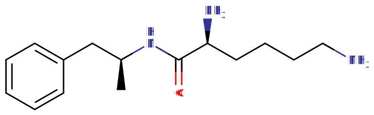

# 利右苯丙胺

[◀返回](index.md)

> B站网友：_碰了之后，一辈子就毁了_  
> 真假自辩

| **化学信息** | 利右苯丙胺                                         |
| ------------ | -------------------------------------------------- |
| 结构式       |                   |
| 分子式       | C15H25N3O         |
| CAS 号       | 608137-32-2                                        |
| **化学命名** |                                                    |
| 常用名       | 利右苯丙胺、Lisdexamfetamine、Vyvanse、Elvanse     |
| 取代名称     | L-赖氨酸-右旋苯丙胺                                |
| 系统命名     | (2S)-2,6-二氨基-N-[(2S)-1-苯基丙烷-2-基]己酰胺     |
| **类别归属** |                                                    |
| 精神活性类别 | _[兴奋剂](../文档/药物分类/兴奋剂.md)_             |
| 化学结构类别 | _[苯丙胺类物质](../文档/药物分类/苯丙胺类物质.md)_ |

> **警告：** 由于个体在体重、耐受性、代谢和敏感度方面存在差异，请务必从较低剂量开始。详情请参阅[负责任的用药索引页](../文档/负责任的用药索引页.md)

| **给药途径** | ⇣ 口服        |
| ------------ | ------------- |
| 生物利用度   | > 96.4%[^1]  |
| **给药剂量** |               |
| 阈值         | 10 mg         |
| 轻微         | 20 \~ 30 mg   |
| 中等         | 30 \~ 60 mg   |
| 强烈         | 60 \~ 90 mg   |
| 严重         | 90 mg +       |
| **药效时长** |               |
| 总时长       | 10 \~ 14 小时 |
| 药效发作     | 60 \~ 90 分钟 |
| 药效上升     | 30 \~ 60 分钟 |
| 药效达峰     | 3 \~ 5 小时   |
| 药效褪去     | 4 \~ 6 小时   |
| 药效残余     | 2 \~ 6 小时   |

> **免责声明：** PW 的[给药剂量](../文档/给药剂量.md)信息是从用户和相关资源收集整理的，仅供教育目的。这不是用药建议，应与其他来源核实以确保准确性

| 药物联用         | 危险程度    |
| ---------------- | ----------- |
| 酒精             | 💔 联用危险 |
| GHB              | 💔 联用危险 |
| GBL              | 💔 联用危险 |
| 阿片类药物       | 💔 联用危险 |
| 可卡因           | ⚠️ 谨慎联用 |
| 大麻             | ⚠️ 谨慎联用 |
| 咖啡因           | ⚠️ 谨慎联用 |
| 氯胺酮           | ⚠️ 谨慎联用 |
| 甲氧麻黄酮       | ⚠️ 谨慎联用 |
| 迷幻剂           | ⚠️ 谨慎联用 |
| 右美沙芬         | ⚠️ 谨慎联用 |
| PCP              | ⚠️ 谨慎联用 |
| 25x-NBOMe        | ⛔ 严禁联用 |
| 2C-T-x           | ⛔ 严禁联用 |
| 5-MeO-xxT        | ⛔ 严禁联用 |
| DOx              | ⛔ 严禁联用 |
| 曲马多           | ⛔ 严禁联用 |
| αMT              | ⛔ 严禁联用 |
| 单胺氧化酶抑制剂 | ⛔ 严禁联用 |

**利右苯丙胺**（**Lisdexamfetamine**，亦称 **利斯右苯丙胺**、**L-赖氨酸-右旋苯丙胺**、**利右苯丙胺二甲磺酸盐**，以及商品名 **Vyvanse**、**Elvanse** 或 **Tyvense**）是一种[苯丙胺类物质](../文档/药物分类/苯丙胺类物质.md)的[兴奋剂](../文档/药物分类/兴奋剂.md)。它是右旋苯丙胺（右旋苯丙胺）的「互利[前药](../文档/药物前药.md)」（共药），被批准用于治疗注意力缺陷多动障碍（ADHD）以及中度到重度暴食症。[^2] 与苯丙胺一样，利右苯丙胺通过促进大脑中[神经递质](../文档/神经递质.md)[多巴胺](../文档/多巴胺.md)和[去甲肾上腺素](../文档/去甲肾上腺素.md)的释放来产生效果。

[主观效应](../药效/index.md)与右旋苯丙胺基本相同，只是起效更慢、持续时间更长。这些效应包括[兴奋](../药效/兴奋.md)、[专注力强化](../药效/专注力强化.md)、[动机增强](../药效/动机增强.md)、[认知欣快](../药效/认知欣快.md)，以及在少部分人群中出现的矛盾性镇静。然而，与右旋苯丙胺不同的是，利右苯丙胺是专门设计来防止非口服给药方式的（作为防滥用设计来宣传的）。这意味着[鼻吸](../文档/给药途径.md)、抽吸或[注射](../文档/给药途径.md)不会提供更快的吸收或起效速度。它有时会作为"学习药"以及娱乐性物质被非法销售和使用。

尽管有防滥用设计的宣传，利右苯丙胺和其他[欣快](../药效/认知欣快.md)类兴奋剂一样，能够产生依赖和成瘾，尤其是在超过推荐剂量使用时。因此，如果要使用这种物质，强烈建议采用[伤害减少措施](../文档/负责任的用药索引页.md)~

## 历史与文化

|                                               |                                                                                            |
| --------------------------------------------- | ------------------------------------------------------------------------------------------ |
|  | **这个 _历史与文化_ 章节还是个小存根~** 因此可能包含不完整或错误的信息。欢迎来帮忙扩展它！ |

利右苯丙胺是由新河制药公司（New River Pharmaceuticals Inc.，NRPH）开发的，作为右旋苯丙胺的一种更持久且更耐滥用的版本。[^3]

美国食品药品监督管理局于 2008 年 4 月 23 日批准利右苯丙胺用于成人 ADHD 治疗，[^4] 随后在 2015 年 1 月批准用于治疗成人暴食症。[^5]

## 化学性质

利右苯丙胺是一种共药，由氨基酸L-赖氨酸与右旋苯丙胺通过共价键连接组成。[^6] 苯丙胺由[苯乙胺](../文档/药物分类/苯乙胺类物质.md)核心组成，其特征是苯环通过乙基链与氨基（NH2）连接，并在 Rα 位置有一个额外的甲基取代。它可以被称为[苯乙胺](../文档/药物分类/苯乙胺类物质.md)的甲基同系物，因为它们具有相同的基本结构式，只是多了一个甲基。

## 药理学

利右苯丙胺的开发目标是提供全天持续一致的长效效果，同时降低滥用潜力。赖氨酸的附加减缓了右旋苯丙胺释放到血液中的相对量。因为利右苯丙胺胶囊中不存在游离的右旋苯丙胺，所以通过机械操作（如压碎或简单提取）无法获得右旋苯丙胺。因此，没有办法通过替代[给药途径](../文档/给药途径.md)（如通过[鼻吸](../文档/给药途径.md)、气化或[注射](../文档/给药途径.md)）来加速吸收，这使得该药物在理论上更不易被滥用。

### 药代动力学

作为一种[前药](../文档/药物前药.md)，利右苯丙胺在给药形式下是无活性的。一旦摄入，它会被酶切成两部分：L-赖氨酸（一种天然存在的必需氨基酸）和右旋苯丙胺（一种中枢神经系统兴奋剂）。因此，利右苯丙胺作为右旋苯丙胺的缓释版本发挥作用。因为右旋苯丙胺需要通过与红细胞接触才能从赖氨酸中释放出来，所以效果与给药途径无关。利右苯丙胺转化为活性右旋苯丙胺是酶限速的，减缓了达到峰值浓度的时间，降低了峰值浓度的大小，并抑制了随之而来的纹状体多巴胺释放，而这被认为是兴奋剂产生欣快和[强迫性补量](../药效/强迫性补量.md)效应的原因。

### 药效动力学

苯丙胺是痕量胺相关受体 1（TAAR1）的[完全激动剂](../文档/受体激动剂.md)，该受体是常见和痕量脑单胺（如[多巴胺](../文档/多巴胺.md)、[血清素](../文档/血清素.md)和[去甲肾上腺素](../文档/去甲肾上腺素.md)）的关键调节器。[^7] [^8] [^9] 这组受体的激动作用导致[突触间隙](../文档/神经递质.md)中[多巴胺](../文档/多巴胺.md)、[血清素](../文档/血清素.md)和[去甲肾上腺素](../文档/去甲肾上腺素.md)浓度升高。这导致用户产生[认知](../药效/思维加速.md)和[躯体刺激](../药效/兴奋.md)。

右旋苯丙胺对 TAAR1 受体的亲和力是左旋苯丙胺的两倍。[^10] 因此，右旋苯丙胺产生的中枢神经系统（CNS）刺激是左旋苯丙胺的三到四倍。另一方面，左旋苯丙胺具有更强的心血管和外周效应。

### 转化率

利右苯丙胺二甲磺酸盐（通常处方形式）的重量中有 29.7% 是右旋苯丙胺：30 mg 利右苯丙胺二甲磺酸盐相当于 8.9 mg 右旋苯丙胺。[^11] [^12]

由于[前药](../文档/药物前药.md)中活性物质释放更慢、更稳定，主观体验会有所不同。等量的右旋苯丙胺会有更高的血浆峰值浓度和更短的持续时间。

## 主观效应

虽然主观效应与右旋苯丙胺（因此也与[苯丙胺](苯丙胺.md)）基本相同，但由于其缓释机制，利右苯丙胺的持续时间明显更长，强度也更加一致。虽然这种药物的代谢是限速的，但一旦达到峰值，足够高的剂量与其速释对应物相当。

据报道，外周效应（如心率增加和体温升高）比部分含有左旋苯丙胺的配方（如Adderall或非法销售的消旋硫酸苯丙胺）更不明显。

> **免责声明：** 以下列出的效应引用了[主观效应索引](../药效/index.md)（SEI），这是一个基于轶事用户报告和PsychonautWiki贡献者个人分析的开放研究文献。因此，应以健康的怀疑态度看待这些内容。
>
> 另外值得注意的是，这些效应不一定会以可预测或可靠的方式发生，尽管较高剂量更可能诱发全部效应谱。同样，**不良效应**在较高剂量时更可能出现，可能包括**成瘾、严重伤害或死亡** ☠。

### **[躯体效应](../药效/躯体效应.md)** 

- **[兴奋](../药效/兴奋.md)** - 据报道，利右苯丙胺在能量和刺激方面与[苯丙胺](苯丙胺.md)相似。它可以鼓励跳舞、社交、跑步或清洁等体力活动。利右苯丙胺产生的刺激风格可以被描述为强制性的。这意味着，在较高剂量时，由于下颌紧咬、身体不自主颤抖和振动的出现，很难或不可能保持静止，导致全身极度颤抖、手不稳以及精细运动控制的普遍丧失。这种效应在体验消退期会被轻度疲劳和普遍疲惫所取代。
- **[自发性躯体感觉](../药效/自发性躯体感觉.md)** - 利右苯丙胺的"躯体高潮"可以被描述为一种中等程度的欣快刺痛感，包围全身。这种感觉保持持续存在，随着起效稳步上升，并在达到峰值时达到极限。
- **[心律异常](../药效/心律异常.md)**
- **[心率增快](../药效/心率增快.md)**[^13]
- **[血压升高](../药效/血压升高.md)**
- **[食欲抑制](../药效/食欲抑制.md)** - 与[苯丙胺](苯丙胺.md)相比，这种效应更为明显，有时会导致人们在整个药效期间都不进食。利右苯丙胺有时被处方用于治疗暴食症，就是因为它强大的食欲抑制效果。
- **[支气管扩张](../药效/支气管扩张.md)**
- **[肌肉紧张](../药效/肌肉紧张.md)**
- **[脱水](../药效/脱水.md)**
- **[口干](../药效/口干.md)**
- **[尿频](../药效/尿频.md)**
- **[体温升高](../药效/体温升高.md)**
- **[出汗增加](../药效/出汗增加.md)**
- **[恶心](../药效/恶心.md)** - 这种效应通常只在严重剂量时出现。
- **[瞳孔扩大](../药效/瞳孔扩大.md)** - 这种效应在体验消退期更为明显，通常只在中等到严重剂量时出现。
- **[耐力增强](../药效/耐力增强.md)**
- **[磨牙](../药效/磨牙.md)** - 与[MDMA](MDMA.md)相比，这一成分可以被认为强度较低。
- **[暂时性勃起功能障碍](../药效/暂时性勃起功能障碍.md)**
- **[血管收缩](../药效/血管扩张.md)**

### **[视觉效应](../药效/视觉效应.md)** 

利右苯丙胺的视觉效应通常不太一致，只在较高剂量时才轻微可见。它们在某种程度上与[谵妄剂](../文档/药物分类/谵妄剂.md)的视觉效应相似，并且在较暗的区域更容易出现。

#### 增强

- **[视觉锐度增强](../药效/视觉锐度增强.md)**
- **[复视](../药效/复视.md)** - 苯丙胺类药物在高剂量时可能导致复视。

#### 扭曲

- **[漂移](../药效/漂移.md)**（呼吸和变形）- 这种效应通常很微妙，只在较高剂量、长时间清醒后或与[大麻](大麻.md)联用时出现。通常这包括1-2级漂移。
- **[亮度改变](../药效/亮度改变.md)** - 由于瞳孔扩大效应，利右苯丙胺可以使空间看起来更明亮。

#### 幻觉状态

- **[物体改变](../药效/物体改变.md)** - 这种效应很少发生，通常只在用户服用高剂量、正在消退期或清醒时间异常长时才会出现。当它们确实出现时，通常非常轻微。

### **[认知效应](../药效/认知效应.md)** 

利右苯丙胺与其他苯丙胺类药物共享大部分认知效应，尽管由于缓释机制，其起效较为温和。它产生与[兴奋剂](../文档/药物分类/兴奋剂.md)相关的各种认知增强。然而，在持续时间的后半部分，这些认知增强可能会与累积的多巴胺消耗及其影响相竞争或被抵消。

其中最突出的认知效应通常包括：

- **[分析能力增强](../药效/分析能力增强.md)**
- **[焦虑](../药效/焦虑.md)** - 这种效应在体验消退阶段更常发生。
- **[创造力增强](../药效/创造力增强.md)**
- **[强迫性补量](../药效/强迫性补量.md)** - 由于利右苯丙胺起效缓慢，完整效果可能在服用后长达 3 小时才能感受到，导致一些人在起效期间补量。如果服用严重剂量，强迫性补量更常见。
- **[自我膨胀](../药效/自我膨胀.md)**
- **[情感抑制](../药效/情感抑制.md)** - 与其他[苯丙胺](苯丙胺.md)类药物（如[右旋苯丙胺](苯丙胺.md)和[甲基苯丙胺](甲基苯丙胺.md)）相比，这种效应在利右苯丙胺中更常被报道。它通常在轻微和中等剂量时最为强烈。
- **[专注力强化](../药效/专注力强化.md)**
- **[易怒](../药效/易怒.md)** - 这种效应在体验消退阶段更常发生。
- **[沉浸感强化](../药效/沉浸感强化.md)**
- **[音乐欣赏能力增强](../药效/音乐欣赏能力增强.md)**
- **[记忆增强](../药效/记忆增强.md)**
- **[动机增强](../药效/动机增强.md)**
- **[性欲增强](../药效/性欲增强.md)** 或 **[性欲减退](../药效/性欲减退.md)**
- **[新奇感增强](../药效/新奇感增强.md)**
- **[时间扭曲](../药效/时间扭曲.md)** - 这可以被描述为时间加速的体验，感觉时间比清醒时过得快得多。
- **[思维加速](../药效/思维加速.md)**
- **[思维组织](../药效/思维组织.md)**
- **[清醒](../药效/清醒.md)**
- **[认知欣快](../药效/认知欣快.md)**

### **[听觉效应](../药效/听觉效应.md)** 

- **[听觉锐度增强](../药效/听觉锐度增强.md)**
- **[听觉幻觉](../药效/听觉幻觉.md)** - 在强烈或严重剂量下使用利右苯丙胺和其他苯丙胺类药物，偶尔会导致轻微的听觉幻觉。这些幻觉最常出现在白噪声源附近（如风扇），通常由安静的幻影音乐或声音组成。利右苯丙胺也可能以兴奋剂精神病的形式引起听觉幻觉。

### **药效残余** 

在[兴奋剂](../文档/药物分类/兴奋剂.md)体验的[药效褪去](../文档/药效下降期.md)期间发生的效应，与[药效达峰](../药效时长.md)期间发生的效应相比，通常感觉是消极和不舒服的。这通常被称为「下坡」，是由于[神经递质](../文档/神经递质.md)耗竭而发生的。根据用户的不同，利右苯丙胺产生的下坡据报道要么比其代谢产物[右旋苯丙胺](苯丙胺.md)温和得多，要么强烈得多，这是由于其缓释机制。其效应通常包括：

- **[焦虑](../药效/焦虑.md)**
- **[食欲抑制](../药效/食欲抑制.md)**
- **[认知疲劳](../药效/认知疲劳.md)**
- **[抑郁](../药效/抑郁.md)**
- **[易怒](../药效/易怒.md)**
- **[动力抑制](../药效/动力抑制.md)**
- **[思维减速](../药效/思维减速.md)**
- **[清醒](../药效/清醒.md)**

确保饮食良好和补充水分是减少下坡效应严重程度的推荐做法。使用温和的镇静剂也是应对兴奋剂下坡的常见策略~

### 体验报告

我们[体验索引]中描述这种化合物效应的轶事报告包括：

- [Experience: 70 mg Lisdexamfetamine (Oral/Insufflated) - Intense Study Session](<../报告/psychonautwiki/Experience:_70_mg_Lisdexamfetamine_(Oral_Insufflated)_-_Intense_Study_Session>)
- [Experience:Lisdexamfetamine (70 mg, Orally) - Daily use for someone with ADHD](<../报告/psychonautwiki/Experience:Lisdexamfetamine_(70_mg,_Orally)_-_Daily_use_for_someone_with_ADHD>)

更多体验报告可以在这里找到：

- [Erowid Experience Vaults: Lisdexamfetamine](https://erowid.org/experiences/subs/exp_Lisdexamfetamine.shtml)

## 毒性与伤害潜力

在啮齿动物和灵长类动物中，足够高剂量的苯丙胺会导致多巴胺能神经毒性或对多巴胺神经元的损伤，其特征是转运体和受体功能降低。没有证据表明苯丙胺对人类具有直接的神经毒性。然而，大剂量的苯丙胺可能由于活性氧和多巴胺自氧化导致的氧化应激增加而间接引起神经毒性。

强烈建议在使用这种药物时采用[伤害减少措施](../文档/负责任的用药索引页.md)哦~

### 耐受性与成瘾潜力

重度娱乐性使用苯丙胺类药物存在严重的成瘾风险，但长期在治疗剂量下进行医疗使用不太可能导致成瘾。由于起效较慢和自限性代谢（对最大血浆峰值浓度和随后的多巴胺释放设定了上限），利右苯丙胺被认为比其他药用苯丙胺类药物具有更低的滥用和成瘾潜力。然而，与苯丙胺类其他药物一样，仍需谨慎。

在苯丙胺滥用（即娱乐性苯丙胺过量使用）中，耐受性发展迅速，因此长期使用通常需要越来越大的剂量才能达到相同的效果。重复使用利右苯丙胺会导致与所服剂量成比例的逐渐耐受。处方该药物的患者通常必须在一段时间后增加剂量以维持其疗效。

### 精神病

使用非常高剂量的苯丙胺类药物可能导致[兴奋剂精神病](../文档/兴奋剂精神病.md)，可能包括偏执、妄想和幻觉等症状，包括著名的[影子人](../药效/影子人.md)。一项关于苯丙胺、右旋苯丙胺和甲基苯丙胺精神病治疗的 Cochrane 协作组综述指出，约 5 \~ 15% 的使用者无法完全康复。根据同一综述，至少有一项试验表明抗精神病药物能有效缓解急性苯丙胺精神病的症状。精神病很少因治疗性使用而发生。长期使用高剂量加上睡眠剥夺会显著增加兴奋剂精神病的风险。

### 危险联用

> **警告：** 许多单独使用时相当安全的精神活性物质，当与某些其他物质联用时可能突然变得危险甚至危及生命。以下列表提供了一些已知的危险联用（尽管不能保证包括所有联用情况）。
>
> 请始终进行独立研究（如 [Google](https://www.google.com)、[DuckDuckGo](https://www.duckduckgo.com)、[PubMed](https://pubmed.ncbi.nlm.nih.gov/)）以确保两种或多种物质联用是安全的。部分列出的联用信息来源于 [TripSit](https://combo.tripsit.me)。

- **酒精** - 在服用兴奋剂时饮酒被认为是有风险的，因为它降低了身体用来判断醉酒程度的酒精镇静效应。这通常导致抑制力大大降低的情况下过量饮酒，增加肝损伤和脱水的风险。兴奋剂的效应还会让人能够喝到超过正常情况下可能昏倒的程度，增加风险。如果你确实决定这样做，你应该设定每小时饮酒量的限制并坚持执行，同时记住你会感觉酒精和兴奋剂的效应都减少了。
- **GHB/GBL** - 兴奋剂增加呼吸频率，允许更高剂量的镇静剂。如果兴奋剂先消退，那么 GHB/GBL 的抑制效应可能会压倒用户并导致呼吸停止。
- **阿片类药物** - 兴奋剂增加呼吸频率，允许更高剂量的阿片类药物。如果兴奋剂先消退，那么阿片类药物可能会压倒患者并导致呼吸停止。
- **可卡因** - 可卡因的奖赏效应是通过DAT抑制和通过细胞膜胞吐作用增加多巴胺释放来介导的。苯丙胺通过 pH 介导的置换机制逆转 DAT 的方向和细胞内囊泡转运的方向，因此排除了通过胞吐作用释放多巴胺的常规机制，因为钠钾泵（Na+/K+-ATPase）的效应被抑制了。你会发现可卡因和苯丙胺联用会产生心脏效应，这是由于随后 5-HT2B 激活导致的 SERT 介导机制，这是血清素相关瓣膜病的一种效应。苯丙胺类药物在滥用模型中通常会导致高血压，这种联用可能会增加因瓣膜运作时血流紊乱而导致晕厥的机会。给予苯丙胺会逆转可卡因的奖赏机制。[^14] [^15]
- **大麻** - 兴奋剂增加[焦虑](../药效/焦虑.md)水平以及[思维循环](../药效/思维循环.md)和[偏执](../药效/偏执.md)的风险，可能导致负面体验。
- **咖啡因** - 这种兴奋剂组合通常被认为是不必要的，可能会增加心脏负担，并可能导致焦虑和身体不适。
- **曲马多** - 曲马多和兴奋剂都会增加癫痫发作的风险。
- **右美沙芬** - 这两种物质都会提高心率，在极端情况下，这些物质引起的恐慌发作可能导致更严重的心脏问题。
- **氯胺酮** - 苯丙胺和氯胺酮联用可能导致类似精神分裂症的精神病，但不比任何一种物质单独产生的精神病更严重，不过这一点是有争议的。这是因为苯丙胺能够减弱氯胺酮对工作记忆的破坏。单独使用苯丙胺可能导致夸大妄想、偏执或躯体妄想，对阴性症状几乎没有影响。然而，氯胺酮会因为概念的改变而导致思维障碍、执行功能障碍和妄想。这些机制是由于苯丙胺通过其影响多巴胺的药理作用增加了中脑边缘通路的多巴胺能活动，以及氯胺酮的 NMDA 拮抗作用对中脑皮层通路多巴胺能功能的破坏。结合这两者，你可能主要预期会出现思维障碍以及阳性症状。[^16]
- **PCP** - 增加心动过速、高血压和躁狂状态的风险。
- **甲氧麻黄酮** - 增加心动过速、高血压和躁狂状态的风险。
- **迷幻剂**（如 **_[LSD](LSD.md)、[麦斯卡林](麦斯卡林.md)、[赛洛西宾](赛洛西宾蘑菇.md)_**）- 增加[焦虑](../药效/焦虑.md)、[偏执](../药效/偏执.md)和[思维循环](../药效/思维循环.md)的风险。
    - **25x-NBOMe** - 苯丙胺和 NBOMe 都提供相当大的刺激，联用时可能导致心动过速、高血压、血管收缩，在极端情况下可能导致心力衰竭。兴奋剂的致焦虑和聚焦效应与迷幻剂联用也不好，因为它们可能导致不愉快的思维循环。已知 NBOMe 会导致癫痫发作，兴奋剂会增加这一风险。
    - **2C-T-x** - 疑似具有轻度 MAOI 特性。可能增加高血压危象的风险。
    - **5-MeO-xxT** - 疑似具有轻度 MAOI 特性。可能增加高血压危象的风险。
    - **DOx**
- **αMT** - αMT 具有 MAOI 特性，可能与苯丙胺类药物产生不良反应。
- **单胺氧化酶抑制剂** - MAO-B 抑制剂可能会不可预测地增加苯乙胺类药物的效力和持续时间。MAO-A 抑制剂与苯丙胺联用可能导致高血压危象。

## 法律状态

利右苯丙胺在医生处方下被批准用于医疗用途，但在大多数国家，未经处方销售或持有是违法的。

在[申根区](https://en.wikipedia.org/wiki/Schengen_Area)（覆盖欧洲大部分地区，但不包括英国）旅行时需要特殊证明。[^17] [^18]

- **澳大利亚**：它是附表8药物。
- **加拿大**：利右苯丙胺以及其他苯丙胺类药物是附表I药物。[^19]
- **德国**：自 2013 年 7 月 17 日起，利右苯丙胺受 Anlage III BtMG（《麻醉品法》附表III）[^20] 管制。[^21] 只能通过麻醉品处方开具。[^22]
- **挪威**：利右苯丙胺是受特别严格管制的A类药物。
- **瑞典**：利右苯丙胺是II类麻醉品，有严格的处方要求。它已被列入「utökad övervakning」（扩展监控）。[^17]
- **瑞士**：自 2014 年 10 月 1 日起，利右苯丙胺是受管制物质，特别列入 Verzeichnis A。允许医疗使用。[^23]
- **英国**：利右苯丙胺是附表II、B类受管制药物。[^24]
- **美国**：利右苯丙胺是附表II受管制药物。[^25]

## 另见

- [负责任的用药索引页](../文档/负责任的用药索引页.md)
- [兴奋剂](../文档/药物分类/兴奋剂.md)
- [苯丙胺](苯丙胺.md)
- [哌甲酯](哌甲酯.md)

## 外部链接

- [Lisdexamfetamine (Wikipedia)](http://en.wikipedia.org/wiki/Lisdexamfetamine)
- [Lisdexamfetamine (Isomer Design)](https://isomerdesign.com/PiHKAL/explore.php?id=10644)
- [Lisdexamfetamine (DrugBank)](https://go.drugbank.com/drugs/DB01255)
- [Lisdexamfetamine (Drugs.com)](https://www.drugs.com/mtm/lisdexamfetamine.html)
- [Dextroamphetamine and Amphetamine (MedicinePlus)](https://medlineplus.gov/druginfo/meds/a601234.html)

## 参考文献

[^1]: <https://web.archive.org/web/20140826115717/http://www.mhra.gov.uk/home/groups/par/documents/websiteresources/con261790.pdf>

[^2]: <https://www.drugs.com/pro/vyvanse.html>

[^3]: Mattingly G (May 2010). ["Lisdexamfetamine dimesylate: a prodrug stimulant for the treatment of ADHD in children and adults"](https://digitalcommons.wustl.edu/open_access_pubs/3506). CNS Spectrums. **15** (5): 315–325. [doi](http://en.wikipedia.org/wiki/Digital_object_identifier):[10.1017/S1092852900027541](https://doi.org/10.1017%2FS1092852900027541). [PMID](http://en.wikipedia.org/wiki/PubMed_Identifier) [20448522](https://www.ncbi.nlm.nih.gov/pubmed/20448522).

[^4]: ["FDA Adult Approval of Vyvanse – FDA Label and Approval History"](http://www.accessdata.fda.gov/drugsatfda_docs/appletter/2008/021977s001ltr.pdf) (PDF). Accessdate.fda.gov. Retrieved 12 March 2022.

[^5]: ["FDA expands uses of Vyvanse to treat binge-eating disorder"](https://web.archive.org/web/20180126103215/https://www.fda.gov/NewsEvents/Newsroom/PressAnnouncements/ucm432543.htm). U.S. Food and Drug Administration (FDA) (Press release). 30 January 2015. Archived from [the original](https://www.fda.gov/NewsEvents/Newsroom/PressAnnouncements/ucm432543.htm) on 26 January 2018. Retrieved 19 March 2023.

[^6]: Blick SK, Keating GM (2007). "Lisdexamfetamine". Paediatric Drugs. **9** (2): 129–135; discussion 136–138. [doi](http://en.wikipedia.org/wiki/Digital_object_identifier):[10.2165/00148581-200709020-00007](https://doi.org/10.2165%2F00148581-200709020-00007). [PMID](http://en.wikipedia.org/wiki/PubMed_Identifier) [17407369](https://www.ncbi.nlm.nih.gov/pubmed/17407369).

[^7]: Miller, G. M. (January 2011). ["The Emerging Role of Trace Amine Associated Receptor 1 in the Functional Regulation of Monoamine Transporters and Dopaminergic Activity"](https://www.ncbi.nlm.nih.gov/pmc/articles/PMC3005101/). Journal of neurochemistry. **116** (2): 164–176. [doi](http://en.wikipedia.org/wiki/Digital_object_identifier):[10.1111/j.1471-4159.2010.07109.x](https://doi.org/10.1111%2Fj.1471-4159.2010.07109.x). [ISSN](http://en.wikipedia.org/wiki/International_Standard_Serial_Number) [0022-3042](https://www.worldcat.org/issn/0022-3042).

[^8]: [Drug banks amphetamine targets](http://www.drugbank.ca/drugs/DB00182#targets)

[^9]: TA1 receptor | <http://www.iuphar-db.org/DATABASE/ObjectDisplayForward?objectId=364>

[^10]: Lewin, A. H., Miller, G. M., Gilmour, B. (1 December 2011). ["Trace amine-associated receptor 1 is a stereoselective binding site for compounds in the amphetamine class"](https://www.ncbi.nlm.nih.gov/pmc/articles/PMC3236098/). Bioorganic & medicinal chemistry. **19** (23): 7044–7048. [doi](http://en.wikipedia.org/wiki/Digital_object_identifier):[10.1016/j.bmc.2011.10.007](https://doi.org/10.1016%2Fj.bmc.2011.10.007). [ISSN](http://en.wikipedia.org/wiki/International_Standard_Serial_Number) [0968-0896](https://www.worldcat.org/issn/0968-0896).

[^11]: [Elvanse 20mg, 30mg, 40mg, 50mg, 60mg & 70mg Capsules, hard - Summary of Product Characteristics (SmPC) - (emc)](https://www.medicines.org.uk/emc/medicine/27442/SPC/)

[^12]: [Stimulant Equivalency Table](https://39f93cda-b262-4d28-a694-bf36a6802943.filesusr.com/ugd/1da6d0_55267f5b04204cb58bcc848398c0286f.pdf)

[^13]: Huang, Y.-S., Tsai, M.-H. (July 2011). ["Long-Term Outcomes with Medications for Attention-Deficit Hyperactivity Disorder: Current Status of Knowledge"](http://link.springer.com/10.2165/11589380-000000000-00000). CNS Drugs. **25** (7): 539–554. [doi](http://en.wikipedia.org/wiki/Digital_object_identifier):[10.2165/11589380-000000000-00000](https://doi.org/10.2165%2F11589380-000000000-00000). [ISSN](http://en.wikipedia.org/wiki/International_Standard_Serial_Number) [1172-7047](https://www.worldcat.org/issn/1172-7047).

[^14]: Greenwald, M. K., Lundahl, L. H., Steinmiller, C. L. (December 2010). ["Sustained Release d-Amphetamine Reduces Cocaine but not 'Speedball'-Seeking in Buprenorphine-Maintained Volunteers: A Test of Dual-Agonist Pharmacotherapy for Cocaine/Heroin Polydrug Abusers"](http://www.nature.com/articles/npp2010175). Neuropsychopharmacology. **35** (13): 2624–2637. [doi](http://en.wikipedia.org/wiki/Digital_object_identifier):[10.1038/npp.2010.175](https://doi.org/10.1038%2Fnpp.2010.175). [ISSN](http://en.wikipedia.org/wiki/International_Standard_Serial_Number) [0893-133X](https://www.worldcat.org/issn/0893-133X).

[^15]: Siciliano, C. A., Saha, K., Calipari, E. S., Fordahl, S. C., Chen, R., Khoshbouei, H., Jones, S. R. (10 January 2018). ["Amphetamine Reverses Escalated Cocaine Intake via Restoration of Dopamine Transporter Conformation"](https://www.jneurosci.org/lookup/doi/10.1523/JNEUROSCI.2604-17.2017). The Journal of Neuroscience. **38** (2): 484–497. [doi](http://en.wikipedia.org/wiki/Digital_object_identifier):[10.1523/JNEUROSCI.2604-17.2017](https://doi.org/10.1523%2FJNEUROSCI.2604-17.2017). [ISSN](http://en.wikipedia.org/wiki/International_Standard_Serial_Number) [0270-6474](https://www.worldcat.org/issn/0270-6474).

[^16]: Krystal, J. H., Perry, E. B., Gueorguieva, R., Belger, A., Madonick, S. H., Abi-Dargham, A., Cooper, T. B., MacDougall, L., Abi-Saab, W., D’Souza, D. C. (1 September 2005). ["Comparative and Interactive Human Psychopharmacologic Effects of Ketamine and Amphetamine: Implications for Glutamatergic and Dopaminergic Model Psychoses and Cognitive Function"](http://archpsyc.jamanetwork.com/article.aspx?doi=10.1001/archpsyc.62.9.985). Archives of General Psychiatry. **62** (9): 985. [doi](http://en.wikipedia.org/wiki/Digital_object_identifier):[10.1001/archpsyc.62.9.985](https://doi.org/10.1001%2Farchpsyc.62.9.985). [ISSN](http://en.wikipedia.org/wiki/International_Standard_Serial_Number) [0003-990X](https://www.worldcat.org/issn/0003-990X).

[^17]: [Elvanse - FASS Allmänhet](https://www.fass.se/LIF/product?userType=2&nplId=20140730000117)

[^18]: <http://www.felleskatalogen.no/medisin/elvanse-shire-pharmaceutical-contracts-ltd-588199>

[^19]: [Consolidated federal laws of Canada, Controlled Drugs and Substances Act](https://laws-lois.justice.gc.ca/eng/acts/C-38.8/page-15.html), 2022

[^20]: ["Anlage III BtMG"](https://www.gesetze-im-internet.de/btmg_1981/anlage_iii.html) (in German). Bundesministerium der Justiz und für Verbraucherschutz. Retrieved December 19, 2019.

[^21]: ["Siebenundzwanzigste Verordnung zur Änderung betäubungsmittelrechtlicher Vorschriften"](https://www.bgbl.de/xaver/bgbl/start.xav#__bgbl__//*%5B@attr_id=%27bgbl113s2274.pdf%27%5D) (in German). Bundesanzeiger Verlag. Retrieved December 19, 2019.

[^22]: ["§ 8 BtMVV"](https://www.gesetze-im-internet.de/btmvv_1998/__8.html) (in German). Bundesministerium der Justiz und für Verbraucherschutz. Retrieved December 19, 2019.

[^23]: ["Verordnung des EDI über die Verzeichnisse der Betäubungsmittel, psychotropen Stoffe, Vorläuferstoffe und Hilfschemikalien"](https://www.admin.ch/opc/de/classified-compilation/20101220/index.html) (in German). Bundeskanzlei [Federal Chancellery of Switzerland]. Retrieved January 1, 2020.

[^24]: <https://www.gov.uk/government/publications/controlled-drugs-list--2/list-of-most-commonly-encountered-drugs-currently-controlled-under-the-misuse-of-drugs-legislation>

[^25]: [21 U.S. Code § 812 - Schedules of controlled substances](https://www.law.cornell.edu/uscode/text/21/812#b_4)
