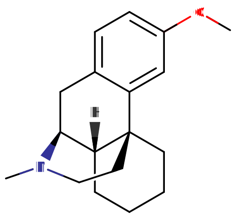
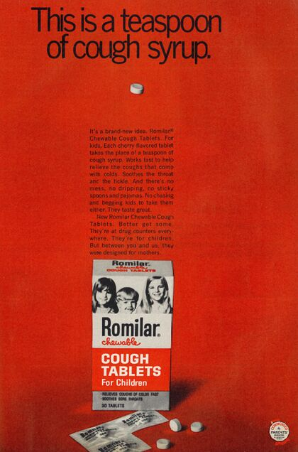
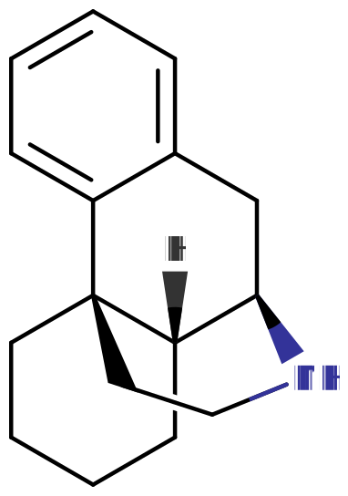
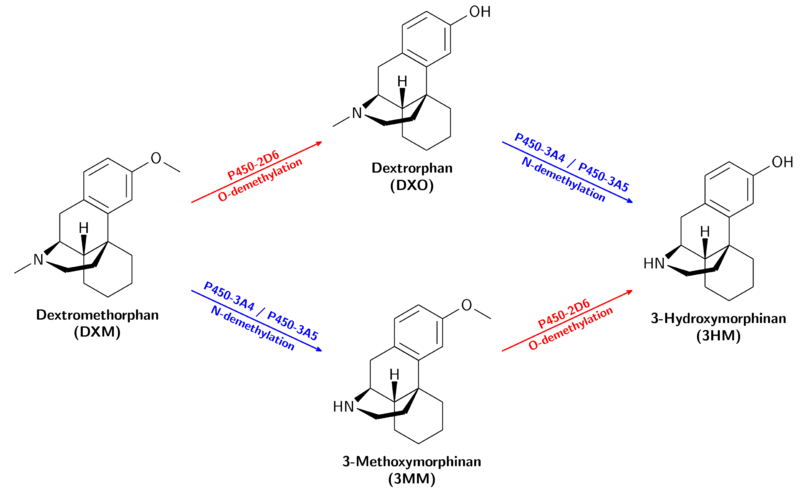

# 右美沙芬

[◀返回](./home.md)

    

    广州禁毒：滥用就是吸毒。我：啊对对对
    

>  " style="height:400px; vertical-align:top;">

> **[危险的药物相互作用](#危险的相互作用)：**
> 苯二氮卓类物质、大麻、2,5-二甲氧基苯丙胺类物质、25x-NBOMe、4-硫基-2,5-二甲氧基苯乙胺类物质、5-MeO-xxT、苯丙胺类物质、可卡因、安非他酮、αMT、PCP、MDMA、酒精、GHB、GBL、阿片类药物、曲马多、MAOI、SSRI、抗组胺药

| 化学信息       | 右美沙芬                                                                                     |
| -------------- | -------------------------------------------------------------------------------------------- |
| 结构式         |                                                                          |
| 分子式         | C18H25NO                                                               |
| CAS 号         | 125-71-3                                                                                     |
| **化学命名法** |                                                                                              |
| 常见名称       | DXM, DMO, DM, Dex, Robitussin, Delsym, DexAlone, Duract                                      |
| 取代名称       | 右美沙芬                                                                                     |
| 系统名称       | (4bS,8aR,9S)-3-Methoxy-11-methyl-6,7,8,8a,9,10-hexahydro-5H-9,4b-(epiminoethano)phenanthrene |
| **所属分类**   |                                                                                              |
| 精神活性分类   | _[解离剂](../文档/药物分类/解离剂.md)_                                                       |
| 化学分类       | _[吗啡喃类物质](../文档/药物分类/吗啡喃类物质.md)_                                           |

> **警告：** 由于个体体重、耐受、代谢与个人敏感性的差异，请务必从更低剂量开始。[参见负责任的用药部分](../文档/负责任的用药索引页.md)。

| [**给药途径**](../文档/给药途径.md)      | [口服](../文档/给药途径.md#口服) |
| ---------------------------------------- | -------------------------------- |
| [**给药剂量**](../文档/给药剂量.md)      |                                  |
| [阈值](../文档/药物剂量分类.md#阈值)     | 75 mg                            |
| [轻微](../文档/药物剂量分类.md#轻微)     | 100 \~ 200 mg                    |
| [中等](../文档/药物剂量分类.md#中等)     | 200 \~ 400 mg                    |
| [强烈](../文档/药物剂量分类.md#强烈)     | 400 \~ 700 mg                    |
| [严重](../文档/药物剂量分类.md#严重)     | 700 mg +                         |
| [**药效时长**](../文档/药效时长.md)      |                                  |
| [总时长](../文档/药效时长.md#总时长)     | 8 \~ 12 小时                     |
| [药效发作](../文档/药效时长.md#药效发作) | 30 \~ 120 分钟                   |
| [药效上升](../文档/药效时长.md#药效上升) | 60 \~ 120 分钟                   |
| [药效达峰](../文档/药效时长.md#药效达峰) | 3 \~ 6 小时                      |
| [药效褪去](../文档/药效时长.md#药效褪去) | 2 \~ 4 小时                      |
| [药效残余](../文档/药效时长.md#药效残余) | 4 \~ 24 小时                     |

> **[免责声明](../关于本站/免责声明.md)：** 本网站的[给药剂量](../文档/给药剂量.md)信息仅为基于用户与资料汇总的教育用途内容，并不构成推荐，使用前应结合其他来源核实其准确性哦。

**右美沙芬**（也称 **robo**、**dex**、**DM** 和 **DXM**）是一种 [解离剂](../文档/药物分类/解离剂.md)，属于 [吗啡喃类物质](../文档/药物分类/吗啡喃类物质.md)。它是许多常见非处方（OTC）感冒药和止咳药中的主要活性成分。当超过核准剂量时，右美沙芬会产生与 [氯胺酮](../药物/氯胺酮.md) 和 [PCP](../药物/PCP.md) 相似的解离效应。它作为一种非竞争性的 [NMDA受体拮抗剂](../文档/药物分类/NMDA受体拮抗剂类药物.md) 起作用。[^1]

据报道，右美沙芬最早于 1953 年被提出，并于 1958 年在美国获批作为镇咳药使用。[^2]获批后，它以 Romilar 这一名称作为非处方药上市。早在1975年，人们就已注意到右美沙芬的流行与广泛滥用，因此 Romilar 自愿退出了非处方市场。[^300mg]几年后，各公司开始推出多种经过改良的右美沙芬产品，以抑制滥用，例如加入味道不佳的成分呢。

不过，右美沙芬的娱乐性使用并没有消失，而且被认为是一种日益增长的趋势，尤其是在寻求廉价且容易获得之“药效”的青少年之中。[^4]

[主观效应](../药效/主观效应索引.md) 包括 [分离效应](../药效/分离效应.md)、[时间扭曲](../药效/时间扭曲.md)、躯体幻觉、[沉浸感强化](../药效/沉浸感强化.md)、[运动控制丧失](../药效/运动控制丧失.md)、欣快感以及自我丧失。用户通常会将低剂量描述为类似酒精醉意的状态，而较高剂量则会产生与[氯胺酮](../药物/氯胺酮.md)或 [PCP](../药物/PCP.md) 相似的效应。它也常被报告会带来强烈且不适的躯体负担，并伴有明显的 [恶心](../药效/恶心.md)。

右美沙芬的效应与耐受性在不同用户之间差异很大，这可能与个体在代谢相关基因上的差异有关。因此，许多用户会觉得右美沙芬体验要么令人不快、要么中性、要么乏味；而另一些人则会报告类似神秘体验的迷幻经历呢。

需要注意的是，游离碱形式的右美沙芬（如 Robocough RoboTablets 中所含者）由于按重量计算的右美沙芬浓度更高，其效力大约比氢溴酸盐形式高 27 \~ 37%。在计算剂量时应将这一点考虑进去，以避免潜在的过量风险。

右美沙芬在娱乐性剂量下的毒性尚不明确，并一直存在争议。有一些证据表明，NMDA 拮抗剂在过量使用时可能具有神经毒性。已有许多关于右美沙芬依赖与滥用的案例记录。若要使用这种物质，强烈建议采取 [伤害减少措施](../文档/负责任的用药索引页.md)。

## 1. 历史与文化

|        |
| -------------------------------- |
| 1968 年 Romilar 右美沙芬片剂广告 |

右美沙芬的外消旋母体化合物 racemethorphan 最早分别记载于 Hoffmann-La Roche 于 1946 年和 1947 年提交的瑞士与美国专利申请中。该专利于 1950 年获批。1952 年发表了使用酒石酸拆分 racemethorphan 两种异构体的方法[^5]，而右美沙芬则于 1954 年在由美国海军与中央情报局资助的、用于寻找 [可待因](../药物/可待因.md) 非成瘾性替代品的研究中成功完成测试。[^6]

右美沙芬于 1958 年获得 FDA 批准，作为一种非处方镇咳药，也就是咳嗽抑制剂。[^5]正如最初所希望的那样，右美沙芬解决了部分使用可待因磷酸盐作为镇咳药所带来的问题，例如镇静和阿片依赖；但与解离性麻醉剂 [PCP](../药物/PCP.md) 和 [氯胺酮](../药物/氯胺酮.md) 类似，右美沙芬后来也与非医疗用途联系在了一起。[^3] [^5]

在 1960 年代和 1970 年代，右美沙芬以 Romilar 品牌的非处方片剂形式供应。1973 年，由于频繁误用导致销量激增，Romilar 被撤下货架，并试图以止咳糖浆取而代之，以减少滥用。[^3]

1990 年代互联网广泛普及后，用户得以迅速传播有关右美沙芬的信息，围绕这种物质的使用与获取也形成了在线讨论群体。

早在 1996 年，人们就已经可以从线上零售商处大量购买右美沙芬氢溴酸盐粉末，这让用户能够避免摄入糖浆制剂中的其他成分。[^5]自 2012 年 1 月 1 日起，除持有医生处方外，右美沙芬在美国加利福尼亚州被禁止向未成年人销售。[^7]

## 2. 化学

|  |
| -------------------------- |
| 吗啡喃分子的通式           |

右美沙芬是 [吗啡喃类物质](../文档/药物分类/吗啡喃类物质.md) 中的右旋分子。它具有一个菲核心结构，其中一个芳香环（苯环）与两个饱和环（环己烷）相连。此外，它还含有一个连接在核心结构 R9 和 R13 位点上的饱和哌啶环。右美沙芬在一个 R 位上带有甲基，在另一个 R 位上带有甲氧基。

## 3. 药理学

更多信息：[NMDA 受体拮抗剂类药物](../文档/药物分类/NMDA受体拮抗剂类药物.md)

右美沙芬的药理机制尚未被完全弄清。体外研究表明，右美沙芬的主要作用机制是对 N-甲基-D-天冬氨酸（NMDA）受体的阻断。NMDA 受体是一类谷氨酸受体；而谷氨酸是主要的兴奋性 [神经递质](../文档/神经递质.md)。因此，阻断 NMDA 受体会干扰中枢神经系统中的兴奋性信号传递。这一作用机制与 [氯胺酮](../药物/氯胺酮.md) 和 [PCP](../药物/PCP.md)相似。

右美沙芬本身并不是直接作为 NMDA 受体拮抗剂发挥作用，而是作为其效力更强的代谢产物右啡烷的前药；真正介导其解离效应的，其实是右啡烷呢。

其他药理机制还包括：作为非选择性的 [血清素](../文档/血清素.md) [再摄取抑制剂](../文档/神经递质再摄取抑制剂.md)[^8]、α3β4 烟碱型受体拮抗剂[^9]，以及 σ1 受体激动剂。[^10] [^11]

在高剂量下，右美沙芬可导致收缩压和舒张压升高，并伴有心率增快。[^12]右美沙芬还会提高血浆中促肾上腺皮质激素（ACTH）和皮质酮的水平。[^13]

尽管右美沙芬是 [吗啡衍生物](../文档/药物分类/吗啡喃类物质.md)，但它并不像该类中大多数化合物那样是强效的 μ-阿片受体激动剂，例如 [海洛因](../药物/海洛因.md) 和 [可待因](../药物/可待因.md)。

| 结合位点 | 结合亲和力 Ki（nM）[^14] |
| -------- | ----------------------------------- |
| NMDA     | 8945                                |
| Sigma-1  | 138                                 |
| SERT     | 40                                  |
| NET      | 240                                 |
| μ-阿片   | 1280                                |
| κ-阿片   | 7000                                |
| δ-阿片   | 11500                               |

### 3.1 代谢

|  |
| ------------------------------- |
| 右美沙芬的代谢                  |

右美沙芬会在 CYP2D6 酶作用下发生 O-去甲基化，转化为右啡烷（DXO / D-3-hydroxy-N-methylmorphinan）[^15] [^16]。右美沙芬也会在 CYP3A4 酶[^16] [^17]、以及较小程度上的 CYP3A5 酶[^18] 作用下发生 N-去甲基化，转化为 3-甲氧基吗喃（MEM / Morphinan）。

右啡烷与 3-甲氧基吗喃都会进一步代谢为 3-羟基吗喃。右啡烷通过 CYP3A4 进行 N-去甲基化，而 3-甲氧基吗喃则通过 CYP2D6 进行 O-去甲基化。CYP2D6 的 O-去甲基化效率高于 CYP3A4 的 N-去甲基化。[^16]

不同个体代谢右美沙芬的方式差异，可能会显著改变体验的性质。代谢较慢者清除右美沙芬的速度低于普通人，导致血液中右美沙芬与右啡烷的比例更高[^19]，并因更多药物没有转化为基本无活性的代谢物 3MM 和 3HM，而使整体效力和持续时间都更强、更长。CYP2D6 与 CYP3A4 抑制剂也会产生类似影响。

#### 右啡烷

右啡烷是右美沙芬在 CYP2D6 酶作用下经 O-去甲基化生成的产物，并有助于右美沙芬的精神活性效应。[^20] 它在药理学上与右美沙芬相似；不过，它作为 [NMDA 受体拮抗剂](../文档/药物分类/NMDA受体拮抗剂类药物.md) 的效力要强得多[^14]，而作为 [选择性血清素再摄取抑制剂（SSRI）](../文档/SSRI.md)的活性则弱得多。[^13]

它作为 α3β4 烟碱型受体拮抗剂的效力也大约比右美沙芬低 3 倍[^9]，并且对 σ1 受体的亲和力更低。[^10]

| 结合位点 | 结合亲和力 Ki（nM）[^14] |
| -------- | ----------------------------------- |
| NMDA     | 486                                 |
| Sigma-1  | 351                                 |
| SERT     | 484                                 |
| NET      | 340                                 |
| μ-阿片   | 420                                 |
| κ-阿片   | 5950                                |
| δ-阿片   | 34700                               |

#### 3-甲氧基吗喃

3-甲氧基吗喃（也称 3MM）是右美沙芬在 CYP3A4 酶作用下经 N-去甲基化生成的产物[^16]，并会抑制 CYP2D6 酶。[^21] 它具有局部麻醉作用。[^22]

#### 3-羟基吗喃

3-羟基吗喃（也称 3HM）可由 3-甲氧基吗喃在 CYP2D6 作用下经 O-去甲基化生成，也可由右啡烷在 CYP3A4 与 CYP3A5 作用下代谢生成。[^23 ]3-羟基吗喃具有神经保护和神经营养作用。[^24] [^25] [^26]

## 4. 主观效应

右美沙芬的精神状态常被描述为具有明显的致幻性、损害性、迷失方向感，而且与 [MXE](../药物/MXE.md) 和 [氯胺酮](../药物/氯胺酮.md) 相比，整体上会更不清晰、也更缺乏清醒头脑的感觉。

> _**免责声明：** 下列效应引用自 [**主观效应索引**](../药效/主观效应索引.md)（**SEI**），这是一个基于轶事性用户报告以及本网站贡献者个人分析的开放式研究文献库。因此，应以适度怀疑的态度来看待这些内容。_
>
> _还值得注意的是，这些效应并不一定会以可预测或可靠的方式出现，尽管更高剂量更容易诱发完整的效应谱。同样，**不良效应** 在更高剂量下也会愈发常见，并可能包括 **成瘾、重伤或死亡** ☠。_

### 4.1 **生理效应** 

- **[兴奋](../药效/兴奋.md)**[^12] 与 **[镇静](../药效/镇静.md)** - 在较低的娱乐性剂量下，右美沙芬主要表现为刺激性。不过，它也会带来一阵阵疲倦感，或让人想闭着眼躺下，进入一种近似睡眠的状态。随着更高剂量的接近，体验通常会变得非常镇静而迟滞，有时甚至会导致使用者完全不想动。
- **[躯体轻盈感](../药效/躯体轻盈感.md)** - 这会带来一种身体漂浮、仿佛完全失去重量的感觉。这个效应带着一种奇异的刺激性，在低到中等剂量下，会因为身体感觉轻盈且移动毫不费力，而鼓励进行身体活动。
- **[躯体控制增强](../药效/躯体控制增强.md)** - 这种效应在较低剂量时出现得并不稳定，但可能相当明显。在更高高原时，它会让位于 [运动控制丧失](../药效/运动控制丧失.md)、步态改变以及[空间定向障碍](../药效/空间定向障碍.md)。
- **[自发性躯体感觉](../药效/自发性躯体感觉.md)** - 右美沙芬的“躯体药效”是一种尖锐、愉悦且温暖的刺痛感，可局限于手、脚和头部。在较低剂量时，它会带来一种令人振奋的刺激感；而在更高剂量下，则可能带来轻微到强烈的躯体负担。
    - **[躯体欣快感](../药效/躯体欣快感.md)** - 这会带来从轻微愉悦到强烈而包裹一切的极乐感。

- **[食欲抑制](../药效/食欲抑制.md)** - 右美沙芬所致的食欲抑制非常强烈，并可能持续到第二天。
- **[躯体形态感改变](../药效/躯体形态感改变.md)** - 在中等或高剂量下，这会变得相当突出。
- **[运动控制丧失](../药效/运动控制丧失.md)**[^12] - 粗大与精细运动控制、平衡感及协调能力的丧失在右美沙芬体验中很突出，并且在较高剂量下会尤其强烈。应在药效发作前先坐下，以防摔倒受伤。
- **[空间定向障碍](../药效/空间定向障碍.md)**[^12] - 常会感觉到一种旋转感，从而导致轻度迷失方向，就像自己正坠入某种洞穴或虚空中一样。
- **[恶心](../药效/恶心.md)**[^12] - 右美沙芬有时会引发极度恶心和呕吐，通常发生在体验的药效上升阶段。这种恶心通常比 [氯胺酮](../药物/氯胺酮.md) 和 [MXE](../药物/MXE.md) 引起的更强烈且更稳定。其原因很可能不只是右美沙芬本身，而是承载右美沙芬的制剂载体，通常是糖浆或明胶胶囊。若摄入的是纯右美沙芬，则严重恶心并不常见。
- **[体温调节抑制](../药效/体温调节抑制.md)**
    - **[体温升高](../药效/体温升高.md)** - 由于右美沙芬是一种中等效力的血清素再摄取抑制剂，因此在中高剂量下会轻微提高体温。

- **[血压升高](../药效/血压升高.md)**[^12]
- **[心率增快](../药效/心率增快.md)**[^12]
- **[出汗增加](../药效/出汗增加.md)** - 这是体温升高与体温调节抑制共同作用的结果。
- **[肌肉痉挛](../药效/肌肉痉挛.md)**
- **[性高潮抑制](../药效/性高潮抑制.md)**
- **[性欲减退](../药效/性欲减退.md)**
- **[排尿困难](../药效/排尿困难.md)** - 随剂量升高，这一点会愈发明显；在高剂量时，甚至可能完全无法排尿。
- **[瘙痒感](../药效/瘙痒感.md)** - 这一效应俗称为“robo-itch”。许多用户从未体验过，而有些人则会体验得相当强烈。它由 [组胺](../文档/组胺.md) 释放引起，通常与剂量大小相关。
- **[咳嗽抑制](../药效/咳嗽抑制.md)** - 由于右美沙芬本来就是常见的镇咳药，因此在娱乐性剂量下也会有同样的作用。
- **[镇痛](../药效/镇痛.md)**
- **[肌肉松弛](../药效/肌肉松弛.md)** - 这一效应并不稳定，可能会与一阵阵 [肌肉颤动](../药效/肌肉颤动.md) 交替出现。
- **[眼球滑动](../药效/眼球滑动.md)**
- **[头晕](../药效/头晕.md)** - 在较高剂量下，这甚至可能导致无法自主站立。
- **[味觉幻觉](../药效/味觉幻觉.md)**
- **[躯体自主](../药效/躯体自主.md)** - 在极高剂量下，有些人可能会发现自己在陌生地点醒来，有时甚至是在站立或进行某些动作时，却完全不记得发生过什么，也不知道自己是怎么到那里的。
- **[触觉抑制](../药效/触觉抑制.md)** - 这会部分到完全抑制触觉，造成四肢麻木感。它也是这种物质具备麻醉性质的原因。
- **[瞳孔扩大](../药效/瞳孔扩大.md)** - 在中到高剂量下，瞳孔扩大非常明显；而在第一高原的低剂量中则不那么常见。
- 步态改变 - 这是右美沙芬上的常见效应，通常被称为“robo walking”。与瘙痒一样，有些用户可能从未体验过，而有些人则可能体验得很强烈。

### 4.2 **视觉效应** 

#### 增强

- **[颜色增强](../药效/颜色增强.md)** - 与迷幻剂上体验到的颜色增强相比，这一效应通常没那么丰富、鲜艳或饱和，而且它往往不只是增强颜色本身，也会改变颜色——在较高剂量下，常会出现红色、橙色或紫色的视觉染色。
- **[放大](../药效/放大.md)** - 这一效应并不常见，通常会与 [透视扭曲](../药效/透视扭曲.md) 同时出现。
- 周边视野增强 - 这一效应通常只出现在低剂量下。
- **[视觉加工加速](../药效/视觉加工加速.md)** - 这一效应较为罕见，偶尔会在较低高原出现。它似乎依赖于情景。

#### 抑制

- **[复视](../药效/复视.md)** - 这一组成部分在中到高剂量中很常见，会让阅读变得不可能，除非闭上一只眼。
- **[模式识别抑制](../药效/模式识别抑制.md)** - 这一效应通常出现在更高剂量下，会让人无法识别和解释可感知的视觉信息。举例来说，可能会无法识别人脸或运动。
- **[视觉加工减慢](../药效/视觉加工减慢.md)** - 这就是所谓的“flanging”效应；在足够高的剂量下，它会影响视觉、听觉，而在更高层级时，还会影响语句、人脸与思维。
- 眼震 - 在非常高的剂量下，人可能会无法识别物体运动或人脸等事物。
- **[视觉锐度抑制](../药效/视觉锐度抑制.md)** - 视觉常被报告为非常梦境化，且常伴有一层朦胧或“静电样”的覆盖感影响整个视野。

#### 扭曲

- **[残影](../药效/残影.md)** - 一些用户报告说，在闭上眼睛后，仍能持续几秒钟看见周围环境。
- **[深度感知扭曲](../药效/深度感知扭曲.md)**
- **[漂移](../药效/漂移.md)** - 右美沙芬上已有视觉漂移的报告，尽管并不常见。这个效应在外观上并不真实。其扭曲运动快速、平滑，且往往转瞬即逝。
- **[环境立体主义](../药效/环境立体主义.md)**
- **[环境球体化](../药效/环境球体化.md)**
- **[透视扭曲](../药效/透视扭曲.md)**
- **[环境切片](../药效/环境切片.md)**
- **[视觉拖尾](../药效/视觉拖尾.md)**
- **[视觉迷雾](../药效/视觉迷雾.md)**
- **[视觉拉伸](../药效/视觉拉伸.md)**

#### [几何](../药效/几何.md)

与[氯胺酮](../药物/氯胺酮.md)或[MXE](../药物/MXE.md)相比，右美沙芬产生的视觉几何可被描述为更加明亮、更加多彩、更加 [迷幻剂](../文档/药物分类/迷幻剂.md) 化且更为复杂，但又比诸如 [LSD](../药物/LSD.md) 之类的迷幻剂更暗一些。有时，所感知到的几何会开始减速、摇晃或冻结，而这通常并不会在迷幻剂或解离剂中看到。它们也会在闭眼时自发转化为一种 [幻觉状态](../药效/幻觉状态.md)。其层级不会超出 4 级，并且可以较为完整地描述为：复杂度精细、风格算法化、质感合成化、组织结构无序、光照明亮、配色多彩、阴影有光泽、边缘柔和、尺寸偏小、速度缓慢、运动既平滑又抖动、棱角与圆角程度相当、纵深极具沉浸感，且强度稳定。

#### 幻觉状态

在高剂量下，右美沙芬可以产生完整范围的高级幻觉状态，但其一致性和可复现性低于许多其他常见迷幻剂。这些效应包括：

- **[外部幻觉](../药效/外部幻觉.md)**（_[自主实体](../药效/自主实体.md)_；_[场景、布景和景观](../药效/场景、布景和景观.md)_；_[视角幻觉](../药效/视角幻觉.md)_ 以及 _[情景与情节](../药效/情景与情节.md)_）- 与其他 [解离剂](../文档/药物分类/解离剂.md) 相比，这一效应可以在高剂量下出现，但与[谵妄剂](../文档/药物分类/谵妄剂.md)中的同类效应相比则极为罕见。它可以较完整地描述为：可信度上偏谵妄性、可控性上偏自主、风格上偏实体化。此效应最常见的主题，是体验到自己在与周围其实并不存在的朋友交谈。
- **[内部幻觉](../药效/内部幻觉.md)**（_[自主实体](../药效/自主实体.md)_；_[场景、布景和景观](../药效/场景、布景和景观.md)_；_[视角幻觉](../药效/视角幻觉.md)_ 以及 _[情景与情节](../药效/情景与情节.md)_）- 与其他 [解离剂](../文档/药物分类/解离剂.md) 相比，这一效应可以在高剂量下出现，但比起 [迷幻剂](../文档/药物分类/迷幻剂.md) 和 [谵妄剂](../文档/药物分类/谵妄剂.md) 中的同类效应仍更少见，尽管有时依旧可能变得极具包裹感。它可以较完整地描述为：可信度上偏谵妄性、风格固定、内容上在新体验与记忆回放之间各半、可控性上偏自主、风格上偏实体化。

### 4.3 **认知效应** 

- **[分析能力抑制](../药效/分析能力抑制.md)**
- **[焦虑抑制](../药效/焦虑抑制.md)** _或_ **[焦虑](../药效/焦虑.md)** - 虽然右美沙芬通常会抑制焦虑，但在某些条件下它也会引发焦虑。高剂量时可能出现惊恐发作。
- **[概念性思维](../药效/概念性思维.md)**
- **[混乱](../药效/混乱.md)**[^12] - 在第三高原上，这一效应几乎可代表谵妄，不过当这一效应伴随人格解体开始出现时，认知思考能力也会开始减弱。
- **[认知欣快](../药效/认知欣快.md)** - 虽然认知欣快状态很常被报告，但这一效应也可能在没有明显原因的情况下不可预测地表现为 [认知不快](../药效/认知不快.md)，尤其是在较高剂量下。
- **[认知疲劳](../药效/认知疲劳.md)**[^12]
- **[创造力增强](../药效/创造力增强.md)**
- **[性欲减退](../药效/性欲减退.md)**
- **[既视感](../药效/既视感.md)**
- **[妄想](../药效/妄想.md)** - 这一效应会在部分用户中自发出现，并且在较高剂量下更可能发生。
- **[人格解体](../药效/人格解体.md)** - 这一效应通常只会在第二高原后段、第三高原或第四高原开始显现。
- **[现实感丧失](../药效/现实感丧失.md)**
- **[去抑制](../药效/去抑制.md)** - 即使在中等剂量下，这一效应也可能相当显著。
- **[自我膨胀](../药效/自我膨胀.md)**
- **[梦境强化](../药效/梦境强化.md)**
- **[情绪强化](../药效/情绪强化.md)** - 虽然这一效应不像在其他常见 [致幻剂](../文档/药物分类/致幻剂.md) 上那样稳定，但它比大多数 [解离剂](../文档/药物分类/解离剂.md) 上的表现更突出。
- **[共情、情感和社交能力增强](../药效/共情、情感和社交能力增强.md)** - 这一效应常被报告为与其他常见共情剂（如 MDMA 或 MDA）相似，但没那么明显。
- **[沉浸感强化](../药效/沉浸感强化.md)**
- **[幽默感增强](../药效/幽默感增强.md)** - 主要出现在较高高原以下。
- **[性欲增强](../药效/性欲增强.md)** - 这一效应只会在低剂量下感受到。
- **[音乐欣赏能力增强](../药效/音乐欣赏能力增强.md)** - 这一效应在右美沙芬上可能非常强烈，尤其是在较低高原时。聆听音乐会大幅强化体验，并带来强烈欣快感。
- **[记忆抑制](../药效/记忆抑制.md)**
    - **[自我死亡](../药效/自我死亡.md)**

- **[失忆](../药效/失忆.md)** - 这一效应通常只会在较高剂量、超过自我死亡阈值后出现（而这一阈值会因个体代谢而异）。它可能表现为对整个体验的部分或完全失忆。一般来说，体验中较为乏味的部分往往完全不会被记住。频繁使用有时也会加重这一点，甚至在体验结束后数天仍有影响。
- **[专注力抑制](../药效/专注力抑制.md)**[^12]
- **[动力抑制](../药效/动力抑制.md)**[^12]
- **[新奇感增强](../药效/新奇感增强.md)**
- **[个人偏见抑制](../药效/个人偏见抑制.md)** - 这一效应通常不像在更常用的致幻剂（如 [LSD](../药物/LSD.md) 或 [赛洛辛](../药物/赛洛辛.md)） 上那样明显。
- **[个人意义强化](../药效/个人意义强化.md)** - 这一效应通常只出现在较低高原，其可信度与内容也会有所变化。
- **[思维减速](../药效/思维减速.md)**
- **[时间扭曲](../药效/时间扭曲.md)** - 在右美沙芬作用下，时间常常会感觉被极大拉长。例如，明明现实中只过去了十分钟，却可能感觉像过了好几个小时。此外，人们通常也会很难判断某些事件究竟发生在什么时候。
- **[困倦](../药效/困倦.md)** - 这一效应会在首次服药后的第一小时达到高峰；当到达药效峰值后，它会慢慢减弱，让你处在一种清醒却又仿佛睡着的状态。

### 4.4 **听觉效应** 

- **[听觉锐度增强](../药效/听觉锐度增强.md)**
- **[听觉锐度抑制](../药效/听觉锐度抑制.md)**
- **[听觉扭曲](../药效/听觉扭曲.md)**
- **[听觉幻觉](../药效/听觉幻觉.md)**

### 4.5 **分离效应** 

- **认知分离**
- **[躯体分离](../药效/躯体分离.md)** - 虽然这一效应确实存在，但通常不像 [氯胺酮](../药物/氯胺酮.md) 或 [PCP](../药物/PCP.md) 那样强烈或稳定。
- **[视觉分离](../药效/视觉分离.md)** - 这最终会导致右美沙芬版本的“K-hole”，更准确地说，是出现某种“洞穴、空间与虚空”以及“结构体”的体验。

### 4.6 **多感官效应** 

- **[通感](../药效/通感.md)** - 在最完整的表现形式下，这是一种非常罕见且不可复现的效应。增加剂量会提升其出现概率，但它似乎只会在那些本就倾向于通感状态的人身上成为体验的显著部分。

### 4.7 **超个人效应** 

- **[灵性增强](../药效/灵性增强.md)**[^12]
- **[存在主义自我实现](../药效/存在主义自我实现.md)**
- **[统一感与互联感](../药效/统一感与互联感.md)**

### 4.8 **余辉** 

- 余辉是一种可能在体验后的次日或数周内出现的感觉。就躯体感受而言，它可被描述为一种欣快、焕发、放松以及轻微弹跳般轻盈的状态。认知表现则包括焦虑消失、满足感，以及 [音乐欣赏能力增强](../药效/音乐欣赏能力增强.md) 和对其他感官刺激更为敏锐，有时还会伴随轻微的 [现实感丧失](../药效/现实感丧失.md) 或 [人格解体](../药效/人格解体.md)。

### 4.9 高原

线上右美沙芬社群通常会将口服右美沙芬后可能出现的体验分为五个“高原”，它们分别对应性质上明显不同的效应类型。

**第一高原**（1.5 - 2.5 mg/kg）-
第一高原的效应通常并不算很强。它们可以包括但不限于：[认知欣快](../药效/认知欣快.md)、[音乐欣赏能力增强](../药效/音乐欣赏能力增强.md)、[时间扭曲](../药效/时间扭曲.md)、[瞳孔扩大](../药效/瞳孔扩大.md)以及[兴奋](../药效/兴奋.md)。第一高原常被描述为一种“喝醉了”的感觉。

**第二高原**（2.5 - 7.5 mg/kg）-
许多右美沙芬用户认为这是最具娱乐性的一个高原。第二高原比起刺激性更偏向镇静，而欣快感与 [视觉分离](../药效/视觉分离.md) 也会更强。第二高原的额外效应可以包括但不限于：[清醒](../药效/清醒.md)、[躯体欣快感](../药效/躯体欣快感.md)、[空间定向障碍](../药效/空间定向障碍.md)、[躯体轻盈感](../药效/躯体轻盈感.md)、[视觉加工减慢](../药效/视觉加工减慢.md)以及[音乐欣赏能力增强](../药效/音乐欣赏能力增强.md)。
许多右美沙芬用户不会再继续进入第二高原以上，因为他们认为想要的效应会逐渐被越来越明显的不良效应所抵消，包括更突出的“躯体负担”。音乐在这一高原常被报告为得到极大增强，被描述为丰富、清晰且被放大了呢。

**第三高原**（7.5 - 15 mg/kg）-
第三高原据称比第二高原强烈得多，因此应当循序渐进地接近。
第三高原的效应可以包括但不限于：[分离效应](../药效/分离效应.md)、[镇静](../药效/镇静.md)、[恶心](../药效/恶心.md)（发生于药效上升阶段）、[记忆抑制](../药效/记忆抑制.md) 与 [自我死亡](../药效/自我死亡.md)、[听觉幻觉](../药效/听觉幻觉.md)、[内部幻觉](../药效/内部幻觉.md)、[认知不快](../药效/认知不快.md)、欣快感、[焦虑](../药效/焦虑.md)、[妄想](../药效/妄想.md)，以及第二高原的所有效应。一些用户将第三高原的体验描述为既欣快又深刻。

一些用户形容自己会产生一种全能感，仿佛自己掌控着整个宇宙，并伴随闭眼视觉。闭眼视觉通常由颜色较暗的几何图样、广阔景观和场景构成。音乐会大幅增强这种效应，尽管它有时也会听起来尖细而失真。用户报告称，自己能够拆解歌曲中的每一个碎片，并在脑海中将其全部可视化；也有人报告会重历过去的记忆。

第三高原常被认为极度内省，不少用户表示这会激励他们改善自己的生活。其余辉常被报告为令人疲惫，但在之后的数日或数周内，情绪提升也很常见。

**第四高原**（15 - 20 mg/kg）- 第四高原的效应可以包括但不限于 [外部幻觉](../药效/外部幻觉.md)、完全分离，以及所有第三高原效应，但强度更高。[失忆](../药效/失忆.md) 也可能发生，导致记忆空白或记忆断片。

**这一剂量范围的右美沙芬非常危险，具有很高的受伤与过量风险，因此不建议尝试。**

**第五高原**（也称“Sigma高原”）-

**Sigma 高原具有神经毒性，并且有很高概率引发 [血清素综合征](../文档/血清素综合征.md)，因此强烈不建议尝试。**

达到“Sigma 高原”的一种常见方法，是先服用一次第二高原剂量，三小时后再追加一次第二高原剂量，然后在第二次剂量达到峰值时再服用一次第四高原剂量。
Sigma 高原通常会导致谵妄性的幻觉、认知不快、[谵妄](../药效/谵妄.md)、[精神病发作](../药效/精神病发作.md) 和 [焦虑](../药效/焦虑.md)；因此，Sigma 高原的主观体验通常非常不愉快且不可预测。
之所以需要分次给药才能达到 Sigma 高原，是因为最初的剂量会优先占据将右美沙芬转化为右啡烷的肝酶，从而导致血液中未转化右美沙芬的浓度更高（并伴随其自身的一套主观效应），同时也会让它从体内清除所需的时间更长。[^27] 由于这种酶学效应，Sigma 高原也可能因为重复给药、药物/药品相互作用（例如 CYP2D6 的底物），以及/或酶缺陷/肝功能障碍而意外出现。由于每个个体清除右美沙芬的方式不同，Sigma 高原的主观体验理论上可能持续一到四天。

## 5. 常见用法

### 5.1 可获得形式

右美沙芬有几种形式，可以在非处方渠道或线上购得。

- **止咳糖浆** 是线上和非处方渠道中最常见的形式。知名品牌包括 Benylin、DayQuil、Delsym、NyQuil、Robitussin、Omol 和 Siltussin。这些产品中很多还含有其他药物，包括 [阿司匹林](https://en.wikipedia.org/wiki/Aspirin)、[对乙酰氨基酚](https://en.wikipedia.org/wiki/Paracetamol)、[咖啡因](../药物/咖啡因.md)、愈创甘油醚或 [伪麻黄碱](https://en.wikipedia.org/wiki/Pseudoephedrine)。在英国，Benylin 干咳 7.5mg/5ml 糖浆（每瓶 150ml 共 225mg）可在每家药房柜台后购买。此类商店中也通常能买到价格更低的通用品牌。近年来，在美国，一种名为 RoboCough 的右美沙芬制剂（不含其他活性成分，且装在小瓶中）变得流行起来。

- **凝胶胶囊**、**含片**、**软糖锭** 和 **药片** 可在线上及非处方渠道购得。知名品牌包括 Benylin、Comtrex、Coricidin、DayQuil、Mucinex、NyQuil 和 Robitussin。这些产品中很多还含有其他药物，包括阿司匹林、对乙酰氨基酚、[咖啡因](../药物/咖啡因.md)、愈创甘油醚或伪麻黄碱。

- **纯粉末** 也可以在线上购得。这是使用右美沙芬最安全的方式，因为不存在因次要化学成分而导致过量的危险。不过，仍应检测你的粉末，以避免摄入有毒副产物，或是误服被虚假宣传为右美沙芬粉末的制剂。

务必要避免对其他活性成分，或它们的组合发生过量。止咳糖浆和药片中还常见的成分包括：

- **对乙酰氨基酚：** 也称 **Paracetamol** 或缩写为 **APAP**，是一种镇痛药。成年人推荐剂量为每 4 至 6 小时 650 至 1,000 mg，24 小时内不应超过 4,000 mg。成人单次剂量超过 150 mg/kg 或 7.5 g 被认为具有潜在毒性，但与肝损伤相关的最低剂量可在 4 至 10 g 之间浮动。对更年轻的成年人来说，这一剂量还会更低。[^28]
- **愈创甘油醚：** 愈创甘油醚推荐的每日最大剂量为 2.4 克。高达 4 克或更多的愈创甘油醚过量尚未与典型过量症状相关，除恶心与呕吐外暂无明确表现。[^29] 不过这不应被当作安全依据，若有可能，仍应避免愈创甘油醚过量。
- **氯苯那敏：** 作为 **Coricidin** 中的活性成分之一，氯苯那敏可作为血压稳定剂。氯苯那敏过量已导致多种循环系统并发症，而与右美沙芬联用也已造成多起过量与死亡案例。因此，与右美沙芬联用时应避免氯苯那敏。
- **去氧肾上腺素：** 每日最大剂量应低于 60 毫克。去氧肾上腺素过量与多种危险的心血管问题有关，而右美沙芬可能会进一步放大这种风险。因此，与右美沙芬联用时应避免去氧肾上腺素。
- **伪麻黄碱：** 过量可能导致心血管问题。与右美沙芬联用时应避免伪麻黄碱。
- **[咖啡因](../药物/咖啡因.md)：** 咖啡因过量可能在仅 400 到 600 毫克时就发生。它可能会增加右美沙芬的心血管副作用，但程度尚不明确。与右美沙芬联用时应避免咖啡因。
- **[苯海拉明](../药物/苯海拉明.md)：** 苯海拉明与右美沙芬联用时，[谵妄](../药效/谵妄.md) 和与现实彻底脱离的阈值会非常低。在高剂量下，也可能对循环系统和心脏造成额外负担。
- **阿司匹林：** 阿司匹林过量在低于 300mg/kg 时就可能开始，并在 500mg/kg 时变得致命。与右美沙芬联用时应避免较高剂量的阿司匹林。
- **右美沙芬聚苯乙烯磺酸树脂复合物：** 这一类型的右美沙芬用于常见品牌 Delsym，以缓解长时间咳嗽和感冒症状。包覆在右美沙芬周围的聚苯乙烯磺酸树脂会让右美沙芬的药效持续远长于预期；有些报告称，其药效可持续 18-24 小时，而普通右美沙芬通常约为 8-12 小时，这对部分用户来说可能非常不适。而且，要达到与普通右美沙芬相同的药效，你需要更多的右美沙芬聚苯乙烯磺酸树脂复合物。这可能导致有人为了达到普通右美沙芬中等偏高剂量的效果，而误用过量右美沙芬聚苯乙烯磺酸树脂复合物并发生过量。
- **多西拉敏：** 这种药存在于 NyQuil 中，作为助眠成分，帮助使用者更容易入睡。多西拉敏的人体半数致死量（LD ）估计为 50-500 mg/kg，而与右美沙芬一同摄入时，由于它与 [**苯海拉明**](../药物/苯海拉明.md) 一样属于第一代抗组胺药，因此出现 [谵妄](../药效/谵妄.md) 和彻底脱离现实的阈值会非常低。**多西拉敏** 与右美沙芬联用时也可能引起强烈镇静和共济失调，进而导致思维受损，甚至可能失去意识。

### 5.2 增效

推荐入门阅读：[右美沙芬 § 代谢](#代谢)

- **西柚汁：**

西柚汁被报告对增强右美沙芬的效应很有效。对于服用市售糖浆的用户而言，这意味着可以喝更少的糖浆。通过抑制 CYP3A4 酶，摄入西柚汁会让原本会被代谢成 3-MM 的右美沙芬，更多地被代谢成 DXO。这样会导致血浆中 DXO 浓度更高，同时也会通过抑制 DXO 向 3-HM 的转化而减慢 DXO 的降解。

在喝下一杯（200-250 mL）西柚汁后，接近最大程度的增效会持续 4 小时，而再喝更多则不会显著增强效果。另一方面，如果连续一天或更久、每天至少喝三次一杯西柚汁，那么其增效会比单次大量饮用更明显。在这种情况下，增效消退所需时间也会更长，这说明频繁饮用西柚汁具有累积效应。[^30]

- **镁：**

由于镁本身具有 NMDAR 拮抗特性，镁与几乎所有解离性物质都表现出协同作用。右美沙芬作为 NMDA 受体上的非竞争性拮抗剂，结合于与镁所结合的离子通道孔位不同的部位。镁则通过占据离子通道内部位点，作为一种电压依赖性阻滞剂。这样的双重机制使两种物质能够以不同方式调节受体活性，从而产生协同作用。[^31]

### 5.3 制备方法

本化合物在本网站 [教学索引页](../文档/教学索引页.md) 中的制备方法包括：

- [酸碱右美沙芬提取术](../文档/愈美分离术.md)

## 6. 毒性与伤害潜力

|                             |                                                                                                                                    |
| --------------------------- | ---------------------------------------------------------------------------------------------------------------------------------- |
|  | **本节“毒性与伤害潜力”仍为一篇小作品。** 因此，其中可能包含不完整甚至 **危险地错误** 的信息！你可以通过补充或修正它来帮助完善。 |

> 注意：若要使用这种物质，请务必自行开展独立研究，并采取 [伤害减少措施](../文档/负责任的用药索引页.md)。

更多信息：[负责任的用药](../文档/负责任的用药索引页.md)

关于人类娱乐性使用右美沙芬的毒性与长期健康影响，尚未有任何科学背景下的系统研究，其确切中毒剂量也不清楚。

轶事证据表明，单独以低到中等剂量尝试右美沙芬并且稀疏使用，似乎不会带来明显的负面健康影响。不过，许多右美沙芬用户报告称，在各自所达到的高原之间等待一周再使用右美沙芬（例如第一次高原后一周、第二次高原后两周，以此类推），可能有助于预防或减少对肾脏以及包括心脏和肝脏在内的许多器官的严重损伤，因为右美沙芬使用后血流中会残留各种过量有毒化学物质。这个 1-4 周的周期能让身体有时间过滤这些化学物质，并帮助你回到基线水平，以便再次使用时更安全。一些更重度的右美沙芬用户还报告称，如果不遵循这些指导，这些化学物质会随着时间大量积累；这可能意味着在更短间隔内进行更重度使用后，需要等待更久才能再次使用。摄入前，始终应进行 [独立研究](https://www.google.com/)，以确保两种或以上物质的组合是安全的。

尽管早期曾推测右美沙芬可能导致神经毒性和 Olney 病灶，但尚未证实它会在动物中造成这种效应。[^32] 不过，许多长期使用者报告称，在停止使用后的数月中，记忆、注意力和情绪仍存在显著问题。在大鼠实验中，[^33] 口服右美沙芬并未引起神经毒性效应。[^34 ]然而，青春期反复口服右美沙芬已被证明会在这些大鼠成年后损害学习能力。[^35]

若要使用这种物质，强烈建议采取 [伤害减少措施](../文档/负责任的用药索引页.md)。

### 6.1 依赖性与滥用潜力

与其他解离剂一样，右美沙芬在长期使用下会产生依赖性，并具有中等程度的滥用潜力。当依赖形成后，如果一个人突然停止使用，可能会出现渴求和 [药物戒断反应](../文档/药物戒断反应.md)。

一项针对右美沙芬用户的正式调查[^36] 显示，在长期/成瘾性使用右美沙芬后的第一周内，超过半数用户分别报告出现以下戒断症状：疲劳、冷漠、闪回以及便秘。超过四分之一的用户报告了失眠、噩梦、无法感到愉悦、记忆受损、注意力缺陷和性欲下降。较少见的副作用包括惊恐发作、学习受损、震颤、皮肤发黄、荨麻疹和肌肉疼痛。以极高剂量频繁长期使用，则可能导致中毒性精神病以及其他永久性的心理问题。[^3]

对右美沙芬许多效应的耐受性会随着持续且重复的使用而发展。这会导致用户必须服用越来越大的剂量，才能达到相同效应。之后，大约需要 3 \~ 7 天，耐受性才会降低一半；需要 1 \~ 2 周才能回到基线（前提是期间没有继续摄入）。

右美沙芬会与所有 [解离剂](../文档/药物分类/解离剂.md) 产生交叉耐受，这意味着在摄入右美沙芬后，所有 [解离剂](../文档/药物分类/解离剂.md) 的效应都会减弱。

此外，一些用户报告称会出现一种不可逆的、永久性的右美沙芬耐受性，这种耐受性会在长期过程中逐渐形成，并被认为与一个人一生中摄入的总剂次数有关。一些用户声称存在所谓的“50 次旅程上限”，超过这个上限后，右美沙芬原本具有奖赏性和独特性的效应会永久消失。其原因尚不明确，但这可能提示存在神经毒性。

#### 耐受性

长期滥用右美沙芬（DXM）可能通过几种不同机制，导致永久且不可逆的耐受性。

右美沙芬是一种 NMDA 受体拮抗剂，会阻断大脑中谷氨酸的抑制性作用。随着反复使用，机体会通过增加谷氨酸的产生来补偿这种阻断。这会导致对右美沙芬的耐受性快速形成。

长期滥用右美沙芬会导致神经适应，包括神经元和突触的变化。这些适应性改变会导致脑功能发生变化，从而减弱右美沙芬的效应。

右美沙芬通过阻断 NMDA 受体发挥作用。长期滥用可能导致这些受体下调，也就是其数量减少。受体减少会导致机体对右美沙芬的反应性降低。

右美沙芬在肝脏中代谢。长期滥用可能诱导代谢酶，从而加速右美沙芬的分解。

### 6.2 过量

轶事证据表明，右美沙芬过量风险会在大约 15 mg/kg 到 20 mg/kg 时变得显著，也就是一个 70 kg 人大约摄入 1,000 \~ 1,500 mg 时。右美沙芬过量可引发广泛的效应，包括 [妄想](../药效/妄想.md)、幻觉、[精神病发作](../药效/精神病发作.md)、[混乱](../药效/混乱.md)、[惊恐发作](../药效/惊恐发作.md)、[躁狂](../药效/躁狂.md)、[镇静](../药效/镇静.md) 以及严重的平衡问题，有时还会出现非常 [去抑制](../药效/去抑制.md) 或暴力的行为、[心率增快](../药效/心率增快.md)、眼震以及 [失忆](../药效/失忆.md)。

更严重的副作用包括麻醉、[呼吸抑制](../药效/呼吸抑制.md)、危险的高 [体温升高](../药效/体温升高.md)、意外伤害风险、自伤以及 [癫痫发作](../药效/癫痫发作.md)。癫痫发作可能是由于低钠血症和整体癫痫阈值下降所造成的。[^37] 它们据称会出现在 900 \~ 1,000 mg 以上剂量范围。右美沙芬也可能影响钾、维生素或血糖等其他水平，从而进一步以线性方式加重癫痫发作及其他健康问题的严重性和持续时间。

一般也认为，极高且反复的剂量会导致 [血清素综合征](../文档/血清素综合征.md)。

不要去打断一个正经历这种状态的人，因为其妄想可能会让他们以暴力回应。应注意不要让使用者受伤，并应寻求医疗救助，或者至少寻求医疗监护，以防出现严重呼吸抑制、窒息或器官损伤。

因右美沙芬毒性而死亡的情况较为罕见，不过大多数过量案例确实都提到了危及生命的并发症，通常包括极度 [心率增快](../药效/心率增快.md) 和 [血压升高](../药效/血压升高.md)、尿潴留以及横纹肌溶解。[体温升高](../药效/体温升高.md) 与 [癫痫发作](../药效/癫痫发作.md) 则可能导致脑细胞死亡。[^38]

### 6.3 危险的相互作用

**_警告：_** _许多单独使用时相对安全的精神活性物质，在与某些其他物质联用后，可能会突然变得危险，甚至危及生命。下列列表提供了一些已知的危险相互作用（尽管并不能保证包含全部情况）。_

_摄入前，始终要进行独立研究（例如 [Google](https://www.google.com)、[DuckDuckGo](https://www.duckduckgo.com)、[PubMed](https://pubmed.ncbi.nlm.nih.gov/)），以确保两种或更多物质联用是安全的。部分列出的相互作用来源于 [TripSit](https://combo.tripsit.me)。_

- **苯二氮卓类物质** - 小剂量苯二氮卓类物质可以终止一次糟糕旅程，不过两种物质都会增强彼此所引起的共济失调与镇静。这可能在高剂量下导致意外失去意识。若人失去意识而又未被置于 [恢复体位](../文档/恢复体位.md)，则存在吸入呕吐物的风险。
- **大麻** - 已知 CBD 会抑制 CYP2D6 酶，而这正是通常将右美沙芬分解为右啡烷的酶。这可能导致意外效应。[^39]
- **2,5-二甲氧基苯丙胺类物质** - 这一类作为 [迷幻剂](../文档/药物分类/迷幻剂.md) 性 [兴奋剂](../文档/药物分类/兴奋剂.md)，可能会掩盖右美沙芬的效应，并导致追加给药至不安全水平。右美沙芬也会增强 2,5-二甲氧基苯丙胺类物质，从而导致令人不适地强烈的体验。2,5-二甲氧基苯丙胺类物质本身也具有很强的身体刺激性，再加上两者持续时间都很长，因此尤其可能引发心率和血压问题。
- **25x-NBOMe**
- **4-硫基-2,5-二甲氧基苯乙胺类物质** - 由于大多数这类物质都是 [MAOI](#危险的相互作用)，因此这可能导致 [血清素综合征](../文档/血清素综合征.md) 以及其他危险效应。
- **5-MeO-xxT** - 关于这一联用的信息极少。
- **苯丙胺类物质** - 两者都会提升心率；在极端情况下，这些药物引发的惊恐发作甚至会导致更严重的心脏问题。
- **安非他酮** - 安非他酮是 CYP2D6 的强抑制剂，而 CYP2D6 正是主要负责分解右美沙芬的酶。这可能导致右美沙芬在血液中异常积累，从而带来不同且延长的效应。[^40] 以娱乐性方式联用安非他酮与右美沙芬，可能降低癫痫阈值、加重焦虑/偏执，并增加心动过速等症状的可能性。[^41] 关于娱乐性剂量下这一相互作用的资料整体仍较少，因此不建议尝试。
- **可卡因** - 两者都会提升心率；在极端情况下，这些药物引发的惊恐发作甚至会导致更严重的心脏问题。
- **αMT**
- **PCP** - 由于 PCP 独特的药理机制会影响 [多巴胺](../文档/多巴胺.md) 水平，因此这可能导致心血管并发症。
- **MDMA** - 两者都作用于血清素系统，因此具有很高的 [血清素综合征](../文档/血清素综合征.md) 风险。
- **酒精** - 两种物质都会增强彼此引起的共济失调与镇静，并可能在高剂量下导致意外失去意识。应将受影响者置于 [恢复体位](../文档/恢复体位.md)，以防因大量呕吐物而发生吸入。此外，中枢神经系统抑制还会导致呼吸困难。高于第一高原时应避免联用。
- **GHB** - 两种物质都会导致共济失调，并带来呕吐与失去意识的风险。如果患者在影响下失去意识，而又未被置于 [恢复体位](../文档/恢复体位.md)，则存在严重的吸入呕吐物风险。这一联用很难预测。
- **GBL** - 两种物质都会导致共济失调，并带来呕吐与失去意识的风险。如果患者在影响下失去意识，而又未被置于 [恢复体位](../文档/恢复体位.md)，则存在严重的吸入呕吐物风险。这一联用很难预测。
- **阿片类药物** - 两种物质在大剂量时都可能导致 [呼吸抑制](../药效/呼吸抑制.md)，此外，两者若都达到极大剂量，还可能具有肝毒性。另外，使用像右美沙芬这样的 NMDA 拮抗剂，还会降低并增强 [阿片类药物](../文档/药物分类/阿片类药物.md) 的耐受与效应。
- **曲马多** - 两种物质在大剂量时都可能导致 [呼吸抑制](../药效/呼吸抑制.md)，且若使用大剂量，两者都可能具有肝毒性。此外，如果服用了右美沙芬，其对 [阿片类药物](../文档/药物分类/阿片类药物.md) 的耐受会略微下降，从而造成额外的协同作用。
- **MAOI** - 具有很高的 [血清素综合征](../文档/血清素综合征.md) 风险。
- **SSRI** - 具有很高的 [血清素综合征](../文档/血清素综合征.md) 风险。
- **抗组胺药** - 许多 H1 拮抗剂，包括诸如 [苯海拉明](../药物/苯海拉明.md) 或特非那定等抗组胺药，以及许多 [抗精神病药](../文档/抗精神病药.md)，都可能因抑制 CYP2D6 而减缓右美沙芬的代谢，从而导致可能的死亡。[^42]

### 6.4 其他相互作用

- 研究显示，右美沙芬可预防并逆转 [吗啡](../药物/吗啡.md) 耐受，同时增强镇痛效应 [^43] [^44] [^45]，并可增强 NSAIDs、萘普生、吡罗昔康、依托度酸、双氯芬酸和酮咯酸的镇痛活性。[^46]

## 7. 法律地位

右美沙芬在大多数国家可作为非处方药或处方药获得。有些国家要求购买者年龄须超过 16、18 或 21 岁。

- **奥地利：** 右美沙芬未被列入《Suchtmittelgesetz》（麻醉品联邦法）。含右美沙芬药品仅限药房销售。含右美沙芬制剂可在药房无处方购买。
- **加拿大：** 右美沙芬被明确列为《受管制药物与物质法》豁免物质。[^47] 在加拿大可作为非处方药获得，也可合法以粉末形式购得。
- **中国：** 右美沙芬自 2024 年 7 月 1 日起被列为受管制物质（第二类精神药品）。含右美沙芬药品的销售被限制在医院内。[^48] 不过，这一限制仅针对“单方制剂”。右美沙芬与愈创甘油醚的复方制剂目前仍可作为非处方药购买。
- **丹麦：** 丹麦唯一含右美沙芬的产品 Dexofan 品牌片剂，属于 A 类处方药。[^49]
- **芬兰：** 右美沙芬被列入药品目录，只能在药房销售。[^50] 可在任何年龄购买，且无需处方。
- **德国：** 右美沙芬未被列入《Betäubungsmittelgesetz》（麻醉品联邦法）。[^51] 含右美沙芬药品仅限药房销售。[^52] 含右美沙芬制剂可在药房无处方购买。
- **墨西哥：** 右美沙芬未被列入《一般卫生法》（Ley General de Salud）所规定的、对公共卫生构成风险的物质名单。[^53] 它也被列入《参考药品清单》[^54]，属于《一般卫生法》第 226 条第 VI 款药物，这意味着它甚至可以在并未依法注册为药房的商家中自由出售。实际中，这意味着仅含右美沙芬的糖浆可以在任何设有药房区域的超市中直接上架、无需处方购买。
- **俄罗斯：** 右美沙芬属于 III 类受控物质。[^55]
- **韩国：** 右美沙芬属于受控物质（“향정신성의약품 라목”）。不过，符合要求的含右美沙芬“复方制剂”属于一般药物。若单次剂量为 7.5 至 15 mg，且规定用法不超过每日 60 mg，则不受管制。[^56]
- **瑞典：** 右美沙芬属于受控物质（麻醉品 V 类）[^57] [^58]，且由于药物滥用及相关风险，已不再于瑞典上市。以右美沙芬为活性成分的止咳药 Tussidyl 于 1999 年退出瑞典市场。
- **瑞士：** 右美沙芬被列为“Abgabekategorie B”类药品，通常需要处方（也可由药师在建议下发放）。在 2018 年与其他药品一并重新分类之前，它属于 C 类，这意味着可作为非处方药购买。[^59]
- **波兰：** 右美沙芬属于非处方药，购买者必须年满 18 岁，并且在单家药房中一次不得购买超过 360 mg 的该物质。[^60]
- **美国：** 右美沙芬可作为非处方药获得，可在杂货店、便利店以及线上找到。许多线下销售点要求购买者年满 18 岁，不过这并不是法律要求。

## 8.另见

- [负责任的用药](../文档/负责任的用药索引页.md)
- [致幻剂](../文档/药物分类/致幻剂.md)
- [解离剂](../文档/药物分类/解离剂.md)
- [MXE](../药物/MXE.md)
- [PCP](../药物/PCP.md)
- [氯胺酮](../药物/氯胺酮.md)
- 右美沙芬与苯海拉明联用

## 9. 外部链接

- [右美沙芬（维基百科）](http://en.wikipedia.org/wiki/Dextromethorphan)
    - [右美沙芬的娱乐性使用（维基百科）](https://en.wikipedia.org/wiki/Recreational_use_of_dextromethorphan)

- [右美沙芬（Erowid Vault）](http://www.erowid.org/chemicals/dxm/)
- [右美沙芬（Isomer Design）](https://isomerdesign.com/PiHKAL/explore.php?id=8676)
- [右美沙芬（DrugBank）](https://go.drugbank.com/drugs/DB00514)
- [右美沙芬（Drugs-Forum）](https://drugs-forum.com/wiki/DXM)

### 10. 讨论

- [DXM, broken down and described (Disregard Everything I Say)](http://disregardeverythingisay.com/post/36679606399/dxm-broken-down-and-described)

## 参考文献

[^1]: Siu, A., Drachtman, R. (2007). "Dextromethorphan: a review of N-methyl-d-aspartate receptor antagonist in the management of pain". _CNS drug reviews_. **13** (1): 96–106. [doi](http://en.wikipedia.org/wiki/Digital_object_identifier 'wikipedia:Digital object identifier'):[10.1111/j.1527-3458.2007.00006.x](https://doi.org/10.1111%2Fj.1527-3458.2007.00006.x). [ISSN](http://en.wikipedia.org/wiki/International_Standard_Serial_Number 'wikipedia:International Standard Serial Number') [1080-563X](https://www.worldcat.org/issn/1080-563X).

[^2]: Dicpinigaitis, P. V., Morice, A. H., Birring, S. S., McGarvey, L., Smith, J. A., Canning, B. J., Page, C. P. (April 2014). Sibley, D. R., ed. ["Antitussive Drugs—Past, Present, and Future"](http://pharmrev.aspetjournals.org/lookup/doi/10.1124/pr.111.005116). _Pharmacological Reviews_. **66** (2): 468–512. [doi](http://en.wikipedia.org/wiki/Digital_object_identifier 'wikipedia:Digital object identifier'):[10.1124/pr.111.005116](https://doi.org/10.1124%2Fpr.111.005116). [ISSN](http://en.wikipedia.org/wiki/International_Standard_Serial_Number 'wikipedia:International Standard Serial Number') [0031-6997](https://www.worldcat.org/issn/0031-6997).

[^3]: [_Dextromethorphan (DXM), CESAR_](https://web.archive.org/web/20180718182042/http://www.cesar.umd.edu/cesar/drugs/dxm.asp), 2018, retrieved 31 July 201.

[^4]: Yvette C. Terrie, Bsp. (1 November 2008). ["Dextromethorphan Abuse"](https://www.pharmacytimes.com/view/2008-11-8747). _Pharmacy Times_. **0**.

[^5]: Morris, H., Wallach, J. (August 2014). "From PCP to MXE: a comprehensive review of the non-medical use of dissociative drugs". _Drug Testing and Analysis_. **6** (7–8): 614–632. [doi](http://en.wikipedia.org/wiki/Digital_object_identifier 'wikipedia:Digital object identifier'):[10.1002/dta.1620](https://doi.org/10.1002%2Fdta.1620). [ISSN](http://en.wikipedia.org/wiki/International_Standard_Serial_Number 'wikipedia:International Standard Serial Number') [1942-7611](https://www.worldcat.org/issn/1942-7611).

[^6]: ["Memorandum for the Secretary of Defense" (PDF).](http://www.esd.whs.mil/Portals/54/Documents/FOID/Reading%20Room/NCB/02-A-0846_RELEASE.pdf) Archived (PDF) from the original on 2017-09-15. Retrieved 2013-07-28.

[^7]: "Senate Bill No. 514" (PDF). An act to add Sections 11110 and 11111 to the Health and Safety Code, relating to nonprescription drugs. State of California, Legislative Counsel. Archived (PDF) from the original on 2018-03-08.

[^8]: Schwartz, A. R., Pizon, A. F., Brooks, D. E. (September 2008). "Dextromethorphan-induced serotonin syndrome". _Clinical Toxicology (Philadelphia, Pa.)_. **46** (8): 771–773. [doi](http://en.wikipedia.org/wiki/Digital_object_identifier 'wikipedia:Digital object identifier'):[10.1080/15563650701668625](https://doi.org/10.1080%2F15563650701668625). [ISSN](http://en.wikipedia.org/wiki/International_Standard_Serial_Number 'wikipedia:International Standard Serial Number') [1556-3650](https://www.worldcat.org/issn/1556-3650).

[^9]: Hernandez, S. C., Bertolino, M., Xiao, Y., Pringle, K. E., Caruso, F. S., Kellar, K. J. (1 June 2000). ["Dextromethorphan and Its Metabolite Dextrorphan Block α3β4 Neuronal Nicotinic Receptors ,"](https://jpet.aspetjournals.org/content/293/3/962). _Journal of Pharmacology and Experimental Therapeutics_. **293** (3): 962–967. [ISSN](http://en.wikipedia.org/wiki/International_Standard_Serial_Number 'wikipedia:International Standard Serial Number') [0022-3565](https://www.worldcat.org/issn/0022-3565).

[^10]: Shin, E.-J., Nah, S.-Y., Chae, J. S., Bing, G., Shin, S. W., Yen, T. P. H., Baek, I.-H., Kim, W.-K., Maurice, T., Nabeshima, T., Kim, H.-C. (1 May 2007). ["Dextromethorphan attenuates trimethyltin-induced neurotoxicity via σ1 receptor activation in rats"](https://www.sciencedirect.com/science/article/pii/S0197018607000381). _Neurochemistry International_. **50** (6): 791–799. [doi](http://en.wikipedia.org/wiki/Digital_object_identifier 'wikipedia:Digital object identifier'):[10.1016/j.neuint.2007.01.008](https://doi.org/10.1016%2Fj.neuint.2007.01.008). [ISSN](http://en.wikipedia.org/wiki/International_Standard_Serial_Number 'wikipedia:International Standard Serial Number') [0197-0186](https://www.worldcat.org/issn/0197-0186).

[^11]: Werling, L. L., Keller, A., Frank, J. G., Nuwayhid, S. J. (October 2007). "A comparison of the binding profiles of dextromethorphan, memantine, fluoxetine and amitriptyline: treatment of involuntary emotional expression disorder". _Experimental Neurology_. **207** (2): 248–257. [doi](http://en.wikipedia.org/wiki/Digital_object_identifier 'wikipedia:Digital object identifier'):[10.1016/j.expneurol.2007.06.013](https://doi.org/10.1016%2Fj.expneurol.2007.06.013). [ISSN](http://en.wikipedia.org/wiki/International_Standard_Serial_Number 'wikipedia:International Standard Serial Number') [0014-4886](https://www.worldcat.org/issn/0014-4886).

[^12]: Reissig, C. J., Carter, L. P., Johnson, M. W., Mintzer, M. Z., Klinedinst, M. A., Griffiths, R. R. (September 2012). ["High doses of dextromethorphan, an NMDA antagonist, produce effects similar to classic hallucinogens"](https://www.ncbi.nlm.nih.gov/pmc/articles/PMC3652430/). _Psychopharmacology_. **223** (1): 1–15. [doi](http://en.wikipedia.org/wiki/Digital_object_identifier 'wikipedia:Digital object identifier'):[10.1007/s00213-012-2680-6](https://doi.org/10.1007%2Fs00213-012-2680-6). [ISSN](http://en.wikipedia.org/wiki/International_Standard_Serial_Number 'wikipedia:International Standard Serial Number') [0033-3158](https://www.worldcat.org/issn/0033-3158).

[^13]: Pechnick, R. N., Poland, R. E. (1 May 2004). ["Comparison of the Effects of Dextromethorphan, Dextrorphan, and Levorphanol on the Hypothalamo-Pituitary-Adrenal Axis"](https://jpet.aspetjournals.org/content/309/2/515). _Journal of Pharmacology and Experimental Therapeutics_. **309** (2): 515–522. [doi](http://en.wikipedia.org/wiki/Digital_object_identifier 'wikipedia:Digital object identifier'):[10.1124/jpet.103.060038](https://doi.org/10.1124%2Fjpet.103.060038). [ISSN](http://en.wikipedia.org/wiki/International_Standard_Serial_Number 'wikipedia:International Standard Serial Number') [0022-3565](https://www.worldcat.org/issn/0022-3565).

[^14]: Nguyen, L., Thomas, K. L., Lucke-Wold, B. P., Cavendish, J. Z., Crowe, M. S., Matsumoto, R. R. (March 2016). ["Dextromethorphan: An update on its utility for neurological and neuropsychiatric disorders"](https://linkinghub.elsevier.com/retrieve/pii/S0163725816000176). _Pharmacology & Therapeutics_. **159**: 1–22. [doi](http://en.wikipedia.org/wiki/Digital_object_identifier 'wikipedia:Digital object identifier'):[10.1016/j.pharmthera.2016.01.016](https://doi.org/10.1016%2Fj.pharmthera.2016.01.016). [ISSN](http://en.wikipedia.org/wiki/International_Standard_Serial_Number 'wikipedia:International Standard Serial Number') [0163-7258](https://www.worldcat.org/issn/0163-7258).

[^15]: Jacqz-Aigrain, E., Cresteil, T. (1992). "Cytochrome P450-dependent metabolism of dextromethorphan: fetal and adult studies". _Developmental Pharmacology and Therapeutics_. **18** (3–4): 161–168. [ISSN](http://en.wikipedia.org/wiki/International_Standard_Serial_Number 'wikipedia:International Standard Serial Number') [0379-8305](https://www.worldcat.org/issn/0379-8305).

[^16]: Yu, A., Haining, R. L. (November 2001). "Comparative contribution to dextromethorphan metabolism by cytochrome P450 isoforms in vitro: can dextromethorphan be used as a dual probe for both CTP2D6 and CYP3A activities?". _Drug Metabolism and Disposition: The Biological Fate of Chemicals_. **29** (11): 1514–1520. [ISSN](http://en.wikipedia.org/wiki/International_Standard_Serial_Number 'wikipedia:International Standard Serial Number') [0090-9556](https://www.worldcat.org/issn/0090-9556).

[^17]: Al-Jenoobi, F. I., Al-Thukair, A. A., Abbas, F. A., Ansari, M. J., Alkharfy, K. M., Al-Mohizea, A. M., Al-Suwayeh, S. A., Jamil, S. (January 2010). "Effect of black seed on dextromethorphan O- and N-demethylation in human liver microsomes and healthy human subjects". _Drug Metabolism Letters_. **4** (1): 51–55. [doi](http://en.wikipedia.org/wiki/Digital_object_identifier 'wikipedia:Digital object identifier'):[10.2174/187231210790980435](https://doi.org/10.2174%2F187231210790980435). [ISSN](http://en.wikipedia.org/wiki/International_Standard_Serial_Number 'wikipedia:International Standard Serial Number') [1874-0758](https://www.worldcat.org/issn/1874-0758).

[^18]: Gorski, J. C., Jones, D. R., Wrighton, S. A., Hall, S. D. (5 July 1994). "Characterization of dextromethorphan N-demethylation by human liver microsomes. Contribution of the cytochrome P450 3A (CYP3A) subfamily". _Biochemical Pharmacology_. **48** (1): 173–182. [doi](http://en.wikipedia.org/wiki/Digital_object_identifier 'wikipedia:Digital object identifier'):[10.1016/0006-2952(94)90237-2](https://doi.org/10.1016%2F0006-2952%2894%2990237-2). [ISSN](http://en.wikipedia.org/wiki/International_Standard_Serial_Number 'wikipedia:International Standard Serial Number') [0006-2952](https://www.worldcat.org/issn/0006-2952).

[^19]: Di Marco, M. P., Edwards, D. J., Wainer, I. W., Ducharme, M. P. (July 2002). ["The effect of grapefruit juice and seville orange juice on the pharmacokinetics of dextromethorphan: The role of gut CYP3A and P-glycoprotein"](https://linkinghub.elsevier.com/retrieve/pii/S002432050201799X). _Life Sciences_. **71** (10): 1149–1160. [doi](http://en.wikipedia.org/wiki/Digital_object_identifier 'wikipedia:Digital object identifier'):[10.1016/S0024-3205(02)01799-X](https://doi.org/10.1016%2FS0024-3205%2802%2901799-X). [ISSN](http://en.wikipedia.org/wiki/International_Standard_Serial_Number 'wikipedia:International Standard Serial Number') [0024-3205](https://www.worldcat.org/issn/0024-3205).

[^20]: Zawertailo, L. A., Kaplan, H. L., Busto, U. E., Tyndale, R. F., Sellers, E. M. (August 1998). ["Psychotropic Effects of Dextromethorphan Are Altered by the CYP2D6 Polymorphism: A Pilot Study"](http://journals.lww.com/00004714-199808000-00014). _Journal of Clinical Psychopharmacology_. **18** (4): 332–337. [doi](http://en.wikipedia.org/wiki/Digital_object_identifier 'wikipedia:Digital object identifier'):[10.1097/00004714-199808000-00014](https://doi.org/10.1097%2F00004714-199808000-00014). [ISSN](http://en.wikipedia.org/wiki/International_Standard_Serial_Number 'wikipedia:International Standard Serial Number') [0271-0749](https://www.worldcat.org/issn/0271-0749).

[^21]: Kerry, N. L., Somogyi, A. A., Bochner, F., Mikus, G. (September 1994). "The role of CYP2D6 in primary and secondary oxidative metabolism of dextromethorphan: in vitro studies using human liver microsomes". _British Journal of Clinical Pharmacology_. **38** (3): 243–248. [doi](http://en.wikipedia.org/wiki/Digital_object_identifier 'wikipedia:Digital object identifier'):[10.1111/j.1365-2125.1994.tb04348.x](https://doi.org/10.1111%2Fj.1365-2125.1994.tb04348.x). [ISSN](http://en.wikipedia.org/wiki/International_Standard_Serial_Number 'wikipedia:International Standard Serial Number') [0306-5251](https://www.worldcat.org/issn/0306-5251).

[^22]: Hou, C.-H., Tzeng, J.-I., Chen, Y.-W., Lin, C.-N., Lin, M.-T., Tu, C.-H., Wang, J.-J. (21 August 2006). ["Dextromethorphan, 3-methoxymorphinan, and dextrorphan have local anaesthetic effect on sciatic nerve blockade in rats"](https://www.sciencedirect.com/science/article/pii/S0014299906006285). _European Journal of Pharmacology_. **544** (1): 10–16. [doi](http://en.wikipedia.org/wiki/Digital_object_identifier 'wikipedia:Digital object identifier'):[10.1016/j.ejphar.2006.06.013](https://doi.org/10.1016%2Fj.ejphar.2006.06.013). [ISSN](http://en.wikipedia.org/wiki/International_Standard_Serial_Number 'wikipedia:International Standard Serial Number') [0014-2999](https://www.worldcat.org/issn/0014-2999).

[^23]: Gorski, J. C., Jones, D. R., Wrighton, S. A., Hall, S. D. (July 1994). ["Characterization of dextromethorphan N-demethylation by human liver microsomes"](https://linkinghub.elsevier.com/retrieve/pii/0006295294902372). _Biochemical Pharmacology_. **48** (1): 173–182. [doi](http://en.wikipedia.org/wiki/Digital_object_identifier 'wikipedia:Digital object identifier'):[10.1016/0006-2952(94)90237-2](https://doi.org/10.1016%2F0006-2952%2894%2990237-2). [ISSN](http://en.wikipedia.org/wiki/International_Standard_Serial_Number 'wikipedia:International Standard Serial Number') [0006-2952](https://www.worldcat.org/issn/0006-2952).

[^24]: New item.

    Zhang, W., Qin, L., Wang, T., Wei, S.-J., Gao, H.-M., Liu, J., Wilson, B., Liu, B., Zhang, W., Kim, H.-C., Hong, J.-S. (March 2005). ["3‐Hydroxymorphinan is neurotrophic to dopaminergic neurons and is also neuroprotective against LPS‐induced neurotoxicity"](https://onlinelibrary.wiley.com/doi/10.1096/fj.04-1586fje). _The FASEB Journal_. **19** (3): 1–25. [doi](http://en.wikipedia.org/wiki/Digital_object_identifier 'wikipedia:Digital object identifier'):[10.1096/fj.04-1586fje](https://doi.org/10.1096%2Ffj.04-1586fje). [ISSN](http://en.wikipedia.org/wiki/International_Standard_Serial_Number 'wikipedia:International Standard Serial Number') [0892-6638](https://www.worldcat.org/issn/0892-6638).

[^25]: Shin, E.-J., Lee, P. H., Kim, H. J., Nabeshima, T., Kim, H.-C. (2008). ["Neuropsychotoxicity of Abused Drugs: Potential of Dextromethorphan and Novel Neuroprotective Analogs of Dextromethorphan With Improved Safety Profiles in Terms of Abuse and Neuroprotective Effects"](http://www.jstage.jst.go.jp/article/jphs/106/1/106_FM0070177/_article). _Journal of Pharmacological Sciences_. **106** (1): 22–27. [doi](http://en.wikipedia.org/wiki/Digital_object_identifier 'wikipedia:Digital object identifier'):[10.1254/jphs.FM0070177](https://doi.org/10.1254%2Fjphs.FM0070177). [ISSN](http://en.wikipedia.org/wiki/International_Standard_Serial_Number 'wikipedia:International Standard Serial Number') [1347-8613](https://www.worldcat.org/issn/1347-8613).

[^26]: Shin, E.-J., Bach, J.-H., Lee, S. Y., Kim, J. M., Lee, J., Hong, J.-S., Nabeshima, T., Kim, H.-C. (2011). "Neuropsychotoxic and Neuroprotective Potentials of Dextromethorphan and Its Analogs". _Journal of Pharmacological Sciences_. **116** (2): 137–148. [doi](http://en.wikipedia.org/wiki/Digital_object_identifier 'wikipedia:Digital object identifier'):[10.1254/jphs.11R02CR](https://doi.org/10.1254%2Fjphs.11R02CR).

[^27]: Zawertalio, Laurie A. MSc, Kaplan, Howard L. PhD, Busto, Usoa E. PharmD, Tyndale, Rachel F. PhD, Sellers, Edward M. PhD (August 1998). ["Psychotropic Effects of Dextromethorphan Are Altered by the CYP2D6 Polymorphism"](https://linkinghub.elsevier.com/retrieve/pii/S0163725816000176). _Journal of Clinical Psychopharmacology_. **18** (4): 332–337. [doi](http://en.wikipedia.org/wiki/Digital_object_identifier 'wikipedia:Digital object identifier'):[10.1097/00004714-199808000-00014](https://doi.org/10.1097%2F00004714-199808000-00014).

[^28]: Dimitropoulos, E., Ambizas, E. M. (2014), [_Acetaminophen Toxicity: What Pharmacists Need to Know_](https://www.uspharmacist.com/article/acetaminophen-toxicity-what-pharmacists-need-to-know), U.S. Pharmacis.

[^29]: [https://www.medsafe.govt.nz/Consumers/cmi/CoughandCold/Guaifenesin1.pdf](https://www.medsafe.govt.nz/Consumers/cmi/CoughandCold/Guaifenesin1.pdf.

[^30]: Bailey, D. G., Dresser, G., Arnold, J. M. O. (5 March 2013). ["Grapefruit–medication interactions: Forbidden fruit or avoidable consequences?"](https://www.cmaj.ca/content/185/4/309). _CMAJ_. **185** (4): 309–316. [doi](http://en.wikipedia.org/wiki/Digital_object_identifier 'wikipedia:Digital object identifier'):[10.1503/cmaj.120951](https://doi.org/10.1503%2Fcmaj.120951). [ISSN](http://en.wikipedia.org/wiki/International_Standard_Serial_Number 'wikipedia:International Standard Serial Number') [0820-3946](https://www.worldcat.org/issn/0820-3946).

[^31]: Chiavetta, L. (2021). Coadministration of ketamine and magnesium: An integrative review.

[^32]: [_Erowid DXM Vaults : Health : The Bad News Isn’t In : A Look at Dissociative-Induced Brain Damage, by Anderson C_](https://www.erowid.org/chemicals/dxm/dxm_health2.shtml.

[^33]: Hashimoto, K., Tomitaka, S., Narita, N., Minabe, Y., Iyo, M., Fukui, S. (July 1996). ["Induction of heat shock protein HSP-70 in rat retrosplenial cortex following administration of dextromethorphan"](https://linkinghub.elsevier.com/retrieve/pii/1382668996000166). _Environmental Toxicology and Pharmacology_. **1** (4): 235–239. [doi](http://en.wikipedia.org/wiki/Digital_object_identifier 'wikipedia:Digital object identifier'):[10.1016/1382-6689(96)00016-6](https://doi.org/10.1016%2F1382-6689%2896%2900016-6). [ISSN](http://en.wikipedia.org/wiki/International_Standard_Serial_Number 'wikipedia:International Standard Serial Number') [1382-6689](https://www.worldcat.org/issn/1382-6689).

[^34]: Carliss, R. D., Radovsky, A., Chengelis, C. P., O’Neill, T. P., Shuey, D. L. (July 2007). "Oral administration of dextromethorphan does not produce neuronal vacuolation in the rat brain". _Neurotoxicology_. **28** (4): 813–818. [doi](http://en.wikipedia.org/wiki/Digital_object_identifier 'wikipedia:Digital object identifier'):[10.1016/j.neuro.2007.03.009](https://doi.org/10.1016%2Fj.neuro.2007.03.009). [ISSN](http://en.wikipedia.org/wiki/International_Standard_Serial_Number 'wikipedia:International Standard Serial Number') [0161-813X](https://www.worldcat.org/issn/0161-813X).

[^35]: [_Recreational use of dextromethorphan_](https://en.wikipedia.org/w/index.php?title=Recreational_use_of_dextromethorphan&oldid=1095440488), 202.

[^36]: Ziaee, V., Akbari Hamed, E., Hoshmand, A., Amini, H., Kebriaeizadeh, A., Saman, K. (September 2005). "Side effects of dextromethorphan abuse, a case series". _Addictive Behaviors_. **30** (8): 1607–1613. [doi](http://en.wikipedia.org/wiki/Digital_object_identifier 'wikipedia:Digital object identifier'):[10.1016/j.addbeh.2005.02.005](https://doi.org/10.1016%2Fj.addbeh.2005.02.005). [ISSN](http://en.wikipedia.org/wiki/International_Standard_Serial_Number 'wikipedia:International Standard Serial Number') [0306-4603](https://www.worldcat.org/issn/0306-4603).

[^37]: [_DXM & CPM - Erowid Exp - “Death from 28 Coriciden Pills”_](https://www.erowid.org/experiences/exp.php?ID=18416).

[^38]: [_DXM - Erowid Exp - “DXM Overdose”_](https://www.erowid.org/experiences/exp.php?ID=3547).

[^39]: Yamaori, S., Okamoto, Y., Yamamoto, I., Watanabe, K. (November 2011). ["Cannabidiol, a Major Phytocannabinoid, As a Potent Atypical Inhibitor for CYP2D6"](http://dmd.aspetjournals.org/lookup/doi/10.1124/dmd.111.041384). _Drug Metabolism and Disposition_. **39** (11): 2049–2056. [doi](http://en.wikipedia.org/wiki/Digital_object_identifier 'wikipedia:Digital object identifier'):[10.1124/dmd.111.041384](https://doi.org/10.1124%2Fdmd.111.041384). [ISSN](http://en.wikipedia.org/wiki/International_Standard_Serial_Number 'wikipedia:International Standard Serial Number') [0090-9556](https://www.worldcat.org/issn/0090-9556).

[^40]: Kotlyar, Michael; Brauer, Lisa H; Tracy, Timothy S; Hatsukami, Dorothy K; Harris, Jennifer; Bronars, Carrie A; Adson, David E (10 February 2005). "Inhibition of CYP2D6 activity by bupropion". _Journal of Clinical Psychopharmacology_. **10**. [doi](http://en.wikipedia.org/wiki/Digital_object_identifier 'wikipedia:Digital object identifier'):[10.1097/01.jcp.0000162805.46453.e3](https://doi.org/10.1097%2F01.jcp.0000162805.46453.e3). [ISSN](http://en.wikipedia.org/wiki/International_Standard_Serial_Number 'wikipedia:International Standard Serial Number') [0271-0749](https://www.worldcat.org/issn/0271-0749).

[^41]: Huecker, Martin R.; Smiley, Abbey; Saadabadi, Abdolreza (9 April 2023), [_Bupropion_](https://www.ncbi.nlm.nih.gov/books/NBK470212/).

[^42]: Kintz, P., Mangin, P. (December 1992). "Toxicological findings in a death involving dextromethorphan and terfenadine". _The American Journal of Forensic Medicine and Pathology_. **13** (4): 351–352. [doi](http://en.wikipedia.org/wiki/Digital_object_identifier 'wikipedia:Digital object identifier'):[10.1097/00000433-199212000-00018](https://doi.org/10.1097%2F00000433-199212000-00018). [ISSN](http://en.wikipedia.org/wiki/International_Standard_Serial_Number 'wikipedia:International Standard Serial Number') [0195-7910](https://www.worldcat.org/issn/0195-7910).

[^43]: Elliott, K., Hynansky, A., Inturrisi, C. E. (December 1994). "Dextromethorphan attenuates and reverses analgesic tolerance to morphine". _Pain_. **59** (3): 361–368. [doi](http://en.wikipedia.org/wiki/Digital_object_identifier 'wikipedia:Digital object identifier'):[10.1016/0304-3959(94)90022-1](https://doi.org/10.1016%2F0304-3959%2894%2990022-1). [ISSN](http://en.wikipedia.org/wiki/International_Standard_Serial_Number 'wikipedia:International Standard Serial Number') [0304-3959](https://www.worldcat.org/issn/0304-3959).

[^44]: Mao, J., Price, D. D., Caruso, F. S., Mayer, D. J. (October 1996). "Oral administration of dextromethorphan prevents the development of morphine tolerance and dependence in rats". _Pain_. **67** (2–3): 361–368. [doi](http://en.wikipedia.org/wiki/Digital_object_identifier 'wikipedia:Digital object identifier'):[10.1016/0304-3959(96)03120-x](https://doi.org/10.1016%2F0304-3959%2896%2903120-x). [ISSN](http://en.wikipedia.org/wiki/International_Standard_Serial_Number 'wikipedia:International Standard Serial Number') [0304-3959](https://www.worldcat.org/issn/0304-3959).

[^45]: Asl, B. H., Hassanzadeh, K., Khezri, E., Mohammadi, S. (1 July 2008). "Evaluation the effects of dextromethorphan and midazolam on morphine induced tolerance and dependence in mice". _Pakistan journal of biological sciences: PJBS_. **11** (13): 1690–1695. [doi](http://en.wikipedia.org/wiki/Digital_object_identifier 'wikipedia:Digital object identifier'):[10.3923/pjbs.2008.1690.1695](https://doi.org/10.3923%2Fpjbs.2008.1690.1695). [ISSN](http://en.wikipedia.org/wiki/International_Standard_Serial_Number 'wikipedia:International Standard Serial Number') [1028-8880](https://www.worldcat.org/issn/1028-8880).

[^46]: Price, D. D., Mao, J., Lu, J., Caruso, F. S., Frenk, H., Mayer, D. J. (November 1996). "Effects of the combined oral administration of NSAIDs and dextromethorphan on behavioral symptoms indicative of arthritic pain in rats". _Pain_. **68** (1): 119–127. [ISSN](http://en.wikipedia.org/wiki/International_Standard_Serial_Number 'wikipedia:International Standard Serial Number') [0304-3959](https://www.worldcat.org/issn/0304-3959).

[^47]: Controlled Drugs and Substances Act (S.C. 1996, c. 19) | [http://laws-lois.justice.gc.ca/PDF/C-38.8.pdf](http://laws-lois.justice.gc.ca/PDF/C-38.8.pdf).

[^48]: [[1]](https://www.nmpa.gov.cn/xxgk/ggtg/ypggtg/ypqtggtg/20240507084000186.html).

[^49]: ["Availability and price table of Dexofan at medicin.dk"](https://min.medicin.dk/Medicin/Praeparater/1034#PakningerTableMH) (in Danish).

[^50]: [_Fimea - Lääkealan turvallisuus- ja kehittämiskeskuksen päätös lääkeluettelosta_](https://www.finlex.fi/fi/laki/alkup/2022/20220183).

[^51]: [_BtMG - nichtamtliches Inhaltsverzeichnis_](http://www.gesetze-im-internet.de/btmg_1981/).

[^52]: [_AMG - nichtamtliches Inhaltsverzeichnis_](http://www.gesetze-im-internet.de/amg_1976/).

[^53]: [https://web.archive.org/web/20171117202316/http://www.diputados.gob.mx/LeyesBiblio/pdf/142_220617.pdf](https://web.archive.org/web/20171117202316/http://www.diputados.gob.mx/LeyesBiblio/pdf/142_220617.pdf).

[^54]: [https://www.gob.mx/cms/uploads/attachment/file/178695/LMR_2017-07_V001.pdf](https://www.gob.mx/cms/uploads/attachment/file/178695/LMR_2017-07_V001.pdf).

[^55]: [_Постановление Правительства РФ от 30.06.1998 N 681 “Об утверждении перечня наркотических средств, психотропных веществ и их прекурсоров, подлежащих контролю в Российской Федерации” (с изменениями и дополнениями), ГАРАНТ_](http://base.garant.ru/12112176/).

[^56]: [https://en.namu.wiki/w/%EB%8D%B1%EC%8A%A4%ED%8A%B8%EB%A1%9C%EB%A9%94%ED%86%A0%EB%A5%B4%ED%8C%90](https://en.namu.wiki/w/%EB%8D%B1%EC%8A%A4%ED%8A%B8%EB%A1%9C%EB%A9%94%ED%86%A0%EB%A5%B4%ED%8C%90).

[^57]: [_Regeringskansliets rättsdatabaser_](https://rkrattsbaser.gov.se/sfst?fritext=Dextrometorfan&upph=false&post_id=1).

[^58]: With the exception of preparations for medical or scientific use in the form of solutions, not containing more than 3 mg/ml.

[^59]: [List of intended reallocations of medicinal products for human use in dispensing category C](https://www.swissmedic.ch/dam/swissmedic/en/dokumente/marktueberwachung/abgabekategorien/hmv4-human-medicines-list-of-intended-categories-c-db.pdf.download.pdf/20181114-Entscheide-AbgabekategorieC-BD-HAM-public-A-Z.pdf), swissmedic, 201.

[^60]: [The law against drug use](http://isap.sejm.gov.pl/isap.nsf/DocDetails.xsp?id=WDU20150000875), Polish Sejm, 2016
