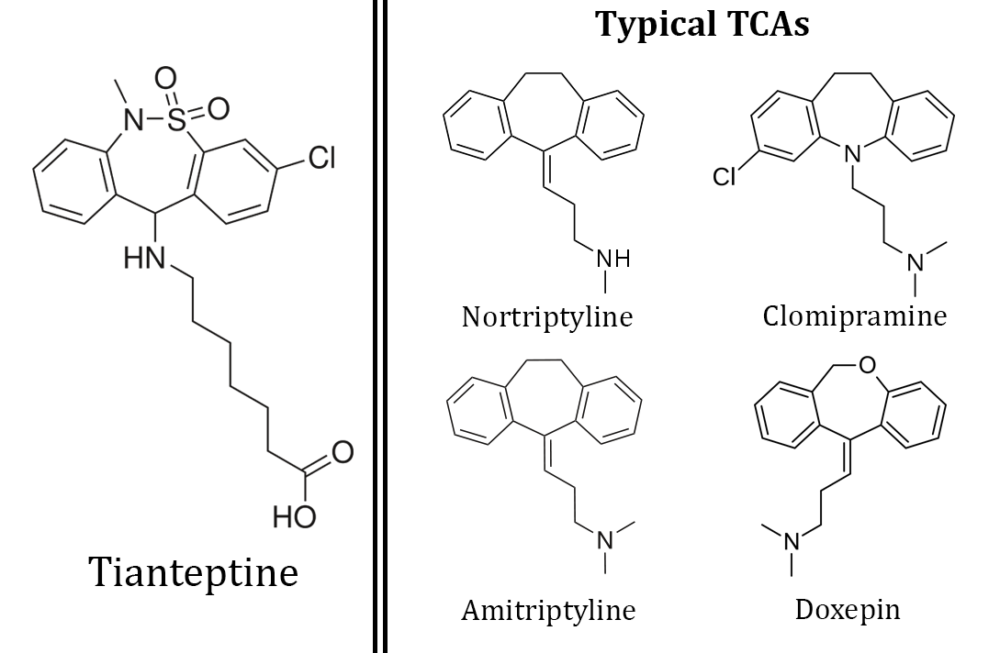

# 噻奈普汀

[◀返回](index.md)

| **化学信息** | 噻奈普汀                                                                                                              |
| ------------ | --------------------------------------------------------------------------------------------------------------------- |
| 结构式       |                                                                                            |
| 分子式       | C21H25ClN2O4S                                                             |
| CAS 号       | 72797-41-2 30123-17-2（钠盐） 1224690-84-9（硫酸盐）                                                            |
| **化学命名** |                                                                                                                       |
| 常用名称     | 噻奈普汀、Tianeptine、达体朗、康耐喜、塔提诺                                                                          |
| 取代名称     | Tianeptine                                                                                                            |
| 系统名称     | (RS)-7-(3-氯-6-甲基-6,11-二氢二苯并[c,f][1,2]噻氮卓-11-基氨基)庚酸 S,S-二氧化物                                       |
| **类别归属** |                                                                                                                       |
| 精神活性分类 | [抗抑郁药](../文档/抗抑郁药.md) / [阿片类药物](../文档/药物分类/阿片类药物.md) / [益智药](../文档/药物分类/益智药.md) |
| 化学分类     | 二苯并噻氮卓类物质                                                                                                    |

> **⚠️警告：** 由于个人体重、耐受性、代谢和敏感性的差异，请务必从小剂量开始尝试。请参阅[负责任的用药索引页](../文档/负责任的用药索引页.md)。

| [给药途径](../文档/给药途径.md)      | [口服](../文档/给药途径.md#口服) |
| ------------------------------------ | -------------------------------- |
| 生物利用度                           | 99%                              |
| [剂量](../文档/给药剂量.md)          |                                  |
| [阈值](../文档/药物剂量分类.md#阈值) | 3 mg                             |
| [轻微](../文档/药物剂量分类.md#轻微) | 6 \~ 12 mg                       |
| [中等](../文档/药物剂量分类.md#中等) | 12 \~ 35 mg                      |
| [强烈](../文档/药物剂量分类.md#强烈) | 35 \~ 100 mg                     |
| [严重](../文档/药物剂量分类.md#严重) | 100 mg +                         |

| [药效时长](../文档/药效时长.md)          |               |
| ---------------------------------------- | ------------- |
| [总时长](../文档/药效时长.md#总时长)     | 2 \~ 3 小时   |
| [药效发作](../文档/药效时长.md#药效发作) | 30 \~ 60 分钟 |
| [药效上升](../文档/药效时长.md#药效上升) | 15 \~ 30 分钟 |
| [药效达峰](../文档/药效时长.md#药效达峰) | 60 \~ 90 分钟 |
| [药效褪去](../文档/药效时长.md#药效褪去) | 30 \~ 60 分钟 |

> **免责声明：** 本站的[剂量](../文档/给药剂量.md)信息仅出于教育目的，收集自用户报告和各类资源。这不作为建议，请务必参考其他来源以确保准确性。

**噻奈普汀**（商品名 **达体朗** 和 **康耐喜**）是一种非典型[抗抑郁药](../文档/抗抑郁药.md)哦。虽然它主要是一种处方药，但有时会被大剂量使用以获得娱乐性的[阿片类药物](../文档/药物分类/阿片类药物.md)效应。它的作用机制非常独特且尚未被透彻理解，主要涉及对大脑单胺能和谷氨酸能系统的调节。

虽然噻奈普汀被归类为[三环类抗抑郁药](../文档/抗抑郁药.md)，但它的药理作用与典型的抗抑郁药有所不同。[^1] 这主要是因为它被认为并不直接通过调节单胺能[神经递质](../文档/神经递质.md)（如[血清素](../文档/血清素.md)、[多巴胺](../文档/多巴胺.md)或[去甲肾上腺素](../文档/去甲肾上腺素.md)）起效。相反，理论上它作用于[谷氨酸](../文档/谷氨酸.md)和谷氨酸能机制，使大脑能更轻易地适应压力和抑郁。[^2] 噻奈普汀的临床试验表明，它的效果与氟西汀（即 SSRI）和阿米替林（即 TCA）等其他更流行的抗抑郁药相当。不过，噻奈普汀的副作用和并发症似乎比传统抗抑郁药更少。[^3]

除了抗抑郁作用外，噻奈普汀还具有[焦虑抑制](../药效/焦虑抑制.md)（抗焦虑）特性，特别是在治疗惊恐障碍方面显示出潜力。[^4] 噻奈普汀还表现出神经保护特性，并被证明可以改善抑郁症患者的认知。[^5] [^6] 噻奈普汀的抗焦虑和提升情绪的效果，加上其据称的神经保护和认知益处，使其成为一种受欢迎的[益智药](../文档/药物分类/益智药.md)。[^7]

娱乐剂量的[主观效应](../药效/index.md)包括[镇静](../药效/镇静.md)和/或[兴奋](../药效/兴奋.md)、[焦虑抑制](../药效/焦虑抑制.md)、[动机增强](../药效/动机增强.md)以及[认知欣快](../药效/认知欣快.md)。处方指南指出，噻奈普汀应以 12.5 mg 的剂量每日服用三次，两次给药间隔 3 \~ 4 小时。[^8] 然而，娱乐性使用者更常用 12 \~ 35 mg 的剂量哦。

值得注意的是，关于娱乐性使用噻奈普汀的潜在毒性，我们知之甚少。一些用户报告称，它的[阿片类药物](../文档/药物分类/阿片类药物.md)效应会导致像传统[阿片类药物](../文档/药物分类/阿片类药物.md)（如[海洛因](海洛因.md)、[吗啡](吗啡.md)、[氢可酮](氢可酮.md)）那样的生理和心理依赖。如果使用这种物质，强烈建议采取[伤害减少措施](../文档/伤害减少措施.md)。

## 化学

噻奈普汀是一种三环类抗抑郁药，因为它的分子结构由三个环状化合物组成。[^9] 尽管噻奈普汀在化学上与其他三环类抗抑郁药相似，但它的效应和[机制](../文档/科学信息索引页.md#药理学)却独具特色。[^10]

### 钠盐与硫酸盐

像许多药物一样，噻奈普汀可以制成各种盐形式，以实现最大的生物利用度、吸收和整体效力。噻奈普汀最常见的是钠盐形式，因为这是药房出售和医生开出的唯一版本。然而，硫酸盐现在也在一些[益智药](../文档/药物分类/益智药.md)销售网站上销售，被认为优于钠盐，尤其是在半衰期和持续时间更长方面。[^11]

目前还没有正式的研究证明硫酸盐形式的功效有所提高，但来自用户的轶事报告表明，它可能比钠盐更有效且持续时间更长。[^12] [^13] 硫酸盐形式的强度并没有更高，但它在体内的代谢速度较慢，从而使每天单次给药更加有效。使用过这两种盐形式的用户报告指出，由于硫酸盐代谢较慢，成瘾的可能性较小。硫酸盐形式似乎提供了更平稳的体验，而不像钠盐那样会迅速达到药效峰值，然后又突然回到基准线。

|                                                                                |
| ------------------------------------------------------------------------------------------------------------------ |
| 噻奈普汀的结构与更典型的三环类抗抑郁药相比。 注意噻奈普汀比其他药物拥有更多的官能团，这促成了其独特的药理特性。 |

## 药理学

与大多数处方抗抑郁药不同，噻奈普汀对多巴胺和血清素等单胺类物质的直接影响微乎其微。噻奈普汀会略微增加细胞外[多巴胺](../文档/多巴胺.md)水平，尽管目前尚不清楚它是如何引起这种释放的。[^14]

在老鼠身上进行的实验表明，噻奈普汀不会增加受试体内的[血清素](../文档/血清素.md)水平。相反，它被发现会增加血清素的 _再摄取_，被贴上了选择性血清素再摄取 _增强剂_ 的标签。[^15] 这与最常用的处方抗抑郁药形成了鲜明对比，后者是选择性[血清素](../文档/血清素.md) [再摄取抑制剂](../文档/神经递质再摄取抑制剂.md)（SSRIs）。然而，噻奈普汀对血清素的改变可能与其作用机制无关。

噻奈普汀还通过调节[谷氨酸](../文档/谷氨酸.md)及其受体，特别是通过间接调节 NMDA 受体，显著增强神经可塑性。[^16] 这种大脑塑性的增加与压力和抑郁症状的显著减轻有关。[^2] 最近的研究得出的结论是，噻奈普汀也是一种有效的 [μ-阿片](../文档/药物分类/阿片类药物.md#Mu_.28.CE.BC.29)[受体](../文档/受体.md)[激动剂](../文档/受体激动剂.md)，这可能有助于其抗抑郁和[焦虑抑制](../药效/焦虑抑制.md)特性。[^17]

它有时也被用于治疗肠易激综合征或哮喘。[^18] [^19]

## 主观效应

> _**免责声明：** 下面列出的效应引用了[主观效应索引](../药效/index.md) (**SEI**)，这是一个基于轶事用户报告和本站贡献者个人分析的开放研究文献。因此，应以审慎的态度看待。_
>
> _另外值得注意的是，这些效应不一定以可预测或可靠的方式发生，尽管高剂量更容易诱发出全方位的效应。同样，**不良反应** 随着剂量的增加而变得越来越可能，可能包括 **成瘾、严重伤害或死亡** ☠。_

### **[躯体效应](../药效/躯体效应.md)** 

- **[兴奋](../药效/兴奋.md)**
- **[躯体欣快感](../药效/躯体欣快感.md)** - 在接近或超过 100 mg 的剂量下，会有更明显的欣快感报告。这些感觉与典型的[阿片类药物](../文档/药物分类/阿片类药物.md)极其相似。
- **[支气管扩张](../药效/支气管扩张.md)** - 噻奈普汀增加了血清素的再摄取，这已被发现可以对抗支气管收缩。[^20]
- **[肌肉松弛](../药效/肌肉松弛.md)**
- **[头痛](../药效/头痛.md)**
- **[恶心](../药效/恶心.md)** - 在为了追求欣快效果而使用的大剂量下会体验到恶心。
- **[瘙痒感](../药效/瘙痒感.md)** - 与传统阿片类药物一样，娱乐剂量下可能会出现瘙痒，程度从轻微到严重不等，取决于剂量和耐受性。
- **[头晕](../药效/头晕.md)**
- **[便秘](../药效/便秘.md)**
- **[躯体疲劳](../药效/躯体疲劳.md)**

### **[视觉效应](../药效/视觉效应.md)** 

- **[内部幻觉](../药效/内部幻觉.md)** - 在严重剂量的“打瞌睡”（nodding）期间，可能会体验到半意识状态和入睡前幻觉，导致梦境般的状态，甚至达到 3 级[内部感官输入](../药效/清明梦.md#内部来源的感官输入)。这通常伴随着模糊的[几何](../药效/几何.md)图形。

### **[认知效应](../药效/认知效应.md)** 

- **[动机增强](../药效/动机增强.md)**
- **[焦虑抑制](../药效/焦虑抑制.md)** - 噻奈普汀被发现对减轻惊恐发作的影响特别有用。[^4]
- **[认知欣快](../药效/认知欣快.md)** - 在接近或超过 100 mg 的剂量下，会有更明显的欣快感报告。这些感觉与典型的[阿片类药物](../文档/药物分类/阿片类药物.md)极其相似哦。
- **[专注力强化](../药效/专注力强化.md)** - 除了增强专注能力外，噻奈普汀还能提高短时记忆的保留，刺激更快的学习，并改善反应时间。[^21]
- **[思维加速](../药效/思维加速.md)** 或 **[思维减速](../药效/思维减速.md)**
- **[返老还童感](../药效/返老还童感.md)**
- **[自我膨胀](../药效/自我膨胀.md)**
- **[认知疲劳](../药效/认知疲劳.md)** - 虽然罕见，但一些用户可能会在认知方面体验到不良反应，如思维过程受阻。

### 体验报告

包含此化合物效应描述的轶事报告可以在我们的体验索引中找到：

其他的体验报告可以在这里找到：

- [Erowid 体验库：噻奈普汀](https://www.erowid.org/experiences/subs/exp_Pharms_Tianeptine.shtml)

## 毒性与危害潜力

> **本毒性与危害潜力章节尚不完善。** 结果可能包含不完整甚至 **危险的错误** 信息！你可以通过完善或纠正它来提供帮助。
> _注：如果使用该物质，请务必进行独立研究并采取[伤害减少措施](../文档/负责任的用药索引页.md#通用)哦。_

娱乐性使用噻奈普汀的毒性和长期健康影响尚未在任何科学背景下得到研究，确切的中毒剂量尚不清楚。

轶事证据表明，如果只是偶尔以低至中等剂量单独尝试该药物，不会产生负面的健康影响（但不能完全保证）。在服用前，应始终进行独立研究，以确保两种或多种物质的联用是安全的。

强烈建议在使用该物质时采取[伤害减少措施](../文档/负责任的用药索引页.md)。

### 致死剂量

噻奈普汀的半数致死量尚未正式确定；然而，它似乎具有较大的治疗指数和安全范围。2007 年，一名 26 岁男子通过服用过量的噻奈普汀并配合酒精自杀身亡。[^22] 然而，过量服用所需的剂量通常不太可能被意外摄入。为了确保使用噻奈普汀时的安全，建议单次剂量不要超过 100 mg，一天总剂量不要超过 300 mg。

### 耐受性与成瘾潜力

长期使用噻奈普汀可以被认为具有轻微的成瘾性，并能够引起生理和心理依赖。当产生生理依赖时，如果突然停止使用，可能会出现[撤药症状](../文档/药物分类/阿片类药物.md#断药)。

长期使用会对噻奈普汀的许多效应产生耐受性，包括治疗效应。这导致使用者必须服用越来越大的剂量才能达到相同的效果。之后，在停止使用的情况下，大约需要 3 - 7 天耐受性会降低一半，1 - 2 周可恢复到基准水平。该化合物可能与其他的[三环类抗抑郁药](../文档/抗抑郁药.md)和[阿片类药物](../文档/药物分类/阿片类药物.md)存在交叉耐受性。

值得注意的是，由于噻奈普汀的药效持续时间短，可能会迫使一些人频繁补药。高剂量（> 100 mg）潜在的欣快效应可能会导致一些使用者超过推荐剂量，这会迅速提高耐受性并加剧负面副作用。此外，噻奈普汀具有一定的 [μ-阿片](../文档/药物分类/阿片类药物.md) [受体激动剂](../文档/受体激动剂.md)特性，可能导致类似于[鸦片类物质](../文档/药物分类/阿片类药物.md)的成瘾和戒断机制。[^23] 然而，正如大多数想要停止服用抗抑郁药物（包括 [SSRIs](../文档/SSRI.md) 和三环类抗抑郁药）的人一样，噻奈普汀的每日使用者应该逐渐[减量](../文档/减量戒断法.md)而不是突然停药。这将确保将负面的断药症状降至最低。

每天使用约 500 mg 就会出现噻奈普汀戒断反应，其严重程度随每日剂量和用药时间的增加而增加。撤药症状与阿片类药物相似（流感样症状、流泪、流涕、干呕等），并可能包括情绪不稳定。由于噻奈普汀与传统的阿片类药物相比娱乐特性通常较弱，这种物质的戒断感可能比同等欣快剂量的传统阿片类药物感觉糟糕得多。

## 法律地位

|  | **本法律章节尚不完善。** 它的内容可能不完整或有误。你可以通过完善它来提供帮助。 |
| -------------------------------- | ------------------------------------------------------------------------------- |

噻奈普汀在许多欧洲、亚洲和南美国家属于处方药，并以达体朗和康耐喜等品牌名称销售。

- **加拿大：** 噻奈普汀在加拿大不受管制，这意味着无需任何形式的许可证或处方即可合法持有。
- **德国：** 根据 AMVV 附件 1，噻奈普汀是一种处方药。[^24]
- **俄罗斯：** 在俄罗斯，自 2010 年以来，噻奈普汀被列为三类受管制物质。[^25]
- **瑞典：** 噻奈普汀不是获批的处方药，因此属于受管制物质。[^26]
- **瑞士：** 噻奈普汀在 A、B、C 和 D 类名录中均不受管。它可能被认为是合法的。[^27]
- **土耳其：** 噻奈普汀是一种“绿色处方”物质，[^28] 无处方销售或持有均属非法。
- **英国：** 根据 2016 年 5 月 26 日生效的《精神活性物质法案》，生产、供应或进口噻奈普汀均属非法。[^29]
- **美国：** 噻奈普汀目前在美国联邦层面是不受管制的物质。然而，由于其娱乐性使用和滥用潜力，许多益智药销售商已停止经营该药物。[^30] 2018 年 3 月，密歇根州议会通过了一项法案，将噻奈普汀钠盐列为二类受管制物质，成为第一个对该药物进行管制的州。[^31]

## 另见

- [负责任的用药索引页](../文档/负责任的用药索引页.md)
- [阿片类药物](../文档/药物分类/阿片类药物.md)

## 外部链接

- [噻奈普汀 (维基百科)](http://en.wikipedia.org/wiki/Tianeptine)
- [噻奈普汀 (Isomer Design)](https://isomerdesign.com/PiHKAL/explore.php?id=3241)
- [Tianeptine - 反解离百科](https://fanjieli.org/1-%E8%8D%AF%E7%89%A9%E4%BB%AC/Tianeptine/)

## 文献

- Ormrod, D.J., Spencer, C.M., & Wagstaff, A.J. (2001). Tianeptine: a review of its use in depressive disorders. CNS Drugs, 15 3, 231-59. PMID: 11463130

## 参考文献

[^1]: Defrance, R., Marey, C., Kamoun, A. (1988). "Antidepressant and anxiolytic activities of tianeptine: an overview of clinical trials". Clinical Neuropharmacology. 11 Suppl 2: S74–82. ISSN 0362-5664.

[^2]: McEwen, B. S., Chattarji, S., Diamond, D. M., Jay, T. M., Reagan, L. P., Svenningsson, P., Fuchs, E. (March 2010). "The neurobiological properties of Tianeptine (Stablon): from monoamine hypothesis to glutamatergic modulation". Molecular psychiatry. 15 (3): 237–249. doi:10.1038/mp.2009.80. ISSN 1359-4184.

[^3]: Wagstaff, A. J., Ormrod, D., Spencer, C. M. (2001). "Tianeptine: a review of its use in depressive disorders". CNS drugs. 15 (3): 231–259. doi:10.2165/00023210-200115030-00006. ISSN 1172-7047.

[^4]: Schruers, K., Griez, E. (December 2004). "The effects of tianeptine or paroxetine on 35% CO 2 provoked panic in panic disorder". Journal of Psychopharmacology. 18 (4): 553–558. doi:10.1177/026988110401800413. ISSN 0269-8811.

[^5]: Plaisant, F., Dommergues, M.-A., Spedding, M., Cecchelli, R., Brillault, J., Kato, G., Muñoz, C., Gressens, P. (May 2003). "Neuroprotective properties of tianeptine: interactions with cytokines". Neuropharmacology. 44 (6): 801–809. doi:10.1016/s0028-3908(03)00066-2. ISSN 0028-3908.

[^6]: Klasik, A., Krysta, K., Krupka-Matuszczyk, I. (September 2011). "Effect of tianeptine on cognitive functions in patients with depressive disorders during a 3-month observation". Psychiatria Danubina. 23 Suppl 1: S18–22. ISSN 0353-5053.

[^7]: Tianeptine - A Mood Brightening Drug for Depression and Anxiety, 2014

[^8]: TIANEPTINE: WHAT IS TIANEPTINE? | https://smartdrugsforthought.com/what-is-tianeptine/

[^9]: Tricyclic antidepressants (TCAs)

[^10]: Brink, C. B., Harvey, B. H., Brand, L. (January 2006). "Tianeptine: a novel atypical antidepressant that may provide new insights into the biomolecular basis of depression". Recent patents on CNS drug discovery. 1 (1): 29–41. doi:10.2174/157488906775245327. ISSN 1574-8898.

[^11]: http://www.ceretropic.com/tianeptine-sulfate-powder/

[^12]: Gorthaur111 (2015), Tianeptine Sulfate is VASTLY SUPERIOR to Tianeptine Sodium

[^13]: Tianeptine sulfate is so great., 2015

[^14]: Invernizzi, R., Pozzi, L., Garattini, S., Samanin, R. (March 1992). "Tianeptine increases the extracellular concentrations of dopamine in the nucleus accumbens by a serotonin-independent mechanism". Neuropharmacology. 31 (3): 221–227. doi:10.1016/0028-3908(92)90171-k. ISSN 0028-3908.

[^15]: Mennini, T., Mocaer, E., Garattini, S. (November 1987). "Tianeptine, a selective enhancer of serotonin uptake in rat brain". Naunyn-Schmiedeberg’s Archives of Pharmacology. 336 (5): 478–482. doi:10.1007/BF00169302. ISSN 0028-1298.

[^16]: Tianeptine ( Stablon )

[^17]: Gassaway, M. M., Rives, M.-L., Kruegel, A. C., Javitch, J. A., Sames, D. (15 July 2014). "The atypical antidepressant and neurorestorative agent tianeptine is a μ-opioid receptor agonist". Translational Psychiatry. 4: e411. doi:10.1038/tp.2014.30. ISSN 2158-3188.

[^18]: The serotonin reuptake enhancer tianeptine ( Stablon ) prevents asthma attacks

[^19]: The Tianeptine Story: Irritable Bowel Syndrome, VelaPharm and Pharmos Corporation

[^20]: The serotonin reuptake enhancer tianeptine ( Stablon ) prevents asthma attacks

[^21]: Klasik, A., Krysta, K., Krupka-Matuszczyk, I. (September 2011). "Effect of tianeptine on cognitive functions in patients with depressive disorders during a 3-month observation". Psychiatria Danubina. 23 Suppl 1: S18–22. ISSN 0353-5053.

[^22]: Proença, P., Teixeira, H., Pinheiro, J., Monsanto, P. V., Vieira, D. N. (August 2007). "Fatal intoxication with tianeptine (Stablon®)". Forensic Science International. 170 (2–3): 200–203. doi:10.1016/j.forsciint.2007.03.035. ISSN 0379-0738.

[^23]: Gassaway, M. M., Rives, M.-L., Kruegel, A. C., Javitch, J. A., Sames, D. (July 2014). "The atypical antidepressant and neurorestorative agent tianeptine is a μ-opioid receptor agonist". Translational Psychiatry. 4 (7): e411–e411. doi:10.1038/tp.2014.30. ISSN 2158-3188.

[^24]: AMVV - Verordnung über die Verschreibungspflicht von Arzneimitteln

[^25]: Resolution of the Government of the Russian Federation от 30.06.2010 N 486

[^26]: https://www.lakemedelsverket.se/sv/sok-lakemedelsfakta/substans?id=E4POFBUAVAHVERT1

[^27]: "Verordnung des EDI über die Verzeichnisse der Betäubungsmittel, psychotropen Stoffe, Vorläuferstoffe und Hilfschemikalien" (in German). Bundeskanzlei [Federal Chancellery of Switzerland]. Retrieved January 1, 2020.

[^28]: https://www.titck.gov.tr/dinamikmodul/43

[^29]: Psychoactive Substances Act 2016

[^30]: PutItOnaTshirt (2016), Powder City has discontinued the selling of Tianeptine

[^31]: Michigan's Legislature has passed a statewide ban on the antidepressant tianeptine sodium. | https://www.usnews.com/news/best-states/michigan/articles/2018-03-21/snyder-to-receive-bill-on-statewide-tianeptine-sodium-ban
