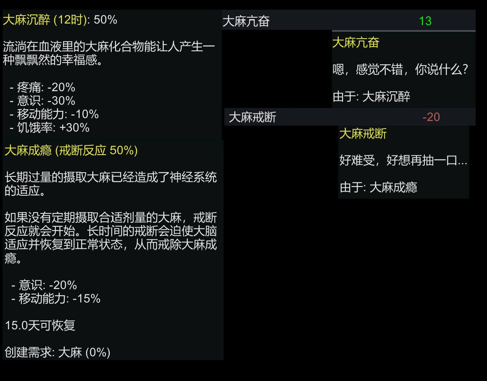

# 大麻

[◀返回](index.md)

 
 《Rimworld》中有关大麻的描述

> 

| 大麻 (Cannabis) | |
| --- | --- |
| [.png)](/文件/Cannabis_(Botany).png)   *Cannabis sativa* 的绘图 | |
| **化学命名** | |
| **俗名** | 大麻 (Cannabis), THC, Marijuana, Weed, Pot, Mary Jane, Grass, Herb, Green, Bud, Tree. [更多名字](https://en.wikipedia.org/wiki/List_of_names_for_cannabis) 和 [俚语](https://en.wikipedia.org/wiki/List_of_slang_names_for_cannabis). |
| **[给药途径](/文档/给药途径.md)** | |
| ⚠️ **警告：** 因为体重、耐受性、新陈代谢和个人敏感度的差异，请务必从低剂量开始哦。参见 [负责任的用药部分](/文档/负责任的用药索引页.md)。 | |

### 剂量与时长信息

| 途径 | [抽吸](/文档/给药途径.md#抽吸) | [口服](/文档/给药途径.md#口服) | [舌下含服](/文档/给药途径.md#舌下含服) |
| --- | --- | --- | --- |
| **[给药剂量](/文档/给药剂量.md)** | | | |
| [阈值](/文档/药物剂量分类.md#阈值) | 0.4 mg THC | 1 mg THC | - |
| [轻微](/文档/药物剂量分类.md#轻微) | 0.4 - 2 mg THC | 2.5 - 5 mg THC | - |
| [中等](/文档/药物剂量分类.md#中等) | 2 - 4 mg THC | 5 - 10 mg THC | - |
| [强烈](/文档/药物剂量分类.md#强烈) | 4 - 10 mg THC | 10 - 25 mg THC | - |
| [严重](/文档/药物剂量分类.md#严重) | 10 mg THC + | 25 mg THC + | - |
| **[药效时长](/文档/药效时长.md)** | | | |
| [总时长](/文档/药效时长.md#总时长) | 2.5 - 5 小时 | 4 - 10 小时 | 3 - 7 小时 |
| [药效发作](/文档/药效时长.md#药效发作) | 0.1 - 10 分钟 | 20 - 60 分钟 | 1 - 10 分钟 |
| [药效上升](/文档/药效时长.md#药效上升) | 5 - 10 分钟 | 30 - 60 分钟 | 15 - 30 分钟 |
| [药效达峰](/文档/药效时长.md#药效达峰) | 15 - 45 分钟 | 1 - 2 小时 | 30 - 60 分钟 |
| [药效褪去](/文档/药效时长.md#药效褪去) | 3 - 4 小时 | 4 - 6 小时 | 4 - 6 小时 |
| [药效残余](/文档/药效时长.md#药效残余) | 45 - 180 分钟 | 6 - 12 小时 | - |

> **[免责声明](/关于本站/index.md)：** 本站的 [给药剂量](/文档/给药剂量.md) 信息是从用户和 [资源](/关于本站/index.md) 中收集的，仅用于教育目的哦。它不是推荐，应该与其他来源核实以确保准确性呢。

### [药物联用](/文档/危险药物联用.md)

*   [4-硫基-2,5-二甲氧基苯乙胺类物质 (2C-T-x)](/文档/药物分类/4-硫基-2,5-二甲氧基苯乙胺类物质.md)
*   [2,5-二甲氧基苯乙胺类物质 (2C-x)](/文档/药物分类/2,5-二甲氧基苯乙胺类物质.md)
*   5-MeO-xxT
*   [苯丙胺类物质](/文档/药物分类/苯丙胺类物质.md)
*   [α-甲基色胺 (aMT)](/药物/αMT.md)
*   [可卡因](/药物/可卡因.md)
*   [DMT](/药物/DMT.md)
*   [2,5-二甲氧基苯丙胺类物质 (DOx)](/文档/药物分类/2,5-二甲氧基苯丙胺类物质.md)
*   [LSD](/药物/LSD.md)
*   [麦斯卡林](/药物/麦斯卡林.md)
*   [赛洛西宾蘑菇](/药物/赛洛西宾蘑菇.md)
*   [25x-NBOMe](/药物/25I-NBOMe.md)
*   锂盐 (Lithium)

---

**大麻**（Cannabis，也叫 **THC**、**Marijuana**、**Weed**、**Pot**、**Grass**、**Hemp**、**Zaza**、**Kush** 等等好多名字呢）是一种大麻植物的制成品，通过 [抽吸](/文档/给药途径.md#抽吸)、[雾化](/文档/给药途径.md) 或 [口服](/文档/给药途径.md#口服) 摄入后会产生精神活性效应。它是世界上使用最广泛的非法物质哦。[\[9\]](#cite_note-ErowidCannabisVaultLegalStatus-9)[\[10\]](#cite_note-WDR-2010-10) 其作用机制是与分布在全身的 [大麻素](/文档/药物分类/合成大麻素类物质.md) [受体](/文档/受体.md) 结合。\[*需要引用*]

大麻的主要精神活性成分是四氢大麻酚（THC），它是植物中 483 种已知化合物之一，[\[11\]](#cite_note-11) 其中还包括至少 84 种其他 [大麻素](/文档/药物分类/合成大麻素类物质.md)，如 [大麻二酚](/药物/大麻二酚（CBD）.md) (CBD)、大麻酚 (CBN)、四氢大麻维林 (THCV)、[\[12\]](#cite_note-12)[\[13\]](#cite_note-13) 和大麻吉罗 (CBG)。目前公认至少有三个品种：*Cannabis sativa*（普通大麻/萨提瓦）、*Cannabis indica*（印度大麻/因迪卡）和 *Cannabis ruderalis*（莠草大麻）。\[*需要引用*]

最早的大麻使用记录可以追溯到公元前 3000 年。[\[14\]](#cite_note-14) 在现代，大麻被用于 [娱乐性](/文档/娱乐性用药.md)、医疗以及宗教或精神目的。[\[15\]](#cite_note-15) 它在 1960 年代的青年反主流文化运动中发挥了核心作用，并与那个时代的艺术和音乐紧密相关呢。\[*需要引用*]

[主观效应](/药效/index.md) 包括 [镇静](/药效/镇静.md)、[食欲增强](/药效/食欲增强.md)、[沉浸感强化](/药效/沉浸感强化.md)、[创造力增强](/药效/创造力增强.md)、[幽默感增强](/药效/幽默感增强.md)、[音乐欣赏能力增强](/药效/音乐欣赏能力增强.md)、[视觉分离](/药效/视觉分离.md) 和 [欣快](/药效/认知欣快.md)。这些效果会因剂量、[品种和形式](#Strains_and_forms)、耐受性以及 [情景与心境](/文档/情景与心境.md) 而有很大差异。值得注意的是，根据个人和情况的不同，它既可能强烈 [抑制焦虑](/药效/焦虑抑制.md)，也可能 [增强焦虑](/药效/焦虑.md) 哦。

较低剂量通常带来类似于 [抑制剂](/文档/药物分类/抑制剂.md) 的放松效果。较高剂量则与轻度到中度的 [致幻](/文档/药物分类/致幻剂.md) 效果有关，例如 [几何视觉](/药效/几何.md)、[概念性思维](/药效/index.md) 和 [时间扭曲](/药效/时间扭曲.md)，同时也伴随着更高的 [焦虑](/药效/焦虑.md)、[偏执](/药效/偏执.md) 和 [妄想](/药效/妄想.md) 风险。

大麻被认为具有低到中等的滥用潜力。\[*需要引用*] 长期使用可能导致某些个体的耐受性增加和心理依赖。\[*需要引用*] 它的生理毒性非常低，基本上不可能因为生理过量而死掉哦。然而，它可能会加剧易感人群的某些心理健康症状，如 [妄想](/药效/妄想.md) 或 [精神病发作](/药效/精神病发作.md)（参见 [此部分](#toxicity_and_harm_potential)）。\[*需要引用*]

长期使用大麻可能与负面的认知影响有关，如脑雾、动力降低、学习困难和注意力不集中。这些影响通常在减少使用和停药一段时间后是可逆的。[\[16\]](#cite_note-16)

如果使用这种物质，强烈建议采取 [伤害减少措施](/文档/负责任的用药索引页.md) 哦。

## 历史与文化

大麻属原产于中亚和印度次大陆。[\[17\]](#cite_note-17)

**大麻的历史** 和人类使用它的历史在书面记载中至少可以追溯到公元前 3000 年，根据考古证据，甚至可能追溯到前陶器新石器时代 B 期（公元前 8800-6500 年）。几千年来，这种植物因其纤维和绳索用途、作为食物和药物、以及用于宗教和娱乐的精神活性特性而受到重视。

最早对大麻的限制出现在 14 世纪的伊斯兰世界。在 19 世纪，它开始在殖民国家受到限制，这通常与种族和阶级压力有关。

自 20 世纪初以来，大麻一直受到法律限制，目前在大多数国家，持有、使用和销售含有精神活性 [大麻素](/文档/药物分类/合成大麻素类物质.md) 的大麻制剂都是非法的。然而，最近出现了非刑事化和合法化的趋势，美国的一些州和加拿大已经将大麻销售合法化了呢。

2004 年，联合国估计全球大麻消费模式表明，约有 4% 的世界成年人口（1.62 亿人）每年使用大麻，约有 0.6%（2250 万人）每天使用大麻。[\[18\]](#cite_note-18) 根据联合国的说法，它是世界上使用最广泛的非法药物。[\[9\]](#cite_note-ErowidCannabisVaultLegalStatus-9)[\[10\]](#cite_note-WDR-2010-10)

### 效力趋势

自 1995 年以来，非法大麻植物材料的效力一直在持续增加，从 1995 年的约 4% 增加到 2014 年的约 12%。大麻二酚（CBD）的含量平均从 2001 年的约 0.28% 下降到 2014 年的 <0.15%，导致 Δ9-四氢大麻酚与大麻二酚的比例从 1995 年的 14 倍变为 2014 年的约 80 倍。[\[19\]](#cite_note-19)[\[20\]](#cite_note-20)

### 词源

*Cannabis* 一词来自希腊语 κάνναβις (*kánnabis*)（见拉丁语 *cannabis*），最初是斯基泰语或色雷斯语。[\[21\]](#cite_note-etymonline-21) 它与波斯语 *kanab*、英语 *canvas*（帆布）以及可能与英语 *hemp*（大麻/汉麻）（古英语 *hænep*）有关哦。[\[21\]](#cite_note-etymonline-21)

### 俗名

大麻有 [无数的俗名和街头名称](https://en.wikipedia.org/wiki/List_of_names_for_cannabis)。最常见的有：**Marijuana**、[\[22\]](#cite_note-wikimarijuanaword-22) **Weed**、[\[3\]](#cite_note-merriamweed-3) **Pot**、[\[4\]](#cite_note-merriampot-4) **Grass**、[\[5\]](#cite_note-merriamgrass-5) **Hemp**、[\[6\]](#cite_note-merriamhemp-6)、**Ganja**、**THC**。

## 化学

大麻植物含有许多不同比例的特定化合物。大麻含有超过 460 种化合物；[\[23\]](#cite_note-Ben2006-23) 其中至少有 80 种是 [大麻素](/文档/药物分类/合成大麻素类物质.md)，[\[24\]](#cite_note-24)[\[25\]](#cite_note-25) 这些化合物会与大脑中的大麻素受体相互作用。[\[26\]](#cite_note-Borgelt2013-26) 最常见的大麻素如下：

### 植物大麻素

加热时，大麻素酸会脱羧，生成具有精神活性的植物大麻素。

*   [四氢大麻酚 (THC)](/药物/四氢大麻酚（THC）.md) 
*   [大麻二酚 (CBD)](/药物/大麻二酚（CBD）.md) 

植物大麻素 ← 植物大麻素酸

**准迷幻植物大麻素**

*   [Δ-8-THC (delta-8-tetrahydrocannabinol)](/药物/四氢大麻酚（THC）.md)：有精神活性，但效力约为 Δ-9-THC 的一半。
    *   脱羧：Δ-8-THCA (delta-8-tetrahydrocannabinolic acid) → Δ-8-THC -- 大麻中仅存在微量。
    *   化学转化：[CBD + 酸](/文档/D-柠檬烯食醋DMT提取术.md)（这里指类似的酸转化过程） 8 小时 → 50% Δ-8-THC。
*   [Δ-9-THC (delta-9-tetrahydrocannabinol)](/药物/四氢大麻酚（THC）.md) (THC)：大麻中最丰富的精神活性成分。是比较 THC 类似物时的标准。
    *   生物合成：[四氢大麻酚酸 (THCA) 合成酶](https://en.wikipedia.org/wiki/Tetrahydrocannabinolic_acid_synthase) 是负责催化大麻吉罗酸 (CBGA) 形成 THCA 的酶。[转入大麻 THCA 合成酶基因的转基因酵母将产生 THC](https://en.wikipedia.org/wiki/THC_production_by_yeast)。
    *   脱羧：THCA (四氢大麻酚酸) ([更多信息](https://en.wikipedia.org/wiki/Tetrahydrocannabinolic_acid)) → THC -- **这种化合物通过加热脱羧对于吸食大麻的精神活性效应至关重要，并且取决于当α碳质子化时烯醇基团转化为酮基团。**
    *   化学转化：[CBD + 酸](/文档/D-柠檬烯食醋DMT提取术.md) 8 小时 → 50% THC。
*   [Δ-10-THC (delta-10-tetrahydrocannabinol)](/药物/四氢大麻酚（THC）.md)：有精神活性，但效力低于 Δ-8-THC。
    *   脱羧：Δ-10-THCA → Δ-10-THC -- 大麻中仅存在微量。
    *   化学转化：[CBD + 酸](/文档/D-柠檬烯食醋DMT提取术.md)。
*   [Δ-11-THC (delta-11-tetrahydrocannabinol)](/药物/四氢大麻酚（THC）.md)：有精神活性，但对该化合物知之甚少。
*   [THCB](/药物/四氢大麻酚（THC）.md) ([更多信息](https://en.wikipedia.org/wiki/Tetrahydrocannabutol))
*   [THCH](/药物/四氢大麻酚（THC）.md) (四氢大麻己醇) ([更多信息](https://en.wikipedia.org/wiki/Tetrahydrocannabihexol))：效力是 THC 的 25 倍。
    *   脱羧：THCHA → THCH -- 大麻中仅存在微量。
    *   化学转化：[CBDH (大麻二己醇) + 酸](/文档/D-柠檬烯食醋DMT提取术.md)。
*   [THCP](/药物/四氢大麻酚（THC）.md) (四氢大麻佛酚) ([更多信息](https://en.wikipedia.org/wiki/Tetrahydrocannabiphorol))：效力是 THC 的 30 倍。
    *   生物合成：CBGPA → THCPA → THCP[\[27\]](#cite_note-27)
    *   脱羧：THCPA → THCP -- 大麻中仅存在微量。
    *   化学转化：[CBDP (大麻二佛酚) + 酸](/文档/D-柠檬烯食醋DMT提取术.md)。

**通过化学修饰合成的准迷幻植物大麻素**

*   [HHC](/药物/四氢大麻酚（THC）.md) (六氢大麻酚)
*   HHCH (六氢大麻己醇)
*   HHCP-O-acetate (HHCP-O-醋酸酯)
*   [THC-O-acetate](/药物/四氢大麻酚（THC）.md) (THC-O-醋酸酯)：效力是 THC 的 3-5 倍。
    *   代谢：THCAO 是一种前药，意味着它需要代谢才能生效。它在代谢上经历一个激活过程，通过 [去乙酰化](https://en.wikipedia.org/wiki/Acetylation) 转化为 THC，然后 THC 继续进入其自身的初级代谢产物，类似于 THC 的口服途径。因此，吸食时的起效时间可能明显较长，范围为 20-45 分钟，但与口服摄入 THC 相比并没有那么长。由于额外的代谢过程，口服 THCAO 的起效时间也可能比口服 THC 更长，约为 90 分钟。[\[28\]](#cite_note-28)
    *   脱羧：缺乏关于脱羧的信息，但可以推断它像其正常的母体化合物一样脱羧，因为研究表明在 340°C (644°F) 下加热会解开乙酰基，释放有毒的乙烯酮气体。[\[29\]](#cite_note-29)
    *   化学转化：乙酸酐 + Δ-9-THC/Δ-8-THC → 分别生成 Δ-9-THCAO/Δ-8-THCAO。[\[30\]](#cite_note-30)
*   THCP-O-acetate (THCP-O-醋酸酯)

**非准迷幻植物大麻素，其中一些可以通过生物合成或化学转化合成为准迷幻大麻素（见上文）**

*   CBC (大麻色烯) ← CBCA (大麻色烯酸)
*   CBCV (大麻色种维林) ← CBCVA (大麻色种维林酸)
*   CBD (大麻二酚)
    *   生物合成：CBGA → CBDA → CBD[\[31\]](#cite_note-31)
    *   脱羧：CBDA (大麻二酚酸) → CBD
    *   化学转化：THC + 碘 → CBD
*   CBDD (大麻二酚二甲醚)
*   CBDV (大麻二维林) ← CBDVA (大麻二维林酸)
*   CBDH (大麻二己醇)
*   CBDP (大麻二佛酚)
    *   生物合成：CBGPA → CBDPA → CBDP[\[32\]](#cite_note-32)
    *   脱羧：CBDPA (大麻二佛酚酸) → CBDP
*   CBE (大麻艾尔松) ← CBEA (大麻艾尔松酸)
*   CBG (大麻吉罗)
*   CBGM (大麻吉罗单甲醚) ← CBGAM (大麻吉罗酸单甲醚)
*   CBGV (大麻吉罗维林) ← CBGVA (大麻吉罗维林酸)
*   CBL (大麻环醇) ← CBLA (大麻环醇酸)
*   CBLV (大麻环醇维林) ← CBLVA (大麻环醇维林酸)
*   CBN (大麻酚) ← CBNA (大麻酚酸)
    *   转化：[THC + 氧化降解 紫外线 加热 → CBN](https://www.lab1st.com/cannabinoids-conversion)
*   CBT (大麻西特兰) ← CBTA (大麻西特兰酸)
*   CBV (大麻维林) ← CBVA (大麻维林酸)
*   THCC (四氢大麻欧考) ← THCCA (四氢大麻欧考酸)
    *   尽管听起来很像 THC，但 THCC 更类似于 CBD 而不是 THC。
*   THCV (四氢大麻维林) ← THCVA (四氢大麻维林酸)
    *   THCV 没有精神活性。[\[33\]](#cite_note-33)

## 药理学

在大麻植物中发现的最具精神活性的 [大麻素](/文档/药物分类/合成大麻素类物质.md) 是四氢大麻酚（或 delta-9-四氢大麻酚），俗称 THC。[\[23\]](#cite_note-Ben2006-23) 其他大麻素包括 delta-8-四氢大麻酚、大麻二酚 (CBD)、大麻酚 (CBN)、大麻环醇 (CBL)、大麻色烯 (CBC) 和大麻吉罗 (CBG)；它们的精神作用比 THC 小，但可能在大麻的整体效果中发挥作用。[\[23\]](#cite_note-Ben2006-23) 研究最多的是 THC、CBD 和 CBN。[\[34\]](#cite_note-Gordon2013-34)

*CYP2C9* 基因型显著影响 THC 的敏感性：

*具有 \*3/\*3 基因型的受试者血液中的 THC 水平是具有 \*1/\*1 基因型的受试者的 3 倍。那些每个基因有一个拷贝 (\*1/\*3) 的受试者的 THC 水平处于中间水平，约为 \*1/\*1 受试者的 2 倍。*[\[35\]](#cite_note-35)

[随行效应](https://en.wikipedia.org/wiki/Entourage_effect) 是一种提出的机制，即大麻中存在的本身基本上没有精神活性的化合物会调节植物的整体精神活性效应（这些效应主要来自大麻的主要精神活性成分四氢大麻酚 (THC) 的作用）。

THC 似乎通过其对 CB1 受体的激动作用来改变情绪和认知，CB1 受体以剂量依赖的方式抑制第二信使系统（腺苷酸环化酶）。通过 CB1 激活，THC 间接增加多巴胺释放并产生精神作用。

大麻二酚充当 μ 和 δ 阿片受体的变构调节剂。[\[36\]](#cite_note-36) THC 还增强甘氨酸受体的作用。[\[37\]](#cite_note-37) 然而，这些相互作用的作用以及它们如何导致大麻的“药效”仍然是正在进行的科学研究的主题。

已知激活 CB1 和 CB2 受体的药物会上调并增强 5-HT2A 受体的活性。[\[38\]](#cite_note-38) ERK1/ERK2 信号通路已被证明介导这种效应，但确切的生化机制尚不清楚。这种 5-HT2A 受体的上调和增强就是为什么大麻会增强迷幻药的作用，并在非常高的剂量下引起迷幻效果的原因。

## 主观效应

***免责声明：** 下列效应引用了 [***主观效应索引***](/药效/index.md) (**SEI**)，这是一个基于轶事用户报告和 [PsychonautWiki](/关于本站/index.md) [贡献者](/关于本站/index.md) 的个人分析的开放研究文献。因此，应以健康的怀疑态度看待它们哦。*

*同样值得注意的是，这些效应不一定会以可预测或可靠的方式发生，尽管较高的剂量更可能诱发全方位的效应。*同样，**不良反应** 随着剂量的增加变得越来越可能，可能包括 **成瘾、严重伤害或死亡** ☠。

### **[躯体效应](/药效/躯体效应.md)** 

*   **[镇静](/药效/镇静.md)**[\[39\]](#cite_note-Robson2001-39) - 大麻在低到中等剂量下可能会产生轻微的 [兴奋](/药效/兴奋.md) 感。它的作用主要是镇静，甚至可以是 [催眠](/文档/催眠药.md) 的。通过有意识地强迫自己进行体育活动，可以抑制这些放松特性。就其刺激作用而言，THC 的这些主观方面通常持续 2-3 小时，而更令人放松的 CBD 的半衰期为 9 小时。[\[40\]](#cite_note-MechoulamParker2002-40) 因此，在禁欲一段时间后的第一剂大麻往往比随后的剂量更具刺激性，因为随后的剂量必须与先前剂量的放松作用竞争。
    由于放松作用持续时间更长，并且与刺激作用共享许多相同的途径，定期摄入 THC 也会导致对其刺激作用的耐受性增加，但不会导致对其放松作用的耐受性增加。\[*需要引用*]
*   **[自发性躯体感觉](/药效/自发性躯体感觉.md)** - 大麻的“身体高潮”变化极大，完全取决于具体的品种以及剂量和摄入方法。然而，一般来说，它可以被描述为一种相对愉悦、有时温暖、柔软、令人陶醉和包罗万象的感觉。在高剂量下，它可能会导致一些用户感到颤抖或神经紧张。
*   **[食欲增强](/药效/食欲增强.md)** - 使用大麻后食欲增加的感觉已被记录了数百年，[\[41\]](#cite_note-41) 俗称“馋虫发作” (the munchies)。最近的研究表明，大麻会刺激激素生长素释放肽 (ghrelin) 的释放，这种激素通常在胃空时释放，作为大脑寻找食物的信号。[\[42\]](#cite_note-42)
*   **[食欲抑制](/药效/食欲抑制.md)** - 这种效应可能在中毒的最开始出现，可能主要归因于大麻素 THCV。[\[43\]](#cite_note-43)
*   **[味觉增强](/药效/味觉增强.md)** - 众所周知，大麻可以改善食物的味道。
*   **[躯体压力感](/药效/躯体压力感.md)** - 这可以描述为眼睛后面感觉到的微妙或明显的压力。
*   **[支气管扩张](/药效/支气管扩张.md)**\[*需要引用*]
*   **[重力感改变](/药效/重力感改变.md)** - 在极高剂量下，许多用户报告说感觉被向后拉过巨大的距离（有时以极快的速度）。这种感觉强度逐渐增加，如果向后靠或躺下，通常最终会变得难以忍受；然而，一旦用户坐起来或向前倾，这种感觉就会完全消失。
*   **[心率增快](/药效/心率增快.md)**[\[39\]](#cite_note-Robson2001-39) - 血压降低会导致心率增加，但这因用户而异。
*   **[血压降低](/药效/血压降低.md)**[\[39\]](#cite_note-Robson2001-39)
*   **[头晕](/药效/头晕.md)** - 大麻在非常高的剂量下有可能引起头晕。然而，这种效应比 [酒精](/药物/酒精.md) 等物质要不一致得多。
*   **[脱水](/药效/脱水.md)**
*   **[口干](/药效/口干.md)**[\[39\]](#cite_note-Robson2001-39) - 在美国和英国流行文化中俗称“棉花嘴”。食用形式的大麻会使这种效果感觉更加强烈和不舒服。
*   **[出汗增加](/药效/出汗增加.md)** - 这种效应几乎只在对流吸食溶剂提取的 [哈希油](#Forms) 时才会体验到，并且在呼气后几乎立即出现。这可能是由于高 THC 浓度和相对较快的起效，可能导致 [血压显著下降](/药效/血压降低.md)，通常导致用户出汗。
*   **[失眠](/药效/失眠.md)** - 长期摄入与失眠有关。[\[44\]](#cite_note-44)
*   **[运动控制丧失](/药效/运动控制丧失.md)** - 这种物质会导致运动控制的轻度到中度抑制，其强度与剂量成正比，但很少导致完全无法行走和进行基本动作。
*   **[肌肉松弛](/药效/肌肉松弛.md)**
*   **[肌肉痉挛](/药效/肌肉痉挛.md)** - 这种效应通常非常微妙，更可能在高剂量下发生。
*   **[恶心](/药效/恶心.md)** - 在重度剂量和过量时，大麻可能会令人恶心。这通常在中毒的前 30 或 40 分钟后过去，并且往往在以后转变为 [恶心抑制](/药效/恶心抑制.md)。
*   **[恶心抑制](/药效/恶心抑制.md)** - 大麻对抑制由一般疾病和物质引起的恶心均有效。它被认为是化疗引起的恶心和呕吐 (CINV) 的有效治疗方法，[\[26\]](#cite_note-Borgelt2013-26) 并且对于那些在优先治疗后没有改善的人来说是一个合理的选择。[\[45\]](#cite_note-45)
*   **[镇痛](/药效/镇痛.md)** - 据报道，这种物质可用于治疗某些头痛和慢性疼痛，包括由神经病变引起的疼痛，以及可能的纤维肌痛和类风湿性关节炎。[\[46\]](#cite_note-46)[\[47\]](#cite_note-47)
*   **[躯体轻盈感](/药效/躯体轻盈感.md)** *或* **[躯体沉重感](/药效/躯体沉重感.md)** - 根据大麻的具体品种，人们可能会发现自己的身体感觉比平时更重或更轻，这种风格完全取决于个人的剂量或耐受性。
*   **[躯体欣快感](/药效/躯体欣快感.md)** - 这种强度很少超过轻度到中度水平，尽管许多用户可能会出现这种效应，但也有许多人报告根本没有体验到欣快感。对某些人来说，这种效应在 [食用形式](#Methods_of_consumption) 的大麻中明显更为突出。
*   **红眼** - 大麻诱导角膜血管舒张（所谓的红眼）和眼内压 (IOP) 降低。[\[48\]](#cite_note-48) 萘甲唑啉滴眼液可缓解红眼。
*   **[癫痫发作抑制](/药效/癫痫发作抑制.md)** - 有许多关于使用低 THC/高 CBD 大麻成功治疗癫痫发作的轶事报告。[\[49\]](#cite_note-49)[\[50\]](#cite_note-50)[\[51\]](#cite_note-51) 然而，没有足够的科学证据来得出关于其安全性或有效性的结论。动物研究发现，大麻二酚、[\[52\]](#cite_note-52)[\[53\]](#cite_note-53) 四氢大麻维林 (THCV)、[\[54\]](#cite_note-54) 和其他大麻素具有抗惊厥特性。[\[55\]](#cite_note-55)
*   **[触觉增强](/药效/触觉增强.md)**
*   **[血管扩张](/药效/血管扩张.md)** - THC 降低血压，从而扩张血管并增加全身血流量。眼球中的动脉因血压降低而扩张。这些扩大的动脉通常会产生充血的红眼效应，这是其治疗青光眼有效性的基础。[\[56\]](#cite_note-56) 研究表明，大麻（吸食或食用）可有效降低约 25% 的眼内压，与标准药物一样多。[\[57\]](#cite_note-57)

### **[视觉效应](/药效/视觉效应.md)** 

*   大麻在高剂量下不一致地诱发视觉和 [幻觉状态](/药效/幻觉状态.md)。与迷幻剂、解离剂和谵妄剂等致幻剂的效果相比，这些幻觉非常温和且定义不清。
*   **[颜色增强](/药效/颜色增强.md)** - 这种效应通常很微弱，但据知在 [迷幻剂](/文档/药物分类/迷幻剂.md) 的“常客”中，其相似度和/或外观会增加。
*   **[视觉锐度抑制](/药效/视觉锐度抑制.md)** - 已知 THC 会降低眼内压。[\[58\]](#cite_note-58) 这有时会导致某些人视力模糊。\[*需要引用*]
*   **[亮度改变](/药效/亮度改变.md)** - THC 已被证明可以调节眼睛中视锥细胞的活性。这会导致对光的敏感度增加，使人的视野看起来比平时更亮。
*   **[模式识别增强](/药效/模式识别增强.md)** - 这种效应可能发生在高剂量下。
*   **[视觉拖尾](/药效/视觉拖尾.md)** - 这种效应可以在高剂量下看到，通常非常温和。它通常不会超过 2 级。
*   **[几何](/药效/几何.md)** - 大麻能够在许多经常使用迷幻剂的用户中，在极高剂量下不一致地诱发轻微的迷幻几何图形。它能够以一种视觉风格诱发这些，这种风格似乎是对一个人过去使用过的所有 [迷幻剂](/文档/药物分类/迷幻剂.md) 的平均描绘。这些很少超过 4 级，被认为是温和、精细、小且缩小的（但通常定义清晰）。
*   **[内部幻觉](/药效/内部幻觉.md)** - 大麻的内部幻觉在外观上极易变化，取决于剂量、耐受性和个人的大脑化学反应。它们非常不一致，对某些人来说甚至很少见，但可以描述为与传统 [迷幻剂](/文档/药物分类/迷幻剂.md) 相比外观更微弱，并且似乎不那么经常由视觉 [几何](/药效/几何.md) 组成。它们最常见的表现方式是通过 [入睡前](/文档/清明梦.md#Fully_defined_hypnagogia) 场景。它们在黑暗环境中的高剂量期间最常见，并且可以通过其 [变化](/药效/内部幻觉.md#Variations) 综合描述为在可信度上既清醒又谵妄，在风格上固定，在可控性上自主，在内容上新体验和记忆重放相等，并且在风格上主要是基于 [几何](/药效/几何.md) 的。
*   **[周边信息误判](/药效/周边信息误判.md)** - 与其他更强大的 [精神活性物质](/文档/药物分类/精神药效.md) 相比，这种非常不一致的效应往往是温和且转瞬即逝的。这种效应很少单独在大麻上发生，但当它发生时，通常是在高剂量和/或个人耐受性低的时候。它更有可能在某些环境中表现出来，而不是其他环境，并且如果一个人最近使用过更强的物质（通常在过去 24 到 36 小时内），这种效应发生的可能性更大。
*   **[视觉分离](/药效/视觉分离.md)**

### **[认知效应](/药效/认知效应.md)** 

*   **[焦虑](/药效/焦虑.md)** *或* **[焦虑抑制](/药效/焦虑抑制.md)**
*   **[分析能力增强](/药效/分析能力增强.md)** - 与 [血清素能迷幻剂](/文档/药物分类/致幻剂.md) 和 [兴奋剂](/文档/药物分类/兴奋剂.md) 相比，这种效应明显不那么突出和一致。
*   **[分析能力抑制](/药效/分析能力抑制.md)**
*   **[概念性思维](/药效/index.md)**
*   **[认知欣快](/药效/认知欣快.md)** - 这种效应通常很轻微，通常只在中毒的开始和高峰期出现。
*   **[创造力增强](/药效/创造力增强.md)**
*   **[妄想](/药效/妄想.md)**
*   **[人格解体](/药效/人格解体.md)**
*   **[现实感丧失](/药效/现实感丧失.md)**
*   **[梦境抑制](/药效/梦境抑制.md)** - 普遍报道称，睡前经常使用大麻会导致完全没有梦。戒除大麻一两天会导致短时间内梦境加剧。这一说法得到了研究的支持，研究表明，当一个人在 THC 状态下入睡时，眼球运动活动和 REM 状态明显减少。这种状态与做梦密切相关。同一项研究还报告了 REM 反弹效应；在从 THC 戒断期间有更多的 REM 活动。[\[59\]](#cite_note-59)
*   **[性欲减退](/药效/性欲减退.md)** 和 **[性欲增强](/药效/性欲增强.md)** - 尽管通常报道大麻会增加性欲并增强其快感，但也报道说它也会降低人的性欲。性欲下降通常只发生在中毒的 [发作](/文档/药效时长.md) 期间，而性欲增加通常发生在 [褪去](/文档/药效时长.md) 或高峰效应之后。然而，这些成分是不一致的，这两种效应中的一种可能在没有另一种的情况下发生。
*   **[情绪强化](/药效/情绪强化.md)** - 大麻体验中最突出的认知成分是它增强一个人已经感受到的情绪的方式，其强度与剂量成正比。这可能导致 [欣快](/药效/认知欣快.md)、极度 [大笑](/药效/狂笑.md)，以及增加对任务和活动的沉浸感，或者它可能导致 [焦虑](/药效/焦虑.md) 和 [偏执](/药效/偏执.md)，具体取决于用户当前的心态。
*   **[濒死感](/药效/濒死感.md)** - 这发生在高剂量下，包括极度的 [焦虑](/药效/焦虑.md) 和 [偏执](/药效/偏执.md)。这可以比作迷幻剂上轻微的“坏旅程”。
*   **[专注力抑制](/药效/专注力抑制.md)** 和 **[专注力强化](/药效/专注力强化.md)** - 这可能取决于用户、剂量、[方法](/文档/给药途径.md) 或使用的大麻品种。较高剂量往往会导致专注力抑制，而较低剂量可以增加一个人的专注力。
*   **[沉浸感强化](/药效/沉浸感强化.md)**
*   **[音乐欣赏能力增强](/药效/音乐欣赏能力增强.md)**
*   **[幽默感增强](/药效/幽默感增强.md)**
    *   **[狂笑](/药效/狂笑.md)** - 大麻经常会因为很少甚至没有理由而引起阵阵笑声。这就是人们在大麻药效下被称为“傻笑” (giggles) 的由来 [\[60\]](#cite_note-60)。
*   **[记忆抑制](/药效/记忆抑制.md)** - 众所周知，大麻会抑制短期记忆，因为抑制了海马体中的谷氨酸神经传递。这种效应主要影响短期记忆，使得 [自我死亡](/药效/自我死亡.md) 或长期 [记忆抑制](/药效/记忆抑制.md) 不太可能发生。
*   **[正念](/药效/正念.md)**
*   **[动力抑制](/药效/动力抑制.md)**[\[61\]](#cite_note-61)
*   **[新奇感增强](/药效/新奇感增强.md)** - 相对一致，但不像迷幻剂那样明显。如果个人经常服用 [迷幻剂](/文档/药物分类/迷幻剂.md)，这种效应可能会变得更加明显和/或一致。
*   **[偏执](/药效/偏执.md)** - 所有 [大麻素](/文档/药物分类/合成大麻素类物质.md) 都能够在高剂量下、长期给药时或与 [迷幻剂](/文档/药物分类/迷幻剂.md) 或 [兴奋剂](/文档/药物分类/兴奋剂.md) 一起给药时诱发偏执。
*   **[个人意义强化](/药效/个人意义强化.md)**
*   **[精神病发作](/药效/精神病发作.md)** - 长期使用 THC 可能会增加一个人患精神病的倾向[\[62\]](#cite_note-Arseneault2004-62)，特别是在具有精神病性疾病风险因素的易感人群中（如精神分裂症的既往史或家族史）。[\[63\]](#cite_note-Vearrier2010-63)
*   **[困倦](/药效/困倦.md)** - 这种效应主要取决于植物的剂量和/或品种，并且在高峰消退后最为突出。
*   **[暗示性强化](/药效/暗示性强化.md)**
*   **[思维连通性](/药效/思维连通性.md)** - 大麻经常可以在大多数剂量下引起许多游荡的想法和主意。
*   **[思维减速](/药效/思维减速.md)**
*   **[时间扭曲](/药效/时间扭曲.md)** - 普遍报道大麻会改变一个人的时间感。发生的扭曲通常是温和的，并且最常被报道为时间膨胀的形式。

### **[听觉效应](/药效/听觉效应.md)** 

*   **[听觉锐度增强](/药效/听觉锐度增强.md)**
*   **[听觉扭曲](/药效/听觉扭曲.md)** - 这些通常只在极高剂量下出现。

### **[多感官效应](/药效/多感官效应.md)** **

*   **[通感](/药效/通感.md)** - 这是一种非常罕见且通常不可再现的效应。与其他 [致幻剂](/文档/药物分类/致幻剂.md)，特别是 [血清素能迷幻剂](/文档/药物分类/致幻剂.md) 能够产生的状态相比，它特别温和。增加剂量可以增加这种效应发生的可能性，但除此之外似乎只可能在那些已经倾向于通感状态的人中发生。

### 组合效应

*   **[迷幻剂](/文档/药物分类/迷幻剂.md)** - 大麻强烈增强所有迷幻剂的感官和认知效应。建议在组合这些物质时极其谨慎，因为这会显着增加负面心理反应的机会，如 [焦虑](/药效/焦虑.md)、[混乱](/药效/混乱.md) 和 [精神病发作](/药效/精神病发作.md)。建议用户仅从平时大麻剂量的一小部分开始，并在吸食之间长时间休息。许多用户报告说，如果在 [药效褪去](/文档/给药途径.md#Coming_down) 阶段食用，大麻能有效地短暂重现体验的高峰。
*   **[解离剂](/文档/药物分类/解离剂.md)** - 大麻增强解离剂的认知、视觉和一般致幻效果。解离剂诱导的 [孔洞、空间和虚空](/药效/视觉分离.md#Holes.2C_spaces_and_voids) 以及 [内部幻觉](/药效/内部幻觉.md) 在大麻上变得更加生动和强烈。这些效应对应于 [混乱](/药效/混乱.md)、[妄想](/药效/妄想.md) 和 [精神病发作](/药效/精神病发作.md) 的风险增加。
*   **[抑制剂](/文档/药物分类/抑制剂.md)** - 诸如 [苯二氮卓类](/文档/药物分类/苯二氮卓类物质.md) 或 [阿片类](/文档/药物分类/阿片类药物.md) 等抑制剂会减少大麻药效的致幻方面。相反，焦点转移到身体感觉，如 [肌肉松弛](/药效/肌肉松弛.md)、[镇静](/药效/镇静.md)、[信息处理抑制](/药效/分析能力抑制.md) 和 [焦虑抑制](/药效/焦虑抑制.md)。
*   **[酒精](/药物/酒精.md)** - 当与酒精一起使用时，大麻通常会产生极度恶心、复视、头晕和重力变化的感觉。通常建议人们在饮酒前服用大麻，而不是反过来，因为据报道这样不太容易诱发这些效应。
*   **[兴奋剂](/文档/药物分类/兴奋剂.md)** - 大麻往往会增加兴奋剂的 [思维加速](/药效/思维加速.md)、[沉浸感强化](/药效/沉浸感强化.md) 和 [欣快](/药效/认知欣快.md) 效应，特别是涉及到一个人对 [音乐的欣赏](/药效/音乐欣赏能力增强.md) 和性快感方面。然而，应谨慎使用这种组合，因为它很容易诱发 [焦虑](/药效/焦虑.md)、[偏执](/药效/偏执.md)、[混乱](/药效/混乱.md)、[妄想](/药效/妄想.md) 和 [精神病发作](/药效/精神病发作.md) 的状态。

### 体验报告

描述这种化合物在我们 [体验索引](/文档/复现索引.md) 中的效果的轶事报告包括：

*   [Experience: 100ug ALD-52 - Nice weekend trip](/报告/psychounautwiki/Experience:_100ug_ALD-52_-_Nice_weekend_trip)
*   [Experience: 2.5 hits - Cannabis Sativa? - Smoked - Cognitive Experiment](/报告/psychounautwiki/Experience:_2.5_hits_-_Cannabis_Sativa%3F_-_Smoked_-_Cognitive_Experiment)
*   [Experience: 25mg 50% DMT Changa + Cannabis (Smoked - Bong) - Insights into my consciousness](/报告/psychounautwiki/Experience:_25mg_50%25_DMT_Changa_%2B_Cannabis_(Smoked_-_Bong)_-_Insights_into_my_consciousness)
*   [Experience: 25ug ALD-52 - Untitled](/报告/psychounautwiki/Experience:_25ug_ALD-52_-_Untitled)
*   [Experience: 2g Psilocybe cubensis (Lemon Tek) + 0.25mg Cannabis (Bong) - Passing through The Doors to the Eternal Summer](/报告/psychounautwiki/Experience:_2g_Psilocybe_cubensis_(Lemon_Tek)_%2B_0.25mg_Cannabis_(Bong)_-_Passing_through_The_Doors_to_the_Eternal_Summer)
*   [Experience: 450mg DXM + THC - A shallow dive into the 3rd plateau](/报告/psychounautwiki/Experience:_450mg_DXM_%2B_THC_-_A_shallow_dive_into_the_3rd_plateau)
*   [Experience: Cannabis Hybrid (moderate dose, smoked and vaporized)](/报告/psychounautwiki/Experience:_Cannabis_Hybrid_(moderate_dose,_smoked_and_vaporized))
*   [Experience:1000 Morning Glory seeds - Rediscovering the Self](/报告/psychounautwiki/Experience:1000_Morning_Glory_seeds_-_Rediscovering_the_Self)
*   [Experience:175mg Mirtazapine and 1g D8 Cannabis - Bugs, Lizards and Continuity](/报告/psychounautwiki/Experience:175mg_Mirtazapine_and_1g_D8_Cannabis_-_Bugs,_Lizards_and_Continuity)
*   [Experience:17mg 3-MeO-PCP & Cannabis oil - Terrifying confusion](/报告/psychounautwiki/Experience:17mg_3-MeO-PCP_%26_Cannabis_oil_-_Terrifying_confusion)
*   [Experience:2 hits of LSD + weed - Mindfuck](/报告/psychounautwiki/Experience:2_hits_of_LSD_%2B_weed_-_Mindfuck)
*   [Experience:3 bowls of cannabis indica - I wrote down unintelligible gibberish](/报告/psychounautwiki/Experience:3_bowls_of_cannabis_indica_-_I_wrote_down_unintelligible_gibberish)
*   [Experience:3.5g psilocybe cubensis - Relinquishing of Material Chains/Fear and Desolation](/报告/psychounautwiki/Experience:3.5g_psilocybe_cubensis_-_Relinquishing_of_Material_Chains/Fear_and_Desolation)
*   [Experience:300mg Cannabis Unity](/报告/psychounautwiki/Experience:300mg_Cannabis_Unity)
*   [Experience:300mg DXM + 25mg DMT + Cannabis - A crazy night](/报告/psychounautwiki/Experience:300mg_DXM_%2B_25mg_DMT_%2B_Cannabis_-_A_crazy_night)
*   [Experience:337mg DMT fumarate - A Day With DMT](/报告/psychounautwiki/Experience:337mg_DMT_fumarate_-_A_Day_With_DMT)
*   [Experience:400ug LSD + weed + nitrous -- Fundamental insights into the universe](/报告/psychounautwiki/Experience:400ug_LSD_%2B_weed_%2B_nitrous_--_Fundamental_insights_into_the_universe)
*   [Experience:400µg LSD + 7.9g cannabis - Pure Energy](/报告/psychounautwiki/Experience:400%C2%B5g_LSD_%2B_7.9g_cannabis_-_Pure_Energy)
*   [Experience:40mg - Brothermind and the Forest's Hand](/报告/psychounautwiki/Experience:40mg_-_Brothermind_and_the_Forest%27s_Hand)
*   [Experience:5 tabs LSD + cannabis + nitrous - A lover's ego death](/报告/psychounautwiki/Experience:5_tabs_LSD_%2B_cannabis_%2B_nitrous_-_A_lover%27s_ego_death)
*   [Experience:A combination of DOC, 5-MAPB, 5-MeO-DMT, ETH-LAD, Cannabis, Pentedrone](/报告/psychounautwiki/Experience:A_combination_of_DOC,_5-MAPB,_5-MeO-DMT,_ETH-LAD,_Cannabis,_Pentedrone)
*   [Experience:An Excessive Amount - N,N DMT / Marijuana - Stuck Inside an Egg](/报告/psychounautwiki/Experience:An_Excessive_Amount_-_N,N_DMT_/_Marijuana_-_Stuck_Inside_an_Egg)
*   [Experience:An experiement combining mangoes and cannabis](/报告/psychounautwiki/Experience:An_experiement_combining_mangoes_and_cannabis)
*   [Experience:Cannabis (50-75mg, Edible) - OEV's](/报告/psychounautwiki/Experience:Cannabis_(50-75mg,_Edible)_-_OEV%27s)
*   [Experience:Cannabis (Smoked) - Memes at School](/报告/psychounautwiki/Experience:Cannabis_(Smoked)_-_Memes_at_School)
*   [Experience:Cannabis 5 Hits - Awesome in Retrospect](/报告/psychounautwiki/Experience:Cannabis_5_Hits_-_Awesome_in_Retrospect)
*   [Experience:Cannabis, Ecstasy (3 brownies, 1 pill, Oral) My happy friends Shadow People](/报告/psychounautwiki/Experience:Cannabis,_Ecstasy_(3_brownies,_1_pill,_Oral)_My_happy_friends_Shadow_People)
*   [Experience:Citalopram 10 mg and Cannabis 7 hits](/报告/psychounautwiki/Experience:Citalopram_10_mg_and_Cannabis_7_hits)
*   [Experience:Creative Bliss](/报告/psychounautwiki/Experience:Creative_Bliss)
*   [Experience:DXM (340 mg) + DMT (30 mg, smoked) + Cannabis - Amazing Synergy](/报告/psychounautwiki/Experience:DXM_(340_mg)_%2B_DMT_(30_mg,_smoked)_%2B_Cannabis_-_Amazing_Synergy)
*   [Experience:First 105μg LSD - Unlocking The Door](/报告/psychounautwiki/Experience:First_105%CE%BCg_LSD_-_Unlocking_The_Door)
*   [Experience:Kratom + Phenibut + Cannabis - Warm Bliss](/报告/psychounautwiki/Experience:Kratom_%2B_Phenibut_%2B_Cannabis_-_Warm_Bliss)
*   [Experience:LSD (150µg) + Cannabis - 150µg lsd and a shitload of weed](/报告/psychounautwiki/Experience:LSD_(150%C2%B5g)_%2B_Cannabis_-_150%C2%B5g_lsd_and_a_shitload_of_weed)
*   [Experience:LSD (220 ug) and Cannabis - Tripping at home](/报告/psychounautwiki/Experience:LSD_(220_ug)_and_Cannabis_-_Tripping_at_home)
*   [Experience:MDMA (100 mg) + Cannabis - Trip Report](/报告/psychounautwiki/Experience:MDMA_(100_mg)_%2B_Cannabis_-_Trip_Report)
*   [Experience:MDMA (750mg, Oral) - Finally Free](/报告/psychounautwiki/Experience:MDMA_(750mg,_Oral)_-_Finally_Free)
*   [Experience:Marijuana Withdrawal](/报告/psychounautwiki/Experience:Marijuana_Withdrawal)
*   [Experience:Meditation with cannabis - terminated ego loss](/报告/psychounautwiki/Experience:Meditation_with_cannabis_-_terminated_ego_loss)
*   [Experience:Methamphetamine (20-40 mg insufflated) + cannabis - Hallucinatory Overdose](/报告/psychounautwiki/Experience:Methamphetamine_(20-40_mg_insufflated)_%2B_cannabis_-_Hallucinatory_Overdose)
*   [Experience:Mushrooms and Snuff Films -- Trip Report (3.5 grams)](/报告/psychounautwiki/Experience:Mushrooms_and_Snuff_Films_--_Trip_Report_(3.5_grams))
*   [Experience:Psilocybin or O-Acetylpsilocin (8000mg oral) - Don't you see? Don't you realize?](/报告/psychounautwiki/Experience:Psilocybin_or_O-Acetylpsilocin_(8000mg_oral)_-_Don%27t_you_see%3F_Don%27t_you_realize%3F)
*   [Experience:Psychedelic Experience on Cannabis - Meeting Zeus](/报告/psychounautwiki/Experience:Psychedelic_Experience_on_Cannabis_-_Meeting_Zeus)
*   [Experience:Unknown dose - Supermarket dislocation and biking](/报告/psychounautwiki/Experience:Unknown_dose_-_Supermarket_dislocation_and_biking)

可以在这里找到更多的体验报告：

*   [Erowid Experience Vaults: Cannabis](https://www.erowid.org/experiences/subs/exp_Cannabis.shtml)

## 剂量和制备

### THC

“我们的结果显示，非法大麻的效力总体上有所增加，从 2009 年的约 10% 增加到 2019 年的约 14%。这些结果与几个欧洲国家的其他效力监测计划一致。”[\[64\]](#cite_note-64)

计算所需大麻数量的数学方法：将所需的 THC 剂量除以该品种的 THC 强度。例如，如果你想从含 12% THC 的大麻中吸食 3 mg（常用剂量）：

3 mg / 12% = 3/0.12 = 25 mg

## 品种和形式

### 品种

   大麻的类型

**Sativa** 和 **Indica** 是大麻植物的两种主要类型，它们可以混合在一起产生杂交品种。因为每个品种都有自己的大麻素平衡，所以每个品种对身心都有自己的效果范围，从而产生广泛的药用益处。

Indica 植物通常比 Sativa 植物长得更矮更宽，Sativa 植物长得又高又细。Indica 植物因其生长矮小而更适合室内种植，Sativa 植物更适合室外种植，因为有些品种的高度可超过 25 英尺。

大麻品种从纯 Sativa 到纯 Indica 不等，杂交品种由 Indica 和 Sativa 组成（例如，30% Indica – 70% Sativa，50% – 50% 组合，或 80% Indica – 20% Sativa）。

#### *C. indica* 和 *C. sativa* 之间假设的植物大麻素差异

*Sativa* 的效果可能用于产生“High”（兴奋），而 *Indica* 可能用于其镇静效果。这两种类型都用作医用大麻。

*   大麻素比例：平均而言，*Cannabis indica* 的 [THC](/药物/四氢大麻酚（THC）.md) 水平相对于 [CBD](/药物/大麻二酚（CBD）.md) 较高，而 *Cannabis sativa* 的 THC 对 CBD 水平较低。[\[65\]](#cite_note-Hillig-65) 然而，任何一个物种内部都存在巨大的变异性。2015 年的一项研究表明，自 2005 年以来，荷兰最受欢迎的草药大麻产品的平均 THC 含量略有下降。[\[66\]](#cite_note-66)
*   萜烯比例：Sativa 血统与法呢烯和 [ergamotene] 相关，而 Indica 血统与月桂烯、榄香烯和倍半萜醇相关。

##### 批评

2022 年，研究发现，根据常见的区分方法（例如植物高度或叶子形状）被确定为“Indica”或“Sativa”的植物，实际上在化学上是无法区分的，许多被确定为“Sativa”的植物具有预测为“Indica”植物的大麻素比例，反之亦然。作者得出的结论是，大麻植物的化学成分不能通过简单的植物物理特征检查来可靠地确定，“Indica”和“Sativa”标签对于提供的大麻素（或其他化学成分）没有信息价值。[\[67\]](#cite_note-67)[\[68\]](#cite_note-68)

### 形式

| 图片 | 描述 |
| --- | --- |
|  | **完整的花和叶** 是最广泛消费的形式，含有 3% 到 22% 的 THC。[\[69\]](#cite_note-69)[\[70\]](#cite_note-70) |
| [.jpg)](/文件/Kief_(yellow).jpg) | **大麻粉 (Kief)** 是可以从大麻植物的叶子和花朵中筛出的粉末，可以粉末形式食用或压缩生产哈希什饼。[\[71\]](#cite_note-71) |
|  | **哈希什 (Hashish)**（也拼写为 *hasheesh*、*hashisha* 或简称 *hash*）是由压制的 Kief 制成的浓缩树脂饼或球。哈希什是 2008 年欧洲使用的主要大麻形式。草药大麻在北美使用更广泛。欧洲没收的哈希什纯度（2011 年）在 4-15% 之间。在 2000 年至 2005 年间，大麻最终产品缉获量中哈希什的百分比为 18%。[\[72\]](#cite_note-EMCDDA08-72) |
|  | **酊剂 (Tinctures)** 是使用高浓度烈酒（通常是谷物酒精）从大麻植物物质中提取的大麻素。[THC](/药物/四氢大麻酚（THC）.md) 在 [乙醇](/药物/酒精.md) 中的溶解度大于 1 g/mL。[\[73\]](#cite_note-73) |
|  | **哈希油 (Hash oil)** 是通过溶剂提取从大麻植物中获得的，含有大麻花和叶子的高度浓缩天然油中存在的大麻素。[\[74\]](#cite_note-74) 2010 年代使用的哈希油的 THC 浓度高达 90%。[\[75\]](#cite_note-75) |
|  | **大麻黄油 (Cannabutter)** 是众多大麻浸液品种之一，这归因于使用的非挥发性溶剂种类繁多。此过程中使用的溶剂示例包括可可脂、乳制品黄油、食用油、甘油和皮肤保湿剂。 |

## 常见用法

### 消费方法

大麻以许多不同的方式消费：[\[76\]](#cite_note-76)

*   **抽吸** 通常涉及从小烟斗、Bong（带水室的水烟筒便携版）、纸卷的 Joint、烟叶卷的 Blunt 和其他物品中吸入汽化的大麻素（“烟雾”）。[\[77\]](#cite_note-77)
*   **雾化器** 将草药大麻加热至 165–190 °C (329–374 °F)，使活性成分蒸发成蒸汽而不燃烧植物材料（THC 的沸点在 760 mmHg 压力下为 157 °C (315 °F)）。[\[78\]](#cite_note-78)
*   **大麻茶** 含有相对较低浓度的 THC，因为 THC 是一种油（亲脂性），仅微溶于水（溶解度为每升 2.8 mg）。[\[79\]](#cite_note-79) 大麻茶的制作方法是首先将饱和脂肪加入热水中（例如，奶油或除脱脂牛奶以外的任何牛奶），并加入少量大麻。[\[80\]](#cite_note-80)
*   **食品 (Edibles)** 是作为成分添加到各种食物中的大麻。
*   **舌下/颊粘膜** 消费通常涉及通过口腔内的膜吸收大麻素（通常通过糖果或酊剂）。
*   **酊剂** 与食品不同，通常仅含有液体形式的提取（且强效）THC。酊剂可以舌下含服或口服。
*   **外用** 消费通常涉及使用含有大麻素的面霜或润唇膏，通过皮肤吸收。

| 图片 | 描述 |
| --- | --- |
|  | *卷制前的一根 Joint/Spliff，左边有一个手工纸质滤嘴。* |
|  | *强制空气雾化器。可拆卸的气球（顶部）充满蒸汽，然后被吸入。* |
|  | *可食用的大麻布朗尼* |

### 制备方法

我们 [教程索引](/文档/教学索引页.md) 中该化合物的制备方法包括：

*   [Butane hash oil extraction](/文档/Butane_hash_oil_extraction_(BHO).md)
*   [Isopropyl extraction of crude cannabis oil](/文档/Isopropyl_extraction_of_crude_cannabis_oil.md)
*   [Cannabis butter](/文档/大麻黄油制作.md)
*   [Cannabis cookies](/文档/大麻饼干.md)
*   [Green dragon tek](/文档/Green_dragon_tek.md)

## 医疗用途

对于患有许多严重疾病（包括癌症）的人来说，大麻是一种新兴的治疗选择。由于其 [缓解疼痛](/药效/镇痛.md)、[抑制恶心](/药效/恶心抑制.md) 的作用，大麻对接受放射治疗和化疗的人很有用。[\[81\]](#cite_note-81) 口服剂量的大麻在减少恶心和呕吐方面更有效[\[82\]](#cite_note-82)。

除了止吐作用外，大麻的 [食欲增强](/药效/食欲增强.md) 作用可以与止吐作用相结合，使患者更有可能通过癌症治疗增加或保持体重。[\[83\]](#cite_note-83)

## 毒性与伤害潜力

⚠️ **大麻很常见，其耐受性适中，因此可能会频繁发生中毒。频繁使用 THC 含量超过 10% 的大麻会增加患精神障碍的风险。5% THC 可提供缓解疼痛以及中毒的效果。[\[84\]](#cite_note-europeanpharmaceuticalreview-84) 我们建议您稀释您的大麻产品（见下文）。**

对 901 名患者的数据分析表明，与从未使用大麻相比，使用高效力大麻（THC 含量 ≥10%）与患精神障碍的风险适度增加有关。[\[85\]](#cite_note-85) 街头大麻的平均 THC 含量为 12%，[\[86\]](#cite_note-86) 而 *医用大麻产品* 的 THC 含量超过 10%。[\[84\]](#cite_note-europeanpharmaceuticalreview-84) 我们建议您 [称量](/文档/给药剂量.md) 并稀释大麻花蕾，对于哈希什，分别用 3 倍和 10 倍的汉麻稀释。避免与烟草混合以避免尼古丁：兴奋剂应谨慎与 [准] 迷幻剂（包括大麻）结合使用。

   2010 年 ISCD 研究的表格，根据药物危害专家的声明对各种药物（合法和非法）进行排名。大麻被发现是总体上第八危险的药物。[\[87\]](#cite_note-Nutt_2010-87)

   显示大麻相对身体伤害、社会伤害和依赖性的雷达图[\[88\]](#cite_note-88)

尽管大麻以良性物质著称，但重要的是要意识到大麻的使用与明显的风险有关。急性不良反应包括 [焦虑](/药效/焦虑.md)、剧吐综合征、协调和判断力受损、自杀意念/倾向和精神病症状。

如果使用这种物质，强烈建议采取 [伤害减少措施](/文档/负责任的用药索引页.md) 哦。

[大麻素剧吐综合征](https://en.wikipedia.org/wiki/Cannabinoid_hyperemesis_syndrome) (CHS) 是有时由于长期、高剂量使用大麻而发生的反复 [恶心](/药效/恶心.md)、[呕吐](/药效/呕吐.md) 和 [胃痉挛](/药效/胃痉挛.md)。[\[89\]](#cite_note-Sor2016-89)[\[90\]](#cite_note-devuono-90)

大麻动脉炎 (CA) 是一种非常罕见的周围血管疾病，类似于血栓闭塞性脉管炎 (Buerger's disease)。[\[91\]](#cite_note-91)

在大脑发育期间（包括怀孕和青春期期间）使用大麻已被证明会干扰各种神经生物学系统。在禁欲约 5 周后的荟萃分析显示，中央执行网络和默认模式网络发生了持久的变化，这些网络涉及注意力和工作记忆。作为风险因素，这些变化的程度尚不完全清楚。[\[92\]](#cite_note-92)

### 自杀倾向

一项 NIH 研究发现，大麻使用者的自杀风险高于非使用者。[\[93\]](#cite_note-93)

另一方面，截至 2018 年关于大麻使用与自杀风险关联的最大规模研究中，没有发现两者之间存在证据。这项研究表明，它不太可能是自杀的风险因素，无论是直接的还是作为使用的后果。[\[94\]](#cite_note-94)

不仅如此，另一项研究大麻与自杀倾向之间关联的研究也存在相关性。[\[95\]](#cite_note-95)

这些研究及更多研究的主要结论是，虽然使用大麻的人的自杀风险可能更高，但大麻不太可能是原因或额外的显着因素。

### 精神病风险

长期使用 [THC](/药物/四氢大麻酚（THC）.md) 和其他 [大麻素](/文档/药物分类/合成大麻素类物质.md) 可能会增加一个人患精神疾病和精神病的倾向，[\[62\]](#cite_note-Arseneault2004-62) 特别是在具有精神病性疾病风险因素的易感人群中（如精神分裂症的既往史或家族史）。[\[96\]](#cite_note-96)[\[97\]](#cite_note-97)[\[63\]](#cite_note-Vearrier2010-63)

有精神疾病个人史或家族史，特别是精神分裂症等精神病性障碍的个人，在没有合格心理健康从业者建议的情况下，**不** 应该使用大麻。

### 创伤

[使用和创伤](https://en.wikipedia.org/wiki/Cannabis_use_and_traumaCannabis) 是有关联的，创伤在鼓励大麻的使用和潜在滥用方面发挥着作用。[\[98\]](#cite_note-98) 相反，大麻的使用与创伤强度和 PTSD 症状有关。[\[99\]](#cite_note-:0-99)[\[100\]](#cite_note-100) 虽然大麻有效使用的证据在不断涌现，但目前并不推荐使用。[\[101\]](#cite_note-101)[\[102\]](#cite_note-102)

### 致死剂量

截至 2010 年，尚未报告与大麻使用有关的致命过量。[\[103\]](#cite_note-103) 2001 年 2 月发表在《英国精神病学杂志》上的一篇评论称，“从未报道过直接因急性大麻使用导致的死亡。”[\[104\]](#cite_note-104)

THC 是大麻植物的主要精神活性成分，具有极低的生理毒性，通过食用大麻植物进入人体的量不会造成死亡威胁。
在实验室动物试验中，科学家们很难给予足够高以致死的 THC 剂量。
杀死 50% 测试啮齿动物所需的 THC 剂量非常高，[\[105\]](#cite_note-105) 为 2.594 mol/kg，约为每公斤体重 815.7 克 THC，[\[106\]](#cite_note-106) 人类因过量死亡闻所未闻。[\[107\]](#cite_note-107)

目前，估计大麻的 [LD50](/文档/od.md) 约为 1:20,000 或 1:40,000。
这意味着，为了导致死亡，大麻吸食者必须消耗比一根大麻卷烟中含量高 20,000 到 40,000 倍的大麻。
理论上，使用者必须在约 15 分钟内吸食近 1,500 磅大麻才能引起致命反应。

值得注意的是，罕见的大麻素剧吐综合征 (CHS) 会导致持续的恶心、呕吐和严重脱水，这可能导致肾衰竭，[\[108\]](#cite_note-108) 在最坏的情况下，这可能导致死亡。[\[109\]](#cite_note-109)

### 依赖性和滥用潜力

大麻有中等的成瘾性。
研究表明，大麻的总体依赖潜力低于 [咖啡因](/药物/咖啡因.md)、[烟草](/药物/烟草.md)、[酒精](/药物/酒精.md)、[可卡因](/药物/可卡因.md) 或 [海洛因](/药物/海洛因.md)，但高于 [赛洛西宾](/药物/赛洛西宾蘑菇.md)、[麦斯卡林](/药物/麦斯卡林.md) 或 [LSD](/药物/LSD.md)。[\[110\]](#cite_note-110)

对大麻的依赖在重度使用者中更为常见。大麻的使用会导致耐受性增加，[\[26\]](#cite_note-Borgelt2013-26)[\[111\]](#cite_note-111) 并在停止使用时出现 [戒断症状](/文档/药物戒断反应.md)。[\[34\]](#cite_note-Gordon2013-34)[\[112\]](#cite_note-112) 长期使用大麻需要用户消耗更高剂量的物质才能达到理想的效果，并强化身体更有效地合成和消除它的代谢系统。[\[113\]](#cite_note-113)

随着长期和反复使用，对大麻的许多效果会产生耐受性。这导致用户必须施用越来越大的剂量才能达到相同的效果。之后，耐受性减少到一半大约需要 1 - 2 周，恢复到基线大约需要 2 - 3 周（在没有进一步消费的情况下）。在药物禁欲 77 天后，在重度大麻使用者中仍检测到了 THC。[\[114\]](#cite_note-114)

大麻表现出与所有 [大麻素](/文档/药物分类/合成大麻素类物质.md) 的交叉耐受性，这意味着在使用大麻后的一段时间内，所有大麻素的效果都会降低。产生这种对 THC 耐受性的机制被认为涉及大麻素受体功能的变化。

一项研究发现，大约十分之一的大麻使用者可能会产生依赖，其特征是戒断后出现戒断综合征。发现这种戒断综合征在戒烟后 2-3 天达到高峰，并在 1 周内基本完成；然而，睡眠障碍和生动的梦境可能会持续 2-3 周。[\[115\]](#cite_note-115)

### 危险的相互作用

***警告：*** *许多单独使用相当安全的精神活性物质，当与某些其他物质结合使用时，可能会突然变得危险甚至危及生命。以下列表提供了一些已知的危险相互作用（尽管不保证包括所有相互作用）。*

*始终进行独立研究（例如 [Google](https://www.google.com)、[DuckDuckGo](https://www.duckduckgo.com)、[PubMed](https://pubmed.ncbi.nlm.nih.gov/)）以确保两种或多种物质的组合可以安全食用。一些列出的相互作用来自 [TripSit](https://combo.tripsit.me)。*

*   **[4-硫基-2,5-二甲氧基苯乙胺类物质 (2C-T-x)](/文档/药物分类/4-硫基-2,5-二甲氧基苯乙胺类物质.md)**
*   **[2,5-二甲氧基苯乙胺类物质 (2C-x)](/文档/药物分类/2,5-二甲氧基苯乙胺类物质.md)**
*   **5-MeO-xxT**
*   **[苯丙胺类物质](/文档/药物分类/苯丙胺类物质.md)** - 兴奋剂会增加焦虑水平和思维循环的风险，这可能导致负面体验。
*   **[α-甲基色胺 (aMT)](/药物/αMT.md)**
*   **[可卡因](/药物/可卡因.md)** - 兴奋剂会增加焦虑水平和思维循环的风险，这可能导致负面体验。
*   **[DMT](/药物/DMT.md)**
*   **[2,5-二甲氧基苯丙胺类物质 (DOx)](/文档/药物分类/2,5-二甲氧基苯丙胺类物质.md)**
*   **锂盐 (Lithium)** - 锂通常用于治疗双相情感障碍；然而，大量的轶事证据表明，将其与大麻素一起服用会显着增加精神病和癫痫发作的风险。因此，应严格避免这种组合。
*   **[LSD](/药物/LSD.md)**
*   **[麦斯卡林](/药物/麦斯卡林.md)**
*   **[赛洛西宾蘑菇](/药物/赛洛西宾蘑菇.md)**
*   **[25x-NBOMe](/药物/25I-NBOMe.md)**

## 法律地位

   娱乐性使用大麻持有的法律地位

  合法或基本合法

  非法但非刑事化

  非法但通常不执行

  非法

  无信息

有关国家表格，请参阅维基百科的 [全球大麻合法化表格](https://en.wikipedia.org/wiki/Template:Global_cannabis_legalization_table)。

### 联合国

大麻在医疗和娱乐用途的合法性因国家而异，涉及其持有、分销和种植，以及（在医疗方面）如何消费以及可以用于哪些医疗状况。大多数国家的这些政策受 1961 年批准的《联合国麻醉品单一公约》、1971 年《精神药物公约》和 1988 年《联合国禁止非法贩运麻醉药品和精神药物公约》的监管。[\[116\]](#cite_note-116)[\[99\]](#cite_note-:0-99)

#### 重新安排提案

世界卫生组织 (WHO) 呼吁将全植物大麻以及大麻树脂从附表 IV 中删除——这是世界各国签署的 1961 年药物公约中限制最严格的类别。[\[117\]](#cite_note-117)

## 另见

*   [负责任的用药](/文档/负责任的用药索引页.md)
*   [致幻剂](/文档/药物分类/致幻剂.md)
*   [大麻素](/文档/药物分类/合成大麻素类物质.md)
*   [合成大麻素](/文档/药物分类/合成大麻素类物质.md)

## 外部链接

*   [Cannabis (drug) (Wikipedia)](https://en.wikipedia.org/wiki/Cannabis_(drug))
*   [Cannabis (Erowid Vault)](https://erowid.org/plants/cannabis/cannabis.shtml)
*   [Cannabis (Drugs-Forum)](https://drugs-forum.com/wiki/Cannabis)

## 延伸阅读

*   [Tart, C. T. (1971). On being stoned: A psychological study of marijuana intoxication.](http://www.druglibrary.org/special/tart/tartcont.htm)

## 参考文献

1.  [↑](#cite_ref-wikithc_1-0) [*Definition of THC*](https://wikipedia.org/wiki/Tetrahydrocannabinol) 
2.  [↑](#cite_ref-wikimarijuana_2-0) [*Definition of Marijuana*](https://en.wikipedia.org/w/index.php?title=Marijuana_(word)&oldid=1097216058) 
3.  ↑ [3.0](#cite_ref-merriamweed_3-0) [3.1](#cite_ref-merriamweed_3-1) [*Definition of Weed*](https://www.merriam-webster.com/dictionary/weed) 
4.  ↑ [4.0](#cite_ref-merriampot_4-0) [4.1](#cite_ref-merriampot_4-1) [*Definition of POT*](https://www.merriam-webster.com/dictionary/pot) 
5.  ↑ [5.0](#cite_ref-merriamgrass_5-0) [5.1](#cite_ref-merriamgrass_5-1) [*Definition of Grass*](https://www.merriam-webster.com/dictionary/grass) 
6.  ↑ [6.0](#cite_ref-merriamhemp_6-0) [6.1](#cite_ref-merriamhemp_6-1) [*Definition of HEMP*](https://www.merriam-webster.com/dictionary/hemp) 
7.  [↑](#cite_ref-urbanzaza_7-0) [*Definition of Zaza*](https://www.urbandictionary.com/define.php?term=Zaza) 
8.  [↑](#cite_ref-urbankush_8-0) [*Definition of Kush*](https://www.urbandictionary.com/define.php?term=Kush) 
9.  ↑ [9.0](#cite_ref-ErowidCannabisVaultLegalStatus_9-0) [9.1](#cite_ref-ErowidCannabisVaultLegalStatus_9-1) [*Erowid Cannabis Vault : Legal Status*](https://www.erowid.org/plants/cannabis/cannabis_law.shtml) 
10. ↑ [10.0](#cite_ref-WDR-2010_10-0) [10.1](#cite_ref-WDR-2010_10-1) [*WDR-2010*](//www.unodc.org/unodc/en/data-and-analysis/WDR-2010.html) 
11. [↑](#cite_ref-11) Russo, E. B. (5 September 2013). *Cannabis and Cannabinoids: Pharmacology, Toxicology, and Therapeutic Potential*. Routledge. [ISBN](http://en.wikipedia.org/wiki/International_Standard_Book_Number "wikipedia:International Standard Book Number") [9781136614934](http://en.wikipedia.org/wiki/Special:BookSources/9781136614934 "wikipedia:Special:BookSources/9781136614934"). 
12. [↑](#cite_ref-12) El-Alfy, A. T., Ivey, K., Robinson, K., Ahmed, S., Radwan, M., Slade, D., Khan, I., ElSohly, M., Ross, S. (June 2010). ["Antidepressant-like effect of Δ9-tetrahydrocannabinol and other cannabinoids isolated from Cannabis sativa L"](https://www.ncbi.nlm.nih.gov/pmc/articles/PMC2866040/). *Pharmacology, biochemistry, and behavior*. **95** (4): 434–442. [doi](http://en.wikipedia.org/wiki/Digital_object_identifier "wikipedia:Digital object identifier"):[10.1016/j.pbb.2010.03.004](//doi.org/10.1016%2Fj.pbb.2010.03.004). [ISSN](http://en.wikipedia.org/wiki/International_Standard_Serial_Number "wikipedia:International Standard Serial Number") [0091-3057](//www.worldcat.org/issn/0091-3057). 
13. [↑](#cite_ref-13) Fusar-Poli, P., Crippa, J. A., Bhattacharyya, S., Borgwardt, S. J., Allen, P., Martin-Santos, R., Seal, M., Surguladze, S. A., O’Carrol, C., Atakan, Z., Zuardi, A. W., McGuire, P. K. (1 January 2009). ["Distinct Effects of Δ9-Tetrahydrocannabinol and Cannabidiol on Neural Activation During Emotional Processing"](https://jamanetwork.com/journals/jamapsychiatry/fullarticle/482939). *Archives of General Psychiatry*. **66** (1): 95. [doi](http://en.wikipedia.org/wiki/Digital_object_identifier "wikipedia:Digital object identifier"):[10.1001/archgenpsychiatry.2008.519](//doi.org/10.1001%2Farchgenpsychiatry.2008.519). [ISSN](http://en.wikipedia.org/wiki/International_Standard_Serial_Number "wikipedia:International Standard Serial Number") [0003-990X](//www.worldcat.org/issn/0003-990X). 
14. [↑](#cite_ref-14) Booth, M. (30 September 2011). *Cannabis: A History*. Random House. [ISBN](http://en.wikipedia.org/wiki/International_Standard_Book_Number "wikipedia:International Standard Book Number") [9781409084891](http://en.wikipedia.org/wiki/Special:BookSources/9781409084891 "wikipedia:Special:BookSources/9781409084891"). 
15. [↑](#cite_ref-15) Clarke, P. B. (1986). *Black paradise: the Rastafarian movement*. New Religious Movements Series. Aquarian Pr. [ISBN](http://en.wikipedia.org/wiki/International_Standard_Book_Number "wikipedia:International Standard Book Number") [9780850304282](http://en.wikipedia.org/wiki/Special:BookSources/9780850304282 "wikipedia:Special:BookSources/9780850304282"). 
16. [↑](#cite_ref-16) Kevin Hill, MD, and MD Michael Hsu. “Cognitive Effects in Midlife of Long-Term Cannabis Use.” *Harvard Health*, 14 June 2022, https://www.health.harvard.edu/blog/cognitive-effects-of-long-term-cannabis-use-in-midlife-202206142760.
17. [↑](#cite_ref-17) ElSohly, M. A., ed. (2007). *Marijuana and the cannabinoids*. Forensic science and medicine. Humana Press. [ISBN](http://en.wikipedia.org/wiki/International_Standard_Book_Number "wikipedia:International Standard Book Number") [9781588294562](http://en.wikipedia.org/wiki/Special:BookSources/9781588294562 "wikipedia:Special:BookSources/9781588294562"). 
18. [↑](#cite_ref-18) <http://www.unodc.org/pdf/WDR_2006/wdr2006_chap2_biggest_market.pdf>
19. [↑](#cite_ref-19) ElSohly, M. A., Mehmedic, Z., Foster, S., Gon, C., Chandra, S., Church, J. C. (1 April 2016). ["Changes in Cannabis Potency Over the Last 2 Decades (1995–2014): Analysis of Current Data in the United States"](https://www.sciencedirect.com/science/article/pii/S0006322316000457). *Biological Psychiatry*. **79** (7): 613–619. [doi](http://en.wikipedia.org/wiki/Digital_object_identifier "wikipedia:Digital object identifier"):[10.1016/j.biopsych.2016.01.004](//doi.org/10.1016%2Fj.biopsych.2016.01.004). [ISSN](http://en.wikipedia.org/wiki/International_Standard_Serial_Number "wikipedia:International Standard Serial Number") [0006-3223](//www.worldcat.org/issn/0006-3223). 
20. [↑](#cite_ref-20) ElSohly, M. A., Mehmedic, Z., Foster, S., Gon, C., Chandra, S., Church, J. C. (1 April 2016). ["Changes in Cannabis Potency over the Last Two Decades (1995-2014) - Analysis of Current Data in the United States"](https://www.ncbi.nlm.nih.gov/pmc/articles/PMC4987131/). *Biological psychiatry*. **79** (7): 613–619. [doi](http://en.wikipedia.org/wiki/Digital_object_identifier "wikipedia:Digital object identifier"):[10.1016/j.biopsych.2016.01.004](//doi.org/10.1016%2Fj.biopsych.2016.01.004). [ISSN](http://en.wikipedia.org/wiki/International_Standard_Serial_Number "wikipedia:International Standard Serial Number") [0006-3223](//www.worldcat.org/issn/0006-3223). 
21. ↑ [21.0](#cite_ref-etymonline_21-0) [21.1](#cite_ref-etymonline_21-1) ["Online Etymology Dictionary"](http://www.etymonline.com/index.php?term=cannabis). Etymonline.com. Retrieved 17 February 2011. 
22. [↑](#cite_ref-wikimarijuanaword_22-0) Cite error: Invalid `<ref>` tag; no text was provided for refs named `wikimarijuanaword`
23. ↑ [23.0](#cite_ref-Ben2006_23-0) [23.1](#cite_ref-Ben2006_23-1) [23.2](#cite_ref-Ben2006_23-2) Ben Amar, M. (April 2006). ["Cannabinoids in medicine: A review of their therapeutic potential"](https://linkinghub.elsevier.com/retrieve/pii/S0378874106000821). *Journal of Ethnopharmacology*. **105** (1–2): 1–25. [doi](http://en.wikipedia.org/wiki/Digital_object_identifier "wikipedia:Digital object identifier"):[10.1016/j.jep.2006.02.001](//doi.org/10.1016%2Fj.jep.2006.02.001). [ISSN](http://en.wikipedia.org/wiki/International_Standard_Serial_Number "wikipedia:International Standard Serial Number") [0378-8741](//www.worldcat.org/issn/0378-8741). 
24. [↑](#cite_ref-24) Downer, E. J., Campbell, V. A. (5 August 2009). ["Phytocannabinoids, CNS cells and development: A dead issue?: Phytocannabinoids have neurotoxic properties"](https://onlinelibrary.wiley.com/doi/10.1111/j.1465-3362.2009.00102.x). *Drug and Alcohol Review*. **29** (1): 91–98. [doi](http://en.wikipedia.org/wiki/Digital_object_identifier "wikipedia:Digital object identifier"):[10.1111/j.1465-3362.2009.00102.x](//doi.org/10.1111%2Fj.1465-3362.2009.00102.x). [ISSN](http://en.wikipedia.org/wiki/International_Standard_Serial_Number "wikipedia:International Standard Serial Number") [0959-5236](//www.worldcat.org/issn/0959-5236). 
25. [↑](#cite_ref-25) Burns, T. L., Ineck, J. R. (February 2006). ["Cannabinoid Analgesia as a Potential New Therapeutic Option in the Treatment of Chronic Pain"](http://journals.sagepub.com/doi/10.1345/aph.1G217). *Annals of Pharmacotherapy*. **40** (2): 251–260. [doi](http://en.wikipedia.org/wiki/Digital_object_identifier "wikipedia:Digital object identifier"):[10.1345/aph.1G217](//doi.org/10.1345%2Faph.1G217). [ISSN](http://en.wikipedia.org/wiki/International_Standard_Serial_Number "wikipedia:International Standard Serial Number") [1060-0280](//www.worldcat.org/issn/1060-0280). 
26. ↑ [26.0](#cite_ref-Borgelt2013_26-0) [26.1](#cite_ref-Borgelt2013_26-1) [26.2](#cite_ref-Borgelt2013_26-2) Borgelt, L. M., Franson, K. L., Nussbaum, A. M., Wang, G. S. (February 2013). ["The Pharmacologic and Clinical Effects of Medical Cannabis"](https://onlinelibrary.wiley.com/doi/10.1002/phar.1187). *Pharmacotherapy: The Journal of Human Pharmacology and Drug Therapy*. **33** (2): 195–209. [doi](http://en.wikipedia.org/wiki/Digital_object_identifier "wikipedia:Digital object identifier"):[10.1002/phar.1187](//doi.org/10.1002%2Fphar.1187). [ISSN](http://en.wikipedia.org/wiki/International_Standard_Serial_Number "wikipedia:International Standard Serial Number") [0277-0008](//www.worldcat.org/issn/0277-0008). 
27. [↑](#cite_ref-27) <https://twitter.com/jefbev/status/1254137977933979648>
28. [↑](#cite_ref-28) Cooke, Justin (25 January 2022). ["How Are Cannabinoids Metabolized? (CBD, THC, CBG, THC-O, & More)"](https://dailycbd.com/en/cannabinoids/metabolism/). *DailyCBD*. 
29. [↑](#cite_ref-29) <https://pubs.acs.org/doi/10.1021/acs.chemrestox.2c00170>
30. [↑](#cite_ref-30) <https://www.erowid.org/library/books_online/future_synthetic/future_synthetic.shtml>
31. [↑](#cite_ref-31) <https://twitter.com/jefbev/status/1254137977933979648>
32. [↑](#cite_ref-32) <https://twitter.com/jefbev/status/1254137977933979648>
33. [↑](#cite_ref-33) Abioye, A; Ayodele, O; Marinkovic, A; Patidar, R; Akinwekomi, A; Sanyaolu, A (31 January 2020). ["Δ9-Tetrahydrocannabivarin (THCV): a commentary on potential therapeutic benefit for the management of obesity and diabetes"](//www.ncbi.nlm.nih.gov/pmc/articles/PMC7819335). *Journal of cannabis research*. **2** (1): 6. [doi](http://en.wikipedia.org/wiki/Digital_object_identifier "wikipedia:Digital object identifier"):[10.1186/s42238-020-0016-7](//doi.org/10.1186%2Fs42238-020-0016-7). [PMC](http://en.wikipedia.org/wiki/PubMed_Central "wikipedia:PubMed Central") [7819335](//www.ncbi.nlm.nih.gov/pmc/articles/PMC7819335) . [PMID](http://en.wikipedia.org/wiki/PubMed_Identifier "wikipedia:PubMed Identifier") [33526143](//www.ncbi.nlm.nih.gov/pubmed/33526143). 
34. ↑ [34.0](#cite_ref-Gordon2013_34-0) [34.1](#cite_ref-Gordon2013_34-1) Gordon, A. J., Conley, J. W., Gordon, J. M. (14 November 2013). ["Medical Consequences of Marijuana Use: A Review of Current Literature"](https://doi.org/10.1007/s11920-013-0419-7). *Current Psychiatry Reports*. **15** (12): 419. [doi](http://en.wikipedia.org/wiki/Digital_object_identifier "wikipedia:Digital object identifier"):[10.1007/s11920-013-0419-7](//doi.org/10.1007%2Fs11920-013-0419-7). [ISSN](http://en.wikipedia.org/wiki/International_Standard_Serial_Number "wikipedia:International Standard Serial Number") [1535-1645](//www.worldcat.org/issn/1535-1645). 
35. [↑](#cite_ref-35) <https://www.ncbi.nlm.nih.gov/books/NBK564166/>
36. [↑](#cite_ref-36) Cannabidiol is an allosteric modulator at [mu- and delta-opioid receptors](/wiki/Opioid#Receptor_types "Opioid")
37. [↑](#cite_ref-37) Hejazi, N., Zhou, C., Oz, M., Sun, H., Ye, J. H., Zhang, L. (1 March 2006). ["Δ9-Tetrahydrocannabinol and Endogenous Cannabinoid Anandamide Directly Potentiate the Function of Glycine Receptors"](https://molpharm.aspetjournals.org/content/69/3/991). *Molecular Pharmacology*. **69** (3): 991–997. [doi](http://en.wikipedia.org/wiki/Digital_object_identifier "wikipedia:Digital object identifier"):[10.1124/mol.105.019174](//doi.org/10.1124%2Fmol.105.019174). [ISSN](http://en.wikipedia.org/wiki/International_Standard_Serial_Number "wikipedia:International Standard Serial Number") [0026-895X](//www.worldcat.org/issn/0026-895X). 
38. [↑](#cite_ref-38) Franklin, J. M., Carrasco, G. A. (March 2013). ["Cannabinoid receptor agonists upregulate and enhance serotonin 2A (5-HT 2A ) receptor activity via ERK1/2 signaling"](https://onlinelibrary.wiley.com/doi/10.1002/syn.21626). *Synapse*. **67** (3): 145–159. [doi](http://en.wikipedia.org/wiki/Digital_object_identifier "wikipedia:Digital object identifier"):[10.1002/syn.21626](//doi.org/10.1002%2Fsyn.21626). [ISSN](http://en.wikipedia.org/wiki/International_Standard_Serial_Number "wikipedia:International Standard Serial Number") [0887-4476](//www.worldcat.org/issn/0887-4476). 
39. ↑ [39.0](#cite_ref-Robson2001_39-0) [39.1](#cite_ref-Robson2001_39-1) [39.2](#cite_ref-Robson2001_39-2) [39.3](#cite_ref-Robson2001_39-3) Robson, P. (2001). "Therapeutic aspects of cannabis and cannabinoids". *The British Journal of Psychiatry*. **178** (2): 107–115. [doi](http://en.wikipedia.org/wiki/Digital_object_identifier "wikipedia:Digital object identifier"):[10.1192/bjp.178.2.107](//doi.org/10.1192%2Fbjp.178.2.107). [ISSN](http://en.wikipedia.org/wiki/International_Standard_Serial_Number "wikipedia:International Standard Serial Number") [0007-1250](//www.worldcat.org/issn/0007-1250). 
40. [↑](#cite_ref-MechoulamParker2002_40-0) Mechoulam, Raphael; Parker, Linda A.; Gallily, Ruth (2002). "Cannabidiol: An Overview of Some Pharmacological Aspects". *The Journal of Clinical Pharmacology*. **42** (S1): 11S–19S. [doi](http://en.wikipedia.org/wiki/Digital_object_identifier "wikipedia:Digital object identifier"):[10.1002/j.1552-4604.2002.tb05998.x](//doi.org/10.1002%2Fj.1552-4604.2002.tb05998.x). [ISSN](http://en.wikipedia.org/wiki/International_Standard_Serial_Number "wikipedia:International Standard Serial Number") [0091-2700](//www.worldcat.org/issn/0091-2700). 
41. [↑](#cite_ref-41) Mechoulam, R., ed. (1986). *Cannabinoids as therapeutic agents*. CRC Press. [ISBN](http://en.wikipedia.org/wiki/International_Standard_Book_Number "wikipedia:International Standard Book Number") [9780849357725](http://en.wikipedia.org/wiki/Special:BookSources/9780849357725 "wikipedia:Special:BookSources/9780849357725"). 
42. [↑](#cite_ref-42) Investigating the Neuroendocrine and Behavioral Controls of Cannabis-Induced Feeding Behavior. JF Davis, PQ Choi, J Kunze, P Wahl, Washington State University Pullman, WA, USA. Presented July 2018, Society for the Study of Ingestive Behavior, Bonita Springs, FL.
43. [↑](#cite_ref-43) [*An Overview Of Tetrahydrocannabivarin (THCV)*](https://www.medicaljane.com/2013/08/27/tetrahydrocannabivarin-thcv-a-cannabinoid-fighting-obesity/), 2013 
44. [↑](#cite_ref-44) Wong, MM; Craun, EA; Bravo, AJ; Pearson, MR; Protective Strategies Study, Team. (August 2019). "Insomnia symptoms, cannabis protective behavioral strategies, and hazardous cannabis use among U.S. college students". *Experimental and clinical psychopharmacology*. **27** (4): 309–317. [doi](http://en.wikipedia.org/wiki/Digital_object_identifier "wikipedia:Digital object identifier"):[10.1037/pha0000273](//doi.org/10.1037%2Fpha0000273). [PMID](http://en.wikipedia.org/wiki/PubMed_Identifier "wikipedia:PubMed Identifier") [30907602](//www.ncbi.nlm.nih.gov/pubmed/30907602). 
45. [↑](#cite_ref-45) Ärzteblatt, D. Ä. G., Redaktion Deutsches, [*The Therapeutic Potential of Cannabis and Cannabinoids (23.07.2012)*](https://www.aerzteblatt.de/int/archive/article?id=127603) 
46. [↑](#cite_ref-46) Martín-Sánchez, E., Furukawa, T. A., Taylor, J., Martin, J. L. R. (November 2009). ["Systematic Review and Meta-analysis of Cannabis Treatment for Chronic Pain"](https://academic.oup.com/painmedicine/article-lookup/doi/10.1111/j.1526-4637.2009.00703.x). *Pain Medicine*. **10** (8): 1353–1368. [doi](http://en.wikipedia.org/wiki/Digital_object_identifier "wikipedia:Digital object identifier"):[10.1111/j.1526-4637.2009.00703.x](//doi.org/10.1111%2Fj.1526-4637.2009.00703.x). [ISSN](http://en.wikipedia.org/wiki/International_Standard_Serial_Number "wikipedia:International Standard Serial Number") [1526-2375](//www.worldcat.org/issn/1526-2375). 
47. [↑](#cite_ref-47) Lynch, M. E., Campbell, F. (November 2011). ["Cannabinoids for treatment of chronic non-cancer pain; a systematic review of randomized trials: Cannabinoids for pain"](https://onlinelibrary.wiley.com/doi/10.1111/j.1365-2125.2011.03970.x). *British Journal of Clinical Pharmacology*. **72** (5): 735–744. [doi](http://en.wikipedia.org/wiki/Digital_object_identifier "wikipedia:Digital object identifier"):[10.1111/j.1365-2125.2011.03970.x](//doi.org/10.1111%2Fj.1365-2125.2011.03970.x). [ISSN](http://en.wikipedia.org/wiki/International_Standard_Serial_Number "wikipedia:International Standard Serial Number") [0306-5251](//www.worldcat.org/issn/0306-5251). 
48. [↑](#cite_ref-48) Yazulla, S (September 2008). "Endocannabinoids in the retina: from marijuana to neuroprotection". *Progress in retinal and eye research*. **27** (5): 501–26. [doi](http://en.wikipedia.org/wiki/Digital_object_identifier "wikipedia:Digital object identifier"):[10.1016/j.preteyeres.2008.07.002](//doi.org/10.1016%2Fj.preteyeres.2008.07.002). [PMID](http://en.wikipedia.org/wiki/PubMed_Identifier "wikipedia:PubMed Identifier") [18725316](//www.ncbi.nlm.nih.gov/pubmed/18725316). 
49. [↑](#cite_ref-49) Osborne, H. (2014), [*Charlotte Figi: The Girl Who is Changing Medical Marijuana Laws Across America*](https://www.ibtimes.co.uk/charlotte-figi-girl-who-changing-medical-marijuana-laws-across-america-1453547) 
50. [↑](#cite_ref-50) [*On the frontier of medical pot to treat boy’s epilepsy*](https://www.latimes.com/health/la-xpm-2012-sep-13-la-me-customized-marijuana-20120914-story.html), 2012 
51. [↑](#cite_ref-51) Porter, B. E., Jacobson, C. (December 2013). ["Report of a parent survey of cannabidiol-enriched cannabis use in pediatric treatment-resistant epilepsy"](https://www.ncbi.nlm.nih.gov/pmc/articles/PMC4157067/). *Epilepsy & behavior : E&B*. **29** (3): 574–577. [doi](http://en.wikipedia.org/wiki/Digital_object_identifier "wikipedia:Digital object identifier"):[10.1016/j.yebeh.2013.08.037](//doi.org/10.1016%2Fj.yebeh.2013.08.037). [ISSN](http://en.wikipedia.org/wiki/International_Standard_Serial_Number "wikipedia:International Standard Serial Number") [1525-5050](//www.worldcat.org/issn/1525-5050). 
52. [↑](#cite_ref-52) Jones, N. A., Hill, A. J., Smith, I., Bevan, S. A., Williams, C. M., Whalley, B. J., Stephens, G. J. (February 2010). "Cannabidiol displays antiepileptiform and antiseizure properties in vitro and in vivo". *The Journal of Pharmacology and Experimental Therapeutics*. **332** (2): 569–577. [doi](http://en.wikipedia.org/wiki/Digital_object_identifier "wikipedia:Digital object identifier"):[10.1124/jpet.109.159145](//doi.org/10.1124%2Fjpet.109.159145). [ISSN](http://en.wikipedia.org/wiki/International_Standard_Serial_Number "wikipedia:International Standard Serial Number") [1521-0103](//www.worldcat.org/issn/1521-0103). 
53. [↑](#cite_ref-53) Turkanis, S. A., Smiley, K. A., Borys, H. K., Olsen, D. M., Karler, R. (August 1979). "An electrophysiological analysis of the anticonvulsant action of cannabidiol on limbic seizures in conscious rats". *Epilepsia*. **20** (4): 351–363. [doi](http://en.wikipedia.org/wiki/Digital_object_identifier "wikipedia:Digital object identifier"):[10.1111/j.1528-1157.1979.tb04815.x](//doi.org/10.1111%2Fj.1528-1157.1979.tb04815.x). [ISSN](http://en.wikipedia.org/wiki/International_Standard_Serial_Number "wikipedia:International Standard Serial Number") [0013-9580](//www.worldcat.org/issn/0013-9580). 
54. [↑](#cite_ref-54) Hill, A. J., Weston, S. E., Jones, N. A., Smith, I., Bevan, S. A., Williamson, E. M., Stephens, G. J., Williams, C. M., Whalley, B. J. (August 2010). "Δ9-Tetrahydrocannabivarin suppresses in vitro epileptiform and in vivo seizure activity in adult rats". *Epilepsia*. **51** (8): 1522–1532. [doi](http://en.wikipedia.org/wiki/Digital_object_identifier "wikipedia:Digital object identifier"):[10.1111/j.1528-1167.2010.02523.x](//doi.org/10.1111%2Fj.1528-1167.2010.02523.x). [ISSN](http://en.wikipedia.org/wiki/International_Standard_Serial_Number "wikipedia:International Standard Serial Number") [1528-1167](//www.worldcat.org/issn/1528-1167). 
55. [↑](#cite_ref-55) Wallace, R. (May 2004). ["Cannabinoids: Defending the Epileptic Brain"](https://www.ncbi.nlm.nih.gov/pmc/articles/PMC1176332/). *Epilepsy Currents*. **4** (3): 93–95. [doi](http://en.wikipedia.org/wiki/Digital_object_identifier "wikipedia:Digital object identifier"):[10.1111/j.1535-7597.2004.43003.x](//doi.org/10.1111%2Fj.1535-7597.2004.43003.x). [ISSN](http://en.wikipedia.org/wiki/International_Standard_Serial_Number "wikipedia:International Standard Serial Number") [1535-7597](//www.worldcat.org/issn/1535-7597). 
56. [↑](#cite_ref-56) [*Is Marijuana an Effective Treatment for Glaucoma? - Medical Marijuana - ProCon.org*](https://medicalmarijuana.procon.org/questions/is-marijuana-an-effective-treatment-for-glaucoma/) 
57. [↑](#cite_ref-57) Cardiovascular Effects of Cannabis | <http://www.idmu.co.uk/canncardio.htm>
58. [↑](#cite_ref-58) Purnell, W. D., Gregg, J. M. (1 July 1975). "Delta(9)-tetrahydrocannabinol,, euphoria and intraocular pressure in man". *Annals of ophthalmology*. **7** (7): 921–923. [ISSN](http://en.wikipedia.org/wiki/International_Standard_Serial_Number "wikipedia:International Standard Serial Number") [0003-4886](//www.worldcat.org/issn/0003-4886). 
59. [↑](#cite_ref-59) Feinberg, I., Jones, R., Walker, J. M., Cavness, C., March, J. (April 1975). ["Effects of high dosage delta-9-tetrahydrocannabinol on sleep patterns in man"](https://onlinelibrary.wiley.com/doi/10.1002/cpt1975174458). *Clinical Pharmacology & Therapeutics*. **17** (4): 458–466. [doi](http://en.wikipedia.org/wiki/Digital_object_identifier "wikipedia:Digital object identifier"):[10.1002/cpt1975174458](//doi.org/10.1002%2Fcpt1975174458). [ISSN](http://en.wikipedia.org/wiki/International_Standard_Serial_Number "wikipedia:International Standard Serial Number") [0009-9236](//www.worldcat.org/issn/0009-9236). 
60. [↑](#cite_ref-60) [*Laughter fits*](/药效/狂笑.md) 
61. [↑](#cite_ref-61) Lac, A; Luk, JW (February 2018). "Testing the Amotivational Syndrome: Marijuana Use Longitudinally Predicts Lower Self-Efficacy Even After Controlling for Demographics, Personality, and Alcohol and Cigarette Use". *Prevention science : the official journal of the Society for Prevention Research*. **19** (2): 117–126. [doi](http://en.wikipedia.org/wiki/Digital_object_identifier "wikipedia:Digital object identifier"):[10.1007/s11121-017-0811-3](//doi.org/10.1007%2Fs11121-017-0811-3). [PMID](http://en.wikipedia.org/wiki/PubMed_Identifier "wikipedia:PubMed Identifier") [28620722](//www.ncbi.nlm.nih.gov/pubmed/28620722). 
62. ↑ [62.0](#cite_ref-Arseneault2004_62-0) [62.1](#cite_ref-Arseneault2004_62-1) Arseneault, L., Cannon, M., Witton, J., Murray, R. M. (February 2004). ["Causal association between cannabis and psychosis: examination of the evidence"](https://www.cambridge.org/core/journals/the-british-journal-of-psychiatry/article/causal-association-between-cannabis-and-psychosis-examination-of-the-evidence/71BA37D16485F186CE7B6B785E5B69A4). *The British Journal of Psychiatry*. **184** (2): 110–117. [doi](http://en.wikipedia.org/wiki/Digital_object_identifier "wikipedia:Digital object identifier"):[10.1192/bjp.184.2.110](//doi.org/10.1192%2Fbjp.184.2.110). [ISSN](http://en.wikipedia.org/wiki/International_Standard_Serial_Number "wikipedia:International Standard Serial Number") [0007-1250](//www.worldcat.org/issn/0007-1250). 
63. ↑ [63.0](#cite_ref-Vearrier2010_63-0) [63.1](#cite_ref-Vearrier2010_63-1) Vearrier, D., Osterhoudt, K. C. (June 2010). ["A Teenager With Agitation: Higher Than She Should Have Climbed"](http://journals.lww.com/00006565-201006000-00016). *Pediatric Emergency Care*. **26** (6): 462–465. [doi](http://en.wikipedia.org/wiki/Digital_object_identifier "wikipedia:Digital object identifier"):[10.1097/PEC.0b013e3181e4f416](//doi.org/10.1097%2FPEC.0b013e3181e4f416). [ISSN](http://en.wikipedia.org/wiki/International_Standard_Serial_Number "wikipedia:International Standard Serial Number") [0749-5161](//www.worldcat.org/issn/0749-5161). 
64. [↑](#cite_ref-64) <https://pubmed.ncbi.nlm.nih.gov/33508497/>
65. [↑](#cite_ref-Hillig_65-0) Karl W. Hillig; Paul G. Mahlberg (2004). "A chemotaxonomic analysis of cannabinoid variation in *Cannabis* (Cannabaceae)". *American Journal of Botany*. **91** (6): 966–975. [doi](http://en.wikipedia.org/wiki/Digital_object_identifier "wikipedia:Digital object identifier"):[10.3732/ajb.91.6.966](//doi.org/10.3732%2Fajb.91.6.966) . [PMID](http://en.wikipedia.org/wiki/PubMed_Identifier "wikipedia:PubMed Identifier") [21653452](//www.ncbi.nlm.nih.gov/pubmed/21653452). 
66. [↑](#cite_ref-66) Niesink RJ, Rigter S, Koeter MW, Brunt TM (2015). "Potency trends of Δ9-tetrahydrocannabinol, cannabidiol and cannabinol in cannabis in the Netherlands: 2005-15". *Addiction*. **110** (12): 1941–50. [doi](http://en.wikipedia.org/wiki/Digital_object_identifier "wikipedia:Digital object identifier"):[10.1111/add.13082](//doi.org/10.1111%2Fadd.13082). [PMID](http://en.wikipedia.org/wiki/PubMed_Identifier "wikipedia:PubMed Identifier") [26234170](//www.ncbi.nlm.nih.gov/pubmed/26234170). 
67. [↑](#cite_ref-67) Smith, Christiana J.; Vergara, Daniela; Keegan, Brian; Jikomes, Nick (2022). ["The phytochemical diversity of commercial Cannabis in the United States"](//www.ncbi.nlm.nih.gov/pmc/articles/PMC9119530). *PLOS ONE*. **17** (5): –0267498. [Bibcode](http://en.wikipedia.org/wiki/Bibcode "wikipedia:Bibcode"):[2022PLoSO..1767498S](http://adsabs.harvard.edu/abs/2022PLoSO..1767498S). [doi](http://en.wikipedia.org/wiki/Digital_object_identifier "wikipedia:Digital object identifier"):[10.1371/journal.pone.0267498](//doi.org/10.1371%2Fjournal.pone.0267498) . [ISSN](http://en.wikipedia.org/wiki/International_Standard_Serial_Number "wikipedia:International Standard Serial Number") [1932-6203](//www.worldcat.org/issn/1932-6203). [PMC](http://en.wikipedia.org/wiki/PubMed_Central "wikipedia:PubMed Central") [9119530](//www.ncbi.nlm.nih.gov/pmc/articles/PMC9119530)  Check `|pmc=` value ([help](/w/index.php?title=Help:CS1_errors&action=edit&redlink=1 "Help:CS1 errors (page does not exist)")). [PMID](http://en.wikipedia.org/wiki/PubMed_Identifier "wikipedia:PubMed Identifier") [35588111](//www.ncbi.nlm.nih.gov/pubmed/35588111). 
68. [↑](#cite_ref-68) Murovec, Jana; Eržen, Jan Jurij; Flajšman, Marko; Vodnik, Dominik (2022). ["Analysis of Morphological Traits, Cannabinoid Profiles, THCAS Gene Sequences, and Photosynthesis in Wide and Narrow Leaflet High-Cannabidiol Breeding Populations of Medical Cannabis"](//www.ncbi.nlm.nih.gov/pmc/articles/PMC8907982). *Frontiers in Plant Science*. **13**: 786161. [doi](http://en.wikipedia.org/wiki/Digital_object_identifier "wikipedia:Digital object identifier"):[10.3389/fpls.2022.786161](//doi.org/10.3389%2Ffpls.2022.786161) . [ISSN](http://en.wikipedia.org/wiki/International_Standard_Serial_Number "wikipedia:International Standard Serial Number") [1664-462X](//www.worldcat.org/issn/1664-462X). [PMC](http://en.wikipedia.org/wiki/PubMed_Central "wikipedia:PubMed Central") [8907982](//www.ncbi.nlm.nih.gov/pmc/articles/PMC8907982)  Check `|pmc=` value ([help](/w/index.php?title=Help:CS1_errors&action=edit&redlink=1 "Help:CS1 errors (page does not exist)")). [PMID](http://en.wikipedia.org/wiki/PubMed_Identifier "wikipedia:PubMed Identifier") [35283868](//www.ncbi.nlm.nih.gov/pubmed/35283868). 
69. [↑](#cite_ref-69) Madrigal, A., [*High Times in Ag Science: Marijuana More Potent Than Ever*](https://www.wired.com/2008/12/high-times-in-a/) 
70. [↑](#cite_ref-70) [*Definition of marijuana, Dictionary.com*](https://www.dictionary.com/browse/marijuana) 
71. [↑](#cite_ref-71) [*Kief, Cannabis Culture*](https://web.archive.org/web/20141203230256/http://www.cannabisculture.com/articles/4220.html), 2014 
72. [↑](#cite_ref-EMCDDA08_72-0) EMCDDA (2008). ["A cannabis reader: global issues and local experiences"](http://www.emcdda.europa.eu/publications/monographs/cannabis). *Monograph Series*. **8** (1).  European Monitoring Centre for Drugs and Drug Addiction, Lisbon, [doi](/w/index.php?title=Digital_object_identifier&action=edit&redlink=1 "Digital object identifier (page does not exist)"):[10.2810/13807](//dx.doi.org/10.2810%2F13807)
73. [↑](#cite_ref-73) ["Section 1 THC Chemistry"](https://web.archive.org/web/20201112012233/https://www.who.int/medicines/access/controlled-substances/Section1.THC.Chemistry.pdf) (PDF). 
74. [↑](#cite_ref-74) <http://books.google.co.uk/books?id=x9Z1QZ5NIEIC&pg=PA78&redir_esc=y>
75. [↑](#cite_ref-75) Gloss, D (October 2015). ["An Overview of Products and Bias in Research"](//www.ncbi.nlm.nih.gov/pmc/articles/PMC4604179). *Neurotherapeutics*. **12** (4): 731–4. [doi](http://en.wikipedia.org/wiki/Digital_object_identifier "wikipedia:Digital object identifier"):[10.1007/s13311-015-0370-x](//doi.org/10.1007%2Fs13311-015-0370-x). [PMC](http://en.wikipedia.org/wiki/PubMed_Central "wikipedia:PubMed Central") [4604179](//www.ncbi.nlm.nih.gov/pmc/articles/PMC4604179) . [PMID](http://en.wikipedia.org/wiki/PubMed_Identifier "wikipedia:PubMed Identifier") [26202343](//www.ncbi.nlm.nih.gov/pubmed/26202343). 
76. [↑](#cite_ref-76) Golub, A. (6 December 2012). *The Cultural/Subcultural Contexts of Marijuana Use at the Turn of the Twenty-First Century*. Routledge. [ISBN](http://en.wikipedia.org/wiki/International_Standard_Book_Number "wikipedia:International Standard Book Number") [9781136446276](http://en.wikipedia.org/wiki/Special:BookSources/9781136446276 "wikipedia:Special:BookSources/9781136446276"). 
77. [↑](#cite_ref-77) Tasman, A., Kay, J., Lieberman, J. A., First, M. B., Maj, M. (11 October 2011). *Psychiatry*. John Wiley & Sons. [ISBN](http://en.wikipedia.org/wiki/International_Standard_Book_Number "wikipedia:International Standard Book Number") [9781119965404](http://en.wikipedia.org/wiki/Special:BookSources/9781119965404 "wikipedia:Special:BookSources/9781119965404"). 
78. [↑](#cite_ref-78) McPartland, J. M., Russo, E. B. (June 2001). ["Cannabis and Cannabis Extracts: Greater Than the Sum of Their Parts?"](http://www.tandfonline.com/doi/abs/10.1300/J175v01n03_08). *Journal of Cannabis Therapeutics*. **1** (3–4): 103–132. [doi](http://en.wikipedia.org/wiki/Digital_object_identifier "wikipedia:Digital object identifier"):[10.1300/J175v01n03_08](//doi.org/10.1300%2FJ175v01n03_08). [ISSN](http://en.wikipedia.org/wiki/International_Standard_Serial_Number "wikipedia:International Standard Serial Number") [1529-9775](//www.worldcat.org/issn/1529-9775). 
79. [↑](#cite_ref-79) Dronabinol | <http://chem.sis.nlm.nih.gov/chemidplus/rn/1972-08-3>
80. [↑](#cite_ref-80) Gieringer, D. H., Rosenthal, E. (2008). *Marijuana Medical Handbook: Practical Guide to Therapeutic Uses of Marijuana*. Ed Rosenthal. [ISBN](http://en.wikipedia.org/wiki/International_Standard_Book_Number "wikipedia:International Standard Book Number") [9780932551863](http://en.wikipedia.org/wiki/Special:BookSources/9780932551863 "wikipedia:Special:BookSources/9780932551863"). 
81. [↑](#cite_ref-81) <https://www.accessdata.fda.gov/drugsatfda_docs/label/2005/018651s021lbl.pdf>
82. [↑](#cite_ref-82) Sallan, S. E., Zinberg, N. E., Frei, E. I. (2010), [*Antiemetic Effect of Delta-9-Tetrahydrocannabinol in Patients Receiving Cancer Chemotherapy*](https://www.nejm.org/doi/pdf/10.1056/NEJM197510162931603) 
83. [↑](#cite_ref-83) American College of Physicians. Supporting Research into the Therapeutic Role of Marijuana. Philadelphia: American College of Physicians; 2008: Position Paper. (Available from American College of Physicians, 190 N. Independence Mall West, Philadelphia, PA19106.) <https://www.acponline.org/system/files/documents/advocacy/current_policy_papers/assets/medmarijuana.pdf>
84. ↑ [84.0](#cite_ref-europeanpharmaceuticalreview_84-0) [84.1](#cite_ref-europeanpharmaceuticalreview_84-1) <https://www.europeanpharmaceuticalreview.com/news/115909/over-90-percent-of-medical-marijuana-in-us-contains-high-levels-of-thc-study-finds/>
85. [↑](#cite_ref-85) <https://www.thelancet.com/journals/lanpsy/article/PIIS2215-0366(19)30048-3/fulltext>
86. [↑](#cite_ref-86) <https://pubmed.ncbi.nlm.nih.gov/33508497/>
87. [↑](#cite_ref-Nutt_2010_87-0) Nutt DJ, King LA, Phillips LD (November 2010). "Drug harms in the UK: a multicriteria decision analysis". *Lancet*. **376** (9752): 1558–1565. [CiteSeerX](http://en.wikipedia.org/wiki/CiteSeerX "wikipedia:CiteSeerX") [10.1.1.690.1283](//citeseerx.ist.psu.edu/viewdoc/summary?doi=10.1.1.690.1283) . [doi](http://en.wikipedia.org/wiki/Digital_object_identifier "wikipedia:Digital object identifier"):[10.1016/S0140-6736(10)61462-6](//doi.org/10.1016%2FS0140-6736%2810%2961462-6). [PMID](http://en.wikipedia.org/wiki/PubMed_Identifier "wikipedia:PubMed Identifier") [21036393](//www.ncbi.nlm.nih.gov/pubmed/21036393).  Unknown parameter `|s2cid=` ignored ([help](/w/index.php?title=Help:CS1_errors&action=edit&redlink=1 "Help:CS1 errors (page does not exist)"))
88. [↑](#cite_ref-88) Nutt, D., King, L. A., Saulsbury, W., Blakemore, C. (24 March 2007). ["Development of a rational scale to assess the harm of drugs of potential misuse"](https://www.sciencedirect.com/science/article/pii/S0140673607604644). *The Lancet*. **369** (9566): 1047–1053. [doi](http://en.wikipedia.org/wiki/Digital_object_identifier "wikipedia:Digital object identifier"):[10.1016/S0140-6736(07)60464-4](//doi.org/10.1016%2FS0140-6736%2807%2960464-4). [ISSN](http://en.wikipedia.org/wiki/International_Standard_Serial_Number "wikipedia:International Standard Serial Number") [0140-6736](//www.worldcat.org/issn/0140-6736). 
89. [↑](#cite_ref-Sor2016_89-0) Sorensen, Cecilia J.; DeSanto, Kristen; Borgelt, Laura; Phillips, Kristina T.; Monte, Andrew A. (20 December 2016). ["Cannabinoid Hyperemesis Syndrome: Diagnosis, Pathophysiology, and Treatment—a Systematic Review"](//www.ncbi.nlm.nih.gov/pmc/articles/PMC5330965). *Journal of Medical Toxicology*. **13** (1): 71–87. [doi](http://en.wikipedia.org/wiki/Digital_object_identifier "wikipedia:Digital object identifier"):[10.1007/s13181-016-0595-z](//doi.org/10.1007%2Fs13181-016-0595-z). [PMC](http://en.wikipedia.org/wiki/PubMed_Central "wikipedia:PubMed Central") [5330965](//www.ncbi.nlm.nih.gov/pmc/articles/PMC5330965) . [PMID](http://en.wikipedia.org/wiki/PubMed_Identifier "wikipedia:PubMed Identifier") [28000146](//www.ncbi.nlm.nih.gov/pubmed/28000146). 
90. [↑](#cite_ref-devuono_90-0) DeVuono, Marieka; Parker, Linda (2020). ["Cannabinoid Hyperemesis Syndrome: A Review of Potential Mechanisms"](https://pubmed.ncbi.nlm.nih.gov/32656345). *Cannabis and Cannabinoid Research*. **5**: 132–144. [doi](http://en.wikipedia.org/wiki/Digital_object_identifier "wikipedia:Digital object identifier"):[10.1089/can.2019.0059](//doi.org/10.1089%2Fcan.2019.0059). 
91. [↑](#cite_ref-91) El Omri, N; Eljaoudi, R; Mekouar, F; Jira, M; Sekkach, Y; Amezyane, T; Ghafir, D (2017). "Cannabis arteritis". *The Pan African medical journal*. **26**: 53. [doi](http://en.wikipedia.org/wiki/Digital_object_identifier "wikipedia:Digital object identifier"):[10.11604/pamj.2017.26.53.11694](//doi.org/10.11604%2Fpamj.2017.26.53.11694). [PMID](http://en.wikipedia.org/wiki/PubMed_Identifier "wikipedia:PubMed Identifier") [28451030](//www.ncbi.nlm.nih.gov/pubmed/28451030). 
92. [↑](#cite_ref-92) Hurd, Yasmin L., et al. “Cannabis and the Developing Brain: Insights into Its Long-Lasting Effects.” *Journal of Neuroscience*, Society for Neuroscience, 16 Oct. 2019, https://www.jneurosci.org/content/39/42/8250.
93. [↑](#cite_ref-93) <https://www.nih.gov/news-events/news-releases/canSuicidality>
94. [↑](#cite_ref-94) Price, C., Hemmingsson, T., Lewis, G., Zammit, S., Allebeck, P. (December 2009). ["Cannabis and suicide: longitudinal study"](https://www.cambridge.org/core/journals/the-british-journal-of-psychiatry/article/cannabis-and-suicide-longitudinal-study/6CFEC0A5B314F34D35A68693A847CAAD). *The British Journal of Psychiatry*. **195** (6): 492–497. [doi](http://en.wikipedia.org/wiki/Digital_object_identifier "wikipedia:Digital object identifier"):[10.1192/bjp.bp.109.065227](//doi.org/10.1192%2Fbjp.bp.109.065227). [ISSN](http://en.wikipedia.org/wiki/International_Standard_Serial_Number "wikipedia:International Standard Serial Number") [0007-1250](//www.worldcat.org/issn/0007-1250). 
95. [↑](#cite_ref-95) Borges, G., Bagge, C. L., Orozco, R. (1 May 2016). ["A literature review and meta-analyses of cannabis use and suicidality"](https://www.sciencedirect.com/science/article/pii/S0165032715310004). *Journal of Affective Disorders*. **195**: 63–74. [doi](http://en.wikipedia.org/wiki/Digital_object_identifier "wikipedia:Digital object identifier"):[10.1016/j.jad.2016.02.007](//doi.org/10.1016%2Fj.jad.2016.02.007). [ISSN](http://en.wikipedia.org/wiki/International_Standard_Serial_Number "wikipedia:International Standard Serial Number") [0165-0327](//www.worldcat.org/issn/0165-0327). 
96. [↑](#cite_ref-96) Every-Palmer, S. (September 2011). ["Synthetic cannabinoid JWH-018 and psychosis: An explorative study"](https://linkinghub.elsevier.com/retrieve/pii/S0376871611000639). *Drug and Alcohol Dependence*. **117** (2–3): 152–157. [doi](http://en.wikipedia.org/wiki/Digital_object_identifier "wikipedia:Digital object identifier"):[10.1016/j.drugalcdep.2011.01.012](//doi.org/10.1016%2Fj.drugalcdep.2011.01.012). [ISSN](http://en.wikipedia.org/wiki/International_Standard_Serial_Number "wikipedia:International Standard Serial Number") [0376-8716](//www.worldcat.org/issn/0376-8716). 
97. [↑](#cite_ref-97) Schneir, A. B., Cullen, J., Ly, B. T. (1 March 2011). [""Spice" Girls: Synthetic Cannabinoid Intoxication"](https://www.sciencedirect.com/science/article/pii/S0736467910008802). *The Journal of Emergency Medicine*. **40** (3): 296–299. [doi](http://en.wikipedia.org/wiki/Digital_object_identifier "wikipedia:Digital object identifier"):[10.1016/j.jemermed.2010.10.014](//doi.org/10.1016%2Fj.jemermed.2010.10.014). [ISSN](http://en.wikipedia.org/wiki/International_Standard_Serial_Number "wikipedia:International Standard Serial Number") [0736-4679](//www.worldcat.org/issn/0736-4679). 
98. [↑](#cite_ref-98) Hyman SM, Sinha R (June 2009). ["Stress-related factors in cannabis use and misuse: implications for prevention and treatment"](//www.ncbi.nlm.nih.gov/pmc/articles/PMC2696937). *Journal of Substance Abuse Treatment*. **36** (4): 400–13. [doi](http://en.wikipedia.org/wiki/Digital_object_identifier "wikipedia:Digital object identifier"):[10.1016/j.jsat.2008.08.005](//doi.org/10.1016%2Fj.jsat.2008.08.005). [PMC](http://en.wikipedia.org/wiki/PubMed_Central "wikipedia:PubMed Central") [2696937](//www.ncbi.nlm.nih.gov/pmc/articles/PMC2696937) . [PMID](http://en.wikipedia.org/wiki/PubMed_Identifier "wikipedia:PubMed Identifier") [19004601](//www.ncbi.nlm.nih.gov/pubmed/19004601). 
99. ↑ [99.0](#cite_ref-:0_99-0) [99.1](#cite_ref-:0_99-1) Bonn-Miller MO, Vujanovic AA, Feldner MT, Bernstein A, Zvolensky MJ (August 2007). "Posttraumatic stress symptom severity predicts marijuana use coping motives among traumatic event-exposed marijuana users". *Journal of Traumatic Stress*. **20** (4): 577–86. [doi](http://en.wikipedia.org/wiki/Digital_object_identifier "wikipedia:Digital object identifier"):[10.1002/jts.20243](//doi.org/10.1002%2Fjts.20243). [PMID](http://en.wikipedia.org/wiki/PubMed_Identifier "wikipedia:PubMed Identifier") [17721963](//www.ncbi.nlm.nih.gov/pubmed/17721963).  Cite error: Invalid `<ref>` tag; name ":0" defined multiple times with different content
100. [↑](#cite_ref-100) Kevorkian S, Bonn-Miller MO, Belendiuk K, Carney DM, Roberson-Nay R, Berenz EC (September 2015). ["Associations among trauma, posttraumatic stress disorder, cannabis use, and cannabis use disorder in a nationally representative epidemiologic sample"](//www.ncbi.nlm.nih.gov/pmc/articles/PMC4699174). *Psychology of Addictive Behaviors*. **29** (3): 6