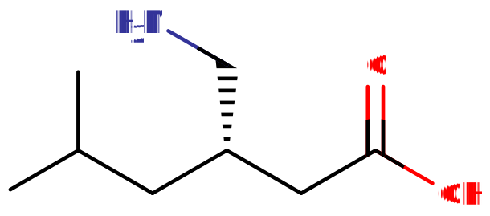

# 普瑞巴林

[◀返回](index.md)

    
 当你把本应属于小圈子的东西放到b站：

>  

    2026/4/20，普瑞巴林单方加入网络禁售，真是好样的。

|  | **当[加巴喷丁类物质](../文档/药物分类/加巴喷丁类物质.md)与其他[抑制剂](../文档/药物分类/抑制剂.md)如[阿片类](../文档/药物分类/阿片类药物.md)、[苯二氮卓类](../文档/药物分类/苯二氮卓类物质.md)、[巴比妥类](../文档/药物分类/巴比妥类物质.md)、[噻吩二氮卓类](../文档/药物分类/噻吩二氮卓类物质.md)、[酒精](../药物/酒精.md)或其他[GABA能物质](../文档/GABA.md)联用时，可能会发生致命的[过量](../文档/药物过量.md)哦。[1]** |
| --------------------------------------------------------------------------------------- | -------------------------------------------------------------------------------------------------------------------------------------------------------------------------------------------------------------------------------------------------------------------------------------------------------------------------------------------------------------------------------------------------------------------------- |

强烈不建议将这些物质联用，尤其是在[中等](../文档/药物剂量分类.md#中等)到[严重](../文档/药物剂量分类.md#严重)剂量下。

| 化学信息     | 普瑞巴林                                               |
| ------------ | ------------------------------------------------------ |
| 结构式       |               |
| 分子式       | C8H17NO2              |
| CAS 号       | 148553-50-8                                            |
| **化学命名** |                                                        |
| 常用名       | Pregabalin, Lyrica (乐瑞卡), Nervalin                  |
| 取代名称     | 3-Isobutyl GABA                                        |
| 系统命名     | (S)-3-(Aminomethyl)-5-methylhexanoic acid              |
| **类别归属** |                                                        |
| 精神药效类别 | _[抑制剂](../文档/药物分类/抑制剂.md)_                 |
| 化学类别     | _[加巴喷丁类物质](../文档/药物分类/加巴喷丁类物质.md)_ |

> **警告：** 由于个体体重、耐受性、新陈代谢和个人敏感度的差异，请务必从低剂量开始哦。[参见负责任的用药部分](../文档/负责任的用药索引页.md)。

| [**给药途径**](../文档/给药途径.md)      | [口服](../文档/给药途径.md#口服) | [直肠给药](../文档/给药途径.md#直肠) |
| ---------------------------------------- | -------------------------------- | ------------------------------------ |
| 生物利用度                               | ~90%                             | ~99%                                 |
| [**剂量**](../文档/给药剂量.md)          |                                  |                                      |
| [阈值](../文档/药物剂量分类.md#阈值)     | 50 mg                            | < 40 mg                              |
| [轻微](../文档/药物剂量分类.md#轻微)     | 50 \~ 225 mg                     | 40 \~ 200 mg                         |
| [中等](../文档/药物剂量分类.md#中等)     | 225 \~ 600 mg                    | 200 \~ 450 mg                        |
| [强烈](../文档/药物剂量分类.md#强烈)     | 600 \~ 900 mg                    | 450 \~ 600 mg                        |
| [严重](../文档/药物剂量分类.md#严重)     | 900 mg +                         | 600 mg +                             |
| [**时长**](../文档/药效时长.md)          |                                  |                                      |
| [总时长](../文档/药效时长.md#总时长)     | 9 \~ 17 小时                     | 5 \~ 8 小时                          |
| [药效发作](../文档/药效时长.md#药效发作) | 30 \~ 45 分钟                    | 15 \~ 30 分钟                        |
| [药效上升](../文档/药效时长.md#药效上升) | 1 \~ 2 小时                      | 30 \~ 120 分钟                       |
| [药效达峰](../文档/药效时长.md#药效达峰) | 4 \~ 6 小时                      | 2 \~ 3 小时                          |
| [药效褪去](../文档/药效时长.md#药效褪去) | 4 \~ 8 小时                      | 3 \~ 5 小时                          |
| [药效残余](../文档/药效时长.md#药效残余) | 4 \~ 10 小时                     | 6 \~ 12 小时                         |

> **免责声明：** 本站的[剂量](../文档/给药剂量.md)信息收集自用户和[网络](../wiki/Network)，仅供教育目的。这不是推荐，应与其他来源核实准确性。

| [**药物联用**](#危险药物联用) |             |
| ----------------------------- | ----------- |
| 羟考酮                        | ⛔ 严禁联用 |
| SSRI                          | ⚠️ 谨慎联用 |
| MDMA                          | ⚠️ 谨慎联用 |

**普瑞巴林**（也称为 **3-异丁基 GABA**，商品名为 **乐瑞卡**）是[加巴喷丁类](../文档/药物分类/加巴喷丁类物质.md)[抑制剂](../文档/药物分类/抑制剂.md)物质。普瑞巴林是一种常见的处方药，通常用于治疗神经性疼痛、[焦虑](../药效/焦虑.md)、[不宁腿综合征](../药效/不宁腿.md)，并作为治疗[癫痫发作](../文档/癫痫发作.md)的辅助药物。

普瑞巴林的药理特征与[加巴喷丁](../药物/加巴喷丁.md)相当，因为它们具有相似的作用机制并诱导相似的主观效应。普瑞巴林相对于加巴喷丁的优势包括更高的生物利用度和效力，以及普瑞巴林有更广泛的公认医疗用途，这在加巴喷丁中是看不到的，例如它成功用于治疗焦虑症，而加巴喷丁在这方面并不成功（除了一些更严重的病例）。

## 化学

普瑞巴林是[GABA](../文档/GABA.md)（γ-氨基丁酸）的结构类似物，在氨基丁酸链的β碳上有一个异丁基取代。普瑞巴林在结构上与其他[加巴喷丁类物质](../文档/药物分类/加巴喷丁类物质.md)相似，如[加巴喷丁](../药物/加巴喷丁.md)和[菲尼布特](../药物/菲尼布特.md)。普瑞巴林含有一条己烷羧化链，称为己酸。该碳链通过R3处的（S）构象中的甲基桥和R5处的甲基基团被胺基取代。

## 药理学

普瑞巴林既不是 GABAA 也不是 GABAB 受体激动剂。

### 药效学

普瑞巴林的药理作用是通过结合电压门控钙通道（VGCC）的 α2δ-1 位点介导的。该位点也被称为加巴喷丁受体，因为它是相关物质[加巴喷丁](../药物/加巴喷丁.md)（也是由辉瑞公司开发）的靶点。α2δ-1 位点在从背根神经节投射的感觉神经元中大量存在，外周神经损伤会上调该结构亚基，导致神经性疼痛发展和维持的敏化。通过阻断脊髓 VGCC 的 α2δ-1 亚基，普瑞巴林可以缓解疼痛，因为它减少了[谷氨酸](../文档/谷氨酸.md)、P 物质、CGRP（降钙素基因相关肽）等物质的释放，这些是参与调节和放大疼痛信号的神经递质。普瑞巴林相对于加巴喷丁的优势包括更高的生物利用度和效力。

尽管普瑞巴林是[GABA](../文档/GABA.md)的化学衍生物，但它对任何 GABA 受体（包括 GABAA 、 GABAB 和[苯二氮卓](../文档/药物分类/苯二氮卓类物质.md)位点）均无活性。普瑞巴林尽管有 GABA 骨架，但似乎不会改变大脑中的 GABA 水平，因此推测其药理活性与GABA无关。相反，它与电压门控钙通道的 α2δ-1 位点的结合似乎是其主观效应的来源。通过结合该位点，普瑞巴林减少了几种兴奋性神经递质的释放，包括[谷氨酸](../文档/谷氨酸.md)、[P物质](../wiki/Substance_P)、[乙酰胆碱](../文档/乙酰胆碱.md)和[去甲肾上腺素](../文档/去甲肾上腺素.md)。

高剂量下谷氨酸和乙酰胆碱释放的减少可能是导致类似解离/谵妄效应的原因。

一项研究还表明，普瑞巴林能促进深度睡眠，从而提高睡眠质量。这可能很重要，因为慢波睡眠的减少与焦虑和纤维肌痛有关。此外，已发现加巴喷丁位点对兴奋性突触的神经发生具有独立作用。内源性神经化学物质血小板反应蛋白也结合该位点，对新兴奋性突触的生成很重要。加巴喷丁和普瑞巴林由于对该位点具有高亲和力，可阻断该作用并导致动物模型中兴奋性突触水平降低。

由于普瑞巴林治疗与大脑过度兴奋（焦虑、癫痫、神经性疼痛）相关的疾病和[神经递质](../文档/神经递质.md)，其调节作用导致普瑞巴林对神经系统产生[镇静](../药效/镇静.md)（或[平静](../药效/焦虑抑制.md)）作用。

### 药代动力学

普瑞巴林空腹服用时吸收迅速，血浆浓度峰值出现在 1 至 1.5 小时内。普瑞巴林的口服生物利用度估计大于或等于90%。与食物同服时，普瑞巴林的吸收率会降低，导致达到血浆浓度峰值的时间延迟约3小时，峰值水平本身降低约 25% 至 30%。然而，与食物同服对吸收程度没有临床显着影响。

普瑞巴林在人体内代谢可忽略不计。在使用核医学技术的实验中，显示尿液中回收的放射性约98%是未改变的普瑞巴林。主要代谢物是 N-甲基普瑞巴林。

普瑞巴林主要以原形物质通过肾脏排泄从体循环中清除。消除半衰期为 6.3 小时。

## 主观效应

每个人对普瑞巴林的反应可能有很大不同，因此必须从较低剂量开始，以确保不会产生任何严重的不良反应，如外周水肿或肌肉疼痛。

_**免责声明：** 下列效应引用自[**主观效应索引**](../药效/index.md)（**SEI**），这是一个基于轶事用户报告和 [PsychonautWiki](../wiki/PsychonautWiki) 贡献者个人分析的开放研究文献。因此，应带着健康的怀疑态度来看待它们。_

_值得注意的是，这些效应不一定会以可预测或可靠的方式发生，尽管高剂量更可能诱发全方位的效应。同样，**不良反应**随着剂量的增加而变得越来越可能，并可能包括**成瘾、严重伤害或死亡** ☠。_

### **[躯体效应](../药效/躯体效应.md)** 

- **[兴奋](../药效/兴奋.md)** & **[镇静](../药效/镇静.md)** - 普瑞巴林产生轻度镇静并适度改善入睡潜伏期。几项研究表明，普瑞巴林可改善因各种适应症服用该药的患者的睡眠质量。目前尚不清楚这种效果是否会延续到娱乐性使用者身上。然而，在白天服用时，它并不是一种过度镇静的物质。
- **[食欲增强](../药效/食欲增强.md)** - 这种效果并不特别显着，但据报道有些人会出现。当与[大麻](../药物/大麻.md)联用时，可能会产生协同作用。
- **[镇痛](../药效/镇痛.md)** - 普瑞巴林对某些类型的慢性疼痛有效，特别是神经性疼痛，但对急性疼痛无效。
- **[自发性躯体感觉](../药效/自发性躯体感觉.md)** - 普瑞巴林的总体“药效”可以被描述为一种尖锐、愉悦的刺痛感，具体位于手、脚和头部。
- **[躯体欣快感](../药效/躯体欣快感.md)** - 这一成分虽然在体验中很突出，但通常不如可能引起的认知欣快那么强烈。这种感觉本身可以描述为身体舒适、温暖和幸福的感觉。
- **[触觉增强](../药效/触觉增强.md)** - 虽然使用者的身体可能会感到麻木，但触觉同时也可能会增强。
- **[肌肉颤动](../药效/肌肉颤动.md)** - 有点矛盾的是，既然普瑞巴林被用作癫痫的辅助治疗，普瑞巴林（尤其是在较高剂量下）可能会产生肌肉痉挛。轶事报告称，在过量服用时曾出现癫痫发作。
- **[呼吸抑制](../药效/呼吸抑制.md)** - 虽然普瑞巴林可能会引起呼吸抑制，但这种作用不如[阿片类药物](../文档/药物分类/阿片类药物.md)和[苯二氮卓类药物](../文档/药物分类/苯二氮卓类物质.md)那么强。
- **[肌肉松弛](../药效/肌肉松弛.md)** - 虽然普瑞巴林带来的肌肉松弛不如[地西泮](../药物/地西泮.md)或其他[苯二氮卓类药物](../文档/药物分类/苯二氮卓类物质.md)那么强大，但仍然很突出。
- **[头晕](../药效/头晕.md)** - 这种效果在较高剂量下相当普遍。
- **[躯体轻盈感](../药效/躯体轻盈感.md)** - 在极高剂量下，一些用户报告感觉变轻了。
- **[性欲增强](../药效/性欲增强.md)** _或_ **[性欲减退](../药效/性欲减退.md)**
- **[性高潮抑制](../药效/性高潮抑制.md)** - 即使性欲增加，有些人可能会经历延迟但更强烈的性高潮。
- **[排尿困难](../药效/排尿困难.md)** - 用户普遍报告此效应。
- **[尿频](../药效/尿频.md)**
- **[运动控制丧失](../药效/运动控制丧失.md)** - 在较高剂量下，这种效果类似于[苯二氮卓类](../文档/药物分类/苯二氮卓类物质.md)和[酒精](../药物/酒精.md)。用户报告会跌跌撞撞并撞到墙上。
- **[触觉抑制](../药效/触觉抑制.md)** - 这种效果会导致全身感觉麻木，尤其是脸部。同时，使用者的触觉可能会增强。
- **[癫痫发作抑制](../药效/癫痫发作抑制.md)** - 普瑞巴林可有效减少某些类型的癫痫发作，如局灶性癫痫发作和部分性癫痫发作。
- **[瞳孔扩大](../药效/瞳孔扩大.md)**

### **[视觉效应](../药效/视觉效应.md)** 

- **[颜色增强](../药效/颜色增强.md)**
- **[视觉锐度抑制](../药效/视觉锐度抑制.md)** - 在高剂量下，普瑞巴林会导致视力略微模糊。
- **[视觉拖尾](../药效/视觉拖尾.md)** - 这种效果在高剂量下可见，通常相当温和。通常不超过2级。
- **[深度感知扭曲](../药效/深度感知扭曲.md)** - 这种效果非常温和，仅在极高剂量下出现。
- **[物体改变](../药效/物体改变.md)** - 虽然这种效果很少见，但仍可能自发发生，通常是在严重剂量下。
- **[漂移](../药效/漂移.md)**
- **[残影](../药效/残影.md)** 和 **[视觉加工减慢](../药效/视觉加工减慢.md)** - 在高/极高剂量下。这两种效果结合在一起会让你的视觉感觉更“慢”。
- **[复视](../药效/复视.md)** - 这种效果非常温和，在高剂量下不一致地出现。

#### 幻觉状态

虽然普瑞巴林通常不被认为是致幻药物，但在较高剂量下仍会导致解离甚至类似精神病的效应。睡眠剥夺和遗传因素可能在普瑞巴林的幻觉状态中起作用。普瑞巴林的幻觉状态包括（但不限于）：

- **[内部幻觉](../药效/内部幻觉.md)** - 在高剂量下，可能会经历类似梦境的状态和[入睡幻觉](../wiki/Hypnagogia)。
- **[外部幻觉](../药效/外部幻觉.md)** - 这种效果很少见，仅在严重剂量和/或用户睡眠不足时发生。这种效果本质上可能是谵妄/精神病的。它可以包括：[物体激活](../药效/物体激活.md)、[影子人](../药效/影子人.md)和[视觉变形](../药效/视觉变形.md)。它甚至可能包括远处的根本不存在的人和动物，但一旦用户走近，它们可能会消失。

### **[分离效应](../药效/分离效应.md)** 

- **[视觉分离](../药效/视觉分离.md)** - 这种效果通常相当温和，在高剂量下不一致地出现。它导致感觉视觉变得遥远或模糊，就像通过屏幕或窗户观看一样。然而，很少有报道称普瑞巴林会导致[孔洞、空间和空隙](../药效/视觉分离.md#Holes_spaces_and_voids)或[幻觉结构](../药效/视觉分离.md#Structures)。

### **[认知效应](../药效/认知效应.md)** 

- 普瑞巴林的认知效应可以分解为几个部分，这些部分随着剂量的增加而逐渐增强。普瑞巴林的思维空间类似于更清醒的[酒精](../药物/酒精.md)或[苯二氮卓类](../文档/药物分类/苯二氮卓类物质.md)中毒，尽管在高剂量下可能会出现更[解离](../文档/药物分类/解离剂.md)的转变。

    这些认知效应中最突出的通常包括：

- **[分析能力抑制](../药效/分析能力抑制.md)**
- **[共情、情感和社交能力增强](../药效/共情、情感和社交能力增强.md)** - 普瑞巴林呈现出明显的[共情剂](../文档/药物分类/共情剂.md)效应。与[苯二氮卓类](../文档/药物分类/苯二氮卓类物质.md)（仅通过[去抑制](../药效/去抑制.md)增加社交能力）相反，在高剂量下，普瑞巴林直接增加与他人交流的冲动，并伴有明确的同理心、爱、亲密和联系感。这些效果虽然比[MDMA](../药物/MDMA.md)弱，但仍然很突出。
- **[自我膨胀](../药效/自我膨胀.md)**
- **[新奇感增强](../药效/新奇感增强.md)**
- **[暗示性强化](../药效/暗示性强化.md)**
- **[失忆](../药效/失忆.md)** - 与[苯二氮卓类](../文档/药物分类/苯二氮卓类物质.md)相比，如果不与其他抑制剂联用，普瑞巴林的健忘症仅是轻微的。长期使用或高剂量使用时，应该预料到会有更多“话到嘴边说不出”的时刻和短期记忆受损（例如，走进一个房间却忘记了本来要做什么）。除非与其他物质联用，否则似乎不会发生完全断片。
- **[焦虑抑制](../药效/焦虑抑制.md)**
- **[情绪强化](../药效/情绪强化.md)**
- **[认知欣快](../药效/认知欣快.md)** - 许多服用普瑞巴林的用户描述即使在较低剂量下也有中度甚至强烈的欣快感。许多用户将其描述为类似于[阿片类药物](../文档/药物分类/阿片类药物.md)引起的欣快感。这种感觉本身可以描述为强大而压倒性的情感幸福、满足和快乐。
- **[去抑制](../药效/去抑制.md)**
- **[梦境强化](../药效/梦境强化.md)**
- **[音乐欣赏能力增强](../药效/音乐欣赏能力增强.md)** - 普瑞巴林的音乐增强可以描述为音乐听起来更详细、“质量更高”，甚至在较高剂量下会变慢。
- **[动机增强](../药效/动机增强.md)** - 像[卡痛](../药物/卡痛.md)一样，普瑞巴林可以产生轻微镇静作用，但以类似[兴奋剂](../文档/药物分类/兴奋剂.md)的方式增加动力。
- **[沉浸感强化](../药效/沉浸感强化.md)**
- **[创造力增强](../药效/创造力增强.md)** - 这种效果在较高剂量下尤为明显。
- **[人格解体](../药效/人格解体.md)** _和_ **[现实感丧失](../药效/现实感丧失.md)** - 在严重剂量下，普瑞巴林可诱发轻微的解离状态。睡眠剥夺会增加普瑞巴林的DPDR（人格解体/现实感丧失）并使其更*消极*（烦躁）。
- **[自杀意念](../药效/自杀意念.md)** - 在严重剂量下，这可能导致自杀企图。
- **[精神病发作](../药效/精神病发作.md)** - 即使在治疗剂量下，普瑞巴林也被证明在少数用户中具有精神病副作用。睡眠剥夺强烈增强了这种效果，对于有精神分裂症遗传倾向的人来说，这种效果可能更高。
- **[躁狂](../药效/躁狂.md)** - 当用于治疗双相情感障碍时，它会导致躁狂，即使是治疗剂量。这种效果通常发生在娱乐环境中，使用严重剂量，或当用户睡眠不足时。它可能表现为低强度（轻躁狂）或与[精神病](../药效/精神病发作.md)协同作用。然而，这种效果很少见，不是典型体验的一部分。
- **[思维减速](../药效/思维减速.md)**

### **[听觉效应](../药效/听觉效应.md)** 

- **[听觉增强](../药效/听觉增强.md)**
- **[听觉扭曲](../药效/听觉扭曲.md)** - 这些通常是温和的，只出现在极高剂量下。
- **[听觉幻觉](../药效/听觉幻觉.md)** - 在较重剂量下，可能会经历耳鸣或感知到想象的声音，如声音。

### **药效残余** 

- 普瑞巴林体验的[药效褪去](../文档/药效时长.md#药效褪去)期间的效果通常是积极的，更类似于“余辉”而不是“宿醉”。与[药效达峰](../文档/药效时长.md#药效达峰)效果相比，这些效果通常非常温和。普瑞巴林的残余效应包括：
- **[动机增强](../药效/动机增强.md)** - 普瑞巴林通常具有精神刺激作用，*余辉*也是如此。由于药效主要消失了，这可以导致生产力提高。
- **[音乐欣赏能力增强](../药效/音乐欣赏能力增强.md)** - 这种效果不如在药效期间那么强，但音乐明显增强，听起来更详细。
- **[肌肉松弛](../药效/肌肉松弛.md)** - 这种效果不如药效期间强，但在余辉中仍然存在。
- **[运动控制丧失](../药效/运动控制丧失.md)** - 这种效果比*药效*弱，但用户仍然可以注意到。在*余辉*/下头期间开车是个坏主意。
- **[头晕](../药效/头晕.md)** - 普瑞巴林的后效大多是积极的，但头晕仍然可能存在，尤其是在服用高剂量后。

### 体验报告

描述这种化合物在我们的[体验索引](../wiki/Experience_index)中的效果的轶事报告包括：

- [报告/psychounautwiki/Experience:225mg*Pregabalin*+Cannabis\_-Bliss_and_Serenity;\_a_hedonistic_evening](Experience:225mg_Pregabalin_+Cannabis_-Bliss_and_Serenity;_a_hedonistic_evening)
- [报告/psychounautwiki/Experience:50mg*Pregabalin*-\_Surprisingly_strong](Experience:50mg_Pregabalin_-_Surprisingly_strong)
- [报告/psychounautwiki/Experience:Pregabalin*(2,625_mg,\_oral)*-\_Pharmaceutical_Sunshine](<Experience:Pregabalin_(2,625_mg,_oral)_-_Pharmaceutical_Sunshine>)
- [报告/psychounautwiki/Experience:Pregabalin*(450mg,\_oral)*+_Methylphenidate_(20mg,_oral)_-\_Gaba_Flipping](<Experience:Pregabalin_(450mg,_oral)_+_Methylphenidate_(20mg,_oral)_-_Gaba_Flipping>)

## 毒性和伤害潜力

普瑞巴林相对于剂量的毒性可能较低。然而，当与[酒精](../药物/酒精.md)或[阿片类药物](../文档/药物分类/阿片类药物.md)等[抑制剂](../文档/药物分类/抑制剂.md)混合时，它可能是[致命的](../药效/呼吸抑制.md)。

### 癫痫发作风险

普瑞巴林已被证明在娱乐剂量下会诱发和/或增加癫痫发作的风险。几乎没有证据表明在医疗剂量（600mg及以下）下存在担忧。当与降低癫痫发作阈值的其他药物混合时，这种风险可能会增加。建议在使用高于600mg的剂量时要小心。减少各种易感因素也可能有益于降低这种风险。易感因素可能包括低钠、睡眠不足和剧烈体力活动等。

如果使用这种物质，强烈建议采取[伤害减少措施](../文档/负责任的用药索引页.md)。

### 致命剂量

啮齿动物的 [LD50](../wiki/LD50)（半数致死量）已确定大于 5,000 mg/kg。大鼠静脉注射的 LD50 也确定大于 300 mg/kg。

就人类而言，有一例病例报告称一名男子摄入了 8,400 mg 普瑞巴林并最终陷入昏迷，但仅通过支持性护理进行管理，直到他恢复意识。相比之下，普瑞巴林的最高推荐治疗剂量为 600 mg/天。辉瑞公司乐瑞卡的官方包装说明书指出，临床试验期间意外摄入普瑞巴林的最高剂量为 8 g，没有产生严重后果。

### 耐受性和成瘾潜力

普瑞巴林最初被认为是非成瘾性的，滥用潜力低，耐受性发展很少。然而，该物质的娱乐性使用导致了对这一评估的重新评估。该物质的欣快作用和耐受性的发展可能导致剂量远高于治疗范围，这表明了娱乐性使用和成瘾的潜力。

连续使用几个月后，会对抑制作用产生耐受性。停止后，耐受性会在 7 \~ 14 天内恢复到基线。在稳定给药几个月或更长时间后突然停止使用，可能会出现戒断症状或反弹症状，可能需要逐渐减少剂量。

突然停止长期使用的戒断反应包括焦虑、失眠、出汗、肌肉痉挛、胃肠道问题、冷热潮红、恶心和流感样感觉。

### 相互作用

有一份关于患者在围手术期使用羟考酮和普瑞巴林后进入血清素综合征的报告。然而，几项研究未能发现普瑞巴林有任何血清素能作用。一篇论文指出，「虽然普瑞巴林是 GABA 的结构类似物，但它在 GABAA 或 GABAB 受体上没有临床显着作用，并且它不会代谢转化为 GABA 或 GABA 激动剂。普瑞巴林不是血清素再摄取抑制剂，也不作为谷氨酸受体拮抗剂。」最近的一项研究写道，「普瑞巴林与血清素和多巴胺受体无关，不抑制多巴胺、血清素或去甲肾上腺素的再摄取。」普瑞巴林的主要作用机制是结合并阻断电压门控钙通道上的亚受体，导致下游过度活跃神经元的减少。

如果普瑞巴林具有[血清素能](../文档/血清素.md)作用，它可能会与其他血清素能物质（包括 SSRIs、MDMA、各种镇痛药以及可能的其他娱乐和医疗物质）产生负面相互作用。鉴于多项研究完全缺乏任何血清素能活性的证据，报告的不良事件似乎可能是一次意外事故，由未知因素引起。

## 法律地位

普瑞巴林在大多数国家被作为处方药监管。

- **德国:** 根据 Anlage 1 AMVV，普瑞巴林是处方药。
- **挪威:** 普瑞巴林与大多数苯二氮卓类药物和止痛药一起被列入处方附表B。由于报告的娱乐性使用、耐受性发展和成瘾，它从限制较少的附表C重新安排到附表B。
- **瑞典:** 普瑞巴林是处方药。自 2018 年 7 月 24 日起被归类为受控物质，属于附表V药物。
- **瑞士:** 普瑞巴林被列为「Abgabekategorie B」药物，需要处方。
- **土耳其**: 普瑞巴林是「绿色处方」专用物质，未经处方出售或持有是非法的。
- **英国:** 1971年滥用药物法规定，未经处方持有该药物是非法的，为此目的，它被归类为 C 类药物。
- **美国:** 普瑞巴林属于附表V，表明「滥用潜力低」。相比之下，苯二氮卓类药物属于附表 IV。

## 药物联用

与 [美金刚](../药物/美金刚.md)（轶事, N=1）

> 每天在 75 mg 普瑞巴林基础上增加 20 mg 到 30 mg 美金刚相当于 300 mg 普瑞巴林（我当时有那么多的耐受性。我有慢性焦虑症）

## 另见

- [负责任的用药](../文档/负责任的用药索引页.md)
- [加巴喷丁](../药物/加巴喷丁.md)
- [苯二氮卓类物质](../文档/药物分类/苯二氮卓类物质.md)
