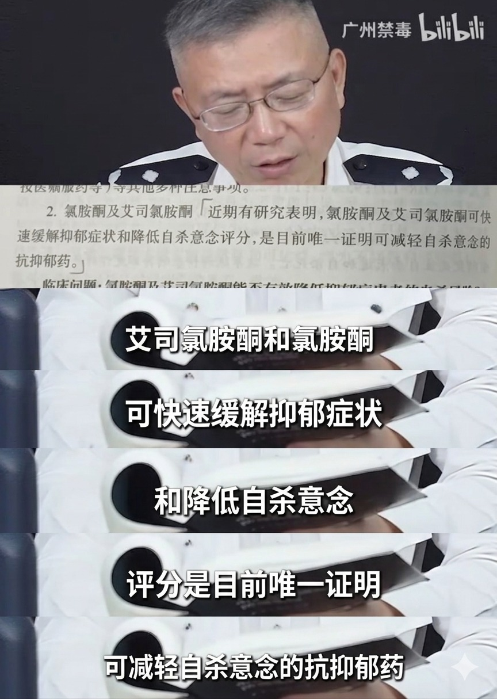
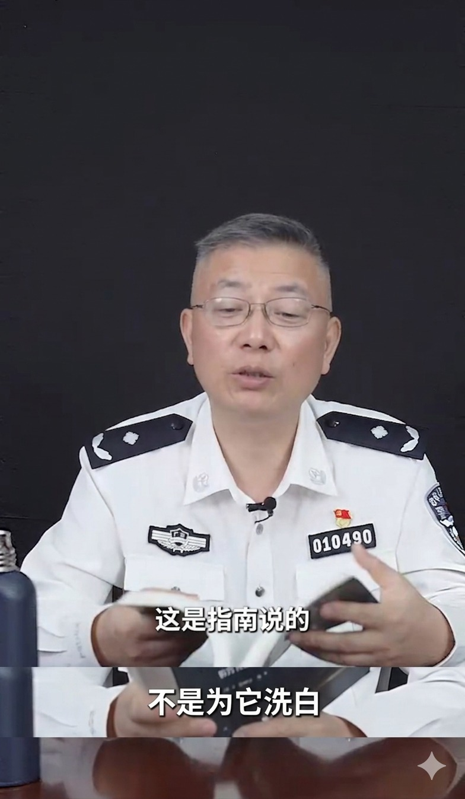

# 氯胺酮

[◀返回](/home.md)

 广州禁毒：我没有在为K粉洗白！ 

> 
>      
>      

> 

 

 

| 氯胺酮 (Ketamine) | |
| --- | --- |
|  | |
| **化学命名** | |
| 常用名称 | *Ketamine, K, Ket, Kitty, Special K, K粉, 喵喵, 氯胺酮, 维生素K, 茄, 嗨药* |
| 取代名称 | *氯胺酮* |
| 系统名称 | *(RS)-2-(2-Chlorophenyl)-2-(methylamino)cyclohexanone* |
| **分类成员** | |
| 精神药效分类 | *[解离剂](/文档/药物分类/解离剂.md)* |
| 化学分类 | *[芳基环己胺类物质](/文档/药物分类/芳基环己胺类物质.md)* |
| **[给药途径](/文档/给药途径.md)** | |
| - **警告喵：** 由于每个人的体重、耐受性、新陈代谢和敏感度都不同，请务必从低剂量开始尝试哦。[参见负责任的用药部分](/文档/负责任的用药索引页.md)。   | |

### 剂量与时长信息

**[鼻吸](/文档/给药途径.md)** (Bioavailability: 45%)

| 强度 | 剂量 |
| --- | --- |
| [阈值](/文档/药物剂量分类.md) | 5 mg |
| [轻微](/文档/药物剂量分类.md) | 10 - 30 mg |
| [中等](/文档/药物剂量分类.md) | 30 - 75 mg |
| [强烈](/文档/药物剂量分类.md) | 75 - 150 mg |
| [严重](/文档/药物剂量分类.md) | 150 mg + |

| 阶段 | 时长 |
| --- | --- |
| [总时长](/文档/药效时长.md) | 1 - 2 小时 |
| [药效发作](/文档/药效时长.md) | 1 - 3 分钟 |
| [药效上升](/文档/药效时长.md) | 5 - 15 分钟 |
| [药效达峰](/文档/药效时长.md) | 15 - 45 分钟 |
| [药效褪去](/文档/药效时长.md) | 30 - 60 分钟 |
| [药效残余](/文档/药效时长.md) | 2 - 12 小时 |

**[口服](/文档/给药途径.md)** (Bioavailability: 17%)

| 强度 | 剂量 |
| --- | --- |
| [阈值](/文档/药物剂量分类.md) | 50 mg |
| [轻微](/文档/药物剂量分类.md) | 50 - 100 mg |
| [中等](/文档/药物剂量分类.md) | 100 - 300 mg |
| [强烈](/文档/药物剂量分类.md) | 300 - 450 mg |
| [严重](/文档/药物剂量分类.md) | 450 mg + |

| 阶段 | 时长 |
| --- | --- |
| [药效发作](/文档/药效时长.md) | 10 - 30 分钟 |
| [药效上升](/文档/药效时长.md) | 5 - 20 分钟 |
| [药效达峰](/文档/药效时长.md) | 45 - 90 分钟 |
| [药效褪去](/文档/药效时长.md) | 3 - 6 小时 |
| [药效残余](/文档/药效时长.md) | 4 - 8 小时 |

**舌下含服** (Bioavailability: 20-29%)
*数据较少，通常介于鼻吸与口服之间，请谨慎参考。*

- **[免责声明](/关于本站/关于FreeODwiki.md)：** 本站的[剂量](/文档/给药剂量.md)信息汇集自用户和[资源](/关于本站/home.md)，仅供教育目的喵。这不是医疗建议，请务必多方核实，注意安全哦。

| **[相互作用](#危险的相互作用)** | |
| --- | --- |
| [苯丙胺](./苯丙胺.md) | ⚠️ 谨慎联用 |
| [可卡因](./可卡因.md) | ⚠️ 谨慎联用 |
| [苯二氮卓类物质](/文档/药物分类/苯二氮卓类物质.md) | 💔 联用危险 |
| [单胺氧化酶抑制剂](/文档/单胺氧化酶抑制剂.md) | ⚠️ 谨慎联用 |
| 曲唑酮 (Trazodone) | ⚠️ 谨慎联用 |
| 西柚/葡萄柚 | ⚠️ 谨慎联用 |
|  | |
| [酒精](./酒精.md) | 💔 联用危险 |
| [GHB](./GHB.md) | 💔 联用危险 |
| GBL | 💔 联用危险 |
| [阿片类药物](/文档/药物分类/阿片类药物.md) | 💔 联用危险 |
| [曲马多](./曲马多.md) | 💔 联用危险 |

**氯胺酮**（也就是大家熟知的 **K粉**、**K**、**Special K**、**维生素K**、**喵喵**等）是一种经典的[解离剂](/文档/药物分类/解离剂.md)，属于[芳基环己胺类物质](/文档/药物分类/芳基环己胺类物质.md)家族。它是解离大家族里最出名、最典型的成员啦，这个家族还包括 [PCP](./PCP.md)、[MXE](/药物/MXE.md)、[右美沙芬](./右美沙芬.md) 和 [氧化亚氮](./氧化亚氮.md) 呢。它的作用机制还没有完全被搞清楚，但一般认为和[阻断 NMDA 谷氨酸受体](/文档/药物分类/NMDA受体拮抗剂类药物.md)有关喵。

它最早是在 1963 年由 Parke-Davis 实验室开发的，原本是为了替代手术麻醉剂 [苯环利定](./PCP.md) (PCP) 的，因为 PCP 的副作用实在太大了。现在它广泛用于人类和兽医的医学领域，主要是在手术和重症监护室里。最近，人们发现它能迅速缓解难治性抑郁症和自杀念头，所以临床研究也多了起来喵。

关于它的娱乐用途，最早是在 1967 年美国的药物化学家圈子里传出来的，到了 90 年代在欧洲变得很流行，当时它经常被当作摇头丸里的掺假成分。现在，流行文化里只要提到夜店和锐舞派对，就少不了它的身影。

[主观效应](/文档/科学信息索引页.md)包括[运动控制丧失](/药效/运动控制丧失.md)、[镇痛](/药效/镇痛.md)、[内部幻觉](/药效/视觉效应.md)、[记忆抑制](/药效/认知效应.md)、[概念性思维](/药效/认知效应.md)、[沉浸感增强](/药效/视觉增强.md)、[欣快感](/药效/躯体欣快感.md)以及[人格解体](/药效/分离效应.md)/[解离](/药效/分离效应.md)。这些效果和 [PCP](./PCP.md) 以及 [右美沙芬](./右美沙芬.md) 有点像，但是起效更快，持续时间更短喵。它以产生相对“纯粹”的解离感而闻名，不像 [PCP](./PCP.md) 或 [MXE](/药物/MXE.md) 那样会有很多[兴奋](/药效/兴奋.md)和[躁狂](/药效/躁狂.md)的感觉。

另外，氯胺酮的效果非常依赖于剂量。低剂量时，用户会觉得像喝了酒一样[脱抑制](/药效/认知效应.md)和[放松](/药效/肌肉松弛.md)。但在高剂量下，它会产生一种被称为“K-hole（K洞）”的[致幻](/文档/药物分类/致幻剂.md)出神状态，很多人形容这就像是“灵魂出窍”或者“濒死体验”一样喵。

它有中等到高度的滥用潜力。长期使用（比如大剂量、反复使用）会导致[强制性重复用药](/文档/药物戒断反应.md)和心理依赖。而且，长期或大量使用的健康风险虽然研究还不充分，但越来越多的证据表明它会导致膀胱功能障碍（比如著名的“K膀胱”），也有证据表明会造成认知和记忆问题（详见[毒性和危害部分](#毒性和危害潜力)）。

如果一定要使用这种物质，墙裂建议采取[伤害减少措施](/文档/负责任的用药索引页.md)哦！

---

## 目录

* [1 历史与文化](#历史与文化)
    + [1.1 常用名称](#常用名称)
* [2 化学](#化学)
    + [2.1 对映异构体](#对映异构体)
* [3 药理学](#药理学)
    + [3.1 研究](#研究)
        - [3.1.1 神经塑性发生剂](#神经塑性发生剂)
* [4 主观效应](#主观效应)
    + [4.1 **躯体效应**](#躯体效应)
    + [4.2 **视觉效应**](#视觉效应)
        - [4.2.1 抑制](#抑制)
        - [4.2.2 扭曲](#扭曲)
        - [4.2.3 几何图形](#几何图形)
        - [4.2.4 幻觉状态](#幻觉状态)
    + [4.3 **认知效应**](#认知效应)
    + [4.4 **听觉效应**](#听觉效应)
    + [4.5 **解离效应**](#解离效应)
    + [4.6 **多重感官效应**](#多重感官效应)
    + [4.7 **超个人效应**](#超个人效应)
    + [4.8 体验报告](#体验报告)
* [5 研究](#研究_2)
    + [5.1 濒死体验](#濒死体验)
    + [5.2 新型抗抑郁药](#新型抗抑郁药)
* [6 试剂测试结果](#试剂测试结果)
* [7 毒性和危害潜力](#毒性和危害潜力)
    + [7.1 认知与健康](#认知与健康)
    + [7.2 泌尿系统影响](#泌尿系统影响)
    + [7.3 神经毒性](#神经毒性)
    + [7.4 依赖性和滥用潜力](#依赖性和滥用潜力)
        - [7.4.1 永久耐受](#永久耐受)
    + [7.5 药物过量](#药物过量)
    + [7.6 静脉注射的警告](#静脉注射的警告)
    + [7.7 危险的相互作用](#危险的相互作用)
* [8 法律地位](#法律地位)
* [9 另见](#另见)
* [10 外部链接](#外部链接)
    + [10.1 媒体](#媒体)
* [11 文献](#文献)
* [12 参考文献](#参考文献)

---

## 历史与文化

氯胺酮最早是由美国科学家 Calvin Stevens 在 Parke Davis 实验室合成出来的。Stevens 当时正在寻找一种新的麻醉剂来替代 PCP，因为 PCP 在病人恢复意识时会产生严重的致幻副作用，不太适合人类使用喵。

1963 年在比利时获得专利后，氯胺酮最初被用作兽医麻醉剂。1966 年 Parke-Davis 获得了人类和动物使用的专利，1969 年以盐酸氯胺酮的形式作为处方药上市，商品名为 Ketalar。

1970 年，美国食品药品监督管理局（FDA）批准它供人类使用。由于它具有良好的拟交感神经特性和较宽的安全范围，它曾被作为战地麻醉剂提供给越战中的士兵使用。

氯胺酮被列在世界卫生组织的“基本药物清单”上，这是一份现代卫生系统所需的最安全、最有效药物的清单哦。

### 常用名称

街头名称包括 "Special K", "K", "Kit Kat", "kitty" (喵喵?), 以及 "马/狗/猫镇静剂"（这指的是它在兽医中的用途），"猫用瓦利姆 (Cat Valium)"，还有 "Jet"。

## 化学

氯胺酮，即 (RS)-2-(2-氯苯基)-2-(甲氨基)环己酮，属于一类叫做[芳基环己胺类物质](/文档/药物分类/芳基环己胺类物质.md)的合成有机化合物。芳基环己胺这个名字来源于它们的化学结构，包括一个连接在芳香环上的环己烷环，以及一个胺基。

其化学结构包含一个苯环，在 R2 位置有一个氯取代基，键合到一个被 -Oxo 基团（环己酮）取代的环己烷环上。一个氨基甲基链 (-N-CH3) 结合在环己酮环的同一位置 (R1) 上。

### 对映异构体

氯胺酮是两种对映异构体的等量混合物：艾司氯胺酮 (esketamine) 和阿氯胺酮 (arketamine)。

艾司氯胺酮是一种比阿氯胺酮更有效的 NMDA 受体拮抗剂和解离性致幻剂。由于假设 NMDA 受体拮抗作用是氯胺酮抗抑郁作用的基础，艾司氯胺酮被开发为一种抗抑郁药。

然而，其他多种 NMDA 受体拮抗剂，包括[美金刚](./美金刚.md)、lanicemine、rislenemdaz、rapastinel 和 4-chlorokynurenine，迄今为止都未能证明对抑郁症有足够的疗效。

此外，动物研究表明，阿氯胺酮（NMDA 受体拮抗作用较弱的对映体）以及 (2*R*,6*R*)-hydroxynorketamine（一种对 NMDA 受体亲和力可忽略不计但却是强效 alpha-7 烟碱受体拮抗剂的代谢物）可能具有抗抑郁作用。

## 药理学

更多信息：[NMDA受体拮抗剂类药物](/文档/药物分类/NMDA受体拮抗剂类药物.md)

氯胺酮被归类为非竞争性[NMDA受体拮抗剂](/文档/药物分类/NMDA受体拮抗剂类药物.md)。

NMDA 受体是一种离子型[谷氨酸](/文档/谷氨酸.md)受体，允许电信号在大脑和脊柱的神经元之间传递；要让信号通过，受体必须是开放的。解离剂通过阻断这些受体来关闭它们。这种神经元的断连会导致感觉丧失、行动困难，最终导致被称为“[K-hole（K洞）](/药效/分离效应.md)”的状态。

它是最容易识别的解离剂之一，这个大家族还包括 [苯环利定](./PCP.md) (PCP)、[MXE](/药物/MXE.md)、[右美沙芬](./右美沙芬.md) (DXM) 和 [氧化亚氮](./氧化亚氮.md)。

在高剂量、完全麻醉水平下，氯胺酮还被发现能与培养的人类神经母细胞瘤细胞中的 μ-阿片受体 2 型结合，但不具有[激动剂](/文档/受体激动剂.md)活性，并在大鼠中与 sigma 受体结合。此外，氯胺酮还与毒蕈碱受体、下行单胺能疼痛通路和电压门控钙通道相互作用。

在亚麻醉和完全麻醉剂量下，氯胺酮被发现通过抑制 5-HT 受体而不是通过单胺氧化酶抑制作用来阻止大脑中的血清素耗竭。

估计的生物利用度如下：鼻吸 (45%)，口服 (17%)，直肠 (25%)。

### 研究

#### 神经塑性发生剂

氯胺酮是一种神经塑性发生剂 (psychoplastogen)，指的是一种能够促进快速和持续的神经可塑性的化合物喵。

## 主观效应

在高剂量下，据报道氯胺酮会产生显著的认知障碍和改变，通常导致符号推理、交流和精细运动能力的完全丧失。这些变化似乎与其[超个人](/药效/认知效应.md)和治疗效果相吻合。

一些用户还报告有抗抑郁的余辉，这种感觉可能会持续数天或数周。

***免责声明：** 下面列出的效应引用自[***主观效应索引***](/文档/科学信息索引页.md) (**SEI**)，这是一个基于轶事用户报告和 [PsychonautWiki](/关于本站/home.md) 贡献者个人分析的开放研究文献。因此，应带着健康的怀疑态度来看待它们喵。*

*值得注意的是，这些效应不一定会以可预测或可靠的方式发生，尽管高剂量更可能诱发全方位的效应。同样，**不良反应**随着剂量的增加可能性也会变得越来越大，可能包括**成瘾、严重伤害甚至死亡** ☠。*

### **[躯体效应](/药效/躯体效应.md)** 
*   **[镇静](/药效/镇静.md)** - 氯胺酮据报道有中等的镇静作用。它会让人不想动弹，高剂量下甚至会让人完全无法移动。
*   **[自发性躯体感觉](/药效/不适性躯体效应.md)** - 氯胺酮的“躯体嗨感”可以被描述为一种尖锐的、愉悦的、刺痛的感觉，主要集中在手、脚和头部。这表现为一种灵魂出窍的感觉，或者身心之间的普遍断连，有时伴随着躯体欣快状态。
*   **[躯体形态感改变](/药效/躯体形态感改变.md)** & **[重力感改变](/药效/重力感改变.md)** - 氯胺酮能强烈改变用户感知自己身体形状的方式，且随剂量变化。在 K-hole 剂量下，用户可能会觉得完全脱离了自己的身体和地球。
*   **[躯体欣快感](/药效/躯体欣快感.md)** - 部分用户会有躯体欣快感。但这比 [阿片类药物](/文档/药物分类/阿片类药物.md) 或 [MDMA](./MDMA.md) 弱得多，也不那么可靠。
*   **[躯体轻盈感](/药效/躯体轻盈感.md)** - 用户可能会觉得身体漂浮起来，变得完全失重。在低剂量下，这种感觉甚至有点提神，让身体觉得动起来毫不费力。
*   **[运动控制丧失](/药效/运动控制丧失.md)** - 粗大和精细运动控制以及平衡和协调能力的丧失很常见，高剂量下尤其明显。建议用户在起效时坐好，以免摔倒受伤喵。
*   **[血压升高](/药效/血压升高.md)** - 高剂量下会出现。
*   **[脱水](/药效/脱水.md)** - 轻微到中度。在炎热、活动量大的场合（如舞池）风险更大。
*   **[触觉抑制](/药效/触觉效应.md)** - 触觉可能完全被抑制，导致四肢麻木。
*   **[镇痛](/药效/镇痛.md)** - 非常显著。氯胺酮会抑制大部分身体感觉。
*   **[眼球滑动](/药效/眼球滑动.md)** - 用户的眼球可能会颤动（也就是眼球震颤），特别是在高剂量下。这通常是暂时的，除非药效消退后还在持续，否则不用太担心。
*   **[头晕](/药效/头晕.md)** - 些用户报告在使用氯胺酮时会感到头晕。
*   **[痰液增多](/药效/痰液增多.md)**
*   **[恶心](/药效/恶心.md)** - 不常见，但在高剂量和药效达峰时可能性较大。
*   **[味觉幻觉](/药效/认知效应.md)**
*   **[排尿困难](/药效/排尿困难.md)**
*   **[性欲减退](/药效/性欲减退.md)** - 与 [兴奋剂](/文档/药物分类/兴奋剂.md) 和许多其他物质不同，氯胺酮倾向于强烈降低性欲，使性活动变得没吸引力且难以进行；这通常伴随着[触觉抑制](/药效/触觉效应.md)和[性高潮抑制](/药效/性高潮抑制.md)。
*   **[性高潮抑制](/药效/性高潮抑制.md)** - 在中高剂量下强烈抑制性高潮和正常的性唤起反应。
*   **[躯体自主](/药效/躯体自主.md)** - 相对少见，但部分用户可能会发生。用户可能会觉得身体在做手势和动作，却不受自己控制。不过，这些干扰通常很简单且短暂。
*   **[瞳孔扩大](/药效/瞳孔扩大.md)**

### **[视觉效应](/药效/视觉效应.md)** 

* 氯胺酮的视觉效应具有高度的抑制性和扭曲性。这也是为什么**在使用氯胺酮时绝对不能开车或操作机器！**

#### 抑制
*   **[复视](/药效/复视.md)** - 在中到重度剂量下很普遍，除非闭上一只眼睛，否则可能无法阅读文字。
*   **[模式识别抑制](/药效/模式识别抑制.md)** - 通常发生在高剂量下，使用户无法识别和解释感知到的视觉数据。
*   **[视觉锐度抑制](/药效/视觉锐度抑制.md)**
*   **[帧率抑制](/药效/视觉效应.md)** - 剂量相关，高剂量下明显。

#### 扭曲
*   **[深度感知扭曲](/药效/深度感知扭曲.md)**
*   **[环境立体主义](/药效/视觉扭曲.md)** (Environmental cubism)
*   **[环境球形化](/药效/视觉扭曲.md)** (Environmental orbism)
*   **[景色切片](/药效/视觉扭曲.md)** (Scenery slicing)

#### 几何图形
*   氯胺酮产生的[几何图形](/药效/视觉效应.md)相比于其他视觉分离感较弱的解离剂（如 [MXE](/药物/MXE.md) 和 [PCP](./PCP.md)）来说，颜色非常明亮，但不如 [右美沙芬](./右美沙芬.md) 或任何 [迷幻剂](/文档/药物分类/迷幻剂.md) 产生的几何图形那么复杂。

    它通常不超过 4 级，可以全面地描述为：复杂度简单，风格像算法生成的，感觉是合成的，组织结构松散，光线昏暗，色彩丰富，阴影有光泽，边缘柔和，尺寸巨大，速度快，运动平滑，圆角和锐角相当，深度沉浸且强度一致。

    除了简单的几何形状幻觉外，进入“洞”的高剂量氯胺酮可能会产生白光和其他低复杂度的幻觉，比如由白线组成的人影。

#### 幻觉状态
*   高剂量氯胺酮可以产生全方位的、高级别的幻觉状态，但比起许多常见的迷幻剂，这种方式更不稳定且难以复现。这些效应包括：

* **[机械景观](/药效/视觉效应.md)** (Machinescapes)
* **[内部幻觉](/药效/视觉效应.md)** (*[自主实体](/药效/视觉效应.md)*; *[场景、景色和景观](/药效/视觉效应.md)*; *[透视幻觉](/药效/视觉效应.md)* 和 *[剧本与情节](/药效/视觉效应.md)*) - 这种效应可以通过其[变体](/药效/视觉效应.md)全面描述为：可信度荒诞，风格固定，新体验和记忆回放各半，控制性自主，风格稳固。
* **[外部幻觉](/药效/视觉效应.md)** (*[自主实体](/药效/视觉效应.md)*; *[场景、景色和景观](/药效/视觉效应.md)*; *[透视幻觉](/药效/视觉效应.md)* 和 *[剧本与情节](/药效/视觉效应.md)*) - 这种效应可以通过其[变体](/药效/视觉效应.md)全面描述为：可信度荒诞，控制性自主，风格稳固。这种效应最常见的主题是感觉在和朋友说话，但其实朋友根本不在场。

### **[认知效应](/药效/认知效应.md)** 

*   **[分析抑制](/药效/认知效应.md)** - 用户报告说在氯胺酮的影响下很难进行正常或逻辑思考。正常认知和工作记忆会随剂量受损。然而，代价是创造性或非线性思维能力可能会增强（见[概念性思维](/药效/认知效应.md)）。
*   **[焦虑抑制](/药效/认知效应.md)** - 焦虑抑制在所有剂量下都很显著，但不如 [苯二氮卓类物质](/文档/药物分类/苯二氮卓类物质.md) 或其他 [GABA能药物](/文档/药物分类/抑制剂.md) 那么有选择性。
*   **[认知欣快](/药效/认知效应.md)** - 用户报告有中等到强烈的认知欣快感，通常发生在药效上升阶段；但这似乎不如 [兴奋剂](/文档/药物分类/兴奋剂.md)、[共情剂](/文档/药物分类/共情剂.md) 和 [阿片类药物](/文档/药物分类/阿片类药物.md) 明显。
*   **[强制性重复用药](/文档/药物戒断反应.md)** - 由于其欣快效果、起效快和持续时间短，氯胺酮可能会导致某些人忍不住一直补药。强烈建议采取策略限制摄入量，防止滥用。
*   **[概念性思维](/药效/认知效应.md)** - 氯胺酮以一种能刺激艺术或创造力的方式产生概念性或非线性思维。用户通常报告进入梦幻般的、高度复杂和抽象的精神空间，这使他们摆脱了正常认知的界限，促进了对自己生活和思维模式的新见解。
*   **[既视感](/药效/认知效应.md)** (Déjà vu) - 用户可能会体验到强烈的既视感。这种效应不常见，但比其他物质更常见。
*   **[妄想](/药效/认知效应.md)** - 妄想在氯胺酮上似乎比其他物质（如 [兴奋剂](/文档/药物分类/兴奋剂.md)、[迷幻剂](/文档/药物分类/迷幻剂.md)）更常见。这种效应通常与其[自我膨胀](/药效/认知效应.md)成分相吻合。如果你容易患精神分裂症或双相情感障碍等精神疾病，强烈建议避免使用氯胺酮，因为它可能会加剧妄想并引发精神病。
*   **[人格解体](/药效/分离效应.md)** & **[现实感丧失](/药效/分离效应.md)**
*   **[抑郁减轻](/药效/认知效应.md)**
*   **[脱抑制](/药效/认知效应.md)** - 低剂量产生的脱抑制效果类似于酒精。因此，它有时被用于聚会和锐舞。高剂量会导致相反的效果：社交退缩和无法正常交流。
*   **[梦境增强](/文档/药物分类/促梦剂.md)**
*   **[自我膨胀](/药效/认知效应.md)** - 低剂量可能会导致类似于 [酒精](./酒精.md)、[苯二氮卓类物质](/文档/药物分类/苯二氮卓类物质.md) 或 [可卡因](./可卡因.md) 上的自我膨胀。也可能发生在 K-hole 剂量下，表现为狂妄自大的妄想。
*   **[专注抑制](/药效/认知效应.md)** - 专注于单个任务或对象的能力可能会被强烈抑制。其精神效果可以描述为“分散”和“非线性”；与分析抑制同时发生。
*   **[沉浸感增强](/药效/视觉增强.md)** - 用户的沉浸感可能会显著增强，特别是在观看视觉媒体时。它被认为是已知的最能增强沉浸感的物质之一。
*   **[音乐欣赏增强](/药效/听觉效应.md)** - 氯胺酮可能会增加对音乐的欣赏，具体取决于剂量和环境。然而，这种效果通常不如 [迷幻剂](/文档/药物分类/迷幻剂.md) 或 [共情剂](/文档/药物分类/共情剂.md) 一致。有时会发生相反的效果，导致音乐听起来陌生且不悦。
*   **[内省](/药效/认知效应.md)** - 一些用户报告表明氯胺酮可能会增强内省；然而，这种效果似乎不如 [迷幻剂](/文档/药物分类/迷幻剂.md) 和 [共情剂](/文档/药物分类/共情剂.md) 那么一致和强大。应当注意，目前显示氯胺酮具有心理治疗益处的证据有限。
*   **[记忆抑制](/药效/认知效应.md)** - 在体验期间强烈抑制短期和长期记忆（随剂量变化）。重剂量似乎能够暂时完全关闭记忆并产生健忘症。
* **[健忘症](/药效/认知效应.md)**
*   **[个人偏见抑制](/药效/认知效应.md)** - 一些用户报告表明氯胺酮可能会抑制个人偏见；然而，这种效果似乎不如 [迷幻剂](/文档/药物分类/迷幻剂.md) 或 [共情剂](/文档/药物分类/共情剂.md) 的效果那么一致和强大。
*   **[躁狂](/药效/躁狂.md)**
*   **[精神病](/药效/精神病发作.md)** - 精神病在氯胺酮上似乎比其他物质（如 [兴奋剂](/文档/药物分类/兴奋剂.md)、[迷幻剂](/文档/药物分类/迷幻剂.md)）更常见，并且似乎与[妄想](/药效/认知效应.md)效应相吻合。如果你容易患精神分裂症或双相情感障碍等精神疾病，强烈建议避免使用氯胺酮，因为它可能会加剧妄想并引发精神病。
*   **[空间定向障碍](/药效/认知效应.md)** - 空间定向障碍非常突出，并且随剂量变化。因此，用户应仔细分析他们使用氯胺酮的任何环境，以避免迷路或受伤。
*   **[暗示性增强](/药效/认知效应.md)** - 在氯胺酮给药期间和之后，用户可能会变得更容易受暗示。这可能是氯胺酮对认知和对妄想及精神病的易感性产生影响的结果。
*   **[思维减速](/药效/认知效应.md)** - 用户可能会觉得思维变得僵硬、冻结或变成慢动作。众所周知，解离剂比其他物质更强烈地产生这种效果。
*   **[时间扭曲](/药效/认知效应.md)** - 氯胺酮显著改变时间的主观体验，特别是在 K-hole 阈值时。在这种状态下，用户无法分辨过了多久；一些用户报告说，半小时的时间感觉像是一辈子。其他人报告说被传送到了似乎超越时空的维度，直到药效消退。
*   **[成瘾抑制](/药效/认知效应.md)** - 氯胺酮正被积极研究作为酒精使用障碍的可能治疗方法，早期结果很有希望。

### **[听觉效应](/药效/听觉效应.md)** 

*   **[听觉抑制](/药效/听觉效应.md)**
*   **[听觉扭曲](/药效/听觉效应.md)**
*   **[听觉幻觉](/药效/听觉效应.md)**

### **[分离效应](/药效/分离效应.md)** 

* 氯胺酮以其断连效应而闻名，这些效应统称为“解离”。以下列出了氯胺酮报告的不同形式的感觉和精神断连。

* **[认知断连](/药效/分离效应.md)**
* **[躯体断连](/药效/分离效应.md)**
* **[视觉断连](/药效/分离效应.md)** - 这最终导致了臭名昭著的“K-hole”体验，或者更具体地说，是 *[空洞、空间和虚空](/药效/分离效应.md)* 以及 *[结构](/药效/分离效应.md)*。

### **多重感官效应**

*   **[联觉](/药效/视觉效应.md)** - 在氯胺酮上，特别是在高剂量下，有时会报告联觉。一些用户报告在 K-hole 状态下能够“听到颜色”或“看到声音”。然而，目前尚不清楚氯胺酮是否能够作为正常效应产生联觉，或者它仅仅是在易感个体中诱发了联觉。需要更多的研究来了解这种报告效应的病因。

### **[认知效应](/药效/认知效应.md)** 

 有时在氯胺酮和其他解离剂上会报告超个人效应。然而，这些效应似乎不如在 [迷幻剂](/文档/药物分类/迷幻剂.md) 和 [共情剂](/文档/药物分类/共情剂.md) 上观察到的那样一致和强大。

应当注意，目前几乎没有临床证据表明氯胺酮具有心理治疗益处，而且有一些证据表明它会促进思维混乱。

*   **[存在主义自我实现](/药效/认知效应.md)**
*   **[身份改变](/药效/认知效应.md)**
*   **[濒死体验](/药效/认知效应.md)**
*   **[灵性增强](/药效/认知效应.md)**

## 研究

### 濒死体验

大多数在氯胺酮麻醉期间能够回忆起梦境的人都报告了使用最广泛定义的[濒死体验](/药效/认知效应.md) (NDE)。氯胺酮可以重现通常与 NDE 相关的特征。2019 年的一项大规模研究发现，大多数药物诱导的 NDE 都与氯胺酮有关。氯胺酮可用于研究生死学，并辅助死亡-重生心理治疗。

### 新型抗抑郁药

氯胺酮已被证明对患有慢性抑郁症和双相情感障碍的患者有效。研究表明，该药物的效果是立竿见影的或在 2 小时内见效，并能持续缓解患者的抑郁和/或自杀症状，单次剂量后可持续长达 3 天。相比之下，常见的抗抑郁药如氟西汀 (Prozac) 可能需要数周才能显示治疗效果。

氯胺酮是由 R-(-)-氯胺酮对映体 (arketamine) 和 S-(+)-氯胺酮对映体 (esketamine) 组成的消旋体。Esketamine 抑制多巴胺转运蛋白重摄取的能力大约是 arketamine 的 8 倍，因此作为多巴胺重摄取抑制剂，其效力大约是后者的 8 倍。Arketamine 作为快速起效的抗抑郁药似乎比 esketamine 更有效。

一项在小鼠身上进行的研究发现，氯胺酮的抗抑郁活性不是由氯胺酮抑制 NMDAR 引起的，而是由一种代谢物 (2R,6R)-hydroxynorketamine 持续激活另一种谷氨酸受体 AMPA 受体引起的；截至 2017 年，尚不清楚这是否发生在人类身上。Arketamine 是一种 AMPA 受体激动剂。

麻醉剂量可能不会产生抗抑郁作用。虽然研究有限，但在约 40 分钟内静脉注射 .5 至 1mg/kg 似乎是最佳剂量。典型的麻醉剂量是在 2 分钟内给予 1-2 mg/kg，随后是 .5-1.8mg/kg/hr。苯二氮卓类药物和 GABA 激动剂（两者常与氯胺酮一起用于麻醉）可能会减轻氯胺酮的抗抑郁作用。

强生公司的子公司杨森神经科学公司以 Spravato 品牌销售一种水基氯胺酮鼻腔喷雾剂用于治疗抑郁症。它于 2019 年被欧洲药品管理局批准使用。这种一次性鼻腔喷雾装置含有 28 毫克艾司氯胺酮（32.3 毫克盐酸艾司氯胺酮），并在 0.2 毫升溶液中，浓度 >= 10 - < 20 % (w/w)，分 2 次喷射，每个鼻孔 1 次。这些装置旨在与口服抗抑郁药结合使用，并在医疗中心的医疗保健提供者的监督下使用。每次疗程可以使用 1、2 或 3 个装置（即 28 毫克、56 毫克或 84 毫克艾司氯胺酮）：如果使用多个装置，患者被指示在装置之间等待 5 分钟，以确保药物完全吸收。

## 试剂测试结果

将化合物暴露于试剂中会产生颜色变化，这表明了被测化合物的性质。

| Marquis | Mecke | Mandelin | Liebermann | Froehde | Gallic | Robadope |
| --- | --- | --- | --- | --- | --- | --- |
| 无反应 | 无反应 | 深棕橙/红 |以此 | 无反应 | 无反应 | 无反应 |
| **Ehrlich** | **Hofmann** | **Simon’s** | **Zimmermann** | **Scott** | **Folin** | |
| 无反应 | 无反应 | 橙 - 粉 - 黄 | 缓慢粉色 | 无反应 | 无反应 | |

## 毒性和危害潜力

**本毒性和危害潜力部分是一个[存根](/关于本站/home.md)。**因此，它可能包含不完整甚至**极其错误**的信息！你可以通过编辑来帮助扩展或纠正它。
*注意：如果使用此物质，请务必进行独立研究并使用**[伤害减少措施](/文档/负责任的用药索引页.md)**。*

更多信息：[负责任的用药 § 致幻剂](/文档/负责任的用药索引页.md)

来自 2010 年 ISCD 研究的表格，根据药物危害专家的陈述对各种药物（合法和非法）进行排名。氯胺酮被发现是总体上第 11 位最危险的药物。

此雷达图显示了氯胺酮的相对身体危害、社会危害和依赖性。

**氯胺酮和艾司氯胺酮都可能增加膀胱损伤。**

氯胺酮在典型的抗抑郁剂量下具有很强的滥用潜力。氯胺酮有严重的膀胱和肝脏损伤病例报告。Esketamine 是一种较新的氯胺酮鼻腔喷雾剂配方，没有任何病例报告，据称安全性更好。然而，在最近的短期临床试验中，与安慰剂相比，esketamine 仍然使不良膀胱事件的数量增加了一倍多（6-10% vs 1-4%）。虽然 2/3 的 esketamine 事件在没有干预或通过降低剂量的情况下自行消退，但任何生理损伤都是急性和直接的：在典型的给药方案中，并未达到稳态浓度。

|  | **警告：鼻腔给药** 鼻吸会导致鼻腔损伤、出血，并且——如果长期重复使用——会对鼻子和周围组织造成不可逆转的损伤。共用鼻吸工具（包括钞票）会增加传播血源性疾病（如丙型肝炎和艾滋病）的风险。 **为了更安全：** 使用前将物质制备成细粉，并始终使用自己的清洁鼻吸工具。限制每次疗程每个鼻孔的使用量，并在使用后 30–60 分钟内（药效达峰后）用盐水冲洗鼻子，以清除任何残留物质并减少刺激。如果与他人在一起，不要让任何人强迫你使用。 **或者：** 可以使用颊粘膜给药作为减少伤害的选择。这涉及将粉末（例如，包裹在一小块卫生纸中）放在嘴唇下，让它通过脸颊或牙龈吸收。这种方法避免了鼻腔损伤，尽管它可能有不同的效果和风险，例如对口腔或牙龈的刺激。 了解更多关于[鼻腔给药风险](/文档/给药途径.md)的信息。 |
| --- | --- |

**如果使用这种物质，强烈建议使用** [**伤害减少措施**](/文档/负责任的用药索引页.md) **。**

有一些证据表明，氯胺酮在高剂量下可能具有抗生素特性。目前尚不清楚这如何影响正常的人类使用。

### 认知与健康

对氯胺酮用户进行的第一次大规模纵向研究发现，频繁使用氯胺酮的用户（每周至少 4 天，平均每月 20 天）在多项指标上表现出抑郁增加和记忆力受损，包括语言、短期记忆和视觉记忆。然而，不频繁的氯胺酮用户（每月 1-4 天，平均每月 3.25 天）和前氯胺酮用户在记忆、注意力和心理健康测试中并未发现与对照组有差异。

这表明不频繁使用氯胺酮不会导致认知缺陷，而且可能出现的任何缺陷在停止使用氯胺酮后可能是可逆的。然而，戒断者、频繁使用者和不频繁使用者在妄想症状测试中的得分都高于对照组。

### 泌尿系统影响

根据 2010 年的一项系统评价，存在 110 份关于氯胺酮依赖引起的刺激性泌尿道症状的记录报告。泌尿道症状被统称为“氯胺酮诱导的溃疡性膀胱炎”或“氯胺酮诱导的膀胱病”，它们包括急迫性尿失禁、膀胱顺应性降低、膀胱容量减少和疼痛性血尿（尿中有血）。

下尿路症状的出现时间因氯胺酮使用的严重程度和慢性程度而异；然而，尚不清楚氯胺酮使用的严重程度和慢性程度是否与这些症状的表现呈线性关系。所有报告每天消耗超过 5 克的病例都报告了下尿路症状。

2015 年的一项研究表明，在每天接受氯胺酮剂量（25 mg/kg/d）的大鼠中共同给予 EGCG（10mM/kg），显著减少了氯胺酮引起的膀胱损伤，几乎达到对照水平，显示了 EGCG 摄入预防或逆转氯胺酮诱导的膀胱炎 (KIC) 和卵巢切除诱导的膀胱过度活动症 (OAB) 的潜在益处。然而，其在人类中的应用尚不清楚。

### 神经毒性

一项研究表明，将培养的 [GABA能](/文档/药物分类/抑制剂.md) [神经元](/文档/科学信息索引页.md) 短期暴露于高浓度的氯胺酮中会导致分化细胞的显着损失，并且非细胞死亡诱导浓度的氯胺酮 (10 μg/ml) 仍可能引发分化神经元树突树的长期改变。

最近关于氯胺酮诱导的神经毒性的研究主要集中在灵长类动物身上，试图使用比啮齿动物更准确的模型。一项此类研究给青春期食蟹猴每天注射与典型娱乐剂量一致的氯胺酮（1 mg/kg IV），持续时间不等。

在每天注射六个月的猴子前额皮层中检测到运动活动减少和细胞死亡增加的指标，但在每天注射一个月的猴子中未检测到。

### 依赖性和滥用潜力

氯胺酮具有中等到高度的滥用潜力，并且长期使用会产生心理依赖。当产生依赖性时，如果一个人突然停止使用，可能会出现渴望和 [戒断效应](/文档/药物戒断反应.md)。

随着长期和反复使用，会对氯胺酮的主要效应产生耐受性。这导致用户必须使用越来越大的剂量才能达到相同的效果。耐受性在休息一段时间后会降低（通常称为耐受性休息），但完全重置耐受性所需的时间各不相同。这个重置期取决于几个因素，包括个人的遗传和生理构成、使用的数量和频率以及接触该物质的时间长度。

氯胺酮与所有 [解离剂](/文档/药物分类/解离剂.md) 存在交叉耐受性，这意味着在服用氯胺酮后，所有 [解离剂](/文档/药物分类/解离剂.md) 的效果都会降低。

#### 永久耐受

据报道，与其他物质不同，解离剂能够产生一种长期或永久形式的耐受性（“永久耐受”），这种耐受性缓慢积累且独立于正常耐受性。

许多长期氯胺酮用户报告说，即使在长时间休息后，与第一次使用相比，他们需要消耗多得多的剂量才能达到解离或 K-hole。原因尚不清楚，尽管有人建议这可能是某种形式的神经毒性的潜在指标。

考虑到氯胺酮对泌尿道的负面影响，解离剂永久耐受构成了一个额外的问题。因此，**强烈不建议大量或长期使用所有解离剂**。

### 药物过量

致命的氯胺酮过量很少见。当氯胺酮与其他物质混合使用时，其毒性会急剧增加。过量会导致呼吸抑制、呕吐、体位性窒息、心脏问题、导致肾衰竭的横纹肌溶解症，极少数情况下会导致癫痫发作。然而，有证据表明极高剂量可能会导致大脑和其他器官受损。

### 静脉注射的警告

快速注射氯胺酮（2 分钟内）会导致短暂的呼吸抑制。氯胺酮对反射的影响和正常意识的快速丧失会增加体位性窒息（在无法呼吸的位置昏倒）的几率。

### 危险的相互作用

***警告喵：*** *许多本身可以安全使用的精神活性物质，在与某些其他物质结合使用时，可能会突然变得危险甚至危及生命。以下列出了一些已知的危险相互作用（尽管不保证包括所有相互作用）。*

*务必进行独立研究（例如 [Google](https://www.google.com)、[DuckDuckGo](https://www.duckduckgo.com)、[PubMed](https://pubmed.ncbi.nlm.nih.gov/)）以确保两种或多种物质的组合是安全的。一些列出的相互作用来源于 [TripSit](https://combo.tripsit.me)。*

*   **酒精** - 两种物质都会导致共济失调，并带来极高的呕吐和昏迷风险。如果用户在影响下昏迷，如果不采取[恢复体位](/文档/恢复体位.md)，会有严重的呕吐物吸入风险。
*   **[GHB](./GHB.md)** / **GBL** - 两种物质都会导致共济失调，并带来呕吐和昏迷的风险。如果用户在影响下昏迷，如果不采取[恢复体位](/文档/恢复体位.md)，会有严重的呕吐物吸入风险。
*   **[阿片类药物](/文档/药物分类/阿片类药物.md)** - 两种物质都会带来呕吐和昏迷的风险。如果用户在影响下昏迷，如果不采取[恢复体位](/文档/恢复体位.md)，会有严重的呕吐物吸入风险。
*   **[曲马多](./曲马多.md)** - 曲马多会降低癫痫发作阈值。两种物质都会增加呕吐和昏迷的风险。
*   **[苯丙胺](./苯丙胺.md)** - 没有意外的相互作用，但可能会增加血压（在合理剂量下可能不是问题）。在这个组合的高剂量下四处走动可能是不明智的，因为有身体受伤的风险。
*   **[可卡因](./可卡因.md)** - 没有意外的相互作用，但可能会增加血压（在合理剂量下可能不是问题）。在这个组合的高剂量下四处走动可能是不明智的，因为有身体受伤的风险。
*   **[苯二氮卓类物质](/文档/药物分类/苯二氮卓类物质.md)** - 两种物质都会增强对方引起的共济失调和镇静作用，高剂量下可能导致意外的意识丧失。在昏迷时，如果不采取[恢复体位](/文档/恢复体位.md)，会有呕吐物吸入的风险。
*   **[单胺氧化酶抑制剂](/文档/单胺氧化酶抑制剂.md)** - MAO-B 抑制剂似乎会增加氯胺酮的效力。MAO-A 抑制剂与该组合有关的一些负面报告，但可用信息不多。
*   **曲唑酮 (Trazodone)** - 当作为助眠剂使用且服用时间接近氯胺酮剂量时，如果两者摄入量都很高，会有呼吸抑制的风险。
*   **西柚/葡萄柚** - 西柚汁会显著增加氯胺酮的口服吸收。这可能导致用户体内的氯胺酮浓度比正常情况高出一倍。氯胺酮的持续时间也可能更长。这可能适用于口服、舌下和鼻内给药。

## 法律地位

*   **澳大利亚：** 氯胺酮在澳大利亚是附表 8 药物，这意味着未经授权持有、制造或供应是违法的。
*   **奥地利：** 氯胺酮被归类为 NR 药物（仅限处方，禁止重复配药），合法用于医疗和兽医用途，但在没有处方的情况下根据 NPSG (Neue-Psychoaktive-Substanzen-Gesetz) 出售、持有或生产是非法的。
*   **比利时：** 氯胺酮合法用于医疗和兽医用途，在没有处方的情况下出售或持有是非法的。
*   **巴西：** 氯胺酮合法用于兽医用途，供人类使用时出售或持有是非法的。
*   **加拿大：** 氯胺酮受《管制药物和物质法》附表 I 管制。除非出于医疗、科学或工业目的获得授权，否则出售、持有或生产氯胺酮等活动是非法的。在加拿大，氯胺酮在医学上有合法用途。
*   **中国：** 氯胺酮是第一类精神药品（注：原文为Schedule II，此处根据中国实际情况及上下文通常指严格管控）。
*   **捷克共和国：** 氯胺酮是附表 IV（清单 7）物质。仅凭处方出售。
*   **丹麦：** 氯胺酮合法用于医疗和兽医用途，在没有处方的情况下出售或持有是非法的。
*   **法国：** 氯胺酮在法国是附表 IV 药物。
*   **德国：** 根据 Anlage 1 AMVV，氯胺酮是处方药。
*   **香港：** 氯胺酮在香港是附表 I 药物。
*   **卢森堡：** 氯胺酮是禁止用于娱乐用途的物质。
*   **日本：** 氯胺酮根据《麻醉和精神药物管制法》被归类为麻醉剂。
*   **马来西亚：** 在马来西亚出售和持有氯胺酮是非法的。
*   **墨西哥：** 氯胺酮在墨西哥是第 3 类药物。
*   **新西兰：** 氯胺酮在新西兰是 C 类药物。
*   **挪威：** 氯胺酮在挪威是 A 类药物。
*   **新加坡：** 氯胺酮在新加坡是 A 类药物。
*   **斯洛伐克：** 氯胺酮在斯洛伐克是附表 II 药物。
*   **韩国：** 在韩国持有和出售氯胺酮是非法的。
*   **西班牙：** 氯胺酮在西班牙是附表 IV 药物。
*   **瑞典：** 氯胺酮在瑞典是附表 IV 药物。
*   **瑞士：** 当没有许可证持有或处理时，氯胺酮是 Verzeichnis B 下特别列出的受控物质。允许医疗用途。
*   **台湾：** 氯胺酮在台湾是附表 III 药物。
*   **土耳其：** 氯胺酮是仅限“绿色处方”的物质，在没有处方的情况下出售或持有是非法的。
*   **英国：** 氯胺酮在英国是 B 类药物。
*   **美国：** 氯胺酮在美国是附表 III 药物。
*   **波兰：** 除医疗目的外，持有、制造和出售氯胺酮是非法的。
*   **意大利：** 氯胺酮在意大利是附表 I 药物。

## 另见

*   [负责任的用药索引页](/文档/负责任的用药索引页.md)
*   [致幻剂](/文档/药物分类/致幻剂.md)
*   [解离剂](/文档/药物分类/解离剂.md)
*   [芳基环己胺类物质](/文档/药物分类/芳基环己胺类物质.md)
*   [MXE](/药物/MXE.md)
*   [PCP](./PCP.md)

## 外部链接

*   [Ketamine (Wikipedia)](http://en.wikipedia.org/wiki/Ketamine)
*   [Ketamine (Erowid Vault)](http://www.erowid.org/chemicals/ketamine/ketamine.shtml)
*   [Ketamine (Isomer Design)](https://isomerdesign.com/PiHKAL/explore.php?id=11012)
*   [Ketamine (DrugBank)](https://go.drugbank.com/drugs/DB01221)
*   [Esketamine (DrugBank)](https://go.drugbank.com/drugs/DB11823)
*   [Ketamine (Drugs.com)](https://www.drugs.com/ketamine.html)
*   [Esketamine (Drugs.com)](https://www.drugs.com/mtm/esketamine-nasal.html)
*   [Ketamine (Drugs-Forum)](https://drugs-forum.com/wiki/Ketamine)

### 媒体

*   [Interview with a Ketamine Chemist (VICE)](https://web.archive.org/web/20170111011440*/https://www.vice.com/en_us/article/interview-with-ketamine-chemist-704-v18n2)
*   [The Experimental Ketamine Cure for Depression (VICE)](https://www.youtube.com/watch?v=PAfLnXFIENk)
*   [Ketamine: Dreams and Realities (Jansen 2000, 2004)](http://www.maps.org/images/pdf/books/K-DreamsKJansenMAPS.pdf)

## 文献

*   Durieux, M., & Kohrs, R.T. (1998). [Ketamine: teaching an old drug new tricks.](https://pdfs.semanticscholar.org/65ae/1e2f56a6b835c2831738fbdb7aa27ff49178.pdf) Anesthesia and A nalgesia, 87 5, 1186-93. PMID: 9806706
*   Mion, G. (2017). History of anaesthesia: The ketamine story–past, present and future. European Journal of Anaesthesiology (EJA), 34(9), 571-575. <https://doi.org/10.1097/EJA.0000000000000638>
*   Krystal, J. H., Karper, L. P., Seibyl, J. P., Freeman, G. K., Delaney, R., Bremner, J. D., . . . Charney, D. S. (1994). Subanesthetic effects of the noncompetitive NMDA antagonist, ketamine, in humans: Psychotomimetic, perceptual, cognitive, and neuroendocrine responses. Archives of General Psychiatry, 51(3), 199-214. <http://dx.doi.org/10.1001/archpsyc.1994.03950030035004>
*   Morris, H., & Wallach, J. (2014). From PCP to MXE: A comprehensive review of the non-medical use of dissociative drugs. Drug Testing and Analysis, 6(7–8), 614–632. <https://doi.org/10.1002/dta.1620>

## 参考文献

1. [↑](#cite_ref-1) Hall, D., Robinson, A. (September 2014). ["INTRANASAL KETAMINE FOR PROCEDURAL SEDATION"](https://emj.bmj.com/lookup/doi/10.1136/emermed-2014-204221.28). *Emergency Medicine Journal*. **31** (9): 789.2–790. [doi](http://en.wikipedia.org/wiki/Digital_object_identifier "wikipedia:Digital object identifier"):[10.1136/emermed-2014-204221.28](//doi.org/10.1136%2Femermed-2014-204221.28). [ISSN](http://en.wikipedia.org/wiki/International_Standard_Serial_Number "wikipedia:International Standard Serial Number") [1472-0205](//www.worldcat.org/issn/1472-0205).
2. [↑](#cite_ref-ClementsNimmoGrant1982_2-0) Clements, J.A.; Nimmo, W.S.; Grant, I.S. (1982). "Bioavailability, Pharmacokinetics, and Analgesic Activity of Ketamine in Humans". *Journal of Pharmaceutical Sciences*. **71** (5): 539–542. [doi](http://en.wikipedia.org/wiki/Digital_object_identifier "wikipedia:Digital object identifier"):[10.1002/jps.2600710516](//doi.org/10.1002%2Fjps.2600710516). [ISSN](http://en.wikipedia.org/wiki/International_Standard_Serial_Number "wikipedia:International Standard Serial Number") [0022-3549](//www.worldcat.org/issn/0022-3549).
3. ↑ [3.0](#cite_ref-YanagiharaEtAl2003_3-0) [3.1](#cite_ref-YanagiharaEtAl2003_3-1) Yanagihara, Y., Ohtani, M., Kariya, S., Uchino, K., Hiraishi, T., Ashizawa, N., Aoyama, T., Yamamura, Y., Yamada, Y., Iga, T. (January 2003). ["Plasma concentration profiles of ketamine and norketamine after administration of various ketamine preparations to healthy Japanese volunteers"](https://onlinelibrary.wiley.com/doi/10.1002/bdd.336). *Biopharmaceutics & Drug Disposition*. **24** (1): 37–43. [doi](http://en.wikipedia.org/wiki/Digital_object_identifier "wikipedia:Digital object identifier"):[10.1002/bdd.336](//doi.org/10.1002%2Fbdd.336). [ISSN](http://en.wikipedia.org/wiki/International_Standard_Serial_Number "wikipedia:International Standard Serial Number") [0142-2782](//www.worldcat.org/issn/0142-2782).
4. [↑](#cite_ref-4) Rolan, Paul; Lim, Stephen; Sunderland, Vivian; Liu, Yandi; Molnar, Valeria (2013). "The absolute bioavailability of racemic ketamine from a novel sublingual formulation". *British Journal of Clinical Pharmacology*. **77** (6): 1011–1016. [doi](http://en.wikipedia.org/wiki/Digital_object_identifier "wikipedia:Digital object identifier"):[10.1111/bcp.12264](//doi.org/10.1111%2Fbcp.12264). [ISSN](http://en.wikipedia.org/wiki/International_Standard_Serial_Number "wikipedia:International Standard Serial Number") [0306-5251](//www.worldcat.org/issn/0306-5251).
5. [↑](#cite_ref-5) Ketamine: Dreams and Realities, p129, p172
6. [↑](#cite_ref-6) Corazza, O., Assi, S., Schifano, F. (June 2013). ["From "Special K" to "Special M": The Evolution of the Recreational Use of Ketamine and Methoxetamine"](https://onlinelibrary.wiley.com/doi/10.1111/cns.12063). *CNS Neuroscience & Therapeutics*. **19** (6): 454–460. [doi](http://en.wikipedia.org/wiki/Digital_object_identifier "wikipedia:Digital object identifier"):[10.1111/cns.12063](//doi.org/10.1111%2Fcns.12063). [ISSN](http://en.wikipedia.org/wiki/International_Standard_Serial_Number "wikipedia:International Standard Serial Number") [1755-5930](//www.worldcat.org/issn/1755-5930).
7. [↑](#cite_ref-7) Murrough, J. W., Perez, A. M., Pillemer, S., Stern, J., Parides, M. K., Rot, M. aan het, Collins, K. A., Mathew, S. J., Charney, D. S., Iosifescu, D. V. (August 2013). ["Rapid and Longer-Term Antidepressant Effects of Repeated Ketamine Infusions in Treatment-Resistant Major Depression"](https://linkinghub.elsevier.com/retrieve/pii/S0006322312005574). *Biological Psychiatry*. **74** (4): 250–256. [doi](http://en.wikipedia.org/wiki/Digital_object_identifier "wikipedia:Digital object identifier"):[10.1016/j.biopsych.2012.06.022](//doi.org/10.1016%2Fj.biopsych.2012.06.022). [ISSN](http://en.wikipedia.org/wiki/International_Standard_Serial_Number "wikipedia:International Standard Serial Number") [0006-3223](//www.worldcat.org/issn/0006-3223).
8. [↑](#cite_ref-8) Grof, S. (2010). *The ultimate journey: consciousness and the mystery of death* (2. ed ed.). MAPS. [ISBN](http://en.wikipedia.org/wiki/International_Standard_Book_Number "wikipedia:International Standard Book Number") [9780966001976](http://en.wikipedia.org/wiki/Special:BookSources/9780966001976 "wikipedia:Special:BookSources/9780966001976"). CS1 maint: Extra text ([link](/w/index.php?title=Category:CS1_maint:_Extra_text&action=edit&redlink=1 "Category:CS1 maint: Extra text (page does not exist)"))
9. [↑](#cite_ref-9) Dalgarno, P. J., Shewan, D. (April 1996). ["Illicit Use of Ketamine in Scotland"](http://www.tandfonline.com/doi/abs/10.1080/02791072.1996.10524391). *Journal of Psychoactive Drugs*. **28** (2): 191–199. [doi](http://en.wikipedia.org/wiki/Digital_object_identifier "wikipedia:Digital object identifier"):[10.1080/02791072.1996.10524391](//doi.org/10.1080%2F02791072.1996.10524391). [ISSN](http://en.wikipedia.org/wiki/International_Standard_Serial_Number "wikipedia:International Standard Serial Number") [0279-1072](//www.worldcat.org/issn/0279-1072).
10. [↑](#cite_ref-10) J Arditti (2000) “Ketamine, déviation d’usage en France,” Centre d’Evaluation et d’Information sur la Pharmacodépendance: Marseille, France
11. [↑](#cite_ref-11) Klein, M., Kramer, F. (February 2004). "Rave drugs: pharmacological considerations". *AANA journal*. **72** (1): 61–67. [ISSN](http://en.wikipedia.org/wiki/International_Standard_Serial_Number "wikipedia:International Standard Serial Number") [0094-6354](//www.worldcat.org/issn/0094-6354).
12. [↑](#cite_ref-12) Kolp, Eli; Friedman, Harris L.; Krupitsky, Evgeny; Jansen, Karl; Sylvester, Mark; Young, M. Scott; Kolp, Anna (2014-07-01). ["Ketamine Psychedelic Psychotherapy: Focus on its Pharmacology, Phenomenology, and Clinical Applications"](https://digitalcommons.ciis.edu/ijts-transpersonalstudies/vol33/iss2/8/). *International Journal of Transpersonal Studies*. **33** (2): 93–96. [doi](http://en.wikipedia.org/wiki/Digital_object_identifier "wikipedia:Digital object identifier"):[10.24972/ijts.2014.33.2.84](//doi.org/10.24972%2Fijts.2014.33.2.84). [ISSN](http://en.wikipedia.org/wiki/International_Standard_Serial_Number "wikipedia:International Standard Serial Number") [1321-0122](//www.worldcat.org/issn/1321-0122).
13. [↑](#cite_ref-Tsai_13-0) Tsai, T.-H., Cha, T.-L., Lin, C.-M., Tsao, C.-W., Tang, S.-H., Chuang, F.-P., Wu, S.-T., Sun, G.-H., Yu, D.-S., Chang, S.-Y. (October 2009). ["Ketamine-associated bladder dysfunction"](https://onlinelibrary.wiley.com/doi/10.1111/j.1442-2042.2009.02361.x). *International Journal of Urology*. **16** (10): 826–829. [doi](http://en.wikipedia.org/wiki/Digital_object_identifier "wikipedia:Digital object identifier"):[10.1111/j.1442-2042.2009.02361.x](//doi.org/10.1111%2Fj.1442-2042.2009.02361.x). [ISSN](http://en.wikipedia.org/wiki/International_Standard_Serial_Number "wikipedia:International Standard Serial Number") [0919-8172](//www.worldcat.org/issn/0919-8172).
14. ↑ [14.0](#cite_ref-MorganMuetzelfeldt2010_14-0) [14.1](#cite_ref-MorganMuetzelfeldt2010_14-1) Morgan, Celia J. A.; Muetzelfeldt, Leslie; Curran, H. Valerie (2010). "Consequences of chronic ketamine self-administration upon neurocognitive function and psychological wellbeing: a 1-year longitudinal study". *Addiction*. **105** (1): 121–133. [doi](http://en.wikipedia.org/wiki/Digital_object_identifier "wikipedia:Digital object identifier"):[10.1111/j.1360-0443.2009.02761.x](//doi.org/10.1111%2Fj.1360-0443.2009.02761.x). [ISSN](http://en.wikipedia.org/wiki/International_Standard_Serial_Number "wikipedia:International Standard Serial Number") [0965-2140](//www.worldcat.org/issn/0965-2140).
15. [↑](#cite_ref-LiangLau2013_15-0) Liang, H.J.; Lau, C.G.; Tang, A.; Chan, F.; Ungvari, G.S.; Tang, W.K. (2013). "Cognitive impairments in poly-drug ketamine users". *Addictive Behaviors*. **38** (11): 2661–2666. [doi](http://en.wikipedia.org/wiki/Digital_object_identifier "wikipedia:Digital object identifier"):[10.1016/j.addbeh.2013.06.017](//doi.org/10.1016%2Fj.addbeh.2013.06.017). [ISSN](http://en.wikipedia.org/wiki/International_Standard_Serial_Number "wikipedia:International Standard Serial Number") [0306-4603](//www.worldcat.org/issn/0306-4603).
16. [↑](#cite_ref-16) Gao M, Rejaei D, Liu H. Ketamine use in current clinical practice. Acta Pharmacol Sin. 2016 Jul;37(7):865-72. doi: 10.1038/aps.2016.5. Epub 2016 Mar 28. PMID: 27018176; PMCID: PMC4933765.
17. [↑](#cite_ref-Mion2017_17-0) Mion, Georges (2017). "History of anaesthesia". *European Journal of Anaesthesiology*. **34** (9): 571–575. [doi](http://en.wikipedia.org/wiki/Digital_object_identifier "wikipedia:Digital object identifier"):[10.1097/EJA.0000000000000638](//doi.org/10.1097%2FEJA.0000000000000638). [ISSN](http://en.wikipedia.org/wiki/International_Standard_Serial_Number "wikipedia:International Standard Serial Number") [0265-0215](//www.worldcat.org/issn/0265-0215).
18. [↑](#cite_ref-18) WHO Model List of Essential Medicines | <http://whqlibdoc.who.int/hq/2011/a95053_eng.pdf>
19. [↑](#cite_ref-19) <https://www.deadiversion.usdoj.gov/drug_chem_info/ketamine.pdf>
20. ↑ [20.0](#cite_ref-Hashimoto2019_20-0) [20.1](#cite_ref-Hashimoto2019_20-1) [20.2](#cite_ref-Hashimoto2019_20-2) Hashimoto, K. (October 2019). "Rapid-acting antidepressant ketamine, its metabolites and other candidates: A historical overview and future perspective". *Psychiatry and Clinical Neurosciences*. **73** (10): 613–627. [doi](http://en.wikipedia.org/wiki/Digital_object_identifier "wikipedia:Digital object identifier"):[10.1111/pcn.12902](//doi.org/10.1111%2Fpcn.12902). [ISSN](http://en.wikipedia.org/wiki/International_Standard_Serial_Number "wikipedia:International Standard Serial Number") [1440-1819](//www.worldcat.org/issn/1440-1819).
21. [↑](#cite_ref-21) Hirota, K., Sikand, K. S., Lambert, D. G. (1 May 1999). ["Interaction of ketamine with μ2 opioid receptors in SH-SY5Y human neuroblastoma cells"](https://doi.org/10.1007/s005400050035). *Journal of Anesthesia*. **13** (2): 107–109. [doi](http://en.wikipedia.org/wiki/Digital_object_identifier "wikipedia:Digital object identifier"):[10.1007/s005400050035](//doi.org/10.1007%2Fs005400050035). [ISSN](http://en.wikipedia.org/wiki/International_Standard_Serial_Number "wikipedia:International Standard Serial Number") [1438-8359](//www.worldcat.org/issn/1438-8359).
22. [↑](#cite_ref-22) Narita, M., Yoshizawa, K., Aoki, K., Takagi, M., Miyatake, M., Suzuki, T. (September 2001). ["A putative sigma 1 receptor antagonist NE-100 attenuates the discriminative stimulus effects of ketamine in rats"](http://doi.wiley.com/10.1080/13556210020077091). *Addiction Biology*. **6** (4): 373–376. [doi](http://en.wikipedia.org/wiki/Digital_object_identifier "wikipedia:Digital object identifier"):[10.1080/13556210020077091](//doi.org/10.1080%2F13556210020077091). [ISSN](http://en.wikipedia.org/wiki/International_Standard_Serial_Number "wikipedia:International Standard Serial Number") [1355-6215](//www.worldcat.org/issn/1355-6215).
23. [↑](#cite_ref-23) Pharmaceutical Society of Australia. "2.1.1 IV general anaesthetics". Australian Medicines Handbook. 2011. Australian Medicines Handbook Pty Ltd. p. 13.
24. [↑](#cite_ref-24) Martin, L. L., Bouchal, R. L., Smith, D. J. (February 1982). "Ketamine inhibits serotonin uptake in vivo". *Neuropharmacology*. **21** (2): 113–118. [doi](http://en.wikipedia.org/wiki/Digital_object_identifier "wikipedia:Digital object identifier"):[10.1016/0028-3908(82)90149-6](//doi.org/10.1016%2F0028-3908%2882%2990149-6). [ISSN](http://en.wikipedia.org/wiki/International_Standard_Serial_Number "wikipedia:International Standard Serial Number") [0028-3908](//www.worldcat.org/issn/0028-3908).
25. [↑](#cite_ref-25) Wang, X., Zhou, Z. J., Zhang, X. F., Zheng, S. (September 2010). ["A Comparison of Two Different Doses of Rectal Ketamine Added to 0.5 mg.kg -1 Midazolam and 0.02 mg.kg -1 Atropine in Infants and Young Children"](http://journals.sagepub.com/doi/10.1177/0310057X1003800515). *Anaesthesia and Intensive Care*. **38** (5): 900–904. [doi](http://en.wikipedia.org/wiki/Digital_object_identifier "wikipedia:Digital object identifier"):[10.1177/0310057X1003800515](//doi.org/10.1177%2F0310057X1003800515). [ISSN](http://en.wikipedia.org/wiki/International_Standard_Serial_Number "wikipedia:International Standard Serial Number") [0310-057X](//www.worldcat.org/issn/0310-057X).
26. [↑](#cite_ref-26) Vargas, MV; Meyer, R; Avanes, AA; Rus, M; Olson, DE (2021). ["Psychedelics and Other Psychoplastogens for Treating Mental Illness"](//www.ncbi.nlm.nih.gov/pmc/articles/PMC8520991). *Frontiers in psychiatry*. **12**: 727117. [doi](http://en.wikipedia.org/wiki/Digital_object_identifier "wikipedia:Digital object identifier"):[10.3389/fpsyt.2021.727117](//doi.org/10.3389%2Ffpsyt.2021.727117). [PMC](http://en.wikipedia.org/wiki/PubMed_Central "wikipedia:PubMed Central") [8520991](//www.ncbi.nlm.nih.gov/pmc/articles/PMC8520991)  Check `|pmc=` value ([help](/w/index.php?title=Help:CS1_errors&action=edit&redlink=1 "Help:CS1 errors (page does not exist)")). [PMID](http://en.wikipedia.org/wiki/PubMed_Identifier "wikipedia:PubMed Identifier") [34671279](//www.ncbi.nlm.nih.gov/pubmed/34671279).
27. [↑](#cite_ref-27) Newton, A., Fitton, L. (1 August 2008). ["Intravenous ketamine for adult procedural sedation in the emergency department: a prospective cohort study"](https://emj.bmj.com/content/25/8/498). *Emergency Medicine Journal*. **25** (8): 498–501. [doi](http://en.wikipedia.org/wiki/Digital_object_identifier "wikipedia:Digital object identifier"):[10.1136/emj.2007.053421](//doi.org/10.1136%2Femj.2007.053421). [ISSN](http://en.wikipedia.org/wiki/International_Standard_Serial_Number "wikipedia:International Standard Serial Number") [1472-0205](//www.worldcat.org/issn/1472-0205).
28. [↑](#cite_ref-28) Grabski, Meryem; McAndrew, Amy; Lawn, Will; Marsh, Beth; Raymen, Laura; Stevens, Tobias; Hardy, Lorna; Warren, Fiona; Bloomfield, Michael; Borissova, Anya; Maschauer, Emily; Broomby, Rupert; Price, Robert; Coathup, Rachel; Gilhooly, David; Palmer, Edward; Gordon-Williams, Richard; Hill, Robert; Harris, Jen; Mollaahmetoglu, O. Merve; Curran, H. Valerie; Brandner, Brigitta; Lingford-Hughes, Anne; Morgan, Celia J.A. (2022). "Adjunctive Ketamine With Relapse Prevention–Based Psychological Therapy in the Treatment of Alcohol Use Disorder". *American Journal of Psychiatry*. American Psychiatric Association Publishing. **179** (2): 152–162. [doi](http://en.wikipedia.org/wiki/Digital_object_identifier "wikipedia:Digital object identifier"):[10.1176/appi.ajp.2021.21030277](//doi.org/10.1176%2Fappi.ajp.2021.21030277). [ISSN](http://en.wikipedia.org/wiki/International_Standard_Serial_Number "wikipedia:International Standard Serial Number") [0002-953X](//www.worldcat.org/issn/0002-953X).
29. [↑](#cite_ref-29) Ivan Ezquerra-Romano, I.; Lawn, W.; Krupitsky, E.; Morgan, C.J.A. (2018). "Ketamine for the treatment of addiction: Evidence and potential mechanisms". *Neuropharmacology*. Elsevier BV. **142**: 72–82. [doi](http://en.wikipedia.org/wiki/Digital_object_identifier "wikipedia:Digital object identifier"):[10.1016/j.neuropharm.2018.01.017](//doi.org/10.1016%2Fj.neuropharm.2018.01.017). [ISSN](http://en.wikipedia.org/wiki/International_Standard_Serial_Number "wikipedia:International Standard Serial Number") [0028-3908](//www.worldcat.org/issn/0028-3908).
30. ↑ [30.0](#cite_ref-pmid.3D30711788_30-0) [30.1](#cite_ref-pmid.3D30711788_30-1) Martial, C; Cassol, H; Charland-Verville, V; Pallavicini, C; Sanz, C; Zamberlan, F; Vivot, RM; Erowid, F; Erowid, E; Laureys, S; Greyson, B; Tagliazucchi, E (March 2019). "Neurochemical models of near-death experiences: A large-scale study based on the semantic similarity of written reports". *Consciousness and cognition*. **69**: 52–69. [doi](http://en.wikipedia.org/wiki/Digital_object_identifier "wikipedia:Digital object identifier"):[10.1016/j.concog.2019.01.011](//doi.org/10.1016%2Fj.concog.2019.01.011). [PMID](http://en.wikipedia.org/wiki/PubMed_Identifier "wikipedia:PubMed Identifier") [30711788](//www.ncbi.nlm.nih.gov/pubmed/30711788).
31. [↑](#cite_ref-Jansen2001_31-0) Jansen K (2001). *Ketamine: Dreams and Realities*. Multidisciplinary Association for Psychedelic Studies. p. 122. [ISBN](http://en.wikipedia.org/wiki/International_Standard_Book_Number "wikipedia:International Standard Book Number") [978-0-9660019-3-8](http://en.wikipedia.org/wiki/Special:BookSources/978-0-9660019-3-8 "wikipedia:Special:BookSources/978-0-9660019-3-8").
32. [↑](#cite_ref-32) ["Erowid Ketamine Vault : Ketamine and Quantum Psychiatry, by Karl Jansen"](https://www.erowid.org/chemicals/ketamine/ketamine_journal5.shtml). *www.erowid.org*.
33. [↑](#cite_ref-33) Reporter, S. (2012), [*Ketamine Improves Bipolar Depression Within Minutes*](https://www.medicaldaily.com/ketamine-improves-bipolar-depression-within-minutes-240626)
34. [↑](#cite_ref-34) Hamilton, J. (2012), [*Could A Club Drug Offer “Almost Immediate” Relief From Depression?*](https://www.npr.org/sections/health-shots/2012/01/30/145992588/could-a-club-drug-offer-almost-immediate-relief-from-depression)
35. [↑](#cite_ref-pmid10553955_35-0) Nishimura, M., Sato, K. (October 1999). ["Ketamine stereoselectively inhibits rat dopamine transporter"](https://linkinghub.elsevier.com/retrieve/pii/S0304394099006886). *Neuroscience Letters*. **274** (2): 131–134. [doi](http://en.wikipedia.org/wiki/Digital_object_identifier "wikipedia:Digital object identifier"):[10.1016/S0304-3940(99)00688-6](//doi.org/10.1016%2FS0304-3940%2899%2900688-6). [ISSN](http://en.wikipedia.org/wiki/International_Standard_Serial_Number "wikipedia:International Standard Serial Number") [0304-3940](//www.worldcat.org/issn/0304-3940).
36. [↑](#cite_ref-pmid24316345_36-0) Zhang JC, Li SX, Hashimoto K (2014). ["R (-)-ketamine shows greater potency and longer-lasting antidepressant effects than S (+)-ketamine"](http://linkinghub.elsevier.com/retrieve/pii/S0091-3057(13)00332-8). *Pharmacol. Biochem. Behav*. **116**: 137–41. [doi](http://en.wikipedia.org/wiki/Digital_object_identifier "wikipedia:Digital object identifier"):[10.1016/j.pbb.2013.11.033](//doi.org/10.1016%2Fj.pbb.2013.11.033). [PMID](http://en.wikipedia.org/wiki/PubMed_Identifier "wikipedia:PubMed Identifier") [24316345](//www.ncbi.nlm.nih.gov/pubmed/24316345).
37. [↑](#cite_ref-ACS2017_37-0) Tyler, M. W., Yourish, H. B., Ionescu, D. F., Haggarty, S. J. (21 June 2017). ["Classics in Chemical Neuroscience: Ketamine"](https://pubs.acs.org/doi/10.1021/acschemneuro.7b00074). *ACS Chemical Neuroscience*. **8** (6): 1122–1134. [doi](http://en.wikipedia.org/wiki/Digital_object_identifier "wikipedia:Digital object identifier"):[10.1021/acschemneuro.7b00074](//doi.org/10.1021%2Facschemneuro.7b00074). [ISSN](http://en.wikipedia.org/wiki/International_Standard_Serial_Number "wikipedia:International Standard Serial Number") [1948-7193](//www.worldcat.org/issn/1948-7193).
38. [↑](#cite_ref-ZanosMoaddel2016_38-0) Zanos, P., Moaddel, R., Morris, P. J., Georgiou, P., Fischell, J., Elmer, G. I., Alkondon, M., Yuan, P., Pribut, H. J., Singh, N. S., Dossou, K. S. S., Fang, Y., Huang, X.-P., Mayo, C. L., Wainer, I. W., Albuquerque, E. X., Thompson, S. M., Thomas, C. J., Zarate Jr, C. A., Gould, T. D. (26 May 2016). ["NMDAR inhibition-independent antidepressant actions of ketamine metabolites"](https://www.nature.com/articles/nature17998). *Nature*. **533** (7604): 481–486. [doi](http://en.wikipedia.org/wiki/Digital_object_identifier "wikipedia:Digital object identifier"):[10.1038/nature17998](//doi.org/10.1038%2Fnature17998). [ISSN](http://en.wikipedia.org/wiki/International_Standard_Serial_Number "wikipedia:International Standard Serial Number") [0028-0836](//www.worldcat.org/issn/0028-0836).
39. [↑](#cite_ref-39) Yang, C., Zhou, W., Li, X., Yang, J., Szewczyk, B., Pałucha-Poniewiera, A., Poleszak, E., Pilc, A., Nowak, G. (May 2012). ["A bright future of researching AMPA receptor agonists for depression treatment"](https://www.tandfonline.com/doi/full/10.1517/13543784.2012.667399). *Expert Opinion on Investigational Drugs*. **21** (5): 583–585. [doi](http://en.wikipedia.org/wiki/Digital_object_identifier "wikipedia:Digital object identifier"):[10.1517/13543784.2012.667399](//doi.org/10.1517%2F13543784.2012.667399). [ISSN](http://en.wikipedia.org/wiki/International_Standard_Serial_Number "wikipedia:International Standard Serial Number") [1354-3784](//www.worldcat.org/issn/1354-3784).
40. [↑](#cite_ref-40) Andrade, C. (July 2017). "Ketamine for Depression, 4: In What Dose, at What Rate, by What Route, for How Long, and at What Frequency?". *The Journal of Clinical Psychiatry*. **78** (7): e852–e857. [doi](http://en.wikipedia.org/wiki/Digital_object_identifier "wikipedia:Digital object identifier"):[10.4088/JCP.17f11738](//doi.org/10.4088%2FJCP.17f11738). [ISSN](http://en.wikipedia.org/wiki/International_Standard_Serial_Number "wikipedia:International Standard Serial Number") [1555-2101](//www.worldcat.org/issn/1555-2101).
41. [↑](#cite_ref-41) <https://www.ema.europa.eu/en/medicines/human/EPAR/spravato>
42. [↑](#cite_ref-42) <https://www.obaid.info/pdf/MSDS/S/Spravato-Nasal-Spray.pdf>
43. [↑](#cite_ref-43) <https://www.spravato.com/taking-spravato>
44. [↑](#cite_ref-Nutt_2010_44-0) Nutt DJ, King LA, Phillips LD (November 2010). "Drug harms in the UK: a multicriteria decision analysis". *Lancet*. **376** (9752): 1558–1565. [CiteSeerX](http://en.wikipedia.org/wiki/CiteSeerX "wikipedia:CiteSeerX") [10.1.1.690.1283](//citeseerx.ist.psu.edu/viewdoc/summary?doi=10.1.1.690.1283) . [doi](http://en.wikipedia.org/wiki/Digital_object_identifier "wikipedia:Digital object identifier"):[10.1016/S0140-6736(10)61462-6](//doi.org/10.1016%2FS0140-6736%2810%2961462-6). [PMID](http://en.wikipedia.org/wiki/PubMed_Identifier "wikipedia:PubMed Identifier") [21036393](//www.ncbi.nlm.nih.gov/pubmed/21036393). Unknown parameter `|s2cid=` ignored ([help](/w/index.php?title=Help:CS1_errors&action=edit&redlink=1 "Help:CS1 errors (page does not exist)"))
45. [↑](#cite_ref-45) Nutt, D., King, L. A., Saulsbury, W., Blakemore, C. (24 March 2007). ["Development of a rational scale to assess the harm of drugs of potential misuse"](https://www.sciencedirect.com/science/article/pii/S0140673607604644). *The Lancet*. **369** (9566): 1047–1053. [doi](http://en.wikipedia.org/wiki/Digital_object_identifier "wikipedia:Digital object identifier"):[10.1016/S0140-6736(07)60464-4](//doi.org/10.1016%2FS0140-6736%2807%2960464-4). [ISSN](http://en.wikipedia.org/wiki/International_Standard_Serial_Number "wikipedia:International Standard Serial Number") [0140-6736](//www.worldcat.org/issn/0140-6736).
46. [↑](#cite_ref-KokaneArmant2020_46-0) Kokane, Saurabh S.; Armant, Ross J.; Bolaños-Guzmán, Carlos A.; Perrotti, Linda I. (2020). "Overlap in the neural circuitry and molecular mechanisms underlying ketamine abuse and its use as an antidepressant". *Behavioural Brain Research*. **384**: 112548. [doi](http://en.wikipedia.org/wiki/Digital_object_identifier "wikipedia:Digital object identifier"):[10.1016/j.bbr.2020.112548](//doi.org/10.1016%2Fj.bbr.2020.112548). [ISSN](http://en.wikipedia.org/wiki/International_Standard_Serial_Number "wikipedia:International Standard Serial Number") [0166-4328](//www.worldcat.org/issn/0166-4328).
47. [↑](#cite_ref-BozymskiCrouse2019_47-0) Bozymski, Kevin M.; Crouse, Ericka L.; Titus-Lay, Erika N.; Ott, Carol A.; Nofziger, Jill L.; Kirkwood, Cynthia K. (2019). "Esketamine: A Novel Option for Treatment-Resistant Depression". *Annals of Pharmacotherapy*. **54** (6): 567–576. [doi](http://en.wikipedia.org/wiki/Digital_object_identifier "wikipedia:Digital object identifier"):[10.1177/1060028019892644](//doi.org/10.1177%2F1060028019892644). [ISSN](http://en.wikipedia.org/wiki/International_Standard_Serial_Number "wikipedia:International Standard Serial Number") [1060-0280](//www.worldcat.org/issn/1060-0280).
48. [↑](#cite_ref-48) Gocmen, S., Buyukkocak, U., Caglayan, O. (January 2008). ["In Vitro Investigation of the Antibacterial Effect of Ketamine"](https://ujms.net/index.php/ujms/article/view/6564). *Upsala Journal of Medical Sciences*. **113** (1): 39–46. [doi](http://en.wikipedia.org/wiki/Digital_object_identifier "wikipedia:Digital object identifier"):[10.3109/2000-1967-211](//doi.org/10.3109%2F2000-1967-211). [ISSN](http://en.wikipedia.org/wiki/International_Standard_Serial_Number "wikipedia:International Standard Serial Number") [0300-9734](//www.worldcat.org/issn/0300-9734).
49. [↑](#cite_ref-49) Middela, S., Pearce, I. (January 2011). ["Ketamine-induced vesicopathy: a literature review: Ketamine and bladder"](https://onlinelibrary.wiley.com/doi/10.1111/j.1742-1241.2010.02502.x). *International Journal of Clinical Practice*. **65** (1): 27–30. [doi](http://en.wikipedia.org/wiki/Digital_object_identifier "wikipedia:Digital object identifier"):[10.1111/j.1742-1241.2010.02502.x](//doi.org/10.1111%2Fj.1742-1241.2010.02502.x). [ISSN](http://en.wikipedia.org/wiki/International_Standard_Serial_Number "wikipedia:International Standard Serial Number") [1368-5031](//www.worldcat.org/issn/1368-5031).
50. [↑](#cite_ref-50) Morgan, C. J. A., Curran, H. V., the Independent Scientific Committee on Drugs (ISCD) (January 2012). ["Ketamine use: a review: Ketamine use: a review"](https://onlinelibrary.wiley.com/doi/10.1111/j.1360-0443.2011.03576.x). *Addiction*. **107** (1): 27–38. [doi](http://en.wikipedia.org/wiki/Digital_object_identifier "wikipedia:Digital object identifier"):[10.1111/j.1360-0443.2011.03576.x](//doi.org/10.1111%2Fj.1360-0443.2011.03576.x). [ISSN](http://en.wikipedia.org/wiki/International_Standard_Serial_Number "wikipedia:International Standard Serial Number") [0965-2140](//www.worldcat.org/issn/0965-2140).
51. [↑](#cite_ref-51) Jang, M.-Y., Lee, Y.-L., Long, C.-Y., Chen, C.-H., Chuang, S.-M., Lee, H.-Y., Shen, J.-T., Wu, W.-J., Juan, Y.-S. (1 September 2015). ["The protective effect of green tea catechins on ketamine-induced cystitis in a rat model"](https://www.sciencedirect.com/science/article/pii/S1879522615004157). *Urological Science*. **26** (3): 186–192. [doi](http://en.wikipedia.org/wiki/Digital_object_identifier "wikipedia:Digital object identifier"):[10.1016/j.urols.2015.07.010](//doi.org/10.1016%2Fj.urols.2015.07.010). [ISSN](http://en.wikipedia.org/wiki/International_Standard_Serial_Number "wikipedia:International Standard Serial Number") [1879-5226](//www.worldcat.org/issn/1879-5226).
52. [↑](#cite_ref-52) Vutskits, L., Gascon, E., Potter, G., Tassonyi, E., Kiss, J. Z. (20 May 2007). ["Low concentrations of ketamine initiate dendritic atrophy of differentiated GABAergic neurons in culture"](https://www.sciencedirect.com/science/article/pii/S0300483X07001138). *Toxicology*. **234** (3): 216–226. [doi](http://en.wikipedia.org/wiki/Digital_object_identifier "wikipedia:Digital object identifier"):[10.1016/j.tox.2007.03.004](//doi.org/10.1016%2Fj.tox.2007.03.004). [ISSN](http://en.wikipedia.org/wiki/International_Standard_Serial_Number "wikipedia:International Standard Serial Number") [0300-483X](//www.worldcat.org/issn/0300-483X).
53. [↑](#cite_ref-53) Hargreaves, R. J., Hill, R. G., Iversen, L. L. (1994). "Neuroprotective NMDA antagonists: the controversy over their potential for adverse effects on cortical neuronal morphology". *Acta Neurochirurgica. Supplementum*. **60**: 15–19. [doi](http://en.wikipedia.org/wiki/Digital_object_identifier "wikipedia:Digital object identifier"):[10.1007/978-3-7091-9334-1_4](//doi.org/10.1007%2F978-3-7091-9334-1_4).
54. [↑](#cite_ref-54) Sun, L., Li, Q., Li, Q., Zhang, Y., Liu, D., Jiang, H., Pan, F., Yew, D. T. (March 2014). ["Chronic ketamine exposure induces permanent impairment of brain functions in adolescent cynomolgus monkeys: Ketamine and brain deficits"](https://onlinelibrary.wiley.com/doi/10.1111/adb.12004). *Addiction Biology*. **19** (2): 185–194. [doi](http://en.wikipedia.org/wiki/Digital_object_identifier "wikipedia:Digital object identifier"):[10.1111/adb.12004](//doi.org/10.1111%2Fadb.12004). [ISSN](http://en.wikipedia.org/wiki/International_Standard_Serial_Number "wikipedia:International Standard Serial Number") [1355-6215](//www.worldcat.org/issn/1355-6215).
55. [↑](#cite_ref-55) <https://www.ncbi.nlm.nih.gov/books/NBK541087/>
56. [↑](#cite_ref-56) <https://www.ncbi.nlm.nih.gov/books/NBK470357/>
57. [↑](#cite_ref-57) Peltoniemi, M. A., Saari, T. I., Hagelberg, N. M., Laine, K., Neuvonen, P. J., Olkkola, K. T. (June 2012). "S-ketamine concentrations are greatly increased by grapefruit juice". *European Journal of Clinical Pharmacology*. **68** (6): 979–986. [doi](http://en.wikipedia.org/wiki/Digital_object_identifier "wikipedia:Digital object identifier"):[10.1007/s00228-012-1214-9](//doi.org/10.1007%2Fs00228-012-1214-9). [ISSN](http://en.wikipedia.org/wiki/International_Standard_Serial_Number "wikipedia:International Standard Serial Number") [1432-1041](//www.worldcat.org/issn/1432-1041).
58. [↑](#cite_ref-58) Health, [*Poisons Standard February 2019*](http://www.legislation.gov.au/Details/F2019L00032/Html/Text)
59. [↑](#cite_ref-59) [*RIS - Rezeptpflichtverordnung - Bundesrecht konsolidiert, Fassung vom 22.07.2022*](https://www.ris.bka.gv.at/GeltendeFassung.wxe?Abfrage=Bundesnormen&Gesetzesnummer=10010358)
60. [↑](#cite_ref-60) [*RIS - Neue-Psychoaktive-Substanzen-Gesetz - Bundesrecht konsolidiert, Fassung vom 22.07.2022*](https://www.ris.bka.gv.at/GeltendeFassung.wxe?Abfrage=Bundesnormen&Gesetzesnummer=20007605)
61. [↑](#cite_ref-61) Branch, L. S. (2022), [*Consolidated federal laws of Canada, Controlled Drugs and Substances Act*](https://laws-lois.justice.gc.ca/eng/acts/C-38.8/page-12.html)
62. [↑](#cite_ref-62) Canada, H. (2012), [*Ketamine*](https://www.canada.ca/en/health-canada/services/substance-use/controlled-illegal-drugs/ketamine.html)
63. [↑](#cite_ref-63) <https://www.unodc.org/pdf/convention_1971_en.pdf>
64. [↑](#cite_ref-64) <https://www.zakonyprolidi.cz/cs/2013-463>
65. [↑](#cite_ref-65) [*AMVV - Verordnung über die Verschreibungspflicht von Arzneimitteln*](https://www.gesetze-im-internet.de/amvv/BJNR363210005.html)
66. [↑](#cite_ref-66) [*Legilux*](https://legilux.public.lu/eli/etat/leg/rgd/1985/12/13/n1/jo)
67. [↑](#cite_ref-67) ["麻薬及び向精神薬取締法"](https://www.mhlw.go.jp/web/t_doc?dataId=81102000&dataType=0&pageNo=3) [Narcotic and Psychotropic Drugs Control Act] (in Japanese). 厚生労働省 [Ministry of Health, Labour and Welfare]. Retrieved June 7, 2023.
68. [↑](#cite_ref-68) [*BOE.es - BOE-A-1977-27160 Real Decreto 2829/1977, de 6 de octubre por el que se regulan las sustancias y preparados medicinales psicotrópicos, así como la fiscalización e inspección de su fabricación, distribución, prescripción y dispensación.*](https://www.boe.es/buscar/act.php?id=BOE-A-1977-27160)
69. [↑](#cite_ref-69) ["Verordnung des EDI über die Verzeichnisse der Betäubungsmittel, psychotropen Stoffe, Vorläuferstoffe und Hilfschemikalien"](https://www.admin.ch/opc/de/classified-compilation/20101220/index.html) (in German). Bundeskanzlei [Federal Chancellery of Switzerland]. Retrieved January 1, 2020.
70. [↑](#cite_ref-70) YEŞİL REÇETEYE TABİ İLAÇLAR | <https://www.titck.gov.tr/storage/Archive/2019/contentFile/01.04.2019%20SKRS%20Ye%C5%9Fil%20Re%C3%A7eteli%20%C4%B0la%C3%A7lar%20Aktif%20SON%20-%20G%C3%9CNCEL_58b1ff4a-2e1c-4867-bad7-eec855d6162a.pdf>
71. [↑](#cite_ref-71) [Drugs penalties](https://www.gov.uk/penalties-drug-possession-dealing), *[GOV.UK](/w/index.php?title=GOV.UK&action=edit&redlink=1 "GOV.UK (page does not exist)")*, 3 September 2016. Retrieved on 25 November 2017.
72. [↑](#cite_ref-72) [\[1\]](https://www.dea.gov/drug-information/drug-scheduling), *[DEA.GOV](/w/index.php?title=DEA.GOV&action=edit&redlink=1 "DEA.GOV (page does not exist)")*,
73. [↑](#cite_ref-73) [*Wykaz środków odurzających i substancji psychotropowych*](https://pl.wikipedia.org/w/index.php?title=Wykaz_%C5%9Brodk%C3%B3w_odurzaj%C4%85cych_i_substancji_psychotropowych&oldid=67226458), 2022
74. [↑](#cite_ref-74) <https://www.normattiva.it/uri-res/N2Ls?urn:nir:stato:legge:2014;79>