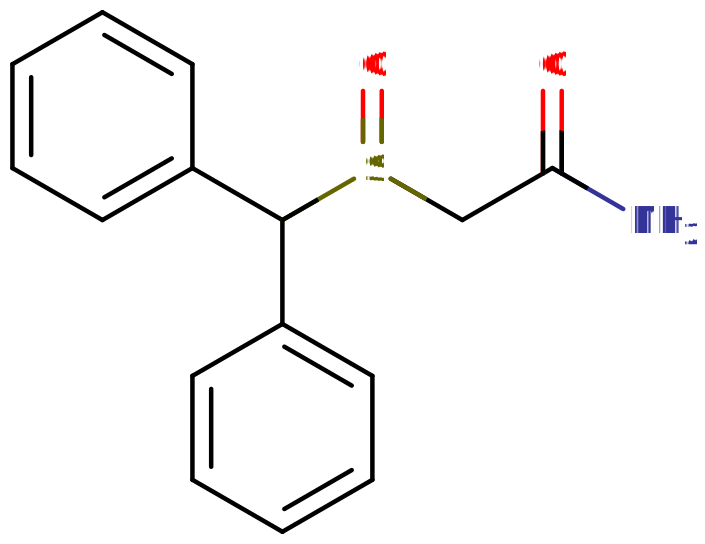

莫达非尼
[◀返回](index.md)

| 化学信息     | 莫达非尼（Modafinil）                                                       |
| ------------ | --------------------------------------------------------------------------- |
| 结构式       |                                                   |
| 分子式       | C15H15NO2S                                 |
| CAS 号       | 68693-11-8                                                                  |
| **化学命名** |                                                                             |
| 常用名称     | 莫达非尼, Modafinil, Alertec, Modavigil, Modiodal, Provigil, Modalert       |
| 取代名称     | Modafinil                                                                   |
| 系统名称     | 2-[(二苯甲基)亚硫酰基]乙酰胺                                                |
| **类别归属** |                                                                             |
| 精神药效分类 | [兴奋剂](../文档/药物分类/兴奋剂.md) / [促醒剂](../文档/药物分类/促醒剂.md) |
| 化学分类     | [二苯甲基类物质](../文档/药物分类/二苯甲基类物质.md)                        |
|              |                                                                             |

> **警告：** 由于个体体重、耐受性、代谢和个人敏感性的差异，请务必从低剂量开始。请参阅[伤害减少措施](../文档/负责任的用药索引页.md)部分。

| [**给药途径**](../文档/给药途径.md)    | ⇣ [口服](../文档/给药途径.md#口服) |
| -------------------------------------- | ---------------------------------- |
| **剂量**                               |                                    |
| [阈值](../文档/药物剂量分类.md#阈值)   | 25 mg                              |
| [轻微](../文档/药物剂量分类.md#轻微)   | 50 \~ 100 mg                       |
| [中等](../文档/药物剂量分类.md#中等)   | 100 \~ 200 mg                      |
| [强烈](../文档/药物剂量分类.md#强烈)   | 200 \~ 300 mg                      |
| \*[严重](../文档/药物剂量分类.md#严重) | 300 mg +                           |
| **药效时长**                           |                                    |
| [总时长](../文档/药效时长.md)          | 5 \~ 10 小时                       |
| [药效发作](../文档/药效时长.md)        | 20 \~ 60 分钟                      |
| [药效上升](../文档/药效时长.md)        | 20 \~ 60 分钟                      |
| [药效达峰](../文档/药效时长.md)        | 3.5 \~ 5 小时                      |
| [药效褪去](../文档/药效时长.md)        | 1 \~ 3 小时                        |
| [药效残余](../文档/药效时长.md)        | 2 \~ 6 小时                        |

> **免责声明：** 本站的剂量信息收集自用户经验和相关资源，仅供教学参考。这并不是用药建议，请务必与其他来源核实准确性。

**莫达非尼**（也以商品名 **Provigil**、**Alertec**、**Modavigil** 等为人所知）是一种[二苯甲基类物质](../文档/药物分类/二苯甲基类物质.md)的[促醒剂](../文档/药物分类/促醒剂.md)物质，使用后会产生[促进觉醒](../药效/清醒.md)和[兴奋剂](../文档/药物分类/兴奋剂.md)效应。在医疗和非医疗场景中，它常被用来增强认知、减轻疲劳以及提高警觉性。

莫达非尼已被美国食品药品监督管理局批准用于治疗阻塞性睡眠呼吸暂停、轮班工作睡眠障碍和发作性睡病。然而，研究表明莫达非尼在超说明书使用时，对于缓解抑郁症、双相情感障碍、帕金森病、季节性情感障碍、ADHD 以及其他以疲劳为症状的多种疾病也可能有用。

由于莫达非尼能够产生[躯体刺激](../药效/兴奋.md)，它也被各种运动员用作兴奋剂。最近，它作为一种用来[记忆增强](../药效/记忆增强.md)、抵制睡眠欲望或需求并提高整体工作效率的「[益智药](../文档/药物分类/益智药.md)」在主流人群中非常流行。

## 历史与文化

莫达非尼最初由神经生理学家 Michel Jouvet 教授和 Lafon 实验室在法国开发。莫达非尼起源于 20 世纪 70 年代后期发明的一系列二苯甲基亚硫酰基化合物，其中包括阿屈非尼，阿屈非尼于 1986 年在法国首次作为发作性睡病的实验性治疗药物提供。莫达非尼是阿屈非尼的主要代谢产物，其末端酰胺上缺少极性的 -OH 基团，活性与母体药物相似，但使用范围要广得多。自 1994 年起在法国以 Modiodal 为名销售，自 1998 年起在美国以 Provigil 为名作为处方药使用。

## 化学

莫达非尼是一种二苯甲基类的合成分子。二苯甲基化合物由两个苯环连接到一个碳分子上组成。莫达非尼被归类为亚硫酰基二苯甲基分子，因为它还包含一个亚硫酰基（一个硫分子与一个氧分子双键结合），连接在二苯甲基基团的碳上。从 R2 位置的这个硫基出发，一个乙酰胺基通过羰基连接到末端胺基上。莫达非尼在结构上类似于氟达非尼（Fluorafinil），那是另一种二苯甲基类兴奋剂。

虽然莫达非尼是外消旋混合物，但类似的药物[阿莫达非尼](阿莫达非尼.md)仅由莫达非尼的 (−)-(R)-对映异构体组成。莫达非尼是一种研究非常充分的化合物，已经开发并研究了许多衍生物。

## 试剂检测显色结果

想要知道一种物质是否可能是莫达非尼，可以使用试剂检测套件。将不同的试剂应用于同一种物质可能会引起特定的颜色变化。下表显示了莫达非尼在各种试剂检测（Marquis、Mecke、Mandelin、Liebermann 和 Froehde）中的预期颜色变化。

|  |
| :-------------------------------------------------------------------------------------------------------: |
|                                          莫达非尼的预期显色结果                                           |

试剂检测不能保证物质是纯的。要检测物质的纯度，可以考虑薄层色谱 (TLC) 或更复杂的测试，如气相色谱。

## 药理学

|  |
| :-------------------------------------------------------: |
|              (R,S)-莫达非尼的作用机制示意图               |

虽然莫达非尼及其 R-对映异构体[阿莫达非尼](阿莫达非尼.md)减少困倦的具体机制尚不完全清楚，但证据表明，这些药物通过直接或间接作用于睡眠/觉醒回路的许多组成部分来促进觉醒。莫达非尼和[阿莫达非尼](阿莫达非尼.md)被假设会抑制 [GABA](../文档/GABA.md) 并促进 [多巴胺](../文档/多巴胺.md)、[去甲肾上腺素](../文档/去甲肾上腺素.md)、[组胺](../文档/组胺.md) 以及下丘脑分泌素/食欲素的释放。

莫达非尼及其 R-对映异构体[阿莫达非尼](阿莫达非尼.md)会增加去甲肾上腺素 (NE) 和多巴胺 (DA)，这可能是通过阻断去甲肾上腺素和多巴胺再摄取转运体（分别为 NET 和 DAT）实现的。NE 在 α-肾上腺素受体上的作用和 DA 在多巴胺 D2 受体上的作用被认为有助于莫达非尼的促醒特性。食欲素是觉醒系统的关键组成部分；因此，假设莫达非尼对食欲素系统的作用可能有助于提高警觉性。此外，莫达非尼可能通过减少对组胺能神经元的 GABA 能抑制，或通过对食欲素能神经元的作用来间接增加组胺。组胺的增加可能有助于莫达非尼的促醒效果以及提高警觉性的潜力。

在缺乏多巴胺转运体 (DAT) 的基因工程小鼠中，莫达非尼缺乏促醒活性，这表明该活性是依赖于 DAT 的。然而，在大鼠中，莫达非尼的促醒作用与[苯丙胺](苯丙胺.md)不同，并不会被多巴胺受体拮抗剂氟哌啶醇降低。此外，α-甲基-对-酪氨酸（一种多巴胺合成抑制剂）会阻断苯丙胺的作用，但不会阻断莫达非尼诱导的运动活性。

## 主观效应

与[苯丙胺](苯丙胺.md)、[哌甲酯](哌甲酯.md)或[可卡因](可卡因.md)等传统兴奋剂相比，这种化合物诱发的体验远没有那么强烈，欣快感和娱乐性也较低。它更多地侧重于整体的[清醒感](../药效/清醒.md)和[动机增强](../药效/动机增强.md)。

> _**免责声明：** 下面列出的效应引用了 **[主观效应索引](../药效/index.md)** (SEI)，这是一个基于用户报告和分析的开放研究文献。因此，应该以健康的怀疑态度来看待它们。_

> _值得注意，这些效应不一定会以可预测或可靠的方式发生，尽管更高剂量更容易诱发全谱效应。同样，**不良反应** 随着剂量的增加而变得越来越可能，并可能包括 **成瘾、严重伤害或死亡** ☠。_

### **[躯体效应](../药效/躯体效应.md)** 

- **[兴奋](../药效/兴奋.md)** - 就其对用户身体能量水平的影响而言，莫达非尼通常被认为是具有刺激性和活力的，但与[苯丙胺](苯丙胺.md)相比，其刺激性要弱得多。这种刺激会鼓励身体运动和活动，如跑步、运动、社交和/或锻炼。莫达非尼呈现的特定刺激风格在剂量较高时可能导致咬紧牙关、磨牙或其他与传统兴奋剂相当的不自主运动，但与苯丙胺或可卡因相比，这些表现要不频繁且不强烈得多。
- **[心率增快](../药效/心率增快.md)**
- **[食欲抑制](../药效/食欲抑制.md)** - 上述成分通常还伴有食欲抑制，其强度通常比苯丙胺引起的食欲抑制要轻一些。
- **[脱水](../药效/脱水.md)** - 脱水和口干经常发生，这是因为参与体力活动的动力增加，以及注意力高度集中导致人忘记喝水。
- **[头痛](../药效/头痛.md)** - 在躯体不适方面，莫达非尼可能会引起头痛，尤其是如果你脱水、没吃东西，或者长时间保持尴尬的姿势专注于某项任务时。
- **[体味改变](../药效/体味改变.md)** - 莫达非尼可能会让人的尿液中带有一种非常明显的硫磺味。这可能是因为莫达非尼作为亚硫酰基二苯甲基类化学物质，其化学构成中含有硫。
- **[瞳孔扩大](../药效/瞳孔扩大.md)**
- **[畏光](../药效/畏光.md)** - 虽然不常见，但莫达非尼可能会导致暂时的畏光现象。
- **[头晕](../药效/头晕.md)**
- **[恶心](../药效/恶心.md)**
- **[腹泻](../药效/腹泻.md)**

### **[认知效应](../药效/认知效应.md)** 

- **[清醒感](../藥效/清醒度.md)** <!-- preserved original path if applicable -->
- **[专注力强化](../药效/专注力强化.md)**
- **[抑郁减轻](../药效/抑郁减轻.md)**
- **[思维加速](../药效/思维加速.md)**
- **[记忆增强](../药效/记忆增强.md)**
- **[动机增强](../药效/动机增强.md)**
- **[时间扭曲](../药效/时间扭曲.md)**
- **[情绪强化](../药效/情绪强化.md)** 或 **[情感抑制](../藥效/情感抑制.md)**
- **[焦虑](../药效/焦虑.md)** 或 **[焦虑抑制](../药效/焦虑抑制.md)**
- **[音乐欣赏能力增强](../药效/音乐欣赏能力增强.md)** - 虽然莫达非尼能够产生这种效应，但它不像传统[兴奋剂](../文档/药物分类/兴奋剂.md)或[共情剂](../文档/药物分类/共情剂.md)那样可靠。

### 体验报告

目前在我们的[体验索引](../文档/复现索引.md)中还没有描述该化合物效应的轶事报告。其他的体验报告可以在这里找到：

- [Erowid 体验库：莫达非尼](https://www.erowid.org/experiences/subs/exp_Modafinil.shtml)

## 毒性与危害潜力

莫达非尼作为定期使用药物的长期安全性和有效性尚未确定。

来自尝试过莫达非尼的人的轶事报告表明，仅仅尝试低到中等剂量的莫达非尼或偶尔使用它，似乎没有任何负面健康影响（但没有什么能完全保证）。

值得注意的是，由于该化合物是一种常用的处方药，它比典型的[研究用化学品](../文档/研究用化学品.md)更不容易产生不可预测的健康负面影响。尽管如此，如果使用该物质，强烈建议采取[伤害减少措施](../文档/负责任的用药索引页.md)。

### 致死剂量

未发现人类达到因莫达非尼导致 50% 受试者死亡的[半数致死剂量](<(../文档/药物过量.md#LD50)>) (LD50) 。在连续 7 到 21 天每天给予 1,000 mg 到 1,600 mg 莫达非尼的临床试验中，没有发生危及生命的效应。两名成人受试者故意急性过量服用 4,500 mg 和 4,000 mg，以及一名三岁儿童意外摄入 800 mg，均未导致任何危及生命的效应或死亡。一名 15 岁女性在自杀未遂中过量服用 5,000mg 莫达非尼后，报告了严重的[头痛](../藥效/頭痛.md)、[恶心](../药效/恶心.md)和[心率增快](../药效/心率增快.md)，但似乎没有任何致命或长期的影响。

### 耐受性与成瘾潜力

长期使用莫达非尼可被认为是不具成瘾性的，滥用潜力较低。它似乎不会在大多数用户中引起心理依赖。

对莫达非尼许多效应的耐受性会随着长期和反复使用而产生。这导致用户必须使用越来越大的剂量才能达到相同的效果。之后，在停止摄入的情况下，大约需要 3 \~ 7 天耐受性会降低到一半，1 \~ 2 周恢复到基线。莫达非尼可能与所有[二苯甲基类物质](../文档/药物分类/二苯甲基类物质.md)的[益智药](../文档/药物分类/益智药.md)存在交叉耐受，这意味着在消耗莫达非尼后，所有相关的促醒化合物如[阿莫达非尼](阿莫达非尼.md)和阿屈非尼都会表现出效果降低。

### 危险药物联用

**警告：** 许多本身可以安全使用的精神活性物质，在与某些其他物质联用时，可能会突然变得危险甚至危及生命。以下列表提供了一些已知的危险联用（但不保证包括所有联用）。

请务必进行独立研究（例如 Google, DuckDuckGo, PubMed）以确保两种或多种物质的组合可以安全食用。部分列出的联用信息来源于 TripSit。

- **[25x-NBOMe](25B-NBOH.md)** 和 **[25x-NBOH](25B-NBOH.md)** - 25x 类化合物具有高度刺激性，对身体压力很大。由于存在过度[兴奋](../药效/兴奋.md)和心脏负担的风险，应严格避免与莫达非尼联用。这可能导致[血压升高](../药效/血压升高.md)、[血管收缩](../药效/血管收缩.md)、惊恐发作、[思维循环](../药效/思维循环.md)、[癫痫发作](../藥效/癫痫发作.md)，极端情况下还会导致心力衰竭。
- **[酒精](酒精.md)** - 将酒精与[兴奋剂](../文档/药物分类/兴奋剂.md)联用是危险的，因为存在意外过度中毒的风险。兴奋剂会掩盖酒精的[抑制](../文档/药物分类/抑制剂.md)作用，而这正是大多数人用来评估自己醉酒程度的依据。一旦兴奋剂药效消失，抑制作用将失去抵消，这可能导致断片和严重的[呼吸抑制](../药效/呼吸抑制.md)。如果混合使用，用户应严格限制自己每小时仅饮用一定量的酒精。
- **[右美沙芬](右美沙芬.md)** - 应避免与右美沙芬联用，因为它对血清素和去甲肾上腺素的再摄取有抑制作用。与血清素释放剂（[MDMA](MDMA.md) 等）合用时，[惊恐发作](../药效/惊恐发作.md)和高血压危象或[血清素综合征](../文档/血清素综合征.md)的风险会增加。请仔细监测血压并避免剧烈的体力活动。
- **[MDMA](MDMA.md)** - 当存在其他[兴奋剂](../文档/药物分类/兴奋剂.md)时，MDMA 的任何神经毒性作用都可能增加。还存在血压过高和心脏负担（心脏毒性）的风险。
- **[MXE](MXE.md)** - 一些报告表明与 MXE 联用可能会危险地增加血压，并增加[躁狂](../藥效/躁狂.md)和[精神病发作](../藥效/精神病发作.md)的风险。
- **[解离剂](../文档/药物分类/解离剂.md)** - 这两类药物都有引起[妄想](../藥效/妄想.md)、[躁狂](../藥效/躁狂.md)和[精神病发作](../藥效/精神病发作.md)的风险，联用时这些风险可能会成倍增加。
- **[兴奋剂](../文档/药物分类/兴奋剂.md)** - 莫达非尼与其他[兴奋剂](../文档/药物分类/兴奋剂.md)（如[可卡因](可卡因.md)）联用可能是危险的，因为它们可以将[心率增快](../藥效/心率增快.md)和[血压升高](../藥效/血压升高.md)提高到危险水平。
- **[曲马多](曲马多.md)** - 已知曲马多会降低[癫痫发作](../藥效/癫痫发作.md)的阈值，与兴奋剂联用可能会进一步增加这种风险。
- **[单胺氧化酶抑制剂](../文档/单胺氧化酶抑制剂.md)** - 这种联用可能会使多巴胺等神经递质的量增加到危险甚至致命的水平。例子包括[骆驼蓬](骆驼蓬.md)、_banisteriopsis caapi_ 以及某些[抗抑郁药](../文档/抗抑郁药.md)。
- **激素避孕药** - 莫达非尼通过增加 CYP3A4/5 酶的活性，在服用后长达一个月的时间内会降低激素避孕药的有效性。值得注意的是，葡萄柚汁会抑制同一种酶。
- **CYP2C19 底物** - 莫达非尼可能会延长某些抗焦虑药物（如地西泮、普萘洛尔和氯米帕明）的消除时间，导致这些药物在系统中的暴露量更高。

虽然莫达非尼可能引起恶心和胃酸倒流，但不应与奥美拉唑（它是一种 CYP2C19 底物）一起服用。

## 法律地位

莫达非尼在全球范围内被合法批准用于医疗用途。然而，在大多数国家，如果没有处方，销售和持有都是非法的。

- **澳大利亚：** 莫达非尼在澳大利亚被列为附表 4（仅限处方）药物，可用于治疗睡眠呼吸暂停和发作性睡病。
- **奥地利：** 莫达非尼被归类为 NR（仅限处方，禁止重复调配）。
- **加拿大：** 莫达非尼在加拿大被列为附表 F 处方药，可用于人类和兽用。
- **德国：** 根据 AMVV 附件 1，莫达非尼是一种处方药。
- **俄罗斯联邦：** 莫达非尼被归类为附表 II 物质。
- **瑞士：** 莫达非尼被列为“Abgabekategorie B”药品，需要处方。
- **英国：** 莫达非尼在英国是获得许可的处方药 (POM) 。在没有有效处方的情况下持有该药物不属于刑事犯罪。该药物可以通过有效处方合法获得，或者通过 1968 年《药品法》第 13 条概述的合法进口供个人使用。
- **美国：** 在美国，莫达非尼是附表 IV 受控物质。如果没有处方或 DEA 执照，购买、销售或持有该药物都是非法的。

## 另见

- [伤害减少措施](../文档/负责任的用药索引页.md)
- [益智药](../文档/药物分类/益智药.md)
- [兴奋剂](../文档/药物分类/兴奋剂.md)
- [阿莫达非尼](阿莫达非尼.md)
- [咖啡因](咖啡因.md)

## 外部链接

- [莫达非尼 (维基百科)](http://en.wikipedia.org/wiki/Modafinil)
- [莫达非尼 (Erowid 库)](https://www.erowid.org/smarts/modafinil/)
- [莫达非尼 (Isomer Design)](https://isomerdesign.com/PiHKAL/explore.php?id=2978)
- [莫达非尼 (DrugBank)](https://go.drugbank.com/drugs/DB00745)
- [莫达非尼 (Drugs-Forum)](https://drugs-forum.com/wiki/Modafinil)

## 参考文献

[^1]: Provigal (Manufacturer's Website) | <http://www.provigil.com/>

[^2]: Fava, M., Thase, M. E., DeBattista, C., Doghramji, K., Arora, S., Hughes, R. J. (September 2007). "Modafinil augmentation of selective serotonin reuptake inhibitor therapy in MDD partial responders with persistent fatigue and sleepiness". Annals of Clinical Psychiatry: Official Journal of the American Academy of Clinical Psychiatrists. **19** (3): 153–159. [doi](http://en.wikipedia.org/wiki/Digital_object_identifier):[10.1080/10401230701464858](https://doi.org/10.1080%2F10401230701464858). [ISSN](http://en.wikipedia.org/wiki/International_Standard_Serial_Number) [1040-1237](https://www.worldcat.org/issn/1040-1237).

[^3]: Frye, M. A., Grunze, H., Suppes, T., McElroy, S. L., Keck, P. E., Walden, J., Leverich, G. S., Altshuler, L. L., Nakelsky, S., Hwang, S., Mintz, J., Post, R. M. (August 2007). "A placebo-controlled evaluation of adjunctive modafinil in the treatment of bipolar depression". The American Journal of Psychiatry. **164** (8): 1242–1249. [doi](http://en.wikipedia.org/wiki/Digital_object_identifier):[10.1176/appi.ajp.2007.06060981](https://doi.org/10.1176%2Fappi.ajp.2007.06060981). [ISSN](http://en.wikipedia.org/wiki/International_Standard_Serial_Number) [0002-953X](https://www.worldcat.org/issn/0002-953X).

[^4]: Vliet, S. A. M. van, Vanwersch, R. A. P., Jongsma, M. J., Gugten, J. van der, Olivier, B., Philippens, I. H. C. H. M. (September 2006). "Neuroprotective effects of modafinil in a marmoset Parkinson model: behavioral and neurochemical aspects". Behavioural Pharmacology. **17** (5–6): 453–462. [doi](http://en.wikipedia.org/wiki/Digital_object_identifier):[10.1097/00008877-200609000-00011](https://doi.org/10.1097%2F00008877-200609000-00011). [ISSN](http://en.wikipedia.org/wiki/International_Standard_Serial_Number) [0955-8810](https://www.worldcat.org/issn/0955-8810).

[^5]: Lundt, L. (August 2004). "Modafinil treatment in patients with seasonal affective disorder/winter depression: an open-label pilot study". Journal of Affective Disorders. **81** (2): 173–178. [doi](http://en.wikipedia.org/wiki/Digital_object_identifier):[10.1016/S0165-0327(03)00162-9](https://doi.org/10.1016%2FS0165-0327%2803%2900162-9). [ISSN](http://en.wikipedia.org/wiki/International_Standard_Serial_Number) [0165-0327](https://www.worldcat.org/issn/0165-0327).

[^6]: Biederman, J., Pliszka, S. R. (March 2008). "Modafinil improves symptoms of attention-deficit/hyperactivity disorder across subtypes in children and adolescents". The Journal of Pediatrics. **152** (3): 394–399. [doi](http://en.wikipedia.org/wiki/Digital_object_identifier):[10.1016/j.jpeds.2007.07.052](https://doi.org/10.1016%2Fj.jpeds.2007.07.052). [ISSN](http://en.wikipedia.org/wiki/International_Standard_Serial_Number) [1097-6833](https://www.worldcat.org/issn/1097-6833).

[^7]: <https://www.cyclingnews.com/news/clinger-given-two-year-suspension-for-doping>

[^8]: <https://web.archive.org/web/20120122061356/http://sportsillustrated.cnn.com/2006/baseball/mlb/03/06/news.excerpt/1.html>

[^9]: <https://journals.lww.com/acsm-msse/fulltext/2004/06000/effects_of_acute_modafinil_ingestion_on_exercise.23.aspx>

[^10]: <https://pubmed.ncbi.nlm.nih.gov/34632515>

[^11]: Ballas, C. A., Kim, D., Baldassano, C. F., Hoeh, N. (1 July 2002). "Modafinil: past, present and future". Expert Review of Neurotherapeutics. **2** (4): 449–457. [doi](http://en.wikipedia.org/wiki/Digital_object_identifier):[10.1586/14737175.2.4.449](https://doi.org/10.1586%2F14737175.2.4.449). [ISSN](http://en.wikipedia.org/wiki/International_Standard_Serial_Number) [1473-7175](https://www.worldcat.org/issn/1473-7175).

[^12]: De Risi, C., Ferraro, L., Pollini, G. P., Tanganelli, S., Valente, F., Veronese, A. C. (1 December 2008). ["Efficient synthesis and biological evaluation of two modafinil analogues"](https://www.sciencedirect.com/science/article/pii/S0968089608009772). Bioorganic & Medicinal Chemistry. **16** (23): 9904–9910. [doi](http://en.wikipedia.org/wiki/Digital_object_identifier):[10.1016/j.bmc.2008.10.027](https://doi.org/10.1016%2Fj.bmc.2008.10.027). [ISSN](http://en.wikipedia.org/wiki/International_Standard_Serial_Number) [0968-0896](https://www.worldcat.org/issn/0968-0896).

[^13]: Testdrugs (September 7, 2022). ["Modafinil Testdrugs.info Website"](https://app.testdrugs.info/substances/564). Testdrugs.

[^14]: Morrissette, D. A. (December 2013). ["Twisting the night away: a review of the neurobiology, genetics, diagnosis, and treatment of shift work disorder"](https://www.cambridge.org/core/product/identifier/S109285291300076X/type/journal_article). CNS Spectrums. **18** (s1): 42–54. [doi](http://en.wikipedia.org/wiki/Digital_object_identifier):[10.1017/S109285291300076X](https://doi.org/10.1017%2FS109285291300076X). [ISSN](http://en.wikipedia.org/wiki/International_Standard_Serial_Number) [1092-8529](https://www.worldcat.org/issn/1092-8529).

[^15]: Touitou, Y., Bogdan, A. (February 2007). ["Promoting adjustment of the sleep–wake cycle by chronobiotics"](https://linkinghub.elsevier.com/retrieve/pii/S0031938406003866). Physiology & Behavior. **90** (2–3): 294–300. [doi](http://en.wikipedia.org/wiki/Digital_object_identifier):[10.1016/j.physbeh.2006.09.001](https://doi.org/10.1016%2Fj.physbeh.2006.09.001). [ISSN](http://en.wikipedia.org/wiki/International_Standard_Serial_Number) [0031-9384](https://www.worldcat.org/issn/0031-9384).

[^16]: Darwish, M., Kirby, M., D’Andrea, D. M., Yang, R., Hellriegel, E. T., Robertson, P. (November 2010). ["Pharmacokinetics of armodafinil and modafinil after single and multiple doses in patients with excessive sleepiness associated with treated obstructive sleep apnea: A randomized, open-label, crossover study"](https://linkinghub.elsevier.com/retrieve/pii/S0149291810003711). Clinical Therapeutics. **32** (12): 2074–2087. [doi](http://en.wikipedia.org/wiki/Digital_object_identifier):[10.1016/j.clinthera.2010.11.009](https://doi.org/10.1016%2Fj.clinthera.2010.11.009). [ISSN](http://en.wikipedia.org/wiki/International_Standard_Serial_Number) [0149-2918](https://www.worldcat.org/issn/0149-2918).

[^17]: Erman, M. K., Yang, R., Seiden, D. J. (2012). "The effect of armodafinil on patient-reported functioning and quality of life in patients with excessive sleepiness associated with shift work disorder: a randomized, double-blind, placebo-controlled trial". The primary care companion for CNS disorders. **14** (4): PCC.12m01345. [doi](http://en.wikipedia.org/wiki/Digital_object_identifier):[10.4088/PCC.12m01345](https://doi.org/10.4088%2FPCC.12m01345). [ISSN](http://en.wikipedia.org/wiki/International_Standard_Serial_Number) [2155-7772](https://www.worldcat.org/issn/2155-7772).

[^18]: He, B., Peng, H., Zhao, Y., Zhou, H., Zhao, Z. (December 2011). ["Modafinil treatment prevents REM sleep deprivation-induced brain function impairment by increasing MMP-9 expression"](https://linkinghub.elsevier.com/retrieve/pii/S0006899311016581). Brain Research. **1426**: 38–42. [doi](http://en.wikipedia.org/wiki/Digital_object_identifier):[10.1016/j.brainres.2011.09.002](https://doi.org/10.1016%2Fj.brainres.2011.09.002). [ISSN](http://en.wikipedia.org/wiki/International_Standard_Serial_Number) [0006-8993](https://www.worldcat.org/issn/0006-8993).

[^19]: Udert, K. M., Larsen, T. A., Gujer, W. (1 December 2006). ["Fate of major compounds in source-separated urine"](https://iwaponline.com/wst/article/54/11-12/413/13916/Fate-of-major-compounds-in-sourceseparated-urine). Water Science and Technology. **54** (11–12): 413–420. [doi](http://en.wikipedia.org/wiki/Digital_object_identifier):[10.2166/wst.2006.921](https://doi.org/10.2166%2Fwst.2006.921). [ISSN](http://en.wikipedia.org/wiki/International_Standard_Serial_Number) [0273-1223](https://www.worldcat.org/issn/0273-1223).

[^20]: Banerjee, D., Vitiello, M. V., Grunstein, R. R. (1 October 2004). ["Pharmacotherapy for excessive daytime sleepiness"](https://www.sciencedirect.com/science/article/pii/S1087079204000243). Sleep Medicine Reviews. **8** (5): 339–354. [doi](http://en.wikipedia.org/wiki/Digital_object_identifier):[10.1016/j.smrv.2004.03.002](https://doi.org/10.1016%2Fj.smrv.2004.03.002). [ISSN](http://en.wikipedia.org/wiki/International_Standard_Serial_Number) [1087-0792](https://www.worldcat.org/issn/1087-0792).

[^21]: The National Library of Medicine - PROVIGIL | <http://dailymed.nlm.nih.gov/dailymed/lookup.cfm?setid=fd75a8a7-a8ab-4141-9af9-989a220b9c19>

[^22]: Neuman, G., Shehadeh, N., Pillar, G. (15 August 2009). ["Unsuccessful Suicide Attempt of a 15 Year Old Adolescent with Ingestion of 5000 mg Modafinil"](https://www.ncbi.nlm.nih.gov/pmc/articles/PMC2725258/). Journal of Clinical Sleep Medicine : JCSM : Official Publication of the American Academy of Sleep Medicine. **5** (4): 372–373. [ISSN](http://en.wikipedia.org/wiki/International_Standard_Serial_Number) [1550-9389](https://www.worldcat.org/issn/1550-9389).

[^23]: Talaie, H.; Panahandeh, R.; Fayaznouri, M. R.; Asadi, Z.; Abdollahi, M. (2009). "Dose-independent occurrence of seizure with tramadol". Journal of Medical Toxicology. **5** (2): 63–67. [doi](http://en.wikipedia.org/wiki/Digital_object_identifier):[10.1007/BF03161089](https://doi.org/10.1007%2FBF03161089). [eISSN](http://en.wikipedia.org/wiki/International_Standard_Serial_Number#Electronic_ISSN) [1937-6995](https://www.worldcat.org/issn/1937-6995). [ISSN](http://en.wikipedia.org/wiki/International_Standard_Serial_Number) [1556-9039](https://www.worldcat.org/issn/1556-9039). [OCLC](http://en.wikipedia.org/wiki/OCLC) [163567183](https://www.worldcat.org/oclc/163567183).

[^24]: Gillman, P. K. (2005). ["Monoamine oxidase inhibitors, opioid analgesics and serotonin toxicity"](<https://bjanaesthesia.org/article/S0007-0912(17)34956-5/fulltext>). British Journal of Anaesthesia. **95** (4): 434–441. [doi](http://en.wikipedia.org/wiki/Digital_object_identifier):[10.1093/bja/aei210](https://doi.org/10.1093%2Fbja%2Faei210). [eISSN](http://en.wikipedia.org/wiki/International_Standard_Serial_Number#Electronic_ISSN) [1471-6771](https://www.worldcat.org/issn/1471-6771). [ISSN](http://en.wikipedia.org/wiki/International_Standard_Serial_Number) [0007-0912](https://www.worldcat.org/issn/0007-0912). [OCLC](http://en.wikipedia.org/wiki/OCLC) [01537271](https://www.worldcat.org/oclc/01537271). [PMID](http://en.wikipedia.org/wiki/PubMed_Identifier) [16051647](https://www.ncbi.nlm.nih.gov/pubmed/16051647).

[^25]: Robertson, P (2002). "Effect of modafinil on the pharmacokinetics of ethinyl estradiol and triazolam in healthy volunteers". Clinical Pharmacology & Therapeutics. Springer Nature. **71** (1): 46–56. [doi](http://en.wikipedia.org/wiki/Digital_object_identifier):[10.1067/mcp.2002.121217](https://doi.org/10.1067%2Fmcp.2002.121217). [ISSN](http://en.wikipedia.org/wiki/International_Standard_Serial_Number) [0009-9236](https://www.worldcat.org/issn/0009-9236).

[^26]: Bailey, D. G.; Dresser, G.; Arnold, J. M. O. (2012-11-26). "Grapefruit-medication interactions: Forbidden fruit or avoidable consequences?". Canadian Medical Association Journal. Joule Inc. **185** (4): 309–316. [doi](http://en.wikipedia.org/wiki/Digital_object_identifier):[10.1503/cmaj.120951](https://doi.org/10.1503%2Fcmaj.120951). [ISSN](http://en.wikipedia.org/wiki/International_Standard_Serial_Number) [0820-3946](https://www.worldcat.org/issn/0820-3946).

[^27]: <https://www.rxlist.com/provigil-drug.htm>

[^28]: [Modafinil](https://en.wikipedia.org/w/index.php?title=Modafinil&oldid=1100020692)

[^29]: Rezeptverordnung | <https://www.ris.bka.gv.at/GeltendeFassung.wxe?Abfrage=Bundesnormen&Gesetzesnummer=10010358>

[^30]: National Association of Pharmacy Regulatory Authorities - Regulations Amending the Food and Drug Regulations (1184 — Modafinil) | <http://napra.ca/Content_Files/Files/FDR-Project1184-Modafinil-Oct122006.pdf>

[^31]: [AMVV - Verordnung über die Verschreibungspflicht von Arzneimitteln](https://www.gesetze-im-internet.de/amvv/BJNR363210005.html)

[^32]: ["Narcotics"](http://www.consultant.ru/cons/cgi/online.cgi?req=doc;base=LAW;n=142882;fld=134;dst=4294967295;rnd=0.8965571122244;from=141820-563).

[^33]: MHRA (April 3, 2013). ["MHRA license for Modafinil in UK"](http://www.mhra.gov.uk/home/groups/par/documents/websiteresources/con273748.pdf) (PDF). MHRA.

[^34]: ["Medicines Act 1968 Section 13"](http://www.legislation.gov.uk/ukpga/1968/67/section/13).

[^35]: Placement of Modafinil Into Schedule IV - U.S. Department of Justice | <http://www.deadiversion.usdoj.gov/fed_regs/rules/1999/fr0127.htm>
