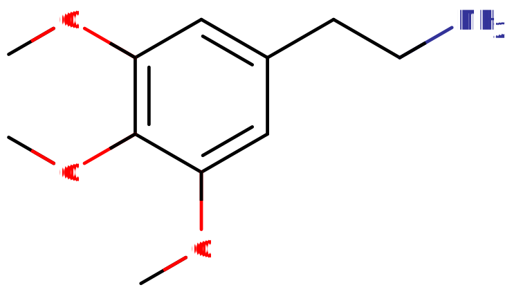

# 麦斯卡林

[◀返回](home.md)

| 化学信息     | 麦斯卡林                                           |
| ------------ | -------------------------------------------------- |
| 结构式       |             |
| 分子式       | C11H17NO3         |
| CAS 号       | 54-04-6                                            |
| **化学命名** |                                                    |
| 通俗名称     | 麦斯卡林, 佩奥特, 圣佩德罗, 仙人掌, 纽扣           |
| 取代名称     | 3,4,5-三甲氧基苯乙胺                               |
| 系统命名     | 2-(3,4,5-三甲氧基苯基)乙胺                         |
| **类别归属** |                                                    |
| 精神药效     | _[迷幻剂](../文档/药物分类/迷幻剂.md)_             |
| 化学分类     | _[苯乙胺类物质](../文档/药物分类/苯乙胺类物质.md)_ |

> **警告：** 由于个体体重、耐受性、代谢和个人敏感度的差异，请务必从小剂量开始。见[负责任的用药](../文档/负责任的用药索引页.md)。

| [**给药途径**](../文档/给药途径.md)             | ⇣ [口服](../文档/给药途径.md#口服) |
| ----------------------------------------------- | ---------------------------------- |
| **[给药剂量](../文档/给药剂量.md)**             |                                    |
| [阈值](../文档/药物剂量分类.md)                 | 50 mg                              |
| [轻微](../文档/药物剂量分类.md)                 | 50 \~ 200 mg                       |
| [中等](../文档/药物剂量分类.md)                 | 200 \~ 400 mg                      |
| [强烈](../文档/药物剂量分类.md)                 | 400 \~ 800 mg                      |
| [严重](../文档/药物剂量分类.md)                 | 800 mg+                            |
| **[药效时长](../文档/药效时长.md)**             |
| [总时长](../文档/药效时长.md)                   | 8 \~ 14 小时                       |
| [药效发作](../文档/药效时长.md)                 | 45 \~ 90 分钟                      |
| [药效上升](../文档/药效时长.md)                 | 60 \~ 120 分钟                     |
| [药效达峰](../文档/药效时长.md)                 | 4 \~ 6 小时                        |
| [药效褪去](../文档/药效时长.md)                 | 2 \~ 3 小时                        |
| [药效残余](../文档/药效时长.md)                 | 6 \~ 36 小时                       |
| **[药物联用](../文档/危险药物联用.md)**         |                                    |
| 5-MeO-xxT (5-甲氧基色胺类)                      | ⚠️ 谨慎联用                        |
| [大麻](大麻.md)                                 | ⚠️ 谨慎联用                        |
| [苯丙胺类](苯丙胺.md)                           | ⚠️ 谨慎联用                        |
| 可卡因                                          | ⚠️ 谨慎联用                        |
| [单胺氧化酶抑制剂](../文档/单胺氧化酶抑制剂.md) | ⚠️ 谨慎联用                        |
| 曲马多                                          | 💔 联用危险                        |
| αMT                                             | ⚠️ 谨慎联用                        |

**麦斯卡林**（也称 **3,4,5-三甲氧基苯乙胺**）是一种天然存在的经典[迷幻剂](../文档/药物分类/迷幻剂.md)，属于[苯乙胺类物质](../文档/药物分类/苯乙胺类物质.md)。[^1] 它天然存在于佩奥特仙人掌 (_Lophophora williamsii_)、[^2] 圣佩德罗仙人掌 (_Echinopsis pachanoi_)、[^3] 秘鲁火炬仙人掌 (_Echinopsis peruviana_) 以及仙人掌科植物和豆科植物家族中。[^4] 它是已知最古老的[致幻剂](../文档/药物分类/迷幻剂.md)之一，也是迷幻苯乙胺类物质的母体化合物，后者是迷幻化合物的两大主要子类之一（另一种是[色胺类物质](../文档/药物分类/迷幻剂.md)）。

麦斯卡林于 1897 年由德国化学家亚瑟·赫夫特（Arthur Heffter）首次从佩奥特仙人掌中分离出来。[^5] 墨西哥的美洲原住民仪式性使用佩奥特仙人掌已有至少 5700 年的历史，其他含有麦斯卡林的仙人掌（如圣佩德罗）在南美大陆（从秘鲁到厄瓜多尔）也有悠久的使用历史。[^6] 麦斯卡林是美国化学家亚历山大·舒尔金（Alexander Shulgin）毕生工作的重要组成部分，他以此为起点合成了数十种新型迷幻化合物，这些化合物记录在他 1991 年出版的《PiHKAL》（“我所知和喜爱的苯乙胺类”）一书中。[^7]

[主观效应](../药效/home.md)包括[睁眼和闭眼视觉效果](../药效/视觉效应.md)、[时间扭曲](../药效/认知效应.md)、[内省增强](../药效/认知效应.md)、[概念性思维](../药效/认知效应.md)、[欣快感](../药效/躯体欣快感.md)和[自我迷失](../药效/认知效应.md)。麦斯卡林通常被认为是最温和、最具洞察力和最令人欣快的迷幻剂之一。众所周知，它比[赛洛西宾](4-HO-MET.md)（注：此处原文为psilocybin，指向同类色胺）或[DMT](DMT.md)等[色胺类迷幻剂](../文档/药物分类/迷幻剂.md)更强调身体和触觉感受（有时被比作[MDMA](MDMA.md)），后者的思维空间往往更狂乱，[视觉几何](../药效/视觉效应.md)更具动态。由于其醇厚、有机而又复杂的特性，它被认为是迷幻治疗的最佳药物之一。合成麦斯卡林受到鉴赏家的高度追捧，但由于其效力低且生产成本相对较高，通常只有限量生产。

与其他被严厉禁止的物质不同，麦斯卡林尚未被证明具有生理毒性或成瘾性。[^8] 然而， 焦虑 、 妄想 、 错觉和精神病等不良心理反应仍然可能发生，尤其是在那些易患精神疾病的人群中。 [^9] 此外，还应注意，在街头市场，“麦司卡林”或“合成麦司卡林”等术语通常被用作其他迷幻剂（例如 2C-x 、 DOx 或 25x-NBOMe ）的欺骗性标签，而这些致幻剂通常更危险。如果使用这些物质，强烈建议采用减害措施。

## 历史与文化

墨西哥的美洲原住民仪式性使用佩奥特仙人掌已有至少 5700 年的历史。早期接触后，欧洲人注意到了佩奥特在美洲原住民宗教仪式中的使用。此外，其他含有麦斯卡林的仙人掌（如圣佩德罗）在南美大陆也有悠久的使用历史，范围从秘鲁到厄瓜多尔。[^6] 佩奥特和圣佩德罗中的主要精神活性成分麦斯卡林，于 1897 年由德国化学家亚瑟·赫夫特首次分离并鉴定，[^5] 并于 1919 年由 Ernst Späth 首次合成。[^10] 它是西方知识分子（如奥尔德斯·赫胥黎）最早尝试的迷幻剂之一，赫胥黎在 1954 年的文章《知觉之门》中著名地描述了它的效果。

在传统的佩奥特制备中，仙人掌的顶部在地面处被切下，留下巨大的主根生长新的“头”。这些“头”然后被干燥制成圆盘状的纽扣，咀嚼这些纽扣以产生效果，或浸泡在水中饮用。在现代，使用者通常会将其研磨成粉末并装入胶囊中，以避免接触仙人掌的苦味。常用的人类剂量为 200–400 毫克硫酸麦斯卡林或 178–356 毫克盐酸麦斯卡林。[^7] 平均 76 毫米（3.0 英寸）的纽扣含有约 25 毫克麦斯卡林。[^11]

麦斯卡林是迷幻化学家和研究员亚历山大·舒尔金毕生工作的重要组成部分。舒尔金以麦斯卡林为起点，合成了数十种新型迷幻苯乙胺化合物，如 [2C-x](2C-B.md) 和 [DOx](DOM.md) 系列。它是所谓的“神奇半打”的一员，这指的是舒尔金自评的最重要的具有迷幻活性的苯乙胺化合物，除了麦斯卡林外，所有这些化合物都是他自己开发和合成的。它们在《PiHKAL》的第一本书中被发现，分别是：麦斯卡林、[DOM](DOM.md)、[2C-B](2C-B.md)、[2C-E](2C-B.md)（注：原文链接至2C-E，此处指向同类）、2C-T-2 和 2C-T-7。[^12]

## 化学

麦斯卡林，即 3,4,5-三甲氧基苯乙胺，是一种取代[苯乙胺类物质](../文档/药物分类/苯乙胺类物质.md)，其特征是苯环通过乙基链与氨基 -NH2 结合。麦斯卡林含有三个甲氧基官能团 CH3O-，分别连接在苯环的 R3、R4 和 R5 碳上。

麦斯卡林有许多结构类似物，包括但不限于：普罗斯卡林 (Proscaline)、爱斯卡林 (Escaline) 和甲基爱斯卡林 (Methallylescaline)。它也是 [2C-x](2C-B.md) 和 [DOx](DOM.md) 系列迷幻苯乙胺的合成起点。像 [2C-B](2C-B.md)（也称为溴麦斯卡林）这样的 2C-x 化合物会产生类似麦斯卡林的迷幻效果，但效力更强，持续时间更短。DOx 化合物（例如 [DOM](DOM.md)、[DOB](DOM.md)）具有显着延长的持续时间和更多的兴奋剂效果。

## 药理学

更多信息：[迷幻剂](../文档/药物分类/迷幻剂.md)

麦斯卡林的作用与其他迷幻剂相似。[^13] 它以高亲和力结合并激活血清素 5-HT2A 受体。[^14] 激活 5-HT2A 受体如何导致迷幻状态尚不清楚，但它可能以某种方式涉及前额叶皮层神经元的兴奋。[^15] 众所周知，麦斯卡林还会结合并激活血清素 5-HT2C 受体。[^16]

## 主观效应

_**免责声明：** 以下列出的效果引用自[**主观效应索引**](../文档/科学信息索引页.md) (**SEI**)，这是一个基于轶事用户报告和 [PsychonautWiki](https://psychonautwiki.org) 贡献者个人分析的开放研究文献。因此，应以健康的怀疑态度看待这些内容。_

_值得注意的是，这些效果不一定会以可预测或可靠的方式发生，尽管较高的剂量更可能诱发全方位的效果。同样，**不良反应**随着剂量的增加而变得越来越可能，并且可能包括**成瘾、严重伤害或死亡** ☠。_

### **[躯体效应](../药效/躯体效应.md)** 

- **[兴奋](../药效/兴奋.md)** - 麦斯卡林通常被认为是非常充满活力和令人兴奋的，而且不会感到强迫。例如，在任何环境中服用时，它通常会鼓励身体活动，如跑步、散步、登山或跳舞。相比之下，其他更常用的迷幻剂如[赛洛辛](4-HO-MET.md)通常具有镇静和放松作用。
- **[自发躯体感觉](../药效/躯体效应.md)** - 麦斯卡林的“躯体快感”可以描述为与其伴随的视觉和认知效果成比例的强烈。它以多种形式表现出来，包括一种强烈的柔软、温暖的光辉，在身体上蔓延，并且能够变得极度[躯体欣快](../药效/躯体欣快感.md)。这与 [MDMA](MDMA.md) 和[赛洛辛](4-HO-MET.md)最相似，并且在整个体验过程中持续表现出来。与之形成对比的是一种极其愉悦但尖锐、寒冷的电流刺痛感，在身体上下移动。这与 [LSD](LSD.md) 最相似，并且也在整个体验过程中持续表现出来。在整个体验过程中注意到的最后一种躯体效应是一种强烈的能量针刺感，表现为一种不断变化和刺痛的感觉，以自发的波浪形式在身体上下移动。这与 [2C-B](2C-B.md) 最相似，但在整个体验过程中并不完全一致。
- **[躯体欣快感](../药效/躯体欣快感.md)** - 与其他迷幻剂相比，麦斯卡林因其躯体或身体上的欣快方面而著称，这隐约让人想起其他[苯乙胺类物质](../文档/药物分类/苯乙胺类物质.md)，如 [MDA](MDA.md)。
- **[恶心](../药效/恶心.md)** - 在中高剂量服用时通常会报告恶心，一旦使用者呕吐，恶心就会立即消失，或者随着药效达峰而自行逐渐消退。
- **[唾液分泌增加](../药效/躯体效应.md)** - 这种效应虽然不常见，但似乎比赛洛辛和其他色胺类物质更不明显，通常不会持续整个体验过程。
- **[触觉增强](../药效/触觉效应.md)** - 增强的触觉感受在中等水平上持续存在。如果达到 [8A 级几何](../药效/视觉效应.md)，一种突然意识到并能够一次性感觉到全身每一根神经末梢的强烈感觉会持续存在。
- **[食欲抑制](../药效/食欲抑制.md)**
- **[躯体控制增强](../药效/躯体控制增强.md)**
- **[耐力增强](../药效/耐力增强.md)**
- **嗅觉增强**
- **[尿频](../药效/尿频.md)**
- **[心率增快](../药效/心率增快.md)**
- **[性欲增强](../药效/性欲增强.md)**
- **[肌肉颤动](../药效/肌肉颤动.md)**
- **[瞳孔扩大](../药效/瞳孔扩大.md)**
- **[癫痫发作](../药效/癫痫发作.md)** - 这是一种罕见的效应，但被认为可能发生在有易感体质的人身上，特别是在身体负担重的情况下，如脱水、疲劳、营养不良或过热。

### **[视觉效应](../药效/视觉效应.md)** 

#### 增强

- **[颜色增强](../药效/颜色增强.md)**
- **[模式识别增强](../药效/模式识别增强.md)**
- **[视觉锐度增强](../药效/视觉锐度增强.md)**

#### 扭曲

- **[漂移](../药效/漂移.md)** _([融化](../药效/漂移.md)、[流动](../药效/漂移.md)、[呼吸](../药效/漂移.md)和[变形](../药效/漂移.md))_ - 与其他迷幻剂相比，这种效果可以描述为细节高度丰富、运动缓慢而平滑、外观静止且风格写实。
- **[残影](../药效/残影.md)**
- **[颜色偏移](../药效/颜色偏移.md)**
- **[递归](../药效/视觉效应.md)**
- **[风景切片](../药效/视觉效应.md)**
- **[对称纹理重复](../药效/视觉效应.md)**
- **[示踪现象](../药效/视觉效应.md)**

### **[视觉效应](../药效/视觉效应.md)** 

麦斯卡林产生的视觉几何形状可以描述为与[死藤水](死藤水.md)、[2C-P](2C-B.md) 或[赛洛辛](4-HO-MET.md)的外观相似，因为它的几何形状在组织结构上很有条理，而且风格自然有机。然而，就其明亮的颜色、锋利的边缘和棱角分明的角落而言，它更类似于 [LSD](LSD.md)、[2C-B](2C-B.md) 和 [2C-I](2C-B.md)。

这种几何形状可以综合描述为：

- **[几何风格有机](../药效/视觉效应.md)**
- **[外观既抽象又算法化](../药效/视觉效应.md)**
- **[复杂性错综复杂](../药效/视觉效应.md)**
- **[组织结构化](../药效/视觉效应.md)**
- **[速度快](../药效/视觉效应.md)**
- **[运动平滑](../药效/视觉效应.md)**
- **[外观大小均等](../药效/视觉效应.md)** - 它具有可变的大小，会在大和小之间自发变化。
- **[配色多彩](../药效/视觉效应.md)**
- **[颜色有光泽](../药效/视觉效应.md)**
- **[角落锋利且棱角分明](../药效/视觉效应.md)**
- **[8B 级](../药效/视觉效应.md)** - 虽然麦斯卡林产生的几何形状尚未完全定性，但它散发出某些属性，这使得在高剂量下更有可能产生 [8A 级](../药效/视觉效应.md)视觉几何形状，而不是 [8B 级](../药效/视觉效应.md)。

#### 幻觉状态

麦斯卡林能够产生全方位的高级幻觉状态，其方式比许多其他常用迷幻剂更一致和可重复。

- **[转化](../药效/视觉效应.md)**
- **[内部幻觉](../药效/视觉效应.md)** (_[自主实体](../药效/视觉效应.md)_；_[环境、风景和景观](../药效/视觉效应.md)_；*[透视幻觉](../药效/视觉效应.md)*和*[场景和情节](../药效/视觉效应.md)*) - 与 [LSD](LSD.md) 等其他迷幻剂相比，麦斯卡林产生大量嵌入视觉[几何](../药效/视觉效应.md)中的幻觉。这种特殊效果通常包含带有场景、环境、概念和[自主实体接触](../药效/视觉效应.md)的幻觉。它们在黑暗环境中更常见，可以描述为可信度高、风格互动，并且在整体主题上几乎完全是个人的、宗教的、精神的、科幻的、奇幻的、超现实的、荒谬的或超验的性质。
- **[外部幻觉](../药效/视觉效应.md)** (_[自主实体](../药效/视觉效应.md)_；_[环境、风景和景观](../药效/视觉效应.md)_；*[透视幻觉](../药效/视觉效应.md)*和*[场景和情节](../药效/视觉效应.md)*)

### **[认知效应](../药效/认知效应.md)** 

- 与其他迷幻剂如[赛洛辛](4-HO-MET.md)、[LSA](lsa.md)和[死藤水](死藤水.md)相比，麦斯卡林在产生的特定思维流风格方面更具刺激性和快节奏，并且包含大量潜在效果。

- **[分析增强](../药效/认知效应.md)** - 这种效果在其表现上是一致的，并且以外省为主导。
- **[认知欣快](../药效/认知效应.md)**
- **[概念性思维](../药效/认知效应.md)**
- **[创造力增强](../药效/认知效应.md)**
- **[妄想](../药效/认知效应.md)**
- **[情绪增强](../药效/认知效应.md)**
- **[共情、爱和社交能力增强](../药效/认知效应.md)** - 这通常被报告为与 [MDMA](MDMA.md) 或 [MDA](MDA.md) 等其他常用[共情剂](../文档/药物分类/苯乙胺类物质.md)相似，但不那么突出。
- **情绪正常化** - 当一到三个剂量与心理治疗方案相结合时，所有经典迷幻剂都会强烈地表现出这种效果。比较荟萃分析时，迷幻心理疗法在几种心理健康问题上的表现大大优于“金标准”治疗。
- **[专注力增强](../药效/认知效应.md)** - 这种效果仅在低剂量或阈值剂量下体验到，并且感觉不像传统兴奋剂那样强迫或尖锐。
- **[沉浸感增强](../药效/认知效应.md)**
- **[音乐欣赏增强](../药效/认知效应.md)**
- **[记忆抑制](../药效/认知效应.md)**
- **[自我死亡](../药效/认知效应.md)** - 与其他更常见的迷幻剂（如[赛洛辛](4-HO-MET.md)或 [LSD](LSD.md)）相比，此成分不太一致且较难获得。就麦斯卡林而言，这种效果高度依赖于剂量，也相当取决于个人的[情景与心境](../文档/情景与心境.md)。
- **[动机增强](../药效/动机增强.md)** - 这种效果感觉不像传统[兴奋剂](../文档/药物分类/兴奋剂.md)那样强迫或突出。
- **[新奇感增强](../药效/认知效应.md)**
- **[个人偏见抑制](../药效/认知效应.md)**
- **[个人意义增强](../药效/认知效应.md)**
- **[自主声音交流](../药效/认知效应.md)** - 与[DMT](DMT.md)及其相关类似物等色胺类物质相比，这种效果通常被报告为温和。
- **[易受暗示性增强](../药效/认知效应.md)**
- **[思维加速](../药效/认知效应.md)**
- **[思维连通性](../药效/认知效应.md)** - 由于其大部分清醒的头脑空间，此成分相对于[赛洛西宾](4-HO-MET.md)而言明显不那么强烈。
- **[思维循环](../药效/认知效应.md)**
- **[时间扭曲](../药效/认知效应.md)**
- **[兴奋](../药效/兴奋.md)**

### **[听觉效应](../药效/听觉效应.md)** 

- **[增强](../药效/听觉效应.md)**
- **[扭曲](../药效/听觉效应.md)**
- **[幻觉](../药效/听觉效应.md)**

### **[多感官效应](../药效/多感官效应.md)** \*\*

- **[联觉](../药效/视觉效应.md)** - 在其最充分的表现形式中，这是一种非常罕见且不可复制的效果。增加剂量可以增加这种情况发生的可能性，但似乎只是那些已经具有联觉状态倾向的人体验的重要部分。

### **[超个人效应](../药效/超个人效应.md)** 

- **[灵性增强](../药效/认知效应.md)**
- **[存在主义自我实现](../药效/认知效应.md)** - 这种效果通常在高剂量下更为普遍，但也可以在中等剂量下发生。对于许多使用者来说，这种效果的可重复性不如传统[色胺类物质](../文档/药物分类/迷幻剂.md)（如[赛洛辛](4-HO-MET.md)）。
- **[统一和相互联系](../药效/认知效应.md)**

### 体验报告

描述此化合物在我们[体验索引](../报告/psychounautwiki/home.md)中效果的轶事报告包括：

- [体验:45cm x 4.5cm 圣佩德罗仙人掌](../报告/psychounautwiki/Experience:45cm_x_4.5cm_San_Pedro_Cactus.md)

更多体验报告可以在这里找到：

- [Erowid Experience Vaults: Mescaline](https://erowid.org/experiences/subs/exp_Mescaline.shtml)

## 天然来源

开花的圣佩德罗，一种已被使用了 3000 多年的致幻仙人掌[^17]

- _Lophophora williamsii_ (_佩奥特_), 麦斯卡林 0.4%[^18] - 麦斯卡林 3-6%[^18] [^19]
- _Lophophora diffusa_ 大麦芽碱 (Hordenine) 0.5% 总生物碱, N-甲基酪胺 0.1% 总生物碱, 麦斯卡林 (痕量) [^19]
- _Echinopsis pachanoi_ (异名 _Trichocereus pachanoi_), 麦斯卡林 0.006-0.12%, 平均 0.05%[^20] - 麦斯卡林 0.01%-2.375%[^20]
- _Echinopsis peruviana_ (异名 _Trichocereus peruvianus_), 麦斯卡林 0.0005%-0.12%[^20]
- _Echinopsis lageniformis_ (异名 _Trichocereus bridgesii_ 又名 _玻利维亚火炬_), 麦斯卡林 0.025%,[^21] 也是 3,4-二甲氧基苯乙胺 1%, 3-甲氧基酪胺 1%, 酪胺 1% - 麦斯卡林 2%[^22]
- _Echinopsis scopulicola_ (异名 _Trichocereus scopulicola_), 麦斯卡林[^18]
- _Echinopsis spachiana_ (异名 _Trichocereus spachianus_), 麦斯卡林[^18] - 麦斯卡林[^18]
- _Echinopsis macrogona_ (异名 _Trichocereus macrogonus_), 麦斯卡林 0.01-0.05%[^21]
- _Echinopsis tacaquirensis_ 亚种 _taquimbalensis_ (异名 _Trichocereus taquimbalensis_),[^23] 0.005-0.025% 麦斯卡林[^21]
- _Echinopsis terscheckii_ (异名 _Trichocereus terscheckii_, _Trichocereus werdemannianus_)[^24] 麦斯卡林 0.005-0.025%[^21] - 麦斯卡林 0.01%-2.375%[^20]
- _Echinopsis valida_, 麦斯卡林 0.025%[^18]
- _Opuntia acanthocarpa_, 麦斯卡林[^18]
- _Opuntia basilaris_, 麦斯卡林 0.01%, 加上 4-羟基-3-5-二甲氧基苯乙胺[^18]
- _Austrocylindropuntia cylindrica_ (异名 _Opuntia cylindrica_)[^25] 麦斯卡林[^18]
- _Cylindropuntia echinocarpa_ (异名 _Opuntia echinocarpa_), 麦斯卡林 0.01%, 3-4-二甲氧基苯乙胺 0.01%, 4-羟基-3-5-二甲氧基苯乙胺 0.01%[^18]
- _Cylindropuntia spinosior_ (异名 _Opuntia spinosior_), 麦斯卡林 0.00004% [^26] 麦斯卡林 0.00004%, 3-甲氧基酪胺 0.001%, 酪胺 0.002%, 3-4-二甲氧基苯乙胺。[^18]
- _Pelecyphora aselliformis_, 大麦芽碱, 麦斯卡林 (痕量) [^19]

## 毒性与伤害潜能

更多信息：[负责任的用药](../文档/负责任的用药索引页.md)

娱乐性麦斯卡林使用的毒性和长期健康影响似乎尚未在任何科学背景下进行过研究，确切的中毒剂量尚不清楚。然而，科学文献中没有已知的致命过量案例。

轶事报告表明，仅仅以低到中等剂量单独尝试麦斯卡林并且非常节制地使用（但没有任何事情可以完全保证），没有归因于此的负面健康影响。

始终应进行[独立研究](https://www.google.com/)以确保两种或多种物质的组合在食用前是安全的。

强烈建议在使用此物质时采取[伤害减少措施](../文档/负责任的用药索引页.md)。

### 依赖性与滥用潜能

麦斯卡林不会形成习惯，使用的欲望实际上可能会随着使用而减少。它通常是自我调节的。

对麦斯卡林效果的耐受性在摄入后几乎立即建立。在那之后，耐受性需要大约 3 天才能减少到一半，7 天才能恢复到基线（在没有进一步摄入的情况下）。麦斯卡林与所有[迷幻剂](../文档/药物分类/迷幻剂.md)均表现出交叉耐受性，这意味着在食用麦斯卡林后，所有迷幻剂的效果都会降低。[^27]

### 危险药物联用

**_警告：_** _许多精神活性物质单独使用时相当安全，但与某些其他物质结合使用时可能会突然变得危险甚至危及生命。以下列表列出了一些已知的危险相互作用（尽管不保证包含所有相互作用）。_

_始终进行独立研究（例如 [Google](https://www.google.com)、[DuckDuckGo](https://www.duckduckgo.com)、[PubMed](https://pubmed.ncbi.nlm.nih.gov/)）以确保两种或多种物质的组合可以安全食用。列出的一些相互作用来源于 [TripSit](https://combo.tripsit.me)。_

- **5-MeO-xxT (5-甲氧基色胺类)** - 5-MeO 类色胺的相互作用可能不可预测。
- **[大麻](大麻.md)** - 大麻与迷幻剂具有出乎意料的强烈且有些不可预测的协同作用。
- **[苯丙胺类](苯丙胺.md)** - 兴奋剂引起的注意力和焦虑会被迷幻剂放大，导致思维循环的风险增加。
- **可卡因** - 兴奋剂引起的注意力和焦虑会被迷幻剂放大，导致思维循环的风险增加。
- **[单胺氧化酶抑制剂](../文档/单胺氧化酶抑制剂.md)**
- **曲马多** - 这种组合可能会因曲马多降低癫痫阈值以及麦斯卡林可能引起癫痫发作而导致癫痫发作。
- **αMT**

## 法律地位

另见：[迷幻仙人掌 § 法律地位](../文档/药物分类/home.md)

## 另见

- [迷幻剂](../文档/药物分类/迷幻剂.md)
- [苯乙胺类物质](../文档/药物分类/苯乙胺类物质.md)
- [佩奥特 (Peyote)](../文档/药物分类/home.md)
- [圣佩德罗 (San Pedro)](../文档/药物分类/home.md)

## 外部链接

- [Mescaline - Wikipedia](https://en.wikipedia.org/wiki/Mescaline)
- [Mescaline - Erowid Vault](https://www.erowid.org/chemicals/mescaline/)
- [Mescaline - PiHKAL](https://erowid.org/library/books_online/pihkal/pihkal096.shtml)

## 参考文献

[^1]: [Nichols, David E.](https://psychonautwiki.org/wiki/David_E._Nichols) (2016). Barker, Eric L., ed. ["Psychedelics"](https://www.ncbi.nlm.nih.gov/pmc/articles/PMC4813425). Pharmacological Reviews. **68** (2): 264–355. [doi](http://en.wikipedia.org/wiki/Digital_object_identifier):[10.1124/pr.115.011478](https://doi.org/10.1124%2Fpr.115.011478) [eISSN](http://en.wikipedia.org/wiki/International_Standard_Serial_Number#Electronic_ISSN) [1521-0081](https://www.worldcat.org/issn/1521-0081). [ISSN](http://en.wikipedia.org/wiki/PubMed_Central) [0031-6997](https://www.worldcat.org/issn/0031-6997). [OCLC](http://en.wikipedia.org/wiki/OCLC) [00824083](https://www.worldcat.org/oclc/00824083). [PMC](http://en.wikipedia.org/wiki/PubMed_Central) [4813425](https://www.ncbi.nlm.nih.gov/pmc/articles/PMC4813425) [PMID](http://en.wikipedia.org/wiki/PubMed_Identifier) [26841800](https://www.ncbi.nlm.nih.gov/pubmed/26841800).

[^2]: Drug Identification Bible. Grand Junction, CO: Amera-Chem. 2007. [ISBN](http://en.wikipedia.org/wiki/International_Standard_Book_Number) [0-9635626-9-X](http://en.wikipedia.org/wiki/Special:BookSources/0-9635626-9-X). [OCLC](http://en.wikipedia.org/wiki/OCLC) [180867436](https://www.worldcat.org/oclc/180867436).

[^3]: Crosby, D. M.; McLaughlin, J. L. (1973). ["Cactus Alkaloids. XIX. Crystallization of Mescaline HCl and 3-Methoxytyramine HCl from Trichocereus pachanoi"](http://catbull.com/alamut/Bibliothek/1973_d.m._crosby_8158_1.pdf) (PDF). Lloydia. **36** (4): 416–418. [ISSN](http://en.wikipedia.org/wiki/International_Standard_Serial_Number) [0024-5461](https://www.worldcat.org/issn/0024-5461). [OCLC](http://en.wikipedia.org/wiki/OCLC) [1606095](https://www.worldcat.org/oclc/1606095). [PMID](http://en.wikipedia.org/wiki/PubMed_Identifier) [4773270](https://www.ncbi.nlm.nih.gov/pubmed/4773270).

[^4]: Forbes, T. D. A.; Clement, B. A. (1998). ["Chemistry of Acacia's from South Texas"](http://catbull.com/alamut/Bibliothek/chem%20of%20texas%20acacias.pdf) (PDF). Uvalde, Texas: Texas A&M Agricultural Research and Extension Center.

[^5]: ["Arthur Heffter"](https://www.erowid.org/culture/characters/heffter_arthur/heffter_arthur.shtml). Erowid Character Vaults. August 9, 1998. Retrieved September 30, 2020.

[^6]: El-Seedi, H. R.; De Smet, P. A. G. M.; Beck, O.; Possnert, G.; Bruhn, J. G. (2005). "Prehistoric peyote use: Alkaloid analysis and radiocarbon dating of archaeological specimens of Lophophora from Texas". Journal of Ethnopharmacology. **101** (1–3): 238–242. [doi](http://en.wikipedia.org/wiki/Digital_object_identifier):[10.1016/j.jep.2005.04.022](https://doi.org/10.1016%2Fj.jep.2005.04.022). [eISSN](http://en.wikipedia.org/wiki/International_Standard_Serial_Number#Electronic_ISSN) [1872-7573](https://www.worldcat.org/issn/1872-7573). [ISSN](http://en.wikipedia.org/wiki/International_Standard_Serial_Number) [0378-8741](https://www.worldcat.org/issn/0378-8741). [OCLC](http://en.wikipedia.org/wiki/OCLC) [04649997](https://www.worldcat.org/oclc/04649997). [PMID](http://en.wikipedia.org/wiki/PubMed_Identifier) [15990261](https://www.ncbi.nlm.nih.gov/pubmed/15990261).

[^7]: [Alexander Shulgin](https://psychonautwiki.org/wiki/Alexander_Shulgin); Ann Shulgin (1991). ["\#96. M"](https://erowid.org/library/books_online/pihkal/pihkal096.shtml). [PiHKAL: A Chemical Love Story](https://psychonautwiki.org/wiki/PiHKAL). United States: Transform Press. [ISBN](http://en.wikipedia.org/wiki/International_Standard_Book_Number) [0963009605](http://en.wikipedia.org/wiki/Special:BookSources/0963009605). [OCLC](http://en.wikipedia.org/wiki/OCLC) [1166889264](https://www.worldcat.org/oclc/1166889264).

[^8]: Lüscher, Christian; Ungless, Mark A. (2006). ["The Mechanistic Classification of Addictive Drugs"](https://www.ncbi.nlm.nih.gov/pmc/articles/PMC1635740). PLOS Medicine. **3** (11). [doi](http://en.wikipedia.org/wiki/Digital_object_identifier):[10.1371/journal.pmed.0030437](https://doi.org/10.1371%2Fjournal.pmed.0030437) [eISSN](http://en.wikipedia.org/wiki/International_Standard_Serial_Number#Electronic_ISSN) [1549-1676](https://www.worldcat.org/issn/1549-1676). [ISSN](http://en.wikipedia.org/wiki/International_Standard_Serial_Number) [1549-1277](https://www.worldcat.org/issn/1549-1277). [OCLC](http://en.wikipedia.org/wiki/OCLC) [54674092](https://www.worldcat.org/oclc/54674092). [PMC](http://en.wikipedia.org/wiki/PubMed_Central) [1635740](https://www.ncbi.nlm.nih.gov/pmc/articles/PMC1635740) [PMID](http://en.wikipedia.org/wiki/PubMed_Identifier) [17105338](https://www.ncbi.nlm.nih.gov/pubmed/17105338).

[^9]: Strassmann, Rick (1984). "Adverse reactions to psychedelic drugs. A review of the literature". Journal of Nervous and Mental Disease. **172** (10): 577–595. [doi](http://en.wikipedia.org/wiki/Digital_object_identifier):[10.1097/00005053-198410000-00001](https://doi.org/10.1097%2F00005053-198410000-00001). [ISSN](http://en.wikipedia.org/wiki/International_Standard_Serial_Number) [0022-3018](https://www.worldcat.org/issn/0022-3018). [OCLC](http://en.wikipedia.org/wiki/OCLC) [1754691](https://www.worldcat.org/oclc/1754691). [PMID](http://en.wikipedia.org/wiki/PubMed_Identifier) [6384428](https://www.ncbi.nlm.nih.gov/pubmed/6384428).

[^10]: Manske, R. H. F.; Holmes, H. L. (1953). ["Mescaline (3,4,5-Trimethoxyphenethylamine)"](https://www.erowid.org/archive/rhodium/chemistry/mescaline.alkaloids.html). The Alkaloids. III. New York: Academic Press. pp. 324–328. [ISBN](http://en.wikipedia.org/wiki/International_Standard_Book_Number) [0080865275](http://en.wikipedia.org/wiki/Special:BookSources/0080865275). [OCLC](http://en.wikipedia.org/wiki/OCLC) [281698426](https://www.worldcat.org/oclc/281698426).

[^11]: Giannini, A. J.; Slaby, A. E.; Giannini, M. C. (1982). Handbook of Overdose and Detoxification Emergencies. New Hyde Park, NY: Medical Examination Publishing Company. [ISBN](http://en.wikipedia.org/wiki/International_Standard_Book_Number) [978-0-87488-182-0](http://en.wikipedia.org/wiki/Special:BookSources/978-0-87488-182-0). [OCLC](http://en.wikipedia.org/wiki/OCLC) [9084341](https://www.worldcat.org/oclc/9084341).

[^12]: [Alexander Shulgin](https://psychonautwiki.org/wiki/Alexander_Shulgin); Ann Shulgin (1991). [PiHKAL: A Chemical Love Story](https://erowid.org/library/books_online/pihkal/pihkal.shtml). United States: Transform Press. [ISBN](http://en.wikipedia.org/wiki/International_Standard_Book_Number) [0963009605](http://en.wikipedia.org/wiki/Special:BookSources/0963009605). [OCLC](http://en.wikipedia.org/wiki/OCLC) [1166889264](https://www.worldcat.org/oclc/1166889264).

[^13]: [Nichols, David E](https://psychonautwiki.org/wiki/David_E._Nichols). (2004). "Hallucinogens". Pharmacology & Therapeutics. **101** (2): 131–181. [doi](http://en.wikipedia.org/wiki/Digital_object_identifier):[10.1016/j.pharmthera.2003.11.002](https://doi.org/10.1016%2Fj.pharmthera.2003.11.002). [eISSN](http://en.wikipedia.org/wiki/International_Standard_Serial_Number#Electronic_ISSN) [1879-016X](https://www.worldcat.org/issn/1879-016X). [ISSN](http://en.wikipedia.org/wiki/PubMed_Central) [0163-7258](https://www.worldcat.org/issn/0163-7258). [OCLC](http://en.wikipedia.org/wiki/OCLC) [04981366](https://www.worldcat.org/oclc/04981366). [PMID](http://en.wikipedia.org/wiki/PubMed_Identifier) [14761703](https://www.ncbi.nlm.nih.gov/pubmed/14761703).

[^14]: Monte, A. P.; Waldman, S. R.; Marona-Lewicka, D.; Wainscott, D. B.; Nelson, D. L.; Sanders-Bush, E.; [Nichols, D. E.](https://psychonautwiki.org/wiki/David_E._Nichols) (1997). "Dihydrobenzofuran Analogues of Hallucinogens. 4. Mescaline Derivatives". Journal of Medicinal Chemistry. **40** (19): 2997–3008. [doi](http://en.wikipedia.org/wiki/Digital_object_identifier):[10.1021/jm970219x](https://doi.org/10.1021%2Fjm970219x). [eISSN](http://en.wikipedia.org/wiki/International_Standard_Serial_Number#Electronic_ISSN) [1520-4804](https://www.worldcat.org/issn/1520-4804). [ISSN](http://en.wikipedia.org/wiki/PubMed_Central) [0022-2623](https://www.worldcat.org/issn/0022-2623). [OCLC](http://en.wikipedia.org/wiki/OCLC) [39480771](https://www.worldcat.org/oclc/39480771). [PMID](http://en.wikipedia.org/wiki/PubMed_Identifier) [9301661](https://www.ncbi.nlm.nih.gov/pubmed/9301661).

[^15]: Béïque, J.-C.; Imad, M.; Mladenovic, L.; Gingrich, J. A.; Andrade, R. (2007). ["Mechanism of the 5-hydroxytryptamine 2A receptor-mediated facilitation of synaptic activity in prefrontal cortex"](https://www.ncbi.nlm.nih.gov/pmc/articles/PMC1887564). Proceedings of the National Academy of Sciences of the United States of America. **104** (23): 9870–9875. [doi](http://en.wikipedia.org/wiki/Digital_object_identifier):[10.1073/pnas.0700436104](https://doi.org/10.1073%2Fpnas.0700436104) [eISSN](http://en.wikipedia.org/wiki/International_Standard_Serial_Number#Electronic_ISSN) [1091-6490](https://www.worldcat.org/issn/1091-6490). [ISSN](http://en.wikipedia.org/wiki/PubMed_Central) [0027-8424](https://www.worldcat.org/issn/0027-8424). [OCLC](http://en.wikipedia.org/wiki/OCLC) [43473694](https://www.worldcat.org/oclc/43473694). PMC [1887564](https://www.ncbi.nlm.nih.gov/pmc/articles/PMC1887564) [PMID](http://en.wikipedia.org/wiki/PubMed_Identifier) [17535909](https://www.ncbi.nlm.nih.gov/pubmed/17535909).

[^16]: "BILZoR" (February 2004). ["The Neuropharmacology of Hallucinogens: a brief introduction"](https://www.erowid.org/psychoactives/pharmacology/pharmacology_article1.shtml). v1. Erowid. Retrieved September 30, 2020.

[^17]: Richard Rudgley (1998). ["San Pedro Cactus"](http://www.mescaline.com/sanpedro/). The Encyclopedia of Psychoactive Substances. London: Little, Brown and Company. [ISBN](http://en.wikipedia.org/wiki/International_Standard_Book_Number) [0316643475](http://en.wikipedia.org/wiki/Special:BookSources/0316643475).

[^18]: ["Visionary Cactus Guide: Cactus Botany"](http://www.erowid.org/plants/cacti/cacti_guide/cacti_guide_lophopho.shtml). Erowid. Retrieved January 14, 2015.

[^19]: Keeper Trout & friends (2014). ["Cactus Chemistry By Species"](http://web.archive.org/web/20160711010059/http://sacredcacti.com/wp-content/uploads/2015/02/CactusChemistryBySpecies_2014_Light.pdf) (PDF). Mydriatic Productions. Archived from [the original](http://sacredcacti.com/wp-content/uploads/2015/02/CactusChemistryBySpecies_2014_Light.pdf) (PDF) on July 11, 2016.

[^20]: Michael S. Smith (June 1998). ["Narcotic and Hallucinogenic Cacti of the New World"](https://web.archive.org/web/20080512012309/entheogen.netfirms.com/articles/articles/Narcotic_Cacti.html). Forbidden Fruit Archives. Archived from [the original](http://entheogen.netfirms.com/articles/articles/Narcotic_Cacti.html) on May 12, 2008.

[^21]: ["Partial List of Alkaloids in Trichocereus Cacti"](http://web.archive.org/web/20191230071125/http://www.thenook.org/archives/tek/alklist.htm). The Nook. Archived from [the original](http://www.thenook.org/archives/tek/alklist.htm) on December 30, 2019.

[^22]: ["Trichocereus spp"](http://www.a1b2c3.com/drugs/var014.htm). a1b2c3.com. Retrieved September 30, 2020.

[^23]: ["Echinopsis tacaquirensis ssp. taquimbalensis"](http://www.desert-tropicals.com/Plants/Cactaceae/Echinopsis_taquimb.html). Desert Tropicals. Retrieved 14 January 2015.[dead link.

[^24]: ["Cardon Grande (Echinopsis terscheckii)"](http://www.desert-tropicals.com/Plants/Cactaceae/Echinopsis_terscheckii.html). Desert Tropicals. Retrieved 14 January 2015.[dead link.

[^25]: ["Austrocylindropuntia cylindrica"](https://web.archive.org/web/20190109104049/http://www.desert-tropicals.com/Plants/Cactaceae/Opuntia_spinosior.html). Desert Tropicals.[dead link.

[^26]: Philippe Faucon. ["Cane Cholla"](https://web.archive.org/web/20190109104049/http://www.desert-tropicals.com/Plants/Cactaceae/Opuntia_spinosior.html). Desert-Tropicals. Archived from [the original](http://www.desert-tropicals.com/Plants/Cactaceae/Opuntia_spinosior.html) on January 9, 2019.

[^27]: Michael Valentine Smith. ["Psychedelics and Society"](https://www.erowid.org/archive/rhodium/chemistry/psychedelicchemistry/chapter1.html). Psychedelic Chemistry. Erowid. Retrieved September 30, 2020.

[^28]: ["Convention On Psychotropic Substances, 1971"](https://www.unodc.org/pdf/convention_1971_en.pdf) (PDF). United Nations Office on Drugs and Crime. [OCLC](http://en.wikipedia.org/wiki/OCLC) [977159148](https://www.worldcat.org/oclc/977159148 ). Retrieved January 3, 2020.

[^29]: ["Poisons Standard October 2015"](https://www.comlaw.gov.au/Details/F2015L01534). Federal Register of Legislation.

[^30]: ["RESOLUÇÃO DA DIRETORIA COLEGIADA - RDC N° 130, DE 2 DE DEZEMBRO DE 2016"](http://portal.anvisa.gov.br/documents/10181/3115436/%281%29RDC_130_2016_.pdf/fc7ea407-3ff5-4fc1-bcfe-2f37504d28b7) (in Portuguese). Agência Nacional de Vigilância Sanitária (Anvisa) [National Sanitary Surveillance Agency]. December 5, 2016. Retrieved January 8, 2020.

[^31]: ["Schedule III"](https://laws-lois.justice.gc.ca/eng/acts/C-38.8/page-15.html). Controlled Drugs and Substances Act (S.C. 1996, c. 19). Government of Canada. Retrieved January 1, 2020.

[^32]: ["Gesetz über den Verkehr mit Betäubungsmitteln: Anlage I"](https://www.gesetze-im-internet.de/btmg_1981/anlage_i.html) (in German). Bundesamt für Justiz [Federal Office of Justice]. Retrieved December 10, 2019.

[^33]: ["Vierte Verordnung über die den Betäubungsmitteln gleichgestellten Stoffe"](http://www.bgbl.de/xaver/bgbl/start.xav?startbk=Bundesanzeiger_BGBl&jumpTo=bgbl167s0197.pdf) (PDF). Bundesgesetzblatt Teil I: 1967 Nr. 10 (in German). Bundesanzeiger Verlag. February 24, 1967. p. 197. [ISSN](http://en.wikipedia.org/wiki/PubMed_Central) [0341-1095](https://www.worldcat.org/issn/0341-1095). [OCLC](http://en.wikipedia.org/wiki/OCLC) [924790029](https://www.worldcat.org/oclc/924790029).

[^34]: ["Gesetz über den Verkehr mit Betäubungsmitteln: § 29"](https://www.gesetze-im-internet.de/btmg_1981/__29.html) (in German). Bundesamt für Justiz [Federal Office of Justice]. Retrieved December 10, 2019.

[^35]: ["Verordnung des EDI über die Verzeichnisse der Betäubungsmittel, psychotropen Stoffe, Vorläuferstoffe und Hilfschemikalien"](https://www.admin.ch/opc/de/classified-compilation/20101220/index.html) (in German). Bundeskanzlei [Federal Chancellery of Switzerland]. Retrieved January 1, 2020.

[^36]: Regina v. Saul Sette (June 2007). ["2007 U.K. Trichocereus Cacti Legal Case"](http://www.erowid.org/plants/cacti/cacti_law2.shtml). Erowid Extracts. Vol. 12. Erowid. Retrieved September 30, 2020.

[^37]: ["Controlled Substance Schedules"](http://www.deadiversion.usdoj.gov/schedules/index.html). Diversion Control Devision. Retrieved September 30, 2020.
